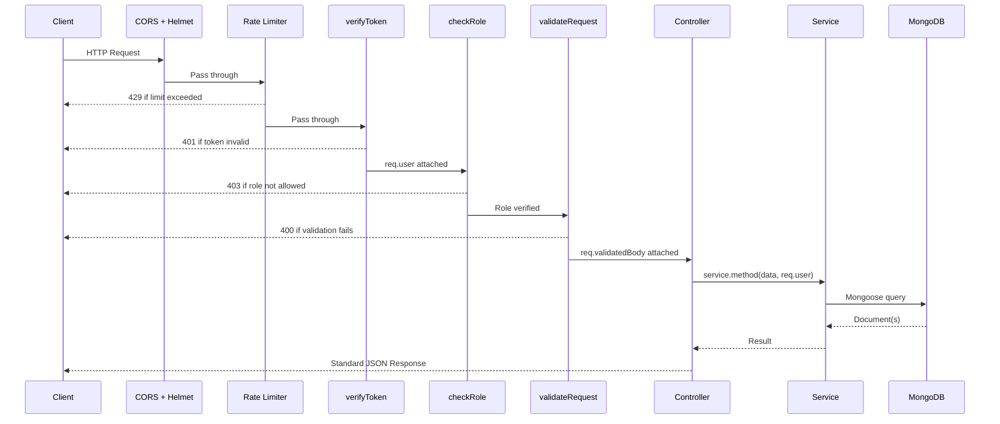
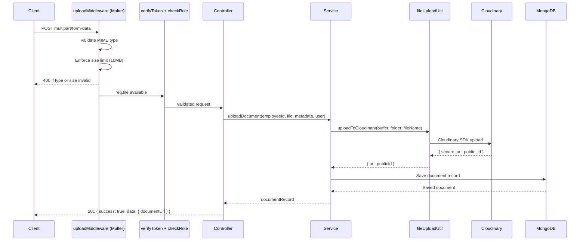

# API_SPECIFICATION.md

---

## 1. Document Metadata

| Field           | Value                                                                      |
|-----------------|----------------------------------------------------------------------------|
| Document Name   | API_SPECIFICATION.md                                                       |
| Version         | 1.0                                                                        |
| Status          | Approved                                                                   |
| Authority Level | Level 5 — Inherits from DATABASE_DESIGN.md                                |
| Purpose         | Definitive REST API contract for the Enterprise Workforce Management Platform |
| Dependencies    | AI_ENGINEERING_SPECIFICATION.md, Problem_Statement.md, PROJECT_MASTER.md, ARCHITECTURE_REVISION.md, DATABASE_DESIGN.md |
| Last Updated    | 2026-07-03                                                                 |

---

## 2. Executive Summary

### 2.1 Purpose

This document defines the complete, authoritative REST API contract for the Enterprise Workforce Management Platform (EWMP). Every backend route, controller, frontend API call, middleware, and AI-generated implementation must derive its API design from this specification.

### 2.2 Relationship with PROJECT_MASTER.md

`PROJECT_MASTER.md` defines 15 functional modules and 9 user roles. This document maps every module to its API resource group and specifies the RBAC permissions for every endpoint consistent with the role definitions in `PROJECT_MASTER.md`.

### 2.3 Relationship with ARCHITECTURE_REVISION.md

`ARCHITECTURE_REVISION.md` defines the REST philosophy, request lifecycle, standard response envelope, pagination convention, URL naming convention, and authentication architecture. This document implements those architectural decisions through concrete endpoint definitions. No endpoint in this specification contradicts `ARCHITECTURE_REVISION.md`.

### 2.4 Relationship with DATABASE_DESIGN.md

`DATABASE_DESIGN.md` defines 27 collections with their field definitions and validation rules. Every request body and response body in this specification is derived from the collection schemas in `DATABASE_DESIGN.md`. Field names, types, and enum values are consistent with database definitions.

### 2.5 API Design Philosophy

The API is resource-oriented, stateless, and role-restricted. Every protected endpoint enforces both authentication (valid JWT) and authorization (permitted role). Business workflows are exposed as action endpoints alongside standard CRUD. Response format is standardized across all 100+ endpoints.

---

## 3. API Architecture Overview

### 3.1 Base URL Strategy

| Environment | Base URL                               |
|-------------|----------------------------------------|
| Development | `http://localhost:5000/api`            |
| Production  | `https://<domain>/api`                 |

All endpoints are prefixed with `/api`. No version prefix (`/api/v1/`) is used in this academic release. Versioning strategy is defined in Section 16.

### 3.2 Authentication Flow

All protected endpoints require a valid JWT access token in the `Authorization` header using the `Bearer` scheme.

```
Authorization: Bearer <access_token>
```

### 3.3 Request Lifecycle Diagram



### 3.4 Route Groups

| Route Group         | Prefix                  | Module Coverage                              |
|---------------------|-------------------------|----------------------------------------------|
| Authentication      | `/api/auth`             | Login, logout, token, password               |
| Organization        | `/api/organizations`    | Org profile, settings                        |
| Departments         | `/api/departments`      | Department CRUD                              |
| Designations        | `/api/designations`     | Designation CRUD                             |
| Locations           | `/api/locations`        | Location CRUD                                |
| Shifts              | `/api/shifts`           | Shift CRUD                                   |
| Employees           | `/api/employees`        | Employee lifecycle                           |
| Recruitment         | `/api/candidates`       | Candidate pipeline                           |
| Interviews          | `/api/interviews`       | Interview scheduling                         |
| Attendance          | `/api/attendance`       | Clock-in/out, corrections                    |
| Leave               | `/api/leave-requests`, `/api/leave-types`, `/api/leave-balances`, `/api/holidays` | Leave management |
| Payroll             | `/api/payroll`, `/api/payslips`, `/api/salary-structures` | Payroll operations |
| Performance         | `/api/goals`, `/api/performance-reviews` | Performance management              |
| Projects            | `/api/projects`         | Project and task management                  |
| Tasks               | `/api/tasks`            | Task operations                              |
| Assets              | `/api/assets`, `/api/asset-allocations` | Asset management                |
| Help Desk           | `/api/tickets`          | Help Desk ticket lifecycle                   |
| Documents           | `/api/employees/:id/documents` | Employee document management           |
| Notifications       | `/api/notifications`    | Notification management                      |
| Announcements       | `/api/announcements`    | Announcement management                      |
| Reports             | `/api/reports`          | Analytics and exports                        |
| Dashboard           | `/api/dashboard`        | Aggregated dashboard data                    |
| AI Assistant        | `/api/ai`               | AI query, conversation, feedback             |
| System Settings     | `/api/settings`         | Organization configuration                   |
| Audit Logs          | `/api/audit-logs`       | Security audit trail                         |

---

## 4. Standard API Conventions

### 4.1 HTTP Methods

| Method | Semantics                                | Body     | Idempotent |
|--------|------------------------------------------|----------|------------|
| GET    | Retrieve resource(s)                     | None     | Yes        |
| POST   | Create resource or trigger action        | Required | No         |
| PUT    | Replace entire resource                  | Required | Yes        |
| PATCH  | Partial update or workflow action        | Required | No         |
| DELETE | Remove resource (triggers soft delete)   | None     | Yes        |

### 4.2 URI Naming Convention

- Plural lowercase nouns: `/employees`, `/leave-requests`, `/salary-structures`
- Hyphen-separated multi-word resources: `/leave-types`, `/help-desk-tickets` → `/tickets`
- No verbs in resource URLs except for action endpoints
- Action endpoints use PATCH with a sub-resource verb: `PATCH /leave-requests/:id/approve`
- Nested resources for tightly-coupled entities: `GET /employees/:id/documents`

### 4.3 Standard Status Codes

| Code | Meaning                        | When Used                                            |
|------|--------------------------------|------------------------------------------------------|
| 200  | OK                             | Successful GET, PUT, PATCH responses                 |
| 201  | Created                        | Successful POST creating a new resource              |
| 204  | No Content                     | Successful DELETE with no body                       |
| 400  | Bad Request                    | Validation errors, malformed request                 |
| 401  | Unauthorized                   | Missing or invalid JWT                               |
| 403  | Forbidden                      | Valid JWT but insufficient role                      |
| 404  | Not Found                      | Resource not found or soft-deleted                   |
| 409  | Conflict                       | Duplicate unique constraint violation                |
| 422  | Unprocessable Entity           | Business rule violation                              |
| 429  | Too Many Requests              | Rate limit exceeded                                  |
| 500  | Internal Server Error          | Unhandled server error                               |

### 4.4 Request Headers

| Header          | Required      | Value                                  |
|-----------------|---------------|----------------------------------------|
| `Authorization` | Protected routes | `Bearer <access_token>`            |
| `Content-Type`  | POST/PUT/PATCH | `application/json`                   |
| `Content-Type`  | File uploads  | `multipart/form-data`                  |

### 4.5 Date and Time Format

All date-time values use ISO 8601 format: `YYYY-MM-DDTHH:mm:ss.sssZ` (UTC).
All date-only values use: `YYYY-MM-DD`.

### 4.6 ObjectId Representation

MongoDB ObjectIds are represented as 24-character hexadecimal strings in all request and response bodies.

### 4.7 Pagination Standard

List endpoints accept the following query parameters:

| Parameter | Type   | Default | Max  | Description                    |
|-----------|--------|---------|------|--------------------------------|
| `page`    | Number | 1       | —    | Current page number            |
| `limit`   | Number | 20      | 100  | Records per page               |
| `sortBy`  | String | createdAt | —  | Field to sort by               |
| `sortOrder`| String | desc   | —    | `asc` or `desc`                |

Paginated response `data` structure:
```json
{
  "items": [],
  "total": 0,
  "page": 1,
  "limit": 20,
  "totalPages": 0
}
```

### 4.8 Filtering and Search

| Parameter  | Format                          | Example                          |
|------------|---------------------------------|----------------------------------|
| `search`   | String                          | `?search=john`                   |
| `status`   | String (enum value)             | `?status=active`                 |
| `startDate`| YYYY-MM-DD                      | `?startDate=2024-01-01`          |
| `endDate`  | YYYY-MM-DD                      | `?endDate=2024-12-31`            |
| `departmentId` | ObjectId string             | `?departmentId=abc123`           |

Filters are passed as query parameters. Multiple filter parameters combine with logical AND.

---

## 5. Authentication APIs

### 5.1 Login

| Attribute        | Value                                              |
|------------------|----------------------------------------------------|
| Method           | POST                                               |
| Route            | `/api/auth/login`                                  |
| Authentication   | Not required (Public)                              |
| Authorized Roles | All                                                |
| Rate Limit       | 10 requests per 15 minutes per IP                  |

**Request Body:**
```json
{
  "email": "string (required, valid email)",
  "password": "string (required, min 8 chars)"
}
```

**Success Response — 200:**
```json
{
  "success": true,
  "message": "Login successful",
  "data": {
    "accessToken": "string (JWT)",
    "user": {
      "_id": "string",
      "email": "string",
      "role": "string",
      "organizationId": "string",
      "employeeId": "string | null"
    }
  }
}
```

**Cookies Set:** `refreshToken` — HTTP-only, Secure, SameSite=Strict, 7-day expiry.

**Error Codes:** 400 (validation), 401 (invalid credentials), 422 (account locked or inactive).

**Business Rules:**
- Increment `failedLoginAttempts` on failure
- Lock account after 5 consecutive failures
- Reset `failedLoginAttempts` on success
- Update `lastLoginAt` on success
- Write to `auditLogs` (action: LOGIN or LOGIN_FAILURE)

---

### 5.2 Logout

| Attribute        | Value                                              |
|------------------|----------------------------------------------------|
| Method           | POST                                               |
| Route            | `/api/auth/logout`                                 |
| Authentication   | Required                                           |
| Authorized Roles | All authenticated users                            |

**Request Body:** None

**Success Response — 200:**
```json
{
  "success": true,
  "message": "Logged out successfully",
  "data": null
}
```

**Behavior:** Clears `refreshToken` from database. Clears HTTP-only cookie on response.

---

### 5.3 Refresh Token

| Attribute        | Value                                              |
|------------------|----------------------------------------------------|
| Method           | POST                                               |
| Route            | `/api/auth/refresh`                                |
| Authentication   | Refresh token from HTTP-only cookie                |
| Authorized Roles | All                                                |

**Request Body:** None (refresh token read from HTTP-only cookie)

**Success Response — 200:**
```json
{
  "success": true,
  "message": "Token refreshed",
  "data": {
    "accessToken": "string (new JWT)"
  }
}
```

**Error Codes:** 401 (invalid or expired refresh token).

---

### 5.4 Forgot Password

| Attribute        | Value                                              |
|------------------|----------------------------------------------------|
| Method           | POST                                               |
| Route            | `/api/auth/forgot-password`                        |
| Authentication   | Not required (Public)                              |
| Authorized Roles | All                                                |
| Rate Limit       | 10 requests per 15 minutes per IP                  |

**Request Body:**
```json
{
  "email": "string (required, valid email)"
}
```

**Success Response — 200:**
```json
{
  "success": true,
  "message": "If an account with this email exists, a reset link has been sent.",
  "data": null
}
```

**Business Rules:**
- Response is always 200 regardless of whether email exists (security measure)
- Reset token is hashed and stored with 1-hour expiry
- Email sent via Nodemailer with reset link

---

### 5.5 Reset Password

| Attribute        | Value                                              |
|------------------|----------------------------------------------------|
| Method           | POST                                               |
| Route            | `/api/auth/reset-password/:token`                  |
| Authentication   | Not required (Public)                              |
| Authorized Roles | All                                                |

**Path Parameters:** `token` — raw reset token from email link

**Request Body:**
```json
{
  "password": "string (required, min 8, must include uppercase, lowercase, number, special char)",
  "confirmPassword": "string (required, must match password)"
}
```

**Success Response — 200:**
```json
{
  "success": true,
  "message": "Password reset successful. Please log in.",
  "data": null
}
```

**Error Codes:** 400 (validation, passwords do not match), 422 (token invalid or expired).

**Business Rules:**
- Hash the provided token, compare with stored hash
- Verify token has not expired (`passwordResetExpiry > now`)
- Hash new password with bcrypt (rounds: 12)
- Clear `passwordResetToken` and `passwordResetExpiry` after use
- Write to `auditLogs` (action: PASSWORD_RESET)

---

### 5.6 Change Password

| Attribute        | Value                                              |
|------------------|----------------------------------------------------|
| Method           | PUT                                                |
| Route            | `/api/auth/change-password`                        |
| Authentication   | Required                                           |
| Authorized Roles | All authenticated users                            |

**Request Body:**
```json
{
  "currentPassword": "string (required)",
  "newPassword": "string (required, min 8, complexity rules)",
  "confirmPassword": "string (required, must match newPassword)"
}
```

**Success Response — 200:**
```json
{
  "success": true,
  "message": "Password changed successfully",
  "data": null
}
```

**Error Codes:** 400 (validation), 401 (current password incorrect).

**Business Rules:**
- Verify current password with bcrypt
- New password must differ from current
- Write to `auditLogs` (action: PASSWORD_CHANGED)

---

### 5.7 Get Current User Profile

| Attribute        | Value                                              |
|------------------|----------------------------------------------------|
| Method           | GET                                                |
| Route            | `/api/auth/me`                                     |
| Authentication   | Required                                           |
| Authorized Roles | All authenticated users                            |

**Success Response — 200:**
```json
{
  "success": true,
  "message": "User profile retrieved",
  "data": {
    "_id": "string",
    "email": "string",
    "role": "string",
    "organizationId": "string",
    "isActive": true,
    "lastLoginAt": "ISO 8601",
    "employee": {
      "_id": "string",
      "employeeId": "string",
      "firstName": "string",
      "lastName": "string",
      "profilePhotoUrl": "string | null",
      "departmentId": "string",
      "designationId": "string"
    }
  }
}
```

---

## 6. User & Organization APIs

### 6.1 Organizations

#### GET /api/organizations/:id — Get Organization Profile

| Attribute | Value                                              |
|-----------|----------------------------------------------------|
| Method    | GET                                                |
| Route     | `/api/organizations/:id`                           |
| Auth      | Required                                           |
| Roles     | SUPER_ADMIN, ORG_ADMIN, HR_MANAGER, AUDITOR        |

**Success Response — 200:** Organization document.

#### PUT /api/organizations/:id — Update Organization

| Attribute | Value                                              |
|-----------|----------------------------------------------------|
| Method    | PUT                                                |
| Route     | `/api/organizations/:id`                           |
| Auth      | Required                                           |
| Roles     | SUPER_ADMIN, ORG_ADMIN                             |

**Request Body:** Organization fields (name, industry, address, phone, email, website).

---

### 6.2 Departments

#### GET /api/departments — List Departments

| Attribute | Value                                              |
|-----------|----------------------------------------------------|
| Method    | GET                                                |
| Route     | `/api/departments`                                 |
| Auth      | Required                                           |
| Roles     | All authenticated users                            |
| Query Params | `page`, `limit`, `search`, `status`            |

**Success Response — 200:** Paginated list of departments.

#### POST /api/departments — Create Department

| Attribute | Value                                              |
|-----------|----------------------------------------------------|
| Method    | POST                                               |
| Route     | `/api/departments`                                 |
| Auth      | Required                                           |
| Roles     | SUPER_ADMIN, ORG_ADMIN, HR_MANAGER                 |

**Request Body:**
```json
{
  "name": "string (required, min 2, max 100)",
  "code": "string (required, uppercase, max 10)",
  "description": "string (optional, max 500)",
  "managerId": "ObjectId (optional)",
  "parentDeptId": "ObjectId (optional)"
}
```

**Success Response — 201:** Created department document.

**Error Codes:** 400 (validation), 409 (code already exists in org).

#### GET /api/departments/:id — Get Department

| Attribute | Value                          |
|-----------|--------------------------------|
| Method    | GET                            |
| Route     | `/api/departments/:id`         |
| Auth      | Required                       |
| Roles     | All authenticated users        |

#### PUT /api/departments/:id — Update Department

| Attribute | Value                                              |
|-----------|----------------------------------------------------|
| Method    | PUT                                                |
| Route     | `/api/departments/:id`                             |
| Auth      | Required                                           |
| Roles     | SUPER_ADMIN, ORG_ADMIN, HR_MANAGER                 |

#### DELETE /api/departments/:id — Archive Department

| Attribute | Value                                              |
|-----------|----------------------------------------------------|
| Method    | DELETE                                             |
| Route     | `/api/departments/:id`                             |
| Auth      | Required                                           |
| Roles     | SUPER_ADMIN, ORG_ADMIN                             |

**Success Response — 204:** No content.

**Business Rule:** Returns 422 if employees are currently assigned to this department.

---

### 6.3 Designations

#### GET /api/designations — List Designations

| Attribute | Value                          |
|-----------|--------------------------------|
| Method    | GET                            |
| Route     | `/api/designations`            |
| Auth      | Required                       |
| Roles     | All authenticated users        |
| Query     | `page`, `limit`, `search`, `departmentId` |

#### POST /api/designations — Create Designation

| Attribute | Value                                              |
|-----------|----------------------------------------------------|
| Method    | POST                                               |
| Route     | `/api/designations`                                |
| Auth      | Required                                           |
| Roles     | SUPER_ADMIN, ORG_ADMIN, HR_MANAGER                 |

**Request Body:**
```json
{
  "title": "string (required, min 2, max 100)",
  "code": "string (required, uppercase, max 20)",
  "grade": "string (optional, max 10)",
  "departmentId": "ObjectId (optional)",
  "description": "string (optional, max 500)"
}
```

#### GET /api/designations/:id — Get Designation
#### PUT /api/designations/:id — Update Designation — Roles: SUPER_ADMIN, ORG_ADMIN, HR_MANAGER
#### DELETE /api/designations/:id — Archive Designation — Roles: SUPER_ADMIN, ORG_ADMIN

---

### 6.4 Locations

#### GET /api/locations — List Locations
| Auth | Required | Roles | All authenticated users |
#### POST /api/locations — Create Location — Roles: SUPER_ADMIN, ORG_ADMIN

**Request Body:**
```json
{
  "name": "string (required)",
  "code": "string (required)",
  "address": {
    "street": "string",
    "city": "string",
    "state": "string",
    "country": "string",
    "pincode": "string"
  },
  "isRemote": "boolean (default: false)"
}
```

#### GET /api/locations/:id — Get Location
#### PUT /api/locations/:id — Update Location — Roles: SUPER_ADMIN, ORG_ADMIN
#### DELETE /api/locations/:id — Archive Location — Roles: SUPER_ADMIN, ORG_ADMIN

---

### 6.5 Shifts

#### GET /api/shifts — List Shifts — Roles: All authenticated users
#### POST /api/shifts — Create Shift — Roles: SUPER_ADMIN, ORG_ADMIN, HR_MANAGER

**Request Body:**
```json
{
  "name": "string (required)",
  "code": "string (required, uppercase)",
  "startTime": "string (HH:mm, 24hr)",
  "endTime": "string (HH:mm, 24hr)",
  "workingHours": "number (min 1, max 24)",
  "overtimeThreshold": "number (default 8)",
  "weeklyOffDays": ["string (day names)"],
  "gracePeriodMinutes": "number (default 15)"
}
```

#### GET /api/shifts/:id — Get Shift
#### PUT /api/shifts/:id — Update Shift — Roles: SUPER_ADMIN, ORG_ADMIN, HR_MANAGER
#### DELETE /api/shifts/:id — Archive Shift — Roles: SUPER_ADMIN, ORG_ADMIN

---

### 6.6 Employees

#### GET /api/employees — List Employees

| Attribute | Value                                              |
|-----------|----------------------------------------------------|
| Method    | GET                                                |
| Route     | `/api/employees`                                   |
| Auth      | Required                                           |
| Roles     | SUPER_ADMIN, ORG_ADMIN, HR_MANAGER, MANAGER, FINANCE, AUDITOR |
| Query Params | `page`, `limit`, `search`, `departmentId`, `designationId`, `status`, `employmentType`, `sortBy`, `sortOrder` |

**Data Scoping:**
- MANAGER receives only employees in their department
- FINANCE receives employees in their organization (limited fields)
- AUDITOR receives read-only access

**Success Response — 200:**
```json
{
  "success": true,
  "message": "Employees retrieved",
  "data": {
    "items": [
      {
        "_id": "string",
        "employeeId": "string",
        "firstName": "string",
        "lastName": "string",
        "email": "string",
        "mobile": "string",
        "profilePhotoUrl": "string | null",
        "department": { "_id": "string", "name": "string" },
        "designation": { "_id": "string", "title": "string" },
        "employmentType": "string",
        "employmentStatus": "string",
        "joiningDate": "ISO 8601",
        "status": "string"
      }
    ],
    "total": 0, "page": 1, "limit": 20, "totalPages": 0
  }
}
```

#### POST /api/employees — Create Employee

| Attribute | Value                                              |
|-----------|----------------------------------------------------|
| Method    | POST                                               |
| Route     | `/api/employees`                                   |
| Auth      | Required                                           |
| Roles     | SUPER_ADMIN, ORG_ADMIN, HR_MANAGER                 |

**Request Body:**
```json
{
  "firstName": "string (required)",
  "lastName": "string (required)",
  "email": "string (required, unique, valid email)",
  "mobile": "string (required, 10 digits)",
  "password": "string (required, min 8, complexity rules — initial password)",
  "role": "string (required, enum: role values)",
  "departmentId": "ObjectId (required)",
  "designationId": "ObjectId (required)",
  "locationId": "ObjectId (optional)",
  "shiftId": "ObjectId (optional)",
  "managerId": "ObjectId (optional)",
  "joiningDate": "date (required, YYYY-MM-DD)",
  "employmentType": "string (required, enum)",
  "salaryStructureId": "ObjectId (optional)",
  "basicSalary": "number (optional, min 0)",
  "gender": "string (optional, enum)",
  "dateOfBirth": "date (optional, YYYY-MM-DD)",
  "address": {
    "street": "string",
    "city": "string",
    "state": "string",
    "country": "string",
    "pincode": "string"
  }
}
```

**Success Response — 201:** Created employee document.

**Error Codes:** 400 (validation), 409 (email already exists).

**Business Rules:**
- Creates `users` document and `employees` document atomically in a transaction
- Auto-generates `employeeId` (EMP + sequential number)
- Initializes `leaveBalances` for all active leave types
- Sends welcome email with temporary credentials
- Write to `auditLogs` (action: EMPLOYEE_CREATED)

#### GET /api/employees/:id — Get Employee Profile

| Attribute | Value                                              |
|-----------|----------------------------------------------------|
| Method    | GET                                                |
| Route     | `/api/employees/:id`                               |
| Auth      | Required                                           |
| Roles     | SUPER_ADMIN, ORG_ADMIN, HR_MANAGER, MANAGER, EMPLOYEE (self only), FINANCE (limited), AUDITOR |

**Success Response — 200:** Full employee document with populated department, designation, location, shift, manager. Sensitive fields (aadharNumber, bankAccountNumber, basicSalary) excluded unless requesting role is authorized.

#### PUT /api/employees/:id — Update Employee

| Attribute | Value                                              |
|-----------|----------------------------------------------------|
| Method    | PUT                                                |
| Route     | `/api/employees/:id`                               |
| Auth      | Required                                           |
| Roles     | SUPER_ADMIN, ORG_ADMIN, HR_MANAGER                 |

**Request Body:** All updatable employee fields (excludes employeeId, userId, createdAt).

#### PATCH /api/employees/:id/status — Update Employment Status

| Attribute | Value                                              |
|-----------|----------------------------------------------------|
| Method    | PATCH                                              |
| Route     | `/api/employees/:id/status`                        |
| Auth      | Required                                           |
| Roles     | SUPER_ADMIN, ORG_ADMIN, HR_MANAGER                 |

**Request Body:**
```json
{
  "employmentStatus": "string (required, enum: [Probation, Permanent, Notice Period, Resigned, Terminated])",
  "exitDate": "date (required if Resigned or Terminated)",
  "exitReason": "string (optional, max 500)"
}
```

**Business Rule:** Write to `auditLogs` (action: EMPLOYEE_STATUS_CHANGED).

#### DELETE /api/employees/:id — Archive Employee

| Attribute | Value                                              |
|-----------|----------------------------------------------------|
| Method    | DELETE                                             |
| Route     | `/api/employees/:id`                               |
| Auth      | Required                                           |
| Roles     | SUPER_ADMIN, ORG_ADMIN                             |

**Business Rule:** Soft archives the employee. Does not delete the `users` document. Deactivates the user account. Write to `auditLogs` (action: EMPLOYEE_ARCHIVED).

#### GET /api/employees/:id/timeline — Get Employee Timeline

| Attribute | Value                                              |
|-----------|----------------------------------------------------|
| Method    | GET                                                |
| Route     | `/api/employees/:id/timeline`                      |
| Auth      | Required                                           |
| Roles     | SUPER_ADMIN, ORG_ADMIN, HR_MANAGER, AUDITOR        |

**Success Response — 200:** Array of audit events related to this employee.

---

## 7. HR Management APIs

### 7.1 Attendance

#### POST /api/attendance/clock-in — Clock In

| Attribute | Value                                              |
|-----------|----------------------------------------------------|
| Method    | POST                                               |
| Route     | `/api/attendance/clock-in`                         |
| Auth      | Required                                           |
| Roles     | EMPLOYEE, MANAGER, TEAM_LEAD                       |

**Request Body:**
```json
{
  "locationId": "ObjectId (optional)",
  "gpsCoordinates": { "lat": "number", "lng": "number" },
  "deviceInfo": "string (optional)"
}
```

**Success Response — 201:** Attendance record created or updated.

**Business Rules:**
- Only one clock-in allowed per employee per day
- Creates `attendance` document with `attendanceStatus: Present`
- Creates `attendanceLogs` event (eventType: Clock-In)
- Computes `isLate` based on shift startTime + gracePeriodMinutes

#### PATCH /api/attendance/clock-out — Clock Out

| Attribute | Value                                              |
|-----------|----------------------------------------------------|
| Method    | PATCH                                              |
| Route     | `/api/attendance/clock-out`                        |
| Auth      | Required                                           |
| Roles     | EMPLOYEE, MANAGER, TEAM_LEAD                       |

**Request Body:**
```json
{
  "gpsCoordinates": { "lat": "number", "lng": "number" },
  "deviceInfo": "string (optional)"
}
```

**Business Rules:**
- Requires prior clock-in on the same day
- Computes `workingHours`, `overtimeHours`, `isEarlyExit`
- Creates `attendanceLogs` event (eventType: Clock-Out)

#### GET /api/attendance — List Attendance Records

| Attribute | Value                                              |
|-----------|----------------------------------------------------|
| Method    | GET                                                |
| Route     | `/api/attendance`                                  |
| Auth      | Required                                           |
| Roles     | SUPER_ADMIN, ORG_ADMIN, HR_MANAGER, MANAGER, FINANCE, AUDITOR |
| Query     | `page`, `limit`, `employeeId`, `startDate`, `endDate`, `attendanceStatus`, `departmentId` |

**Data Scoping:** MANAGER receives only their department members' attendance.

#### GET /api/attendance/my — Get My Attendance

| Attribute | Value                                              |
|-----------|----------------------------------------------------|
| Method    | GET                                                |
| Route     | `/api/attendance/my`                               |
| Auth      | Required                                           |
| Roles     | All authenticated users                            |
| Query     | `startDate`, `endDate`, `page`, `limit`            |

#### GET /api/attendance/:id — Get Attendance Record

Roles: SUPER_ADMIN, ORG_ADMIN, HR_MANAGER, MANAGER, AUDITOR

#### POST /api/attendance/:id/correction — Request Attendance Correction

| Attribute | Value                                              |
|-----------|----------------------------------------------------|
| Method    | POST                                               |
| Route     | `/api/attendance/:id/correction`                   |
| Auth      | Required                                           |
| Roles     | EMPLOYEE, MANAGER, TEAM_LEAD                       |

**Request Body:**
```json
{
  "correctedClockIn": "ISO 8601 (optional)",
  "correctedClockOut": "ISO 8601 (optional)",
  "correctionNotes": "string (required, min 10, max 500)"
}
```

**Business Rules:**
- Creates `attendanceLogs` event (eventType: Correction-Request)
- Sets `attendance.correctionStatus: Pending`
- Notifies manager via `notifications`

#### PATCH /api/attendance/:id/correction/approve — Approve Correction

| Attribute | Value                                              |
|-----------|----------------------------------------------------|
| Method    | PATCH                                              |
| Route     | `/api/attendance/:id/correction/approve`           |
| Auth      | Required                                           |
| Roles     | SUPER_ADMIN, HR_MANAGER, MANAGER                   |

**Request Body:**
```json
{
  "approved": "boolean (required)",
  "approverNotes": "string (optional)"
}
```

---

### 7.2 Leave Types

#### GET /api/leave-types — List Leave Types — Roles: All authenticated users
#### POST /api/leave-types — Create Leave Type — Roles: SUPER_ADMIN, ORG_ADMIN, HR_MANAGER

**Request Body:**
```json
{
  "name": "string (required, unique per org)",
  "code": "string (required, uppercase, unique per org)",
  "maxDaysPerYear": "number (required, min 0)",
  "isCarryForward": "boolean",
  "maxCarryForwardDays": "number",
  "isPaidLeave": "boolean",
  "requiresApproval": "boolean",
  "minAdvanceNoticeDays": "number",
  "applicableGender": "string (optional, enum)"
}
```

#### GET /api/leave-types/:id — Get Leave Type
#### PUT /api/leave-types/:id — Update Leave Type — Roles: SUPER_ADMIN, ORG_ADMIN, HR_MANAGER
#### DELETE /api/leave-types/:id — Archive Leave Type — Roles: SUPER_ADMIN, ORG_ADMIN

---

### 7.3 Holidays

#### GET /api/holidays — List Holidays — Roles: All authenticated users — Query: `year`, `holidayType`
#### POST /api/holidays — Create Holiday — Roles: SUPER_ADMIN, ORG_ADMIN, HR_MANAGER

**Request Body:**
```json
{
  "name": "string (required)",
  "date": "date (required, YYYY-MM-DD, unique per org)",
  "holidayType": "string (enum: [Public, Restricted, Optional])",
  "applicableLocations": ["ObjectId (optional)"],
  "description": "string (optional)"
}
```

#### PUT /api/holidays/:id — Update Holiday — Roles: SUPER_ADMIN, ORG_ADMIN, HR_MANAGER
#### DELETE /api/holidays/:id — Archive Holiday — Roles: SUPER_ADMIN, ORG_ADMIN

---

### 7.4 Leave Balances

#### GET /api/leave-balances — List Leave Balances

| Attribute | Value                                              |
|-----------|----------------------------------------------------|
| Method    | GET                                                |
| Route     | `/api/leave-balances`                              |
| Auth      | Required                                           |
| Roles     | SUPER_ADMIN, ORG_ADMIN, HR_MANAGER, MANAGER        |
| Query     | `employeeId` (required for MANAGER), `year`, `leaveTypeId` |

#### GET /api/leave-balances/my — Get My Leave Balances

| Attribute | Value                                              |
|-----------|----------------------------------------------------|
| Method    | GET                                                |
| Route     | `/api/leave-balances/my`                           |
| Auth      | Required                                           |
| Roles     | All authenticated users                            |
| Query     | `year` (default: current year)                     |

**Success Response — 200:**
```json
{
  "success": true,
  "message": "Leave balances retrieved",
  "data": [
    {
      "_id": "string",
      "leaveType": { "_id": "string", "name": "string", "code": "string" },
      "year": 2024,
      "entitledDays": 12,
      "usedDays": 3,
      "pendingDays": 1,
      "remainingDays": 8,
      "carryForwardDays": 0
    }
  ]
}
```

---

### 7.5 Leave Requests

#### GET /api/leave-requests — List Leave Requests

| Attribute | Value                                              |
|-----------|----------------------------------------------------|
| Method    | GET                                                |
| Route     | `/api/leave-requests`                              |
| Auth      | Required                                           |
| Roles     | SUPER_ADMIN, ORG_ADMIN, HR_MANAGER, MANAGER, FINANCE, AUDITOR |
| Query     | `page`, `limit`, `employeeId`, `approvalStatus`, `leaveTypeId`, `startDate`, `endDate` |

**Data Scoping:** MANAGER receives only their team's leave requests.

#### GET /api/leave-requests/my — Get My Leave Requests

Roles: All authenticated users — Query: `page`, `limit`, `approvalStatus`, `year`

#### POST /api/leave-requests — Submit Leave Request

| Attribute | Value                                              |
|-----------|----------------------------------------------------|
| Method    | POST                                               |
| Route     | `/api/leave-requests`                              |
| Auth      | Required                                           |
| Roles     | All authenticated users                            |

**Request Body:**
```json
{
  "leaveTypeId": "ObjectId (required)",
  "startDate": "date (required, YYYY-MM-DD)",
  "endDate": "date (required, YYYY-MM-DD)",
  "isHalfDay": "boolean (default: false)",
  "halfDaySession": "string (enum: [Morning, Afternoon] — required if isHalfDay)",
  "reason": "string (required, min 10, max 500)"
}
```

**Business Rules:**
- Compute `totalDays` as working days (excluding weekends and holidays)
- Verify `remainingDays >= totalDays` in leaveBalance
- Set `leaveBalance.pendingDays += totalDays` (in transaction)
- Notify manager via `notifications`
- If `requiresApproval` is false: auto-approve

#### GET /api/leave-requests/:id — Get Leave Request — Roles: all (own or authorized)

#### PATCH /api/leave-requests/:id/approve — Approve Leave Request

| Attribute | Value                                              |
|-----------|----------------------------------------------------|
| Method    | PATCH                                              |
| Route     | `/api/leave-requests/:id/approve`                  |
| Auth      | Required                                           |
| Roles     | SUPER_ADMIN, ORG_ADMIN, HR_MANAGER, MANAGER        |

**Request Body:**
```json
{ "approverNotes": "string (optional, max 500)" }
```

**Business Rules (transaction):**
- Set `approvalStatus: Approved`, `approverId`, `approvedAt`
- Update `leaveBalance`: `usedDays += totalDays`, `pendingDays -= totalDays`, recalculate `remainingDays`
- Create `attendance` records for each leave day with `attendanceStatus: Leave`
- Notify employee via `notifications`

#### PATCH /api/leave-requests/:id/reject — Reject Leave Request

Roles: SUPER_ADMIN, ORG_ADMIN, HR_MANAGER, MANAGER

**Request Body:**
```json
{ "approverNotes": "string (required, min 5, max 500)" }
```

**Business Rules:** Restore `leaveBalance.pendingDays`. Notify employee.

#### PATCH /api/leave-requests/:id/cancel — Cancel Leave Request

Roles: EMPLOYEE (own, Pending only), HR_MANAGER, MANAGER

**Request Body:**
```json
{ "cancellationReason": "string (required, min 5, max 500)" }
```

**Business Rules:** If Pending: restore `pendingDays`. If Approved and future: restore `usedDays`. Delete linked attendance records for future dates.

---

### 7.6 Salary Structures

#### GET /api/salary-structures — List Salary Structures — Roles: SUPER_ADMIN, ORG_ADMIN, HR_MANAGER, FINANCE
#### POST /api/salary-structures — Create Salary Structure — Roles: SUPER_ADMIN, ORG_ADMIN, FINANCE

**Request Body:**
```json
{
  "name": "string (required)",
  "code": "string (required, uppercase)",
  "hraPercent": "number (required, 0-100)",
  "daPercent": "number (optional, 0-100)",
  "pfPercent": "number (optional, default 12)",
  "professionalTax": "number (optional)",
  "medicalAllowance": "number (optional)",
  "travelAllowance": "number (optional)",
  "description": "string (optional)"
}
```

#### GET /api/salary-structures/:id
#### PUT /api/salary-structures/:id — Roles: SUPER_ADMIN, ORG_ADMIN, FINANCE
#### DELETE /api/salary-structures/:id — Roles: SUPER_ADMIN, ORG_ADMIN

---

### 7.7 Payroll

#### GET /api/payroll — List Payroll Records

| Attribute | Value                                              |
|-----------|----------------------------------------------------|
| Method    | GET                                                |
| Route     | `/api/payroll`                                     |
| Auth      | Required                                           |
| Roles     | SUPER_ADMIN, ORG_ADMIN, HR_MANAGER, FINANCE, AUDITOR |
| Query     | `page`, `limit`, `employeeId`, `payPeriodMonth`, `payPeriodYear`, `payrollStatus` |

#### GET /api/payroll/my — Get My Payroll Records

Roles: All authenticated users — Query: `payPeriodYear`

#### POST /api/payroll/process — Process Payroll Run

| Attribute | Value                                              |
|-----------|----------------------------------------------------|
| Method    | POST                                               |
| Route     | `/api/payroll/process`                             |
| Auth      | Required                                           |
| Roles     | SUPER_ADMIN, ORG_ADMIN, FINANCE                    |

**Request Body:**
```json
{
  "payPeriodMonth": "number (required, 1-12)",
  "payPeriodYear": "number (required, 4-digit)",
  "employeeIds": ["ObjectId (optional — if empty, process all active employees)"]
}
```

**Business Rules:**
- Fetch attendance data for the period
- Fetch approved leave data for the period
- Compute gross salary from `salaryStructure` and `basicSalary`
- Compute deductions (PF, PT, income tax, leave deductions)
- Create `payroll` document per employee (status: Draft)
- Returns summary of processed count and errors

#### GET /api/payroll/:id — Get Payroll Record

Roles: SUPER_ADMIN, HR_MANAGER, FINANCE, EMPLOYEE (own only), AUDITOR

#### PATCH /api/payroll/:id/approve — Approve Payroll

| Attribute | Value                                              |
|-----------|----------------------------------------------------|
| Method    | PATCH                                              |
| Route     | `/api/payroll/:id/approve`                         |
| Auth      | Required                                           |
| Roles     | SUPER_ADMIN, ORG_ADMIN, FINANCE                    |

**Business Rules:** Set `payrollStatus: Approved`. Generate `payslips` document. Send payslip email to employee.

#### PATCH /api/payroll/:id/mark-paid — Mark as Paid

Roles: SUPER_ADMIN, FINANCE

**Business Rules:** Set `payrollStatus: Paid`. Notify employee via `notifications`.

---

### 7.8 Payslips

#### GET /api/payslips/my — Get My Payslips

Roles: All authenticated users — Query: `year`, `page`, `limit`

#### GET /api/payslips/:id — Get Payslip

Roles: SUPER_ADMIN, HR_MANAGER, FINANCE, EMPLOYEE (own only), AUDITOR

---

### 7.9 Performance — Goals

#### GET /api/goals — List Goals

| Attribute | Value                                              |
|-----------|----------------------------------------------------|
| Method    | GET                                                |
| Route     | `/api/goals`                                       |
| Auth      | Required                                           |
| Roles     | SUPER_ADMIN, ORG_ADMIN, HR_MANAGER, MANAGER        |
| Query     | `employeeId`, `year`, `quarter`, `goalStatus`, `goalType`, `page`, `limit` |

#### GET /api/goals/my — Get My Goals

Roles: All authenticated users — Query: `year`, `quarter`, `goalStatus`

#### POST /api/goals — Create Goal

| Attribute | Value                                              |
|-----------|----------------------------------------------------|
| Method    | POST                                               |
| Route     | `/api/goals`                                       |
| Auth      | Required                                           |
| Roles     | SUPER_ADMIN, ORG_ADMIN, HR_MANAGER, MANAGER        |

**Request Body:**
```json
{
  "employeeId": "ObjectId (required)",
  "title": "string (required, min 5, max 200)",
  "description": "string (optional, max 1000)",
  "targetDate": "date (required, future date)",
  "quarter": "string (required, enum: [Q1, Q2, Q3, Q4])",
  "year": "number (required)",
  "goalType": "string (enum: [KPI, Learning, Project, Behavior])",
  "targetValue": "number (optional)"
}
```

#### GET /api/goals/:id — Get Goal

#### PUT /api/goals/:id — Update Goal

Roles: SUPER_ADMIN, HR_MANAGER, MANAGER (own team goals only)

#### PATCH /api/goals/:id/progress — Update Goal Progress

Roles: EMPLOYEE (own goals), MANAGER, HR_MANAGER

**Request Body:**
```json
{
  "completionPercent": "number (0-100)",
  "achievedValue": "number (optional)",
  "goalStatus": "string (enum: [Not Started, In Progress, Completed, Missed])"
}
```

#### DELETE /api/goals/:id — Archive Goal — Roles: SUPER_ADMIN, HR_MANAGER, MANAGER

---

### 7.10 Performance Reviews

#### GET /api/performance-reviews — List Reviews

Roles: SUPER_ADMIN, ORG_ADMIN, HR_MANAGER, MANAGER — Query: `employeeId`, `year`, `quarter`, `reviewStatus`

#### GET /api/performance-reviews/my — Get My Reviews

Roles: All authenticated users

#### POST /api/performance-reviews — Create Review

Roles: SUPER_ADMIN, HR_MANAGER, MANAGER

**Request Body:**
```json
{
  "employeeId": "ObjectId (required)",
  "quarter": "string (required, enum)",
  "year": "number (required)",
  "goalIds": ["ObjectId (optional)"]
}
```

#### GET /api/performance-reviews/:id — Get Review

#### PATCH /api/performance-reviews/:id/self-assessment — Submit Self Assessment

Roles: EMPLOYEE (own review), HR_MANAGER, MANAGER

**Request Body:**
```json
{
  "selfRating": "number (1-5)",
  "selfAssessment": "string (required, min 50, max 2000)"
}
```

#### PATCH /api/performance-reviews/:id/manager-review — Submit Manager Review

Roles: SUPER_ADMIN, HR_MANAGER, MANAGER

**Request Body:**
```json
{
  "kpiScore": "number (0-100)",
  "attendanceScore": "number (0-100)",
  "managerRating": "number (1-5)",
  "finalRating": "number (1-5)",
  "overallLevel": "string (enum: [Outstanding, Excellent, Good, Needs Improvement, Unsatisfactory])",
  "managerFeedback": "string (required, min 50, max 2000)",
  "promotionRecommended": "boolean",
  "promotionNotes": "string (optional)"
}
```

---

### 7.11 Recruitment — Candidates

#### GET /api/candidates — List Candidates

| Attribute | Value                                              |
|-----------|----------------------------------------------------|
| Method    | GET                                                |
| Route     | `/api/candidates`                                  |
| Auth      | Required                                           |
| Roles     | SUPER_ADMIN, ORG_ADMIN, HR_MANAGER, MANAGER (interview access), AUDITOR |
| Query     | `page`, `limit`, `search`, `recruitmentStatus`, `departmentId`, `designationId`, `sourceChannel` |

#### POST /api/candidates — Create Candidate

Roles: SUPER_ADMIN, ORG_ADMIN, HR_MANAGER

**Request Body:**
```json
{
  "firstName": "string (required)",
  "lastName": "string (required)",
  "email": "string (required, valid email, unique per org)",
  "mobile": "string (optional)",
  "appliedForDesignationId": "ObjectId (optional)",
  "appliedForDepartmentId": "ObjectId (optional)",
  "experience": "number (optional, min 0)",
  "skills": ["string (optional)"],
  "sourceChannel": "string (enum)",
  "referredBy": "ObjectId (optional)",
  "notes": "string (optional)"
}
```

#### GET /api/candidates/:id — Get Candidate

#### PUT /api/candidates/:id — Update Candidate — Roles: SUPER_ADMIN, HR_MANAGER

#### PATCH /api/candidates/:id/status — Update Recruitment Status

Roles: SUPER_ADMIN, ORG_ADMIN, HR_MANAGER

**Request Body:**
```json
{
  "recruitmentStatus": "string (required, enum)",
  "rejectionReason": "string (required if Rejected)"
}
```

#### POST /api/candidates/:id/convert — Convert Candidate to Employee

Roles: SUPER_ADMIN, ORG_ADMIN, HR_MANAGER

**Request Body:**
```json
{
  "joiningDate": "date (required)",
  "departmentId": "ObjectId (required)",
  "designationId": "ObjectId (required)",
  "role": "string (required, enum)",
  "basicSalary": "number (optional)",
  "password": "string (required, initial password)"
}
```

**Business Rules (transaction):** Create `users` + `employees` documents. Set `candidates.convertedEmployeeId`. Set `recruitmentStatus: Joined`.

#### POST /api/candidates/:id/analyze — AI Resume Analysis

Roles: SUPER_ADMIN, HR_MANAGER

**Success Response — 200:**
```json
{
  "success": true,
  "message": "Resume analyzed",
  "data": {
    "aiAnalysisScore": 78,
    "aiAnalysisSummary": "string",
    "aiSkillsIdentified": ["string"],
    "aiSkillsGap": ["string"]
  }
}
```

**Business Rules:** Requires `candidate.resumeUrl` to exist. AI extracts skills from resume via Gemini.

#### DELETE /api/candidates/:id — Archive Candidate — Roles: SUPER_ADMIN, HR_MANAGER

---

### 7.12 Interview Schedules

#### GET /api/interviews — List Interviews

Roles: SUPER_ADMIN, ORG_ADMIN, HR_MANAGER — Query: `candidateId`, `interviewerId`, `round`, `interviewStatus`, `startDate`, `endDate`

#### POST /api/interviews — Schedule Interview

Roles: SUPER_ADMIN, HR_MANAGER

**Request Body:**
```json
{
  "candidateId": "ObjectId (required)",
  "interviewerId": "ObjectId (required)",
  "round": "string (required, enum: [Screening, Technical, HR, Final])",
  "scheduledAt": "ISO 8601 (required, future datetime)",
  "durationMinutes": "number (default 60)",
  "mode": "string (required, enum: [In-Person, Video Call, Phone])",
  "meetingLink": "string (required if Video Call)",
  "venue": "string (required if In-Person)"
}
```

**Business Rules:** Send calendar notification to interviewer and candidate email.

#### GET /api/interviews/:id — Get Interview
#### PUT /api/interviews/:id — Update Interview — Roles: SUPER_ADMIN, HR_MANAGER

#### PATCH /api/interviews/:id/feedback — Submit Interview Feedback

Roles: Interviewer (MANAGER, TEAM_LEAD) or HR_MANAGER

**Request Body:**
```json
{
  "interviewStatus": "string (required, enum: [Completed, No-Show, Cancelled])",
  "feedbackScore": "number (1-10)",
  "feedbackNotes": "string (optional, max 2000)",
  "recommendation": "string (enum: [Proceed, Reject, Hold])"
}
```

---

### 7.13 Employee Documents

#### GET /api/employees/:id/documents — List Employee Documents

| Attribute | Value                                              |
|-----------|----------------------------------------------------|
| Method    | GET                                                |
| Route     | `/api/employees/:id/documents`                     |
| Auth      | Required                                           |
| Roles     | SUPER_ADMIN, ORG_ADMIN, HR_MANAGER, EMPLOYEE (own only) |
| Query     | `documentType`                                     |

#### POST /api/employees/:id/documents — Upload Document

| Attribute | Value                                              |
|-----------|----------------------------------------------------|
| Method    | POST                                               |
| Route     | `/api/employees/:id/documents`                     |
| Auth      | Required                                           |
| Roles     | SUPER_ADMIN, ORG_ADMIN, HR_MANAGER, EMPLOYEE (own only) |
| Content-Type | multipart/form-data                            |

**Request Body (form-data):**
```
documentType: string (required, enum)
documentName: string (required)
file: binary (required)
expiryDate: date (optional)
notes: string (optional)
```

**Success Response — 201:** Created document metadata with Cloudinary URL.

#### PATCH /api/employees/:id/documents/:docId/verify — Verify Document

Roles: SUPER_ADMIN, ORG_ADMIN, HR_MANAGER

**Request Body:**
```json
{ "isVerified": true, "notes": "string (optional)" }
```

#### DELETE /api/employees/:id/documents/:docId — Delete Document

Roles: SUPER_ADMIN, ORG_ADMIN, HR_MANAGER

**Business Rules:** Delete from Cloudinary using `publicId`. Soft-archive database record.

---

## 8. Operational APIs

### 8.1 Projects

#### GET /api/projects — List Projects

| Attribute | Value                                              |
|-----------|----------------------------------------------------|
| Method    | GET                                                |
| Route     | `/api/projects`                                    |
| Auth      | Required                                           |
| Roles     | SUPER_ADMIN, ORG_ADMIN, HR_MANAGER, MANAGER, TEAM_LEAD, EMPLOYEE (assigned), AUDITOR |
| Query     | `page`, `limit`, `search`, `projectStatus`, `departmentId`, `priority` |

**Data Scoping:** EMPLOYEE receives only projects they are a team member of.

#### POST /api/projects — Create Project

Roles: SUPER_ADMIN, ORG_ADMIN, MANAGER

**Request Body:**
```json
{
  "name": "string (required, min 2, max 200)",
  "code": "string (required, unique per org)",
  "description": "string (optional)",
  "departmentId": "ObjectId (optional)",
  "projectManagerId": "ObjectId (required)",
  "teamMemberIds": ["ObjectId (optional)"],
  "startDate": "date (required)",
  "endDate": "date (optional)",
  "priority": "string (enum: [Critical, High, Medium, Low])",
  "budget": "number (optional)"
}
```

#### GET /api/projects/:id — Get Project
#### PUT /api/projects/:id — Update Project — Roles: SUPER_ADMIN, ORG_ADMIN, MANAGER

#### PATCH /api/projects/:id/status — Update Project Status

Roles: SUPER_ADMIN, ORG_ADMIN, MANAGER

**Request Body:**
```json
{
  "projectStatus": "string (required, enum: [Planning, Active, On Hold, Completed, Cancelled])",
  "actualEndDate": "date (required if Completed)"
}
```

#### DELETE /api/projects/:id — Archive Project — Roles: SUPER_ADMIN, ORG_ADMIN, MANAGER

---

### 8.2 Tasks

#### GET /api/tasks — List Tasks

| Attribute | Value                                              |
|-----------|----------------------------------------------------|
| Method    | GET                                                |
| Route     | `/api/tasks`                                       |
| Auth      | Required                                           |
| Roles     | All authenticated users (scoped by project membership) |
| Query     | `projectId`, `assignedToId`, `taskStatus`, `priority`, `dueDate`, `sprintName`, `page`, `limit` |

#### GET /api/tasks/my — Get My Assigned Tasks

Roles: All authenticated users — Query: `taskStatus`, `priority`, `projectId`

#### POST /api/tasks — Create Task

Roles: SUPER_ADMIN, ORG_ADMIN, MANAGER, TEAM_LEAD

**Request Body:**
```json
{
  "projectId": "ObjectId (required)",
  "title": "string (required, min 2, max 200)",
  "description": "string (optional, max 2000)",
  "assignedToId": "ObjectId (optional)",
  "priority": "string (enum: [Critical, High, Medium, Low])",
  "dueDate": "date (required)",
  "estimatedHours": "number (optional)",
  "sprintName": "string (optional)",
  "tags": ["string (optional)"]
}
```

#### GET /api/tasks/:id — Get Task

#### PUT /api/tasks/:id — Update Task

Roles: SUPER_ADMIN, ORG_ADMIN, MANAGER, TEAM_LEAD

#### PATCH /api/tasks/:id/status — Update Task Status

Roles: EMPLOYEE (own assigned tasks), TEAM_LEAD, MANAGER, SUPER_ADMIN

**Request Body:**
```json
{
  "taskStatus": "string (required, enum)",
  "loggedHours": "number (optional)",
  "blockedReason": "string (required if status is Blocked)"
}
```

#### POST /api/tasks/:id/comments — Add Task Comment

Roles: All authenticated users (project members only)

**Request Body:**
```json
{ "text": "string (required, min 1, max 1000)" }
```

#### DELETE /api/tasks/:id — Archive Task — Roles: SUPER_ADMIN, MANAGER, TEAM_LEAD

---

### 8.3 Assets

#### GET /api/assets — List Assets

| Attribute | Value                                              |
|-----------|----------------------------------------------------|
| Method    | GET                                                |
| Route     | `/api/assets`                                      |
| Auth      | Required                                           |
| Roles     | SUPER_ADMIN, ORG_ADMIN, IT_ADMIN, MANAGER, AUDITOR |
| Query     | `page`, `limit`, `search`, `assetType`, `assetStatus`, `locationId` |

#### POST /api/assets — Create Asset

Roles: SUPER_ADMIN, ORG_ADMIN, IT_ADMIN

**Request Body:**
```json
{
  "assetTag": "string (required, unique per org)",
  "name": "string (required)",
  "assetType": "string (required, enum)",
  "brand": "string (optional)",
  "model": "string (optional)",
  "serialNumber": "string (optional, unique)",
  "purchaseDate": "date (optional)",
  "purchaseCost": "number (optional)",
  "warrantyExpiry": "date (optional)",
  "locationId": "ObjectId (optional)",
  "condition": "string (enum)"
}
```

#### GET /api/assets/:id — Get Asset

#### PUT /api/assets/:id — Update Asset — Roles: SUPER_ADMIN, IT_ADMIN

#### POST /api/assets/:id/allocate — Allocate Asset

| Attribute | Value                                              |
|-----------|----------------------------------------------------|
| Method    | POST                                               |
| Route     | `/api/assets/:id/allocate`                         |
| Auth      | Required                                           |
| Roles     | SUPER_ADMIN, ORG_ADMIN, IT_ADMIN                   |

**Request Body:**
```json
{
  "employeeId": "ObjectId (required)",
  "allocationDate": "date (required)",
  "expectedReturnDate": "date (optional)",
  "conditionOnIssue": "string (required, enum)",
  "allocationNotes": "string (optional)"
}
```

**Business Rules (transaction):** Create `assetAllocations` document. Update `assets.assetStatus = Allocated`, `assets.currentAllocationId`.

#### GET /api/asset-allocations — List Allocations — Roles: SUPER_ADMIN, IT_ADMIN, AUDITOR — Query: `employeeId`, `assetId`, `allocationStatus`

#### PATCH /api/asset-allocations/:id/return — Return Asset

Roles: SUPER_ADMIN, IT_ADMIN

**Request Body:**
```json
{
  "actualReturnDate": "date (required)",
  "conditionOnReturn": "string (required, enum)",
  "returnNotes": "string (optional)"
}
```

**Business Rules (transaction):** Update `allocationStatus = Returned`. Update `assets.assetStatus = Available`. Clear `assets.currentAllocationId`.

#### DELETE /api/assets/:id — Archive Asset — Roles: SUPER_ADMIN, IT_ADMIN

---

### 8.4 Help Desk Tickets

#### GET /api/tickets — List Tickets

| Attribute | Value                                              |
|-----------|----------------------------------------------------|
| Method    | GET                                                |
| Route     | `/api/tickets`                                     |
| Auth      | Required                                           |
| Roles     | SUPER_ADMIN, ORG_ADMIN, IT_ADMIN, HR_MANAGER       |
| Query     | `page`, `limit`, `ticketStatus`, `category`, `priority`, `assignedToId`, `startDate`, `endDate` |

#### GET /api/tickets/my — Get My Tickets

Roles: All authenticated users

#### POST /api/tickets — Raise Ticket

Roles: All authenticated users

**Request Body:**
```json
{
  "category": "string (required, enum)",
  "priority": "string (enum: [Critical, High, Medium, Low])",
  "subject": "string (required, min 5, max 200)",
  "description": "string (required, min 10, max 2000)"
}
```

**Business Rules:** Auto-generate `ticketNumber` (TKT-XXXXXX). Notify IT Admin or HR via `notifications`.

#### GET /api/tickets/:id — Get Ticket

#### PATCH /api/tickets/:id/assign — Assign Ticket

Roles: SUPER_ADMIN, ORG_ADMIN, IT_ADMIN, HR_MANAGER

**Request Body:**
```json
{ "assignedToId": "ObjectId (required)" }
```

#### PATCH /api/tickets/:id/resolve — Resolve Ticket

Roles: SUPER_ADMIN, IT_ADMIN, HR_MANAGER (assigned agent)

**Request Body:**
```json
{
  "resolutionNotes": "string (required, min 10, max 2000)"
}
```

**Business Rules:** Set `ticketStatus: Resolved`. Notify ticket raiser.

#### PATCH /api/tickets/:id/close — Close Ticket

Roles: EMPLOYEE (ticket raiser), SUPER_ADMIN, IT_ADMIN

**Request Body:**
```json
{ "satisfactionRating": "number (optional, 1-5)" }
```

#### POST /api/tickets/:id/comments — Add Comment

Roles: Ticket participants (raiser + assigned agent)

**Request Body:**
```json
{ "text": "string (required, min 1, max 1000)" }
```

---

### 8.5 Notifications

#### GET /api/notifications — Get My Notifications

| Attribute | Value                                              |
|-----------|----------------------------------------------------|
| Method    | GET                                                |
| Route     | `/api/notifications`                               |
| Auth      | Required                                           |
| Roles     | All authenticated users                            |
| Query     | `page`, `limit`, `isRead`, `notificationType`      |

**Success Response — 200:** Paginated list of the authenticated user's notifications.

#### PATCH /api/notifications/:id/read — Mark Notification as Read

Roles: All authenticated users (own notifications only)

**Success Response — 200:** Updated notification document.

#### PATCH /api/notifications/read-all — Mark All as Read

Roles: All authenticated users

**Success Response — 200:**
```json
{
  "success": true,
  "message": "All notifications marked as read",
  "data": { "updatedCount": 12 }
}
```

#### GET /api/notifications/unread-count — Get Unread Count

Roles: All authenticated users

**Success Response — 200:**
```json
{
  "success": true,
  "message": "Unread count retrieved",
  "data": { "count": 5 }
}
```

---

### 8.6 Announcements

#### GET /api/announcements — List Announcements

| Attribute | Value                                              |
|-----------|----------------------------------------------------|
| Method    | GET                                                |
| Route     | `/api/announcements`                               |
| Auth      | Required                                           |
| Roles     | All authenticated users (audience-scoped)          |
| Query     | `page`, `limit`, `announcementType`, `isPinned`    |

**Data Scoping:** Returns only announcements where the user's role or department is in the audience.

#### POST /api/announcements — Create Announcement

Roles: SUPER_ADMIN, ORG_ADMIN, HR_MANAGER

**Request Body:**
```json
{
  "title": "string (required, min 5, max 200)",
  "content": "string (required, min 10, max 5000)",
  "announcementType": "string (required, enum)",
  "audienceScope": "string (required, enum: [All, Department, Location, Role])",
  "audienceDepartmentIds": ["ObjectId (optional)"],
  "audienceRoles": ["string (optional)"],
  "publishedAt": "ISO 8601 (optional — defaults to now)",
  "expiresAt": "ISO 8601 (optional)",
  "isPinned": "boolean (default false)"
}
```

#### GET /api/announcements/:id — Get Announcement
#### PUT /api/announcements/:id — Update Announcement — Roles: SUPER_ADMIN, ORG_ADMIN, HR_MANAGER
#### DELETE /api/announcements/:id — Archive Announcement — Roles: SUPER_ADMIN, ORG_ADMIN

---

### 8.7 System Settings

#### GET /api/settings — Get Organization Settings

Roles: SUPER_ADMIN, ORG_ADMIN

#### PUT /api/settings — Update Organization Settings

Roles: SUPER_ADMIN, ORG_ADMIN

**Request Body:** `systemSettings` fields (attendanceSettings, leaveSettings, payrollSettings, notificationSettings, aiSettings, workingDaysPerWeek, fiscalYearStart, timezone, currency).

---

### 8.8 Audit Logs

#### GET /api/audit-logs — List Audit Logs

| Attribute | Value                                              |
|-----------|----------------------------------------------------|
| Method    | GET                                                |
| Route     | `/api/audit-logs`                                  |
| Auth      | Required                                           |
| Roles     | SUPER_ADMIN, ORG_ADMIN, AUDITOR                    |
| Query     | `page`, `limit`, `actorUserId`, `action`, `entityType`, `entityId`, `startDate`, `endDate`, `outcome` |

**Success Response — 200:** Paginated audit log records.

---

## 9. Dashboard APIs

### 9.1 Get Dashboard Summary

| Attribute | Value                                              |
|-----------|----------------------------------------------------|
| Method    | GET                                                |
| Route     | `/api/dashboard/summary`                           |
| Auth      | Required                                           |
| Roles     | All authenticated users (role-scoped data)         |

**Success Response — 200 (ORG_ADMIN / HR_MANAGER view):**
```json
{
  "success": true,
  "message": "Dashboard summary retrieved",
  "data": {
    "totalEmployees": 245,
    "presentToday": 198,
    "onLeaveToday": 12,
    "absentToday": 35,
    "openTickets": 8,
    "pendingLeaveRequests": 14,
    "pendingPayrollCount": 0,
    "activeProjects": 7,
    "openPositions": 3,
    "recentAnnouncements": [],
    "upcomingHolidays": []
  }
}
```

**Data Scoping:**
- EMPLOYEE: personal stats (own attendance, leave balance, assigned tasks, own tickets)
- MANAGER: department stats (department attendance, pending approvals, team tasks)
- FINANCE: payroll stats (current period payroll status, total payroll cost)
- IT_ADMIN: asset and ticket stats

### 9.2 Get Dashboard Statistics

| Attribute | Value                                              |
|-----------|----------------------------------------------------|
| Method    | GET                                                |
| Route     | `/api/dashboard/stats`                             |
| Auth      | Required                                           |
| Roles     | SUPER_ADMIN, ORG_ADMIN, HR_MANAGER, MANAGER, FINANCE, AUDITOR |
| Query     | `period` (enum: [week, month, quarter, year])      |

**Success Response — 200:**
```json
{
  "success": true,
  "message": "Statistics retrieved",
  "data": {
    "attendanceTrend": [{ "date": "string", "present": 0, "absent": 0 }],
    "leaveDistribution": [{ "leaveType": "string", "count": 0 }],
    "departmentHeadcount": [{ "department": "string", "count": 0 }],
    "recruitmentFunnel": [{ "stage": "string", "count": 0 }],
    "payrollSummary": { "totalGross": 0, "totalNet": 0, "employeeCount": 0 }
  }
}
```

### 9.3 Get Pending Approvals

| Attribute | Value                                              |
|-----------|----------------------------------------------------|
| Method    | GET                                                |
| Route     | `/api/dashboard/pending-approvals`                 |
| Auth      | Required                                           |
| Roles     | MANAGER, HR_MANAGER, ORG_ADMIN, SUPER_ADMIN, FINANCE |

**Success Response — 200:**
```json
{
  "success": true,
  "message": "Pending approvals retrieved",
  "data": {
    "leaveRequests": [],
    "attendanceCorrections": [],
    "payrollApprovals": []
  }
}
```

---

## 10. AI Integration APIs

### 10.1 Submit AI Query

| Attribute | Value                                              |
|-----------|----------------------------------------------------|
| Method    | POST                                               |
| Route     | `/api/ai/query`                                    |
| Auth      | Required                                           |
| Roles     | All authenticated users                            |
| Rate Limit | 20 requests per minute per user                  |

**Request Body:**
```json
{
  "message": "string (required, min 1, max 2000)",
  "conversationId": "ObjectId (optional — if continuing existing session)",
  "moduleContext": "string (optional, enum: [Leave, Attendance, Payroll, Recruitment, Performance, Document, General])"
}
```

**Success Response — 200:**
```json
{
  "success": true,
  "message": "AI response generated",
  "data": {
    "conversationId": "string",
    "response": "string",
    "moduleContext": "string"
  }
}
```

**Error Codes:** 429 (AI rate limit exceeded), 503 (Gemini API unavailable — graceful fallback message).

**Business Rules:**
- If `conversationId` is provided, append to existing conversation; else create new `aiConversations` document
- Context built from HR data scoped to the user's authorization
- Response saved to `aiMessages` (role: assistant)
- User message saved to `aiMessages` (role: user)

### 10.2 List My AI Conversations

| Attribute | Value                                              |
|-----------|----------------------------------------------------|
| Method    | GET                                                |
| Route     | `/api/ai/conversations`                            |
| Auth      | Required                                           |
| Roles     | All authenticated users                            |
| Query     | `page`, `limit`                                    |

### 10.3 Get Conversation Messages

| Attribute | Value                                              |
|-----------|----------------------------------------------------|
| Method    | GET                                                |
| Route     | `/api/ai/conversations/:id/messages`               |
| Auth      | Required                                           |
| Roles     | All authenticated users (own conversations only)   |
| Query     | `page`, `limit`                                    |

**Success Response — 200:** Paginated message list ordered by `createdAt` ascending.

### 10.4 Submit AI Message Feedback

| Attribute | Value                                              |
|-----------|----------------------------------------------------|
| Method    | POST                                               |
| Route     | `/api/ai/conversations/:conversationId/messages/:messageId/feedback` |
| Auth      | Required                                           |
| Roles     | All authenticated users (own messages only)        |

**Request Body:**
```json
{ "feedbackRating": "number (required, 1-5)" }
```

### 10.5 Delete Conversation

| Attribute | Value                                              |
|-----------|----------------------------------------------------|
| Method    | DELETE                                             |
| Route     | `/api/ai/conversations/:id`                        |
| Auth      | Required                                           |
| Roles     | All authenticated users (own conversations only)   |

**Business Rules:** Soft-archives the conversation and all its messages.

### 10.6 AI Health Check

| Attribute | Value                                              |
|-----------|----------------------------------------------------|
| Method    | GET                                                |
| Route     | `/api/ai/health`                                   |
| Auth      | Required                                           |
| Roles     | SUPER_ADMIN, ORG_ADMIN                             |

**Success Response — 200:**
```json
{
  "success": true,
  "message": "AI service health retrieved",
  "data": {
    "isAvailable": true,
    "provider": "Google Gemini",
    "responseTimeMs": 245
  }
}
```

---

## 11. Reports APIs

### 11.1 Attendance Report

| Attribute | Value                                              |
|-----------|----------------------------------------------------|
| Method    | GET                                                |
| Route     | `/api/reports/attendance`                          |
| Auth      | Required                                           |
| Roles     | SUPER_ADMIN, ORG_ADMIN, HR_MANAGER, MANAGER, AUDITOR |
| Query     | `startDate` (required), `endDate` (required), `departmentId`, `employeeId`, `format` (json/csv) |

### 11.2 Leave Report

| Attribute | Value                                              |
|-----------|----------------------------------------------------|
| Method    | GET                                                |
| Route     | `/api/reports/leave`                               |
| Auth      | Required                                           |
| Roles     | SUPER_ADMIN, ORG_ADMIN, HR_MANAGER, AUDITOR        |
| Query     | `year`, `month`, `leaveTypeId`, `departmentId`, `format` |

### 11.3 Payroll Report

| Attribute | Value                                              |
|-----------|----------------------------------------------------|
| Method    | GET                                                |
| Route     | `/api/reports/payroll`                             |
| Auth      | Required                                           |
| Roles     | SUPER_ADMIN, ORG_ADMIN, FINANCE, AUDITOR           |
| Query     | `payPeriodMonth` (required), `payPeriodYear` (required), `departmentId`, `format` |

### 11.4 Performance Report

| Attribute | Value                                              |
|-----------|----------------------------------------------------|
| Method    | GET                                                |
| Route     | `/api/reports/performance`                         |
| Auth      | Required                                           |
| Roles     | SUPER_ADMIN, ORG_ADMIN, HR_MANAGER, MANAGER, AUDITOR |
| Query     | `year`, `quarter`, `departmentId`, `format`        |

### 11.5 Recruitment Report

| Attribute | Value                                              |
|-----------|----------------------------------------------------|
| Method    | GET                                                |
| Route     | `/api/reports/recruitment`                         |
| Auth      | Required                                           |
| Roles     | SUPER_ADMIN, ORG_ADMIN, HR_MANAGER, AUDITOR        |
| Query     | `startDate`, `endDate`, `recruitmentStatus`, `sourceChannel`, `format` |

### 11.6 Headcount Report

| Attribute | Value                                              |
|-----------|----------------------------------------------------|
| Method    | GET                                                |
| Route     | `/api/reports/headcount`                           |
| Auth      | Required                                           |
| Roles     | SUPER_ADMIN, ORG_ADMIN, HR_MANAGER, MANAGER, AUDITOR |
| Query     | `departmentId`, `locationId`, `employmentType`     |

---

## 12. Standard Response Format

### 12.1 Success Response
```json
{
  "success": true,
  "message": "Human-readable success description",
  "data": {}
}
```

### 12.2 Success Paginated Response
```json
{
  "success": true,
  "message": "Records retrieved",
  "data": {
    "items": [],
    "total": 100,
    "page": 1,
    "limit": 20,
    "totalPages": 5
  }
}
```

### 12.3 Validation Error Response — 400
```json
{
  "success": false,
  "message": "Validation failed",
  "error": {
    "fields": {
      "email": "Valid email address is required",
      "password": "Password must be at least 8 characters"
    }
  }
}
```

### 12.4 Business Rule Error Response — 422
```json
{
  "success": false,
  "message": "Insufficient leave balance for the requested period",
  "error": {
    "code": "LEAVE_BALANCE_INSUFFICIENT",
    "detail": "Available: 3 days, Requested: 5 days"
  }
}
```

### 12.5 Authentication Error Response — 401
```json
{
  "success": false,
  "message": "Authentication required. Please log in.",
  "error": { "code": "TOKEN_INVALID" }
}
```

### 12.6 Authorization Error Response — 403
```json
{
  "success": false,
  "message": "You do not have permission to perform this action.",
  "error": { "code": "INSUFFICIENT_ROLE" }
}
```

### 12.7 Not Found Response — 404
```json
{
  "success": false,
  "message": "Employee not found.",
  "error": { "code": "RESOURCE_NOT_FOUND" }
}
```

### 12.8 Conflict Response — 409
```json
{
  "success": false,
  "message": "An employee with this email address already exists.",
  "error": { "code": "DUPLICATE_RESOURCE" }
}
```

### 12.9 Rate Limit Response — 429
```json
{
  "success": false,
  "message": "Too many requests. Please try again in a moment.",
  "error": {
    "code": "RATE_LIMIT_EXCEEDED",
    "retryAfterSeconds": 60
  }
}
```

### 12.10 Server Error Response — 500
```json
{
  "success": false,
  "message": "An internal server error occurred. Please try again later.",
  "error": { "code": "INTERNAL_SERVER_ERROR" }
}
```

---

## 13. Status Code Standards

| Code | Name                  | When Used in EWMP                                                        |
|------|-----------------------|--------------------------------------------------------------------------|
| 200  | OK                    | Successful GET (single or list), successful PUT, PATCH, DELETE (with body) |
| 201  | Created               | Successful POST that creates a new resource                               |
| 204  | No Content            | Successful DELETE with no response body                                  |
| 400  | Bad Request           | Zod validation failure; malformed JSON; missing required fields           |
| 401  | Unauthorized          | No Authorization header; expired token; invalid token signature           |
| 403  | Forbidden             | Valid token; role not permitted for this endpoint                         |
| 404  | Not Found             | Document with given `:id` does not exist or is archived                  |
| 409  | Conflict              | Unique constraint violation (duplicate email, duplicate attendance record)|
| 422  | Unprocessable Entity  | Business rule violation (insufficient leave balance, payroll already processed) |
| 429  | Too Many Requests     | IP rate limit exceeded on auth endpoints; user rate limit on AI endpoints |
| 500  | Internal Server Error | Unhandled exception; database connection failure; external service failure |

---

## 14. File Upload APIs

### 14.1 Upload Architecture

All file uploads use `multipart/form-data`. Files are processed by Multer middleware, staged in memory, validated, then streamed to Cloudinary. The Cloudinary `secure_url` and `public_id` are stored in the database document.

### 14.2 Upload Workflow



### 14.3 Supported File Types and Limits

| File Category        | Accepted MIME Types                                         | Max Size |
|----------------------|-------------------------------------------------------------|----------|
| Employee Documents   | application/pdf, image/jpeg, image/png, application/vnd.openxmlformats-officedocument.wordprocessingml.document | 10MB |
| Profile Photo        | image/jpeg, image/png                                       | 5MB      |
| Asset Images         | image/jpeg, image/png                                       | 5MB      |
| Announcement Attachments | application/pdf, image/jpeg, image/png               | 10MB     |
| Ticket Attachments   | application/pdf, image/jpeg, image/png                      | 10MB     |
| Resume               | application/pdf                                             | 10MB     |

### 14.4 File Upload Endpoints Summary

| Route                                    | Method | Purpose                         | Authorized Roles                      |
|------------------------------------------|--------|---------------------------------|---------------------------------------|
| `POST /api/employees/:id/documents`      | POST   | Upload employee document        | HR_MANAGER, ORG_ADMIN, EMPLOYEE (own) |
| `PATCH /api/employees/:id/photo`         | PATCH  | Update profile photo            | All authenticated (own), HR_MANAGER   |
| `POST /api/candidates/:id/resume`        | POST   | Upload candidate resume         | HR_MANAGER, ORG_ADMIN                 |
| `POST /api/assets/:id/image`            | POST   | Upload asset photo              | IT_ADMIN, ORG_ADMIN                   |
| `POST /api/tickets/:id/attachments`      | POST   | Attach file to help desk ticket | Ticket raiser, IT_ADMIN               |

---

#### PATCH /api/employees/:id/photo — Update Profile Photo

| Attribute | Value                                              |
|-----------|----------------------------------------------------|
| Method    | PATCH                                              |
| Route     | `/api/employees/:id/photo`                         |
| Auth      | Required                                           |
| Roles     | All authenticated (own profile), HR_MANAGER, ORG_ADMIN |
| Content-Type | multipart/form-data                            |

**Request Body (form-data):**
```
file: binary (required, image/jpeg or image/png, max 5MB)
```

**Business Rules:** Delete existing photo from Cloudinary (if exists). Upload new photo. Update `employees.profilePhotoUrl` and `employees.profilePhotoPublicId`.

---

#### POST /api/candidates/:id/resume — Upload Candidate Resume

| Attribute | Value                                              |
|-----------|----------------------------------------------------|
| Method    | POST                                               |
| Route     | `/api/candidates/:id/resume`                       |
| Auth      | Required                                           |
| Roles     | SUPER_ADMIN, ORG_ADMIN, HR_MANAGER                 |
| Content-Type | multipart/form-data                            |

**Request Body:** `file: binary (required, application/pdf, max 10MB)`

**Business Rules:** Delete old resume from Cloudinary if exists. Upload to `ewmp/recruitment/resumes/`. Update `candidates.resumeUrl` and `candidates.resumePublicId`.

---

## 15. API Security Standards

### 15.1 Authentication Contract

| Rule                           | Specification                                                   |
|--------------------------------|-----------------------------------------------------------------|
| Authentication scheme          | Bearer JWT in `Authorization` header                           |
| Token type                     | Access token (short-lived, 15 minutes)                         |
| Refresh mechanism              | Refresh token in HTTP-only cookie, POST `/api/auth/refresh`    |
| Public routes                  | `/api/auth/login`, `/api/auth/forgot-password`, `/api/auth/reset-password/:token` |
| All other routes               | Protected; require valid access token                          |

### 15.2 Authorization Contract

| Rule                           | Specification                                                   |
|--------------------------------|-----------------------------------------------------------------|
| Authorization model            | Role-Based Access Control (RBAC)                               |
| Role enforcement               | `checkRole` middleware before every controller                  |
| Data scoping                   | Service layer filters data by `organizationId`, `managerId`, or `employeeId` based on role |
| Default access                 | Deny all; access is explicitly granted per endpoint            |

### 15.3 Rate Limiting Contract

| Route Group               | Limit                              |
|---------------------------|------------------------------------|
| Auth endpoints            | 10 requests per 15 minutes per IP  |
| All other API endpoints   | 100 requests per 15 minutes per IP |
| AI query endpoint         | 20 requests per minute per user    |

### 15.4 Input Sanitization Contract

- All string inputs trimmed before validation
- Zod schema validation on every POST/PUT/PATCH request before controller execution
- MongoDB query injection prevented by Mongoose ODM parameterization
- File MIME types whitelisted; file size enforced before Cloudinary upload

### 15.5 Response Sanitization Contract

- Sensitive fields excluded from responses via Mongoose projection
- `passwordHash`, `refreshToken`, `passwordResetToken` never returned
- PII fields (`aadharNumber`, `bankAccountNumber`, `panNumber`) returned only to authorized roles
- No stack traces in error responses (production mode)

### 15.6 Security Headers

Helmet.js applies on every response:
- `Content-Security-Policy`
- `X-Content-Type-Options: nosniff`
- `X-Frame-Options: DENY`
- `Strict-Transport-Security: max-age=31536000`

### 15.7 CORS Contract

```
Origin: CLIENT_URL environment variable (exact match)
Credentials: true
Methods: GET, POST, PUT, PATCH, DELETE
Headers: Authorization, Content-Type
```

---

## 16. API Versioning Strategy

### 16.1 Current Version

This academic release uses no version prefix. All routes are at `/api/<resource>`.

### 16.2 Future Version Planning

When version 2 is introduced:
- Routes migrate to `/api/v2/<resource>`
- Version 1 routes remain available for a deprecation window of 6 months
- Version is communicated in the `X-API-Version` response header

### 16.3 Breaking Change Definition

A breaking change is any modification that removes a field from a response, changes a field's data type, renames an endpoint, or removes an endpoint entirely.

### 16.4 Backward Compatibility

Non-breaking additions (new optional fields in requests, new fields in responses) are permitted without a version increment. Breaking changes always require a version increment.

### 16.5 Deprecation Policy

Deprecated endpoints return a `Deprecation: true` header and a `Sunset: <date>` header indicating when the endpoint will be removed.

---

## 17. Logging and Monitoring Standards

### 17.1 Request Logging

Morgan middleware logs every incoming request:
- HTTP method
- Route path
- Response status code
- Response time (ms)
- Request IP address

Log destination: `server/logs/access.log`

### 17.2 Error Logging

All errors caught by the global error handler are logged with:
- Timestamp
- Error message
- Stack trace (non-production only)
- Request route
- Request method
- User ID (if authenticated)

Log destination: `server/logs/error.log`

### 17.3 Authentication Logging

All login attempts (success and failure), password changes, and account lock events are written to the `auditLogs` collection in MongoDB for compliance.

### 17.4 API Health Check

| Attribute | Value                              |
|-----------|------------------------------------|
| Method    | GET                                |
| Route     | `/api/health`                      |
| Auth      | Not required (Public)              |

**Success Response — 200:**
```json
{
  "success": true,
  "message": "EWMP API is running",
  "data": {
    "status": "healthy",
    "timestamp": "ISO 8601",
    "database": "connected",
    "version": "1.0.0"
  }
}
```

---

## 18. Performance Standards

### 18.1 Pagination Limits

| Parameter     | Default | Maximum | Minimum |
|---------------|---------|---------|---------|
| `limit`       | 20      | 100     | 1       |
| `page`        | 1       | —       | 1       |

No endpoint returns unbounded result sets. Requests with `limit > 100` are rejected with 400.

### 18.2 Response Size Philosophy

- List endpoints return only summary fields (not full nested documents)
- Detail endpoints return the full document with populated references
- Heavy report data uses pagination or streaming (CSV export)

### 18.3 Search Optimization

- Text search uses MongoDB case-insensitive regex on indexed fields
- Search is limited to a maximum of 3 fields per query
- Minimum search string length: 2 characters

### 18.4 Timeout Philosophy

- API request timeout: 30 seconds
- External service calls (Gemini, Cloudinary): 15 seconds with error fallback
- Long-running operations (payroll processing for all employees): background job pattern (not implemented in academic release; runs synchronously with extended timeout)

### 18.5 Caching Strategy

- No server-side caching implemented in the academic release
- TanStack Query on the frontend provides client-side response caching (5-minute stale time for list queries)
- `Cache-Control: no-store` header on all authenticated API responses

---

## 19. Architecture Decision Records (ADR)

### ADR-301 — REST Architecture

| Field     | Detail                                                                      |
|-----------|-----------------------------------------------------------------------------|
| ID        | ADR-301                                                                     |
| Title     | RESTful API Architecture with Resource-Oriented URL Design                  |
| Status    | Approved — Immutable                                                        |
| Context   | Multiple AI systems and human developers will generate API calls. A consistent, predictable URL pattern is necessary to prevent ad-hoc endpoint naming. |
| Decision  | REST architecture with plural noun URLs, HTTP method semantics, no verbs in resource URLs except for documented action endpoints (PATCH /:id/approve). |
| Reasoning | REST is universally understood by developers and AI systems. Plural noun URLs are predictable. HTTP method semantics communicate intent without reading documentation. |
| Impact    | Every endpoint must follow the URL naming convention. Action endpoints must use PATCH. Controllers must not introduce custom URL patterns. |

---

### ADR-302 — JWT Authentication

| Field     | Detail                                                                      |
|-----------|-----------------------------------------------------------------------------|
| ID        | ADR-302                                                                     |
| Title     | Stateless JWT Authentication with Short-Lived Access Tokens and HTTP-Only Refresh Tokens |
| Status    | Approved — Immutable                                                        |
| Context   | The platform must support 9 user roles across all modules without server-side session storage. |
| Decision  | Access tokens (15-minute expiry) stored in JavaScript memory. Refresh tokens (7-day expiry) stored in HTTP-only, Secure, SameSite=Strict cookies. All protected endpoints require `Authorization: Bearer <token>`. |
| Reasoning | Short-lived access tokens minimize breach exposure. HTTP-only cookies prevent XSS access to refresh tokens. Stateless design enables horizontal scaling. |
| Impact    | Frontend must implement token refresh logic via Axios interceptors. Every protected endpoint enforces `verifyToken` middleware. |

---

### ADR-303 — Standard Response Format

| Field     | Detail                                                                      |
|-----------|-----------------------------------------------------------------------------|
| ID        | ADR-303                                                                     |
| Title     | Mandatory Standard Response Envelope for All API Endpoints                  |
| Status    | Approved — Immutable                                                        |
| Context   | Without a mandated response format, AI-generated controllers will produce inconsistent response structures, requiring custom frontend handling per module. |
| Decision  | All responses use the envelope `{ success: boolean, message: string, data: any }`. Errors use `{ success: false, message: string, error: { code, detail } }`. Paginated responses use `{ items, total, page, limit, totalPages }` within `data`. |
| Reasoning | A single response envelope allows the frontend Axios interceptor to uniformly extract data and handle errors across all 100+ endpoints without special-case logic. |
| Impact    | No controller may return a non-envelope response. `formatResponse` utility enforces the structure. |

---

### ADR-304 — Pagination Strategy

| Field     | Detail                                                                      |
|-----------|-----------------------------------------------------------------------------|
| ID        | ADR-304                                                                     |
| Title     | Skip/Limit Pagination with Default 20 Records and Maximum 100 Records       |
| Status    | Approved — Immutable                                                        |
| Context   | All list endpoints must paginate results to prevent memory and bandwidth issues as data volumes grow. |
| Decision  | All list endpoints accept `page` (default 1) and `limit` (default 20, max 100) query parameters. Responses include `total`, `page`, `limit`, `totalPages`. |
| Reasoning | Skip/limit pagination is simple to implement and sufficient for the expected academic data volumes. Cursor-based pagination is identified as a future enhancement for high-volume collections (attendance, audit logs). |
| Impact    | Every service list method must implement skip/limit. No endpoint returns an unbounded dataset. |

---

### ADR-305 — Filtering and Search

| Field     | Detail                                                                      |
|-----------|-----------------------------------------------------------------------------|
| ID        | ADR-305                                                                     |
| Title     | Query Parameter Filtering with Case-Insensitive Regex Search                |
| Status    | Approved — Immutable                                                        |
| Context   | HR data requires filtering by department, status, date range, and search by name or ID. A consistent filter convention prevents per-module ad-hoc implementations. |
| Decision  | Filters are passed as query parameters. `search` applies case-insensitive regex on specified fields. Date range filters use `startDate` and `endDate` parameters. Filters combine with logical AND. Minimum search length: 2 characters. |
| Reasoning | Query parameter filters are the REST standard. Regex search is sufficient for academic scale. Text indexes are reserved for production-scale search. |
| Impact    | All service list methods must accept and apply filter parameters. No endpoint ignores provided filters. |

---

### ADR-306 — Validation Strategy

| Field     | Detail                                                                      |
|-----------|-----------------------------------------------------------------------------|
| ID        | ADR-306                                                                     |
| Title     | Three-Layer Validation: Zod Frontend, Zod Backend Middleware, Mongoose Schema |
| Status    | Approved — Immutable                                                        |
| Context   | Data quality must be enforced at multiple layers. Frontend-only validation can be bypassed; Mongoose-only validation does not return structured field errors suitable for API consumers. |
| Decision  | Every POST/PUT/PATCH endpoint has a corresponding Zod schema in `server/validators/`. The `validateRequest` middleware runs before the controller and returns 400 with structured field errors on failure. |
| Reasoning | Defense-in-depth for data quality. Structured field errors allow the frontend to display per-field validation messages automatically. |
| Impact    | Every mutating endpoint must have a validator file. `validateRequest(schema)` is added as middleware before every controller in route definitions. |

---

### ADR-307 — Error Handling Standard

| Field     | Detail                                                                      |
|-----------|-----------------------------------------------------------------------------|
| ID        | ADR-307                                                                     |
| Title     | Centralized Global Error Handler with Typed AppError Class                  |
| Status    | Approved — Immutable                                                        |
| Context   | Without centralized error handling, each controller implements its own error response logic, producing inconsistent error formats and missing logs. |
| Decision  | Services throw `AppError(statusCode, message)` for operational errors. Controllers do not catch; errors propagate to the global `errorMiddleware`. The error handler logs all errors and returns the standard error envelope. |
| Reasoning | Centralization ensures consistent error format, complete error logging, and eliminates try/catch boilerplate from controller code. |
| Impact    | All controllers must be thin and not implement error catching. Service methods use AppError for all expected error conditions. |

---

### ADR-308 — File Upload Strategy

| Field     | Detail                                                                      |
|-----------|-----------------------------------------------------------------------------|
| ID        | ADR-308                                                                     |
| Title     | Cloudinary-Based File Storage with Multer Memory Buffer Staging             |
| Status    | Approved — Immutable                                                        |
| Context   | Employee documents, resumes, and photos must be stored durably outside the application server. The Express server must not serve binary files. |
| Decision  | Multer processes file uploads into memory buffers. The `fileUploadUtil` streams buffers to Cloudinary via the Cloudinary SDK. `secure_url` and `public_id` are stored in MongoDB. Files are served from Cloudinary CDN URLs. |
| Reasoning | Cloudinary provides CDN delivery, automatic format optimization, transformation capabilities, and reliable storage without server file system management. |
| Impact    | All file upload endpoints must use `uploadMiddleware`. No file is stored on the Express server file system. Deletion must always use Cloudinary `public_id`. |

---

### ADR-309 — API Versioning

| Field     | Detail                                                                      |
|-----------|-----------------------------------------------------------------------------|
| ID        | ADR-309                                                                     |
| Title     | No Version Prefix for Academic Release; URL Versioning Reserved for Production |
| Status    | Approved — Immutable                                                        |
| Context   | Adding `/api/v1/` prefixes in an academic single-release system creates unnecessary complexity without benefit. |
| Decision  | All routes use `/api/<resource>` without a version prefix. When version 2 is required, routes will adopt `/api/v2/<resource>`. Version is communicated via `X-API-Version` response header. Deprecation policy is defined for future use. |
| Reasoning | For a single academic release with one frontend client, versioning adds complexity without delivering value. The versioning policy is documented so the pattern is clear for future implementations. |
| Impact    | No version prefix in any current route definition. API_SPECIFICATION.md is the canonical definition of the current API contract. |

---

## 20. API Validation Checklist

| Validation Item                                               | Status      |
|---------------------------------------------------------------|-------------|
| Authentication module has complete endpoint coverage (7 endpoints) | ✓ Verified |
| Organization module (departments, designations, locations, shifts) has full CRUD | ✓ Verified |
| Employee module has full CRUD with status management and timeline | ✓ Verified |
| Recruitment module (candidates, interviews) has full pipeline coverage | ✓ Verified |
| Attendance module has clock-in, clock-out, correction workflow | ✓ Verified |
| Leave module has types, balances, requests, approval workflow  | ✓ Verified |
| Payroll module has processing, approval, payslip endpoints    | ✓ Verified |
| Performance module has goals and reviews with workflow endpoints | ✓ Verified |
| Projects and Tasks have full CRUD with status management      | ✓ Verified |
| Asset management has inventory and allocation/return workflow  | ✓ Verified |
| Help Desk has full ticket lifecycle with assignment and resolution | ✓ Verified |
| Document management has upload, verify, delete endpoints      | ✓ Verified |
| Notifications have list, read, read-all, count endpoints      | ✓ Verified |
| Announcements have full CRUD with audience scoping            | ✓ Verified |
| Dashboard has summary, stats, pending-approvals endpoints     | ✓ Verified |
| AI module has query, conversations, messages, feedback, health | ✓ Verified |
| Reports module covers attendance, leave, payroll, performance, recruitment, headcount | ✓ Verified |
| Audit logs endpoint is defined with authorized roles          | ✓ Verified |
| System settings endpoint is defined                           | ✓ Verified |
| RBAC permissions are consistent with ARCHITECTURE_REVISION.md across all endpoints | ✓ Verified |
| Request body schemas reference DATABASE_DESIGN.md field definitions | ✓ Verified |
| Response formats are standardized using the approved envelope | ✓ Verified |
| All status codes are appropriate per Section 13               | ✓ Verified |
| File upload endpoints are defined with MIME types and size limits | ✓ Verified |
| Upload workflow Mermaid diagram is valid                      | ✓ Verified |
| Security contract defines all auth, RBAC, rate limit, CORS rules | ✓ Verified |
| All 9 ADRs are complete with all required fields              | ✓ Verified |
| No contradictions exist with ARCHITECTURE_REVISION.md         | ✓ Verified |
| No contradictions exist with DATABASE_DESIGN.md               | ✓ Verified |

---

*API_SPECIFICATION.md — Version 1.0 — Status: Approved*
*Inherits from: DATABASE_DESIGN.md v1.0 → ARCHITECTURE_REVISION.md v1.0 → PROJECT_MASTER.md v1.0 → AI_ENGINEERING_SPECIFICATION.md v1.0*
*Governs: DEVELOPMENT_ORDER.md and all backend controller, route, and service implementations*
