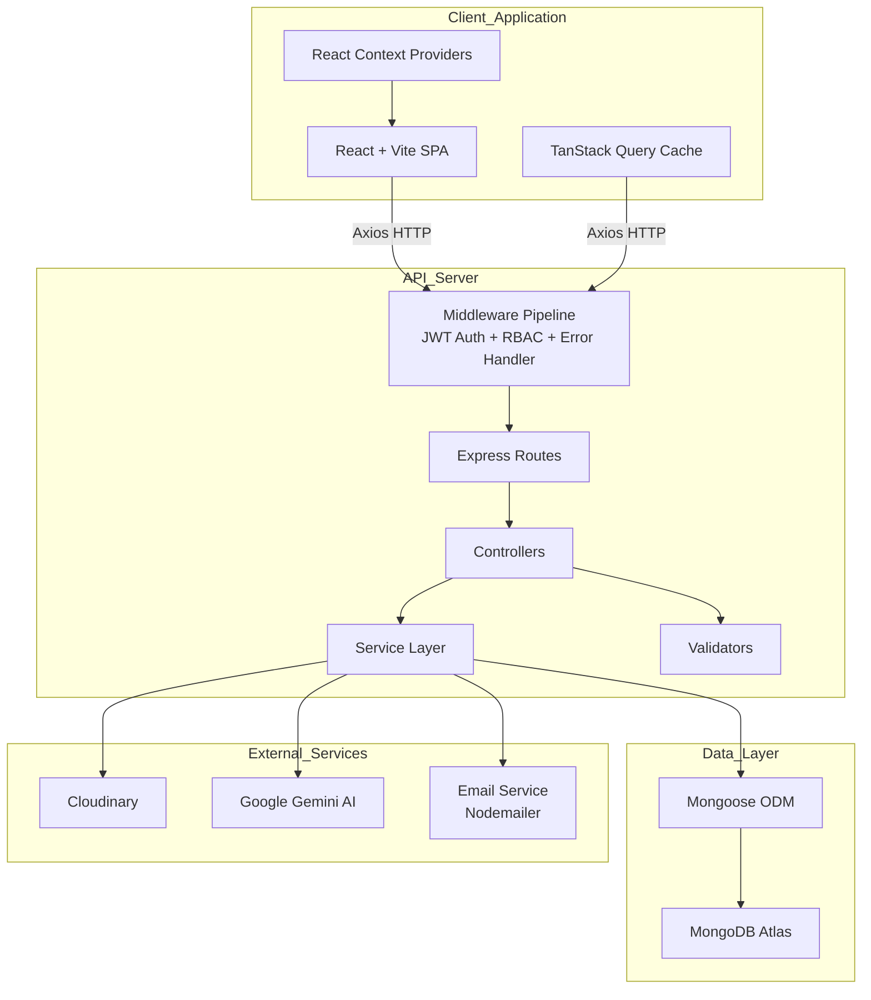
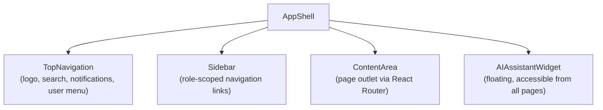
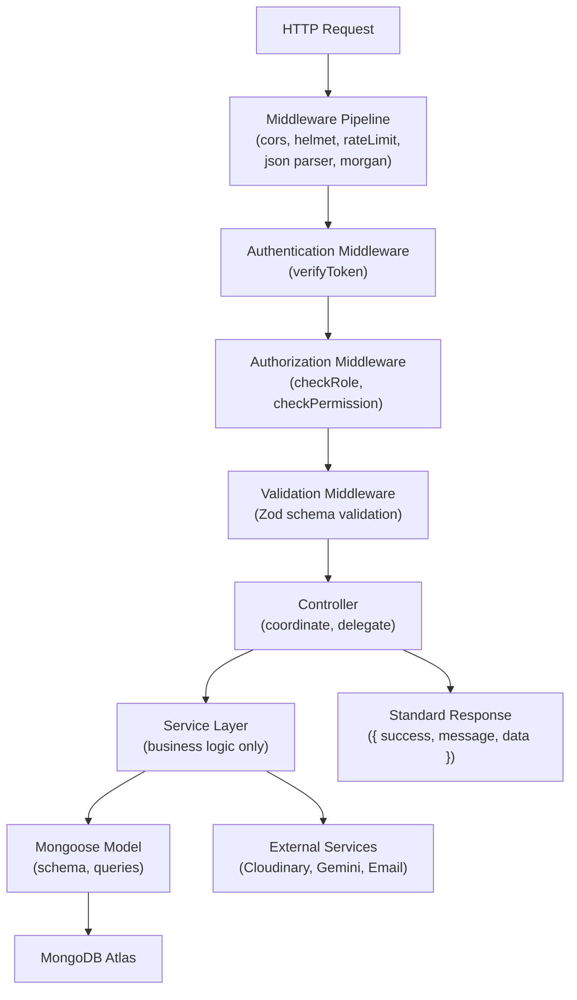
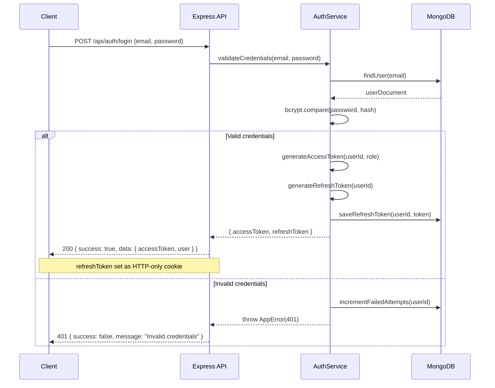
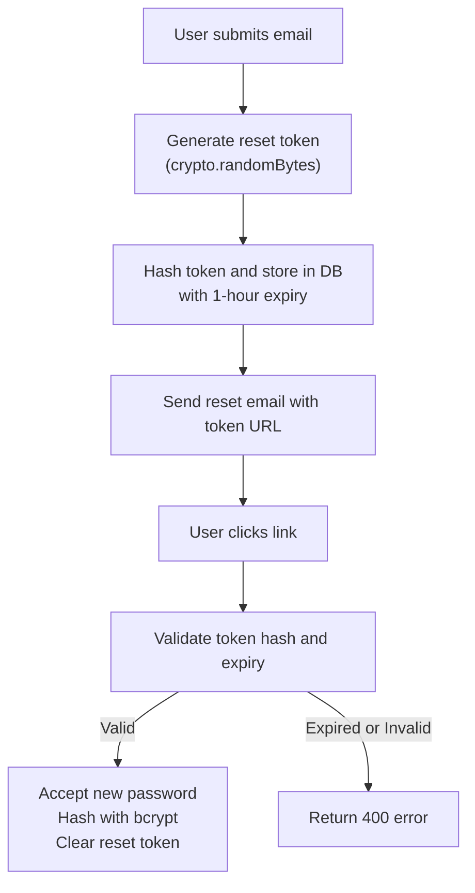
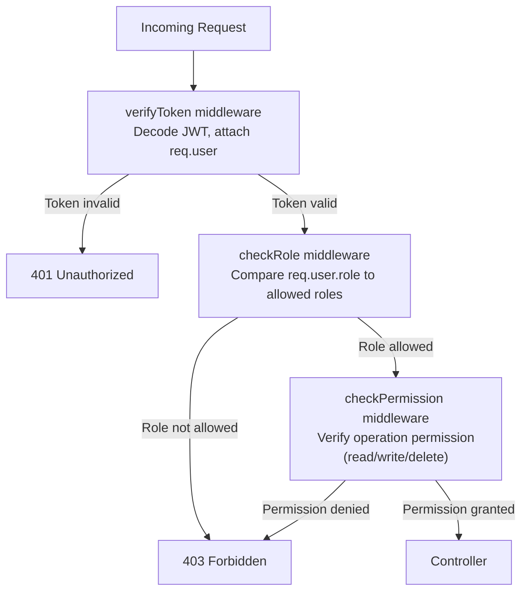
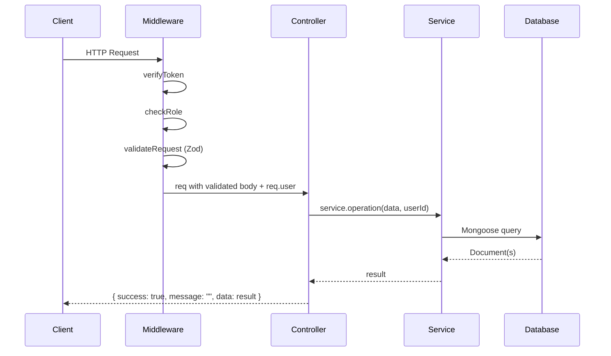
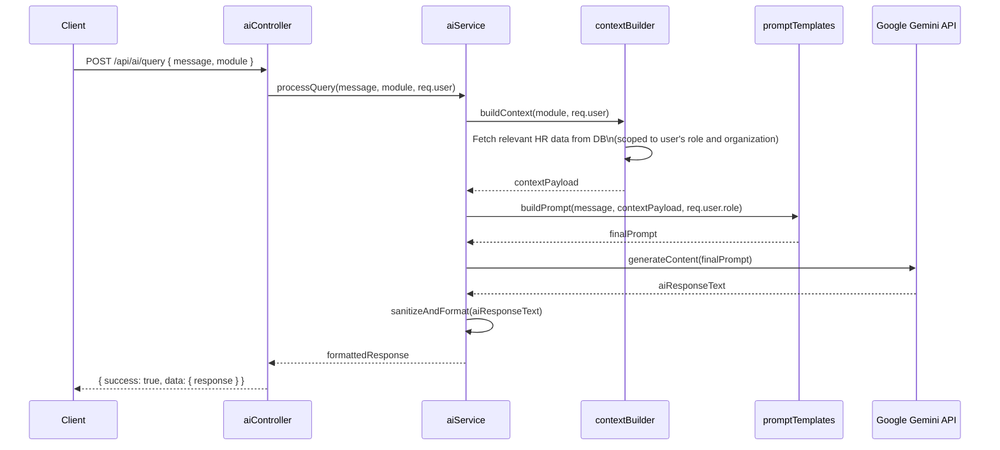
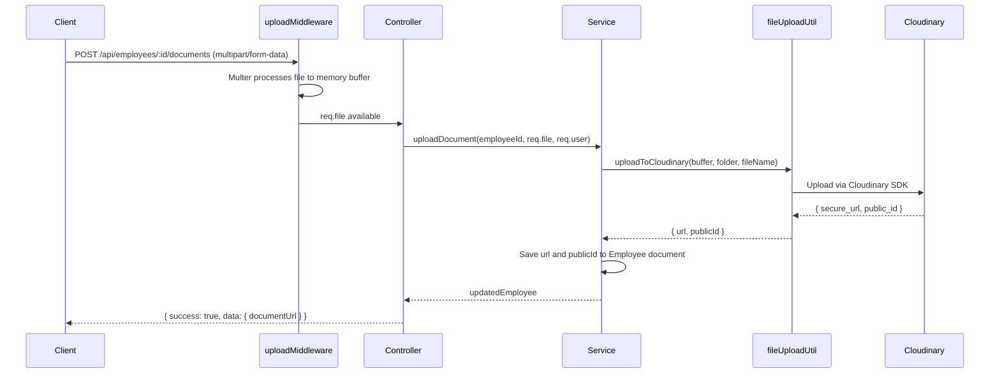
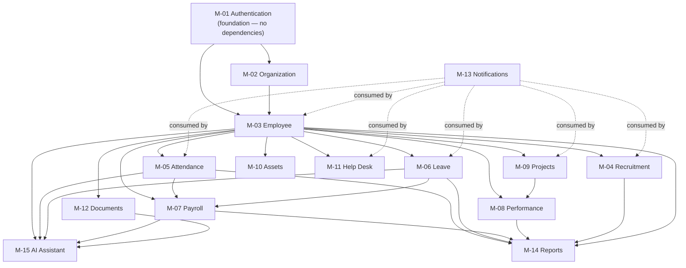

# ARCHITECTURE_REVISION.md

---

## 1. Document Metadata

| Field           | Value                                                              |
|-----------------|--------------------------------------------------------------------|
| Document Name   | ARCHITECTURE_REVISION.md                                           |
| Version         | 1.0                                                                |
| Status          | Approved                                                           |
| Authority Level | Level 3 — Inherits from PROJECT_MASTER.md                         |
| Purpose         | Definitive technical architecture specification for the Enterprise Workforce Management Platform |
| Dependencies    | AI_ENGINEERING_SPECIFICATION.md, Problem_Statement.md, PROJECT_MASTER.md |
| Last Updated    | 2026-07-03                                                         |

---

## 2. Executive Summary

### 2.1 Purpose

This document formalizes the complete technical architecture of the Enterprise Workforce Management Platform (EWMP). It translates the engineering philosophy and module definitions established in `PROJECT_MASTER.md` into implementation-ready architectural guidance covering every system layer.

### 2.2 Relationship with PROJECT_MASTER.md

`PROJECT_MASTER.md` establishes what the system is and what it must accomplish. `ARCHITECTURE_REVISION.md` defines how every component of the system is structured, how layers interact, and how each architectural concern is resolved. This document inherits all engineering decisions from `PROJECT_MASTER.md` and may not contradict them.

### 2.3 Architectural Goals

- Define an unambiguous layered architecture that all developers and AI systems can implement without deviation
- Establish consistent folder, naming, and responsibility conventions for frontend and backend
- Define the complete authentication, authorization, API, service, and database interaction patterns
- Specify the AI integration layer, file storage layer, and shared component strategy
- Provide Mermaid diagrams for every major architectural concern

### 2.4 Intended Audience

- Development AI systems (Antigravity)
- UI Generation AI (Stitch MCP)
- Human developers (4-person team)
- Technical reviewers
- Future document authors (DATABASE_DESIGN.md, API_SPECIFICATION.md, DEVELOPMENT_ORDER.md)

---

## 3. Architecture Principles

### 3.1 Architecture Philosophy

The platform follows a **strict layered architecture** where each layer has a single, clearly defined responsibility. Layers communicate downward only. No layer may bypass an adjacent layer or reach across to a non-adjacent layer.

### 3.2 Layered Architecture

Every request passes through a defined sequence of layers. Each layer processes what belongs to it and delegates the rest downward.

```
Presentation Layer  (React components, pages)
        |
   API Layer        (Express routes — endpoint definitions only)
        |
Controller Layer    (Request coordination, response formation)
        |
 Service Layer      (Business logic — exclusively)
        |
  Data Layer        (Mongoose models, ODM queries)
        |
  Database          (MongoDB Atlas)
```

### 3.3 Separation of Concerns

Each system concern is handled by exactly one designated layer or module. No concern bleeds into an adjacent concern. Business logic never exists outside the service layer. UI rendering never contains business computation. Database access never occurs outside the data layer.

### 3.4 Single Responsibility

Every file, class, function, and component has exactly one responsibility. A service handles one domain's business logic. A controller handles one route group. A component renders one logical UI unit.

### 3.5 Loose Coupling

Modules communicate through defined service interfaces, not through direct cross-module model access. The frontend communicates with the backend exclusively through the REST API. No module is aware of another module's internal implementation.

### 3.6 High Cohesion

All files related to a domain concern are grouped together. Frontend features are co-located. Backend module files (controller, service, model, route, validator) are co-located by domain.

### 3.7 Scalability

The architecture supports the addition of new modules without modifying existing modules. New routes, controllers, services, and models are registered independently. New frontend pages and components are added without restructuring existing components.

### 3.8 Maintainability

Code is structured so that any developer (human or AI) can locate, understand, and modify any module without reading unrelated code. Folder structure mirrors architectural structure. Naming conventions eliminate ambiguity.

### 3.9 Extensibility

The architecture is designed to accept future enhancements (mobile API support, caching layer, WebSocket notifications) without requiring architectural refactoring of existing modules.

### 3.10 Reusability

Shared utilities, validation schemas, services, components, and design tokens are extracted to shared locations. No implementation is duplicated across modules.

---

## 4. Overall System Architecture

### 4.1 System Layer Description

| Layer              | Technology               | Responsibility                                           |
|--------------------|--------------------------|----------------------------------------------------------|
| Client             | React 18 + Vite          | Render UI, handle user interaction, manage client state  |
| API Gateway        | Express.js               | Expose REST endpoints, apply middleware pipeline         |
| Controller         | Express controllers       | Coordinate requests, call services, return responses     |
| Service            | Node.js service modules  | Execute all business logic                               |
| ODM                | Mongoose                 | Schema definition, query abstraction, validation         |
| Database           | MongoDB Atlas            | Persistent document storage                              |
| File Storage       | Cloudinary               | Binary file and document storage                         |
| AI Service         | Google Gemini API        | LLM-based contextual responses                           |
| Email              | Nodemailer / SMTP        | Transactional email delivery                             |

### 4.2 High-Level Architecture Diagram



### 4.3 Communication Protocol

| Communication Path       | Protocol        | Format          |
|--------------------------|-----------------|-----------------|
| Client to Backend        | HTTPS REST      | JSON            |
| Backend to MongoDB Atlas | MongoDB Wire    | BSON            |
| Backend to Cloudinary    | HTTPS REST      | Multipart / JSON|
| Backend to Google Gemini | HTTPS REST      | JSON            |
| Backend to Email         | SMTP            | MIME            |

---

## 5. Frontend Architecture

### 5.1 Application Structure

The frontend is a Single Page Application (SPA) built with React 18 and Vite. It follows a **feature-aware component architecture** where shared infrastructure lives at the root and feature-specific code co-locates with its feature.

### 5.2 Routing Strategy

React Router v6 governs all client-side routing. Routes are defined centrally in `src/routes/`. Route groups are organized by authentication state:

| Route Group     | Guard              | Examples                              |
|-----------------|--------------------|---------------------------------------|
| Public          | No guard           | `/login`, `/forgot-password`, `/reset-password` |
| Protected       | Auth guard         | All authenticated routes              |
| Role-protected  | Auth + RBAC guard  | Admin-only, HR-only pages             |

Route guards read authentication state from the global auth context. Unauthorized access redirects to `/login`. Insufficient role redirects to a `403 Forbidden` page.

### 5.3 Page Hierarchy

```
/login                          → LoginPage
/forgot-password                → ForgotPasswordPage
/reset-password/:token          → ResetPasswordPage
/dashboard                      → DashboardPage (role-aware)
/organization/*                 → Organization module pages
/employees/*                    → Employee module pages
/recruitment/*                  → Recruitment module pages
/attendance/*                   → Attendance module pages
/leave/*                        → Leave module pages
/payroll/*                      → Payroll module pages
/performance/*                  → Performance module pages
/projects/*                     → Project module pages
/assets/*                       → Asset module pages
/helpdesk/*                     → Help Desk module pages
/documents/*                    → Document module pages
/reports/*                      → Reports module pages
/notifications                  → Notifications page
/ai-assistant                   → AI Assistant page
/profile                        → Profile page
/settings                       → Settings page
/403                            → ForbiddenPage
/404                            → NotFoundPage
```

### 5.4 Shared Layout

All authenticated pages render within a shared application shell:



The layout is defined once in `src/components/layout/` and composed by `AppShell.jsx`. No page renders its own navigation structure.

### 5.5 Component Organization

| Category         | Location                        | Responsibility                              |
|------------------|---------------------------------|---------------------------------------------|
| Layout           | `src/components/layout/`        | AppShell, TopNav, Sidebar, ContentArea      |
| Common UI        | `src/components/ui/`            | Button, Input, Badge, Card, Table, Dialog   |
| Data Display     | `src/components/data/`          | DataTable, StatCard, KPICard, ChartWrapper  |
| Forms            | `src/components/forms/`         | FormField, DatePicker, FileUpload, Select   |
| Feedback         | `src/components/feedback/`      | Toast, AlertBanner, EmptyState, LoadingSpinner |
| Navigation       | `src/components/navigation/`    | SidebarNav, Breadcrumb, TabGroup            |
| Feature          | `src/features/<module>/`        | Module-specific components                  |

### 5.6 Feature Organization

Each feature module co-locates its pages, components, hooks, and services:

```
src/features/employees/
├── pages/
│   ├── EmployeeListPage.jsx
│   ├── EmployeeDetailPage.jsx
│   └── AddEmployeePage.jsx
├── components/
│   ├── EmployeeCard.jsx
│   └── EmployeeTable.jsx
├── hooks/
│   └── useEmployees.js
└── services/
    └── employeeService.js
```

### 5.7 API Communication

All API calls originate from feature-level or shared service files. No component makes direct API calls. Axios is configured in `src/lib/axios.js` with:
- Base URL from environment variable
- Authorization header injection (JWT Bearer token)
- Response interceptor for 401 handling (redirect to login)
- Response interceptor for standard error extraction

TanStack Query wraps all server state. Mutations are defined in feature hooks. Cache invalidation is explicit after every mutation.

### 5.8 State Management

| State Category    | Tool                | Location                            |
|-------------------|---------------------|-------------------------------------|
| Authentication    | React Context       | `src/context/AuthContext.jsx`       |
| UI Theme          | React Context       | `src/context/ThemeContext.jsx`      |
| Server Data       | TanStack Query      | Feature hooks                       |
| Form State        | React Hook Form     | Page/component level                |
| Local UI          | React useState      | Component level                     |
| Notifications     | React Context       | `src/context/NotificationContext.jsx`|

Global state is minimized. Server state is owned by TanStack Query. Context is used only for truly global, non-server concerns.

### 5.9 Form Handling

React Hook Form manages all form state. Zod schemas define validation rules. `useForm` is initialized with a Zod resolver. Field-level validation errors display inline. Form submission is disabled while a mutation is pending.

### 5.10 Validation Strategy

All frontend validation is Zod-schema-driven. Schemas are defined in `src/features/<module>/schemas/` and registered with React Hook Form via `zodResolver`. Frontend validation is a UX layer only; backend validation is the authoritative enforcement point.

### 5.11 Loading and Error Strategy

| State      | UI Behavior                                                    |
|------------|----------------------------------------------------------------|
| Loading    | Skeleton loaders or spinner overlay; submit buttons disabled   |
| Error      | Toast notification; field-level errors on forms                |
| Empty      | EmptyState component with contextual message                   |
| Success    | Toast notification; automatic data refetch via TanStack Query  |

---

## 6. Backend Architecture

### 6.1 Server Organization

The backend is a Node.js + Express.js REST API server. It follows a strict layered architecture. Each layer is contained in its own directory. No layer reaches across to a non-adjacent layer.

### 6.2 Layered Architecture Diagram



### 6.3 Layer Responsibilities

| Layer        | File Location              | Responsibilities                                              | Prohibited                          |
|--------------|----------------------------|---------------------------------------------------------------|-------------------------------------|
| Routes       | `server/routes/`           | Endpoint path definition, middleware attachment               | Business logic, DB calls            |
| Controllers  | `server/controllers/`      | Receive request, call validators, call service, return response | Business logic, DB queries        |
| Services     | `server/services/`         | All business logic, orchestration, computation                | HTTP concerns, response formatting  |
| Models       | `server/models/`           | Mongoose schema definitions only                              | Business logic, service calls       |
| Validators   | `server/validators/`       | Zod request schema definitions                                | Business logic                      |
| Middleware   | `server/middleware/`       | Auth, RBAC, error handling, request logging                   | Business logic, DB calls            |
| Utilities    | `server/utils/`            | Shared helper functions                                       | Business logic                      |
| Config       | `server/config/`           | DB connection, environment variables, service configs         | Business logic                      |
| AI Module    | `server/ai/`               | Gemini integration, prompt templates, AI response processing  | Business logic outside AI domain    |
| Uploads      | `server/uploads/`          | Temporary file staging before Cloudinary transfer             | Business logic                      |

### 6.4 Middleware Pipeline Order

Every incoming request passes through this exact middleware pipeline:

```
1. CORS
2. Helmet (security headers)
3. Rate Limiter
4. JSON body parser
5. Request logger (Morgan)
6. Route matching
7. Authentication middleware (verifyToken)
8. Authorization middleware (checkRole)
9. Validation middleware (validateRequest)
10. Controller
11. Global error handler (terminal middleware)
```

### 6.5 Error Propagation

Services throw typed application errors. Controllers do not catch; they let errors propagate. The global error handler middleware catches all errors, determines the HTTP status code, and returns the standard error response envelope.

---

## 7. Folder Structure

### 7.1 Root Structure

```
ewmp/
├── client/                     (React + Vite frontend)
├── server/                     (Node.js + Express backend)
├── docs/                       (Project documentation)
│   ├── AI_ENGINEERING_SPECIFICATION.md
│   ├── Problem_Statement.md
│   ├── PROJECT_MASTER.md
│   ├── ARCHITECTURE_REVISION.md
│   ├── DATABASE_DESIGN.md
│   ├── API_SPECIFICATION.md
│   └── DEVELOPMENT_ORDER.md
├── .env.example                (Environment variable template)
├── .gitignore
└── README.md
```

### 7.2 Frontend Folder Structure

```
client/
├── public/
│   └── favicon.ico
├── src/
│   ├── assets/                 (Static assets: images, icons, fonts)
│   ├── components/             (Shared, reusable UI components)
│   │   ├── layout/             (AppShell, TopNavigation, Sidebar, ContentArea)
│   │   ├── ui/                 (Button, Input, Badge, Card, Dialog, Table, etc.)
│   │   ├── data/               (DataTable, StatCard, KPICard, ChartWrapper)
│   │   ├── forms/              (FormField, DatePicker, FileUpload, SearchInput)
│   │   ├── feedback/           (Toast, AlertBanner, EmptyState, LoadingSpinner)
│   │   └── navigation/         (SidebarNav, Breadcrumb, TabGroup)
│   ├── context/                (React Context providers)
│   │   ├── AuthContext.jsx
│   │   ├── ThemeContext.jsx
│   │   └── NotificationContext.jsx
│   ├── features/               (Feature-organized modules)
│   │   ├── auth/               (Login, ForgotPassword, ResetPassword)
│   │   ├── dashboard/          (Role-aware dashboard page)
│   │   ├── organization/       (Departments, designations, locations, shifts)
│   │   ├── employees/          (Employee CRUD, profile, timeline)
│   │   ├── recruitment/        (Candidates, interviews, offers)
│   │   ├── attendance/         (Clock-in/out, corrections, reports)
│   │   ├── leave/              (Apply, approve, balance, history)
│   │   ├── payroll/            (Payroll run, payslips, history)
│   │   ├── performance/        (Goals, KPIs, reviews, ratings)
│   │   ├── projects/           (Projects, tasks, Kanban, sprints)
│   │   ├── assets/             (Asset inventory, assignment, return)
│   │   ├── helpdesk/           (Tickets, assignment, resolution)
│   │   ├── documents/          (Upload, categorize, search)
│   │   ├── notifications/      (Notification center)
│   │   ├── reports/            (Analytics dashboards, exports)
│   │   └── ai-assistant/       (AI chat widget, prompt interface)
│   ├── hooks/                  (Shared custom hooks)
│   │   ├── useAuth.js
│   │   ├── useDebounce.js
│   │   ├── usePagination.js
│   │   └── useToast.js
│   ├── lib/                    (Library configurations)
│   │   ├── axios.js            (Axios instance with interceptors)
│   │   └── queryClient.js      (TanStack Query client config)
│   ├── routes/                 (Route definitions and guards)
│   │   ├── AppRouter.jsx
│   │   ├── PrivateRoute.jsx
│   │   └── RoleRoute.jsx
│   ├── utils/                  (Shared utility functions)
│   │   ├── formatDate.js
│   │   ├── formatCurrency.js
│   │   └── cn.js               (Tailwind class merge utility)
│   ├── types/                  (JSDoc types or TypeScript interfaces)
│   ├── App.jsx
│   └── main.jsx
├── index.html
├── vite.config.js
├── tailwind.config.js
├── postcss.config.js
└── .env
```

### 7.3 Backend Folder Structure

```
server/
├── config/
│   ├── db.js                   (MongoDB Atlas connection)
│   ├── cloudinary.js           (Cloudinary SDK configuration)
│   ├── gemini.js               (Google Gemini SDK configuration)
│   └── env.js                  (Environment variable validation)
├── controllers/
│   ├── authController.js
│   ├── organizationController.js
│   ├── employeeController.js
│   ├── recruitmentController.js
│   ├── attendanceController.js
│   ├── leaveController.js
│   ├── payrollController.js
│   ├── performanceController.js
│   ├── projectController.js
│   ├── assetController.js
│   ├── helpdeskController.js
│   ├── documentController.js
│   ├── notificationController.js
│   ├── reportController.js
│   └── aiController.js
├── middleware/
│   ├── authMiddleware.js        (verifyToken)
│   ├── rbacMiddleware.js        (checkRole, checkPermission)
│   ├── validationMiddleware.js  (validateRequest with Zod)
│   ├── errorMiddleware.js       (global error handler)
│   ├── uploadMiddleware.js      (Multer configuration)
│   └── rateLimitMiddleware.js   (express-rate-limit)
├── models/
│   ├── User.js
│   ├── Organization.js
│   ├── Department.js
│   ├── Designation.js
│   ├── Employee.js
│   ├── Candidate.js
│   ├── Attendance.js
│   ├── Leave.js
│   ├── LeaveBalance.js
│   ├── Payroll.js
│   ├── Performance.js
│   ├── Goal.js
│   ├── Project.js
│   ├── Task.js
│   ├── Asset.js
│   ├── Ticket.js
│   ├── Document.js
│   └── Notification.js
├── routes/
│   ├── authRoutes.js
│   ├── organizationRoutes.js
│   ├── employeeRoutes.js
│   ├── recruitmentRoutes.js
│   ├── attendanceRoutes.js
│   ├── leaveRoutes.js
│   ├── payrollRoutes.js
│   ├── performanceRoutes.js
│   ├── projectRoutes.js
│   ├── assetRoutes.js
│   ├── helpdeskRoutes.js
│   ├── documentRoutes.js
│   ├── notificationRoutes.js
│   ├── reportRoutes.js
│   └── aiRoutes.js
├── services/
│   ├── authService.js
│   ├── organizationService.js
│   ├── employeeService.js
│   ├── recruitmentService.js
│   ├── attendanceService.js
│   ├── leaveService.js
│   ├── payrollService.js
│   ├── performanceService.js
│   ├── projectService.js
│   ├── assetService.js
│   ├── helpdeskService.js
│   ├── documentService.js
│   ├── notificationService.js
│   ├── reportService.js
│   └── aiService.js
├── validators/
│   ├── authValidator.js
│   ├── employeeValidator.js
│   ├── recruitmentValidator.js
│   ├── attendanceValidator.js
│   ├── leaveValidator.js
│   ├── payrollValidator.js
│   ├── performanceValidator.js
│   ├── projectValidator.js
│   ├── assetValidator.js
│   ├── helpdeskValidator.js
│   └── documentValidator.js
├── utils/
│   ├── generateToken.js
│   ├── generateEmployeeId.js
│   ├── sendEmail.js
│   ├── formatResponse.js
│   ├── calculateWorkingHours.js
│   ├── calculateSalary.js
│   └── AppError.js             (Custom error class)
├── ai/
│   ├── geminiClient.js         (Initialized Gemini client)
│   ├── promptTemplates.js      (Role-aware prompt builders)
│   └── contextBuilder.js       (Assembles HR context for AI requests)
├── uploads/                    (Temporary file storage — Multer staging)
├── logs/                       (Server-side log files)
└── server.js                   (Entry point, app bootstrap, route registration)
```

### 7.4 Folder Responsibility Summary

| Folder              | Purpose                                                         |
|---------------------|-----------------------------------------------------------------|
| `config/`           | External service initialization and environment validation      |
| `controllers/`      | Request entry, service delegation, response return              |
| `middleware/`       | Cross-cutting concerns: auth, RBAC, validation, errors          |
| `models/`           | Mongoose schema definitions only                                |
| `routes/`           | Express router definitions and middleware attachment            |
| `services/`         | All business logic for each domain                              |
| `validators/`       | Zod schemas for request body and query validation               |
| `utils/`            | Shared pure functions, no side effects                          |
| `ai/`               | Gemini client, prompt construction, AI response processing      |
| `uploads/`          | Temporary staging for file uploads before Cloudinary transfer   |
| `logs/`             | Request and error logs                                          |

---

## 8. Authentication Architecture

### 8.1 Authentication Strategy

Authentication is stateless and JWT-based. No server-side session storage is used. Every authenticated request carries a signed JWT in the `Authorization` header.

### 8.2 JWT Token Strategy

| Token Type    | Expiration       | Storage                        | Refresh Mechanism          |
|---------------|------------------|--------------------------------|----------------------------|
| Access Token  | 15 minutes       | Memory (JavaScript variable)   | Refresh token call         |
| Refresh Token | 7 days           | HTTP-only cookie               | POST /api/auth/refresh     |

Access tokens are short-lived to minimize breach exposure. Refresh tokens are stored in HTTP-only cookies to prevent JavaScript access.

### 8.3 Authentication Flow



### 8.4 Token Validation Middleware

Every protected route passes through `authMiddleware.js`:

```
1. Extract Bearer token from Authorization header
2. Verify JWT signature using JWT_SECRET
3. Check token expiration
4. Decode payload { userId, role, organizationId }
5. Attach decoded payload to req.user
6. Call next() on success
7. Throw 401 AppError on failure
```

### 8.5 Password Security

| Operation         | Implementation                                                  |
|-------------------|-----------------------------------------------------------------|
| Hashing           | bcrypt with salt rounds = 12                                    |
| Comparison        | bcrypt.compare() — constant-time comparison                     |
| Storage           | Only bcrypt hash stored; plaintext never persisted              |
| Minimum length    | 8 characters enforced by Zod validator                          |
| Complexity        | Uppercase, lowercase, number, and special character required    |

### 8.6 Account Lock Strategy

After 5 consecutive failed login attempts, the account is locked. Lock state is stored in the User model as `isLocked: Boolean` and `lockUntil: Date`. Locked accounts must contact an IT Administrator to unlock. Lock state resets on successful login.

### 8.7 Password Reset Flow



### 8.8 Public vs Protected Routes

| Route Category | Examples                              | Middleware Applied         |
|----------------|---------------------------------------|----------------------------|
| Public         | `/api/auth/login`, `/api/auth/forgot-password`, `/api/auth/reset-password` | None |
| Protected      | All other `/api/*` routes             | `verifyToken` + `checkRole` |

---

## 9. Authorization (RBAC) Architecture

### 9.1 Role Definitions

| Role ID | Role Name          | System Scope                          |
|---------|--------------------|---------------------------------------|
| SUPER_ADMIN | Super Admin    | Platform-wide, all organizations      |
| ORG_ADMIN | Organization Admin | Single organization, full access    |
| HR_MANAGER | HR Manager       | Employee lifecycle, recruitment       |
| MANAGER    | Manager          | Department team, approvals            |
| TEAM_LEAD  | Team Lead        | Project tasks, team monitoring        |
| EMPLOYEE   | Employee         | Self-service only                     |
| FINANCE    | Finance Executive | Payroll operations                   |
| IT_ADMIN   | IT Administrator | Help desk, assets                     |
| AUDITOR    | Auditor          | Read-only access                      |

### 9.2 Authorization Middleware Flow



### 9.3 RBAC Implementation Pattern

Routes declare required roles as middleware arguments:

```
router.get('/employees', verifyToken, checkRole(['SUPER_ADMIN','ORG_ADMIN','HR_MANAGER','MANAGER']), employeeController.getAll)
router.post('/employees', verifyToken, checkRole(['SUPER_ADMIN','HR_MANAGER']), employeeController.create)
```

### 9.4 RBAC Permission Matrix

| Module              | SUPER_ADMIN | HR_MANAGER | MANAGER    | EMPLOYEE     | FINANCE     | IT_ADMIN    | AUDITOR |
|---------------------|-------------|------------|------------|--------------|-------------|-------------|---------|
| User Management     | Full        | Read       | No Access  | No Access    | No Access   | No Access   | Read    |
| Employee Management | Full        | CRUD       | Read       | Self Only    | Read        | Read        | Read    |
| Recruitment         | Full        | CRUD       | Interview  | No Access    | No Access   | No Access   | Read    |
| Attendance          | Full        | CRUD       | Approve    | Mark Own     | Read        | No Access   | Read    |
| Leave               | Full        | CRUD       | Approve    | Apply        | Read        | No Access   | Read    |
| Payroll             | Full        | Read       | Read       | View Own     | CRUD        | No Access   | Read    |
| Project Management  | Full        | Read       | CRUD       | Assigned     | No Access   | No Access   | Read    |
| Asset Management    | Full        | Read       | Read       | View Assigned| No Access   | CRUD        | Read    |
| Help Desk           | Full        | Read       | Read       | Raise Ticket | No Access   | CRUD        | Read    |
| Documents           | Full        | CRUD       | Team Read  | Own Docs     | No Access   | No Access   | Read    |
| Reports             | Full        | Generate   | Dept Only  | Personal     | Payroll     | IT Reports  | Full    |
| AI Assistant        | Full        | Full       | Full       | Role-scoped  | Role-scoped | Role-scoped | Full    |
| Notifications       | Full        | Read       | Read       | Own          | Own         | Own         | Read    |
| Organization        | Full        | Read       | Read       | No Access    | No Access   | No Access   | Read    |

### 9.5 Data Scoping

Authorization is enforced at two levels:

1. **Route Level** — `checkRole` prevents access to routes the user's role cannot reach
2. **Data Level** — Service methods filter queries by `organizationId`, `managerId`, or `employeeId` based on role, so users only receive data they are authorized to see

---

## 10. API Architecture

### 10.1 REST Philosophy

The API follows REST conventions. Resources are identified by plural nouns. HTTP methods express the operation. Stateless requests carry all context in headers and body. No server-side session state is referenced.

### 10.2 URL Naming Convention

| Pattern                        | Purpose                                |
|--------------------------------|----------------------------------------|
| `/api/employees`               | Collection resource                    |
| `/api/employees/:id`           | Single resource                        |
| `/api/employees/:id/documents` | Nested sub-resource                    |
| `/api/attendance/report`       | Collection-level action                |
| `/api/auth/login`              | Non-resource action (acceptable for auth) |

All path segments use plural lowercase nouns. No verbs in resource URLs.

### 10.3 HTTP Method Semantics

| Method  | Usage                                           |
|---------|-------------------------------------------------|
| GET     | Retrieve resource(s) — idempotent, no side effects |
| POST    | Create resource or trigger action                |
| PUT     | Replace entire resource                          |
| PATCH   | Partial resource update                          |
| DELETE  | Remove resource (soft delete preferred)          |

### 10.4 Request Lifecycle



### 10.5 Standard Response Envelope

**Success:**
```json
{
  "success": true,
  "message": "Operation description",
  "data": {}
}
```

**Error:**
```json
{
  "success": false,
  "message": "Error description",
  "error": {}
}
```

No module may define its own response format. All responses use this envelope. This is an immutable decision (ADR-007 in PROJECT_MASTER.md).

### 10.6 Pagination Convention

List endpoints accept:
- `page` (default: 1)
- `limit` (default: 20)
- `sortBy` (field name)
- `sortOrder` (`asc` / `desc`)
- `search` (text search query)

Paginated responses include:
```json
{
  "success": true,
  "data": {
    "items": [],
    "total": 0,
    "page": 1,
    "limit": 20,
    "totalPages": 0
  }
}
```

### 10.7 API Versioning

All routes are prefixed with `/api`. No versioning prefix (`/api/v1/`) is used for this academic release. Version namespacing is reserved for future production architecture.

### 10.8 API Security Principles

- All protected routes require valid JWT
- RBAC checked before controller execution
- Request body validated with Zod schema before controller execution
- Rate limiting applied at the API entry point
- CORS restricted to known client origin
- No sensitive data returned in error responses

---

## 11. Service Layer Architecture

### 11.1 Business Logic Organization

The service layer is the exclusive home of all business logic. One service file exists per domain module. Service files are named `<module>Service.js` in camelCase. Services do not import other services unless there is a documented cross-module dependency.

### 11.2 Service Responsibilities

| Responsibility                    | In Service | Not in Service       |
|-----------------------------------|------------|----------------------|
| Data computation and transformation | Yes      | —                    |
| Mongoose model queries             | Yes        | —                    |
| External API calls (Cloudinary, Gemini, Email) | Yes | —           |
| Business rule enforcement          | Yes        | —                    |
| HTTP status codes                  | No         | Controller           |
| Response formatting                | No         | Controller           |
| Request parsing                    | No         | Controller/Middleware|

### 11.3 Cross-Module Service Dependencies

When one module's business logic requires data from another module, the service may call another service method (not import models directly from that module):

```
payrollService.js
  → imports attendanceService (to get attendance data)
  → imports leaveService (to get leave deduction data)
  → does NOT import Attendance.js or Leave.js models directly
```

### 11.4 Error Propagation

Services throw `AppError` instances for expected business errors. `AppError` carries a status code and message. Services use `try/catch` internally only for external service calls (Cloudinary, Gemini, Email). All AppErrors propagate to the global error handler.

### 11.5 Shared Business Logic

Business logic that applies across multiple modules (e.g., working hours calculation, salary computation) is extracted to `server/utils/` as pure functions and imported by the relevant service. No duplication.

### 11.6 Transaction Philosophy

MongoDB transactions are used when an operation modifies multiple documents that must succeed or fail atomically (e.g., creating a user and an employee profile simultaneously). Mongoose session-based transactions are used via `mongoose.startSession()`.

---

## 12. Database Interaction Architecture

### 12.1 ODM Strategy

Mongoose is the exclusive interface to MongoDB Atlas. Direct MongoDB driver calls are not used. All queries, schema definitions, and validation are mediated through Mongoose.

### 12.2 Query Flow

```
Service method
    → Mongoose Model method (.find(), .findById(), .create(), .findByIdAndUpdate())
    → Mongoose validates against schema
    → MongoDB Atlas query execution
    → Mongoose hydrates response documents
    → Service returns plain JavaScript objects or Mongoose documents
```

### 12.3 Reference Strategy

Cross-collection relationships use MongoDB ObjectId references. Mongoose `.populate()` is used selectively for read operations where related data is required. Unnecessary population chains are avoided for performance.

| Relationship Type     | Implementation                                       |
|-----------------------|------------------------------------------------------|
| Employee to Department| `department: { type: ObjectId, ref: 'Department' }`  |
| Attendance to Employee| `employee: { type: ObjectId, ref: 'Employee' }`      |
| Leave to Employee     | `employee: { type: ObjectId, ref: 'Employee' }`      |
| Task to Project       | `project: { type: ObjectId, ref: 'Project' }`        |

Embedding is used only for sub-documents with no independent lifecycle (e.g., address within an employee document).

### 12.4 Soft Delete Philosophy

Records are never hard-deleted in production. Soft delete is implemented via:
- `status: { type: String, enum: ['active', 'inactive', 'archived'] }`
- All queries filter by `status: 'active'` by default
- Admin-level restore is available for archived records

### 12.5 Standard Fields

Every collection includes:

| Field       | Type       | Description                              |
|-------------|------------|------------------------------------------|
| `_id`       | ObjectId   | Auto-generated MongoDB document ID       |
| `createdAt` | Date       | Mongoose timestamps (auto)               |
| `updatedAt` | Date       | Mongoose timestamps (auto)               |
| `status`    | String     | Record lifecycle status                  |
| `organizationId` | ObjectId | Multi-tenancy scope (where applicable) |

### 12.6 Index Strategy

Indexes are defined per collection based on query patterns:
- `email` — unique index on User and Candidate
- `employeeId` — unique index on Employee
- `organizationId` — compound index on most collections
- `date + employee` — compound index on Attendance

Detailed index definitions belong to `DATABASE_DESIGN.md`.

### 12.7 Caching Philosophy

No caching layer is implemented in this academic release. TanStack Query on the frontend provides client-side response caching. Server-side caching (Redis) is identified as a future enhancement.

---

## 13. Shared Component Architecture

### 13.1 Design System Foundation

The design system is implemented using Tailwind CSS utility classes and shadcn/ui as the component primitive layer. All design tokens (colors, spacing, typography, border radius) are defined in `tailwind.config.js` and `globals.css`. No inline styles are used.

### 13.2 Component Hierarchy

```
Design System (tailwind.config.js + globals.css)
    |
shadcn/ui primitives (Button, Dialog, Select, etc.)
    |
Shared application components (DataTable, StatCard, etc.)
    |
Feature components (EmployeeCard, LeaveApprovalRow, etc.)
    |
Feature pages (EmployeeListPage, LeaveManagementPage, etc.)
```

### 13.3 Shared Component Catalogue

| Component          | Location                          | Purpose                                           |
|--------------------|-----------------------------------|---------------------------------------------------|
| `AppShell`         | `components/layout/`              | Root authenticated layout wrapper                 |
| `TopNavigation`    | `components/layout/`              | Global header with user menu and notifications    |
| `Sidebar`          | `components/layout/`              | Role-scoped navigation links                      |
| `ContentArea`      | `components/layout/`              | Main content outlet                               |
| `DataTable`        | `components/data/`                | Sortable, paginated, searchable data table        |
| `StatCard`         | `components/data/`                | KPI metric display card                           |
| `ChartWrapper`     | `components/data/`                | Recharts wrapper with consistent styling          |
| `FormField`        | `components/forms/`               | Label + input + error message wrapper             |
| `FileUpload`       | `components/forms/`               | Drag-and-drop file upload with preview            |
| `DatePicker`       | `components/forms/`               | Calendar date selection input                     |
| `SearchInput`      | `components/forms/`               | Debounced search field                            |
| `Toast`            | `components/feedback/`            | Success/error notification                        |
| `AlertBanner`      | `components/feedback/`            | Inline contextual alerts                          |
| `EmptyState`       | `components/feedback/`            | Empty data placeholder with action                |
| `LoadingSpinner`   | `components/feedback/`            | Centered loading indicator                        |
| `Breadcrumb`       | `components/navigation/`          | Page location indicator                           |
| `TabGroup`         | `components/navigation/`          | Horizontal tab navigation                         |
| `StatusBadge`      | `components/ui/`                  | Colored status pill (Active, Pending, Rejected)   |
| `ConfirmDialog`    | `components/ui/`                  | Destructive action confirmation modal             |
| `PageHeader`       | `components/ui/`                  | Consistent page title + actions row               |

### 13.4 Component Reuse Strategy

- No feature may create a component that duplicates a shared component
- Feature components that have reuse potential are promoted to `src/components/`
- All components accept `className` prop for context-specific styling overrides
- Components are accessible by default (aria labels, keyboard navigation) via shadcn/ui

---

## 14. State Management Architecture

### 14.1 State Categories

| State Category      | Owner               | Scope       | Tool                    |
|---------------------|---------------------|-------------|-------------------------|
| Authentication state| AuthContext         | Global      | React Context + useState |
| Notification state  | NotificationContext | Global      | React Context + useState |
| Theme state         | ThemeContext        | Global      | React Context + useState |
| Server data         | TanStack Query      | Feature     | QueryClient cache        |
| Form state          | React Hook Form     | Component   | useForm hook             |
| Local UI state      | useState            | Component   | React useState           |

### 14.2 AuthContext

The `AuthContext` provides:
- `user` — decoded JWT payload (userId, role, organizationId, name)
- `accessToken` — current access token (in memory only)
- `login(token, user)` — store token and user in memory + context
- `logout()` — clear token, clear context, redirect to login
- `isAuthenticated` — boolean derived from token presence

The access token is never stored in localStorage or sessionStorage.

### 14.3 TanStack Query Strategy

| Pattern             | Implementation                                               |
|---------------------|--------------------------------------------------------------|
| Query keys          | `['employees']`, `['employee', id]`, `['attendance', month]` |
| Stale time          | 5 minutes for list queries; 10 minutes for detail queries    |
| Cache invalidation  | On every mutation that modifies the related collection       |
| Optimistic updates  | Not used by default; pessimistic updates only                |
| Error handling      | `onError` callbacks trigger toast notifications              |
| Loading state       | `isLoading` drives skeleton and spinner states               |

### 14.4 Data Flow Pattern

```
User action
    → React component event handler
    → useMutation hook (TanStack Query)
    → Axios POST/PUT/PATCH/DELETE
    → API Server
    → Response
    → onSuccess callback
    → queryClient.invalidateQueries([key])
    → useQuery refetches
    → UI updates
```

---

## 15. Validation Architecture

### 15.1 Frontend Validation

- Zod schemas defined in `src/features/<module>/schemas/`
- React Hook Form initialized with `zodResolver(schema)`
- Field-level errors displayed inline below each input
- Submit button disabled when form is invalid or pending
- Frontend validation provides immediate UX feedback only

### 15.2 Backend Validation

- Zod schemas defined in `server/validators/`
- Validation middleware (`validateRequest`) runs before controller
- Returns `400 Bad Request` with structured error details on failure
- Backend validation is the authoritative enforcement layer

### 15.3 Validation Lifecycle

```
Frontend: User types
    → React Hook Form validates field on blur/change
    → Zod schema parses value
    → Error displayed inline

User submits form
    → React Hook Form validates all fields
    → If invalid: prevent submission, highlight errors
    → If valid: fire mutation

API receives request
    → validateRequest middleware runs Zod schema
    → If invalid: 400 response with field errors
    → If valid: pass to controller
```

### 15.4 Input Sanitization

- All string inputs trimmed before persistence
- Mongoose schema validators enforce field types, min/max lengths
- No raw HTML input accepted in text fields
- File uploads validated for type and size before Cloudinary transfer

### 15.5 Error Message Standards

Backend validation errors are returned as:
```json
{
  "success": false,
  "message": "Validation failed",
  "error": {
    "fields": {
      "email": "Valid email address required",
      "password": "Password must be at least 8 characters"
    }
  }
}
```

---

## 16. Error Handling Architecture

### 16.1 AppError Class

A custom `AppError` class extends `Error` with:
- `statusCode` — HTTP status code
- `message` — Human-readable error message
- `isOperational` — distinguishes expected errors from programming errors

### 16.2 Error Categories

| Error Type           | HTTP Status | Throw Location          | Handler                  |
|----------------------|-------------|-------------------------|--------------------------|
| Validation error     | 400         | Validation middleware   | Global error handler     |
| Authentication error | 401         | Auth middleware         | Global error handler     |
| Authorization error  | 403         | RBAC middleware         | Global error handler     |
| Not found error      | 404         | Service layer           | Global error handler     |
| Business rule error  | 422         | Service layer           | Global error handler     |
| External service error| 502        | Service layer           | Global error handler     |
| Server error         | 500         | Unhandled exceptions    | Global error handler     |

### 16.3 Global Error Handler

`errorMiddleware.js` is the terminal Express middleware:

```
1. Check if error is AppError (operational)
2. If operational: return { success: false, message: error.message, error: details }
3. If not operational: log full error, return { success: false, message: "Internal server error" }
4. Log all errors to logs/error.log
```

### 16.4 Frontend Error Handling

| Error Source    | UI Response                                           |
|-----------------|-------------------------------------------------------|
| Network error   | Toast: "Connection failed. Please try again."         |
| 401 response    | Axios interceptor: redirect to /login                 |
| 403 response    | Toast: "You do not have permission for this action."  |
| 404 response    | Toast or redirect to 404 page                         |
| 422 response    | Field-level validation errors on form                 |
| 500 response    | Toast: "Server error. Please try again later."        |

### 16.5 Unhandled Rejection Protection

`server.js` registers global handlers:
```
process.on('unhandledRejection', ...)
process.on('uncaughtException', ...)
```

Both log the error and perform a graceful server shutdown.

---

## 17. Security Architecture

### 17.1 Authentication Security

- JWT signed with a strong secret (minimum 256-bit) stored in environment variable
- Access tokens expire in 15 minutes
- Refresh tokens stored in HTTP-only, Secure, SameSite=Strict cookies
- Token signature verified on every protected request

### 17.2 Password Security

- bcrypt salt rounds = 12
- Password minimum length: 8 characters
- Complexity: uppercase, lowercase, number, special character
- Account lock after 5 failed attempts
- Password reset tokens are cryptographically random and expire in 1 hour
- Reset tokens are hashed before database storage

### 17.3 Transport Security

- HTTPS enforced in production
- HTTP Strict Transport Security (HSTS) header via Helmet
- All external API calls (Cloudinary, Gemini) use HTTPS

### 17.4 HTTP Security Headers

Helmet.js applies the following security headers:
- `Content-Security-Policy`
- `X-Content-Type-Options: nosniff`
- `X-Frame-Options: DENY`
- `X-XSS-Protection: 1; mode=block`
- `Referrer-Policy: no-referrer`
- `Strict-Transport-Security`

### 17.5 CORS Configuration

```
Origin: CLIENT_URL environment variable (specific origin, not wildcard *)
Methods: GET, POST, PUT, PATCH, DELETE
Credentials: true (required for HTTP-only cookie transmission)
```

### 17.6 Rate Limiting

`express-rate-limit` applied at the API entry point:
- General API: 100 requests per 15 minutes per IP
- Auth endpoints: 10 requests per 15 minutes per IP (stricter limit)

### 17.7 Input Validation and Injection Prevention

- All inputs validated with Zod before reaching the service layer
- Mongoose ODM parameterizes all queries; no raw query string construction
- No MongoDB operator injection possible through Zod-validated types
- File type and size validation before storage

### 17.8 File Upload Security

- Accepted MIME types explicitly whitelisted (PDF, JPEG, PNG, DOCX)
- Maximum file size enforced by Multer before Cloudinary transfer
- Cloudinary URL is stored; files are served from Cloudinary CDN, not the Express server
- No executable file types accepted

### 17.9 Environment Variable Strategy

| Variable Category    | Example                         | Storage               |
|----------------------|---------------------------------|-----------------------|
| JWT secrets          | `JWT_SECRET`, `JWT_REFRESH_SECRET` | `.env` (not committed) |
| Database connection  | `MONGODB_URI`                   | `.env`                |
| External service keys| `CLOUDINARY_API_KEY`, `GEMINI_API_KEY` | `.env`          |
| Application config   | `CLIENT_URL`, `PORT`            | `.env`                |

`.env` is listed in `.gitignore`. `.env.example` contains all variable names with placeholder values and is committed to the repository.

### 17.10 Least Privilege Principle

- Each role has the minimum permissions required for its function
- Service methods accept `userId` and `role` parameters and filter data accordingly
- No elevated permission is ever assumed; all access is explicitly checked

---

## 18. AI Integration Architecture

### 18.1 AI Service Philosophy

The AI integration is a contained service layer module. The AI assistant is a feature that consumes organizational data and presents contextual LLM responses. It does not modify any data. It reads only data the authenticated user is authorized to access.

### 18.2 AI Architecture Components

| Component           | Location                   | Responsibility                                           |
|---------------------|----------------------------|----------------------------------------------------------|
| `geminiClient.js`   | `server/ai/`               | Initialize and export the Google Gemini client           |
| `promptTemplates.js`| `server/ai/`               | Role-aware, module-aware prompt template builders        |
| `contextBuilder.js` | `server/ai/`               | Assemble HR context payload for each AI request          |
| `aiService.js`      | `server/services/`         | Orchestrate context building, prompt construction, Gemini call, response processing |
| `aiController.js`   | `server/controllers/`      | Receive AI request, call aiService, return response      |
| `aiRoutes.js`       | `server/routes/`           | Expose `/api/ai/*` endpoints                             |

### 18.3 AI Request Lifecycle



### 18.4 Context Building Strategy

The `contextBuilder` assembles a structured context payload specific to the user's role and the module context of the query:

| AI Feature              | Context Data Assembled                                      |
|-------------------------|-------------------------------------------------------------|
| Leave Assistant         | Employee leave balances, leave types, leave history         |
| Attendance Insights     | Employee attendance records for current month/quarter       |
| Payroll Explainer       | Employee payslip components for the requested period        |
| HR Policy Assistant     | Organization documents tagged as HR policies                |
| Resume Analyzer         | Uploaded resume text extracted from Cloudinary URL          |
| Performance Summary     | Employee KPI scores and manager ratings                     |

### 18.5 Rate Limit Handling

Google Gemini API rate limits are handled in `aiService.js`:
- On `429 Too Many Requests`: return a structured user-facing message ("AI service is temporarily unavailable. Please try again in a moment.")
- No retry loop implemented; single-attempt request
- Rate limit errors are logged

### 18.6 Fallback Strategy

If the Gemini API call fails:
1. `aiService.js` catches the error
2. Returns a structured fallback message to the client
3. Logs the error with full details
4. Does not throw 500 to the user unless the failure is unrecoverable

### 18.7 AI Security

- AI endpoint is protected by `verifyToken` middleware
- Context data is fetched with the same RBAC filters as regular data endpoints
- The AI model is never given data the user is not authorized to see
- AI responses are sanitized before return; no raw HTML in responses

---

## 19. File Storage Architecture

### 19.1 Storage Philosophy

Binary files (employee documents, resumes, certificates, task attachments) are stored exclusively in Cloudinary. The Express server does not serve binary files. Cloudinary URLs are stored in MongoDB documents. Files are streamed to Cloudinary via Multer.

### 19.2 Upload Architecture Components

| Component              | Location                      | Responsibility                                     |
|------------------------|-------------------------------|-----------------------------------------------------|
| `uploadMiddleware.js`  | `server/middleware/`          | Multer configuration: disk storage for temp files   |
| Cloudinary config      | `server/config/cloudinary.js` | Initialize Cloudinary SDK with env credentials      |
| `fileUploadUtil.js`    | `server/utils/`               | Upload file buffer to Cloudinary, return URL        |
| Service method         | `server/services/<module>Service.js` | Call fileUploadUtil, store returned URL in DB |

### 19.3 Upload Flow



### 19.4 Cloudinary Organization

| Asset Type           | Cloudinary Folder              |
|----------------------|--------------------------------|
| Employee photos      | `ewmp/employees/photos/`       |
| Employee documents   | `ewmp/employees/documents/`    |
| Candidate resumes    | `ewmp/recruitment/resumes/`    |
| Task attachments     | `ewmp/projects/attachments/`   |
| Organization documents| `ewmp/documents/`             |

### 19.5 File Validation Rules

| Rule                   | Enforcement                                      |
|------------------------|--------------------------------------------------|
| Accepted types         | PDF, JPEG, PNG, DOCX — Multer MIME type filter   |
| Maximum file size      | 10MB — Multer size limit                         |
| Minimum file size      | 1KB — service-level check                        |
| Virus scanning         | Not implemented in academic release              |

### 19.6 Cleanup Strategy

- `public_id` is stored in MongoDB alongside the URL
- When a document is replaced, the old Cloudinary asset is deleted using `cloudinary.uploader.destroy(public_id)`
- Orphaned assets (employee deleted) are cleaned up by the archival service

---

## 20. Module Interaction Architecture

### 20.1 Module Dependency Philosophy

Modules have a declared dependency hierarchy. Lower-level modules do not depend on higher-level modules. Cross-module service calls are directional and explicit.

### 20.2 Dependency Hierarchy



### 20.3 Cross-Module Communication Rules

| Rule | Description |
|------|-------------|
| Services only | Cross-module calls occur only at the service layer |
| No model imports | Module A's service imports Module B's service, not Module B's model |
| One direction | Dependencies flow downward; lower modules do not call higher modules |
| Notification decoupled | `notificationService` is called by other services after events; it does not trigger business logic |

### 20.4 Module Interaction Summary

| Source Module | Calls                         | Purpose                                      |
|---------------|-------------------------------|----------------------------------------------|
| Payroll       | Attendance, Leave             | Compute attendance deductions and overtime   |
| Performance   | Project                       | Include task completion in performance data  |
| Recruitment   | Employee                      | Convert accepted candidate to employee       |
| Reports       | Employee, Attendance, Leave, Payroll, Performance, Recruitment | Aggregate data for dashboards |
| AI Assistant  | Employee, Attendance, Leave, Payroll, Documents | Build context payload |
| All modules   | Notification                  | Trigger event-based notifications            |

---

## 21. Stitch MCP UI Architecture

### 21.1 Role of Stitch MCP

Stitch MCP is responsible exclusively for UI generation. It produces React component code that integrates into the approved frontend folder structure and design system. It never generates backend code, API endpoints, authentication logic, database schemas, or business logic.

### 21.2 Design System Constraints

Every Stitch MCP execution must conform to:

| Constraint          | Specification                                              |
|---------------------|------------------------------------------------------------|
| CSS Framework       | Tailwind CSS — utility classes only                        |
| Component Library   | shadcn/ui primitives                                       |
| Color System        | Design tokens defined in `tailwind.config.js`              |
| Typography          | Inter font family; scale defined in Tailwind config        |
| Spacing             | Tailwind spacing scale (4px base unit)                     |
| Border Radius       | Consistent rounded values from Tailwind config             |
| Iconography         | Lucide React icons                                         |
| Charts              | Recharts wrapped in `ChartWrapper` component               |

### 21.3 Layout Constraints

All generated pages must use the existing `AppShell` layout. No page generates its own navigation, sidebar, or header. The generated content renders inside the `ContentArea` outlet only.

### 21.4 Component Reuse Mandate

Before generating any new component, Stitch MCP must check whether a shared component already satisfies the requirement:
- Data tables → use `DataTable`
- Metric cards → use `StatCard`
- Status indicators → use `StatusBadge`
- Empty states → use `EmptyState`
- Loading states → use `LoadingSpinner`
- Dialogs → use shadcn/ui `Dialog`
- Forms → use `FormField` wrapper

### 21.5 Accessibility Requirements

All generated UI must include:
- `aria-label` on icon-only buttons
- `role` attributes on non-semantic interactive elements
- Keyboard-navigable focus management
- Sufficient color contrast (WCAG 2.1 AA minimum)
- Screen reader-compatible form labels

### 21.6 Responsive Layout Requirements

| Breakpoint  | Behavior                                          |
|-------------|---------------------------------------------------|
| Desktop (lg+)| Sidebar visible; full table columns; multi-column forms |
| Tablet (md) | Sidebar collapsed or hidden; reduced table columns |
| Mobile      | Out of scope; best-effort only                    |

### 21.7 Page Consistency Requirements

Every generated page must include:
1. `PageHeader` component with page title and primary action button
2. Breadcrumb navigation
3. Content area with consistent padding (`p-6`)
4. Loading state handling
5. Empty state handling
6. Error state handling

### 21.8 Dark/Light Theme

A theme toggle is provided via `ThemeContext`. Tailwind `dark:` variant classes are used throughout. Generated components must include dark mode variants for all background, text, and border colors.

---

## 22. Development Standards

### 22.1 Naming Standards

| Artifact              | Convention     | Examples                                    |
|-----------------------|----------------|---------------------------------------------|
| Folders               | lowercase      | `controllers/`, `features/`, `components/`  |
| React components      | PascalCase     | `EmployeeCard.jsx`, `LeaveApprovalRow.jsx`  |
| JavaScript files      | camelCase      | `employeeService.js`, `authController.js`   |
| React hooks           | camelCase, `use` prefix | `useEmployees.js`, `useAuth.js`   |
| Mongoose models       | PascalCase     | `Employee.js`, `Attendance.js`              |
| API routes            | plural nouns   | `/api/employees`, `/api/attendance`         |
| Environment variables | UPPER_SNAKE_CASE | `JWT_SECRET`, `CLOUDINARY_API_KEY`        |
| Constants             | UPPER_SNAKE_CASE | `MAX_LOGIN_ATTEMPTS`, `TOKEN_EXPIRY`      |
| CSS classes           | Tailwind utilities only — no custom class names invented |

### 22.2 Folder Standards

- Feature modules are self-contained within `src/features/<module>/`
- Shared code is promoted to `src/components/`, `src/hooks/`, `src/utils/`
- Backend domain files are co-located within their layer folder (not in sub-folders)
- No nesting deeper than 3 levels inside feature folders

### 22.3 Import Standards

- Absolute imports via Vite path aliases (`@components`, `@features`, `@utils`, `@hooks`)
- No relative `../../..` imports beyond one directory up
- External library imports before internal imports
- Import order: external libraries → internal lib → components → utils

### 22.4 Coding Standards

| Standard                | Rule                                                          |
|-------------------------|---------------------------------------------------------------|
| Async pattern           | async/await exclusively; no .then()/.catch() chains           |
| Error handling          | try/catch for external service calls; AppError for business errors |
| Function size           | Maximum 40 lines per function; extract if larger              |
| Variable naming         | Descriptive; no single-letter variables except loop indices   |
| Magic values            | All constants extracted to named constants                    |
| Comments                | Only for non-obvious logic; self-documenting code preferred   |
| Dead code               | No commented-out code committed to repository                 |
| Formatting              | Prettier default configuration enforced                       |

### 22.5 Configuration Management

- All configurable values in environment variables
- `server/config/env.js` validates required environment variables at startup; server refuses to start if variables are missing
- `client/.env` stores only `VITE_API_URL` and `VITE_CLOUDINARY_URL`

### 22.6 Dependency Management

- No new npm packages introduced without Project Lead approval (immutable per AI_ENGINEERING_SPECIFICATION.md Section 8)
- `package.json` managed at both `client/` and `server/` levels
- `package-lock.json` committed to the repository

### 22.7 Testing Philosophy

- Each module is tested locally before Pull Request submission
- API endpoint tests verify success, validation error, authentication error, and RBAC rejection
- No automated test framework is mandated for this academic release; manual functional testing is the standard
- Integration points are verified after each module merge to `develop`

---

## 23. Architecture Decision Records (ADR)

### ADR-101 — Layered Architecture

| Field     | Detail                                                                      |
|-----------|-----------------------------------------------------------------------------|
| ID        | ADR-101                                                                     |
| Title     | Strict Five-Layer Backend Architecture                                      |
| Status    | Approved — Immutable                                                        |
| Context   | AI-assisted code generation across 15 modules by multiple AI systems requires an architectural contract that prevents logic from being placed in wrong layers |
| Decision  | Backend enforces five layers: Routes (endpoint definitions only), Controllers (coordination only), Services (business logic only), Models (schema only), Utilities (pure functions). Layers communicate downward only. |
| Reasoning | A strict layer contract ensures that AI-generated code from any prompt is always placed correctly regardless of the AI system's default tendencies. |
| Impact    | Every Pull Request review must verify layer compliance. Code with business logic outside the service layer is rejected. |

---

### ADR-102 — MERN Stack Selection

| Field     | Detail                                                                      |
|-----------|-----------------------------------------------------------------------------|
| ID        | ADR-102                                                                     |
| Title     | MERN Stack as the Exclusive Implementation Stack                            |
| Status    | Approved — Immutable                                                        |
| Context   | Academic internship requires a demonstrable full-stack application within 6 days using a technology stack familiar to the team |
| Decision  | MongoDB Atlas + Express.js + React 18 + Node.js 20 LTS exclusively. Frontend augmented with Vite, Tailwind CSS, shadcn/ui, TanStack Query, React Hook Form, Zod, Axios. |
| Reasoning | MERN enables full JavaScript consistency across frontend and backend, reducing context switching. The selected libraries are purpose-built for their specific role. |
| Impact    | No deviation from this stack is permitted without documented architectural revision approved by the Project Lead. |

---

### ADR-103 — Service Layer Pattern

| Field     | Detail                                                                      |
|-----------|-----------------------------------------------------------------------------|
| ID        | ADR-103                                                                     |
| Title     | Mandatory Service Layer as the Exclusive Business Logic Container            |
| Status    | Approved — Immutable                                                        |
| Context   | Without a mandated service layer, AI systems tend to produce business logic inside controllers, leading to untestable, tightly-coupled code |
| Decision  | All business logic, data transformations, computation, and external service orchestration exist exclusively in service layer files. Controllers are thin coordinators only. |
| Reasoning | The service layer is independently testable, replaceable, and unambiguous in its responsibilities. |
| Impact    | Controller files must remain thin. Any controller exceeding 20 lines of logic per method indicates business logic leakage and must be refactored. |

---

### ADR-104 — RBAC Strategy

| Field     | Detail                                                                      |
|-----------|-----------------------------------------------------------------------------|
| ID        | ADR-104                                                                     |
| Title     | Role-Based Access Control Enforced at API Middleware and Data Service Layers |
| Status    | Approved — Immutable                                                        |
| Context   | 9 roles access 15 modules through a shared codebase. Frontend-only access control is insecure and insufficient. |
| Decision  | RBAC is enforced at two levels: (1) Route level via `checkRole` middleware rejecting unauthorized role access; (2) Data level via service methods that scope queries to the authenticated user's authorized data. |
| Reasoning | Defense in depth ensures that even if the frontend is manipulated, unauthorized API calls are always rejected at the server. |
| Impact    | Every protected route must declare its allowed roles. Service methods must scope returned data to the user's authorization. |

---

### ADR-105 — Shared UI Components

| Field     | Detail                                                                      |
|-----------|-----------------------------------------------------------------------------|
| ID        | ADR-105                                                                     |
| Title     | Centralized Shared Component Library Under src/components/                  |
| Status    | Approved — Immutable                                                        |
| Context   | 15 modules developed by multiple AI systems will produce inconsistent and duplicated UI without a shared component constraint |
| Decision  | All reusable UI components are centralized in `src/components/`. Feature-specific components reside in `src/features/<module>/components/`. No feature may duplicate a shared component. |
| Reasoning | Centralization prevents visual inconsistency and ensures the application presents as a single product. |
| Impact    | Stitch MCP must always attempt to reuse shared components before generating new ones. |

---

### ADR-106 — REST API Architecture

| Field     | Detail                                                                      |
|-----------|-----------------------------------------------------------------------------|
| ID        | ADR-106                                                                     |
| Title     | REST API with Standardized Response Envelope and Plural Noun URL Convention |
| Status    | Approved — Immutable                                                        |
| Context   | Multiple AI systems generating API endpoints will produce inconsistent URL shapes and response structures without a mandate |
| Decision  | REST architecture with: plural noun URLs (`/api/employees`), standard HTTP methods, standardized response envelope `{ success, message, data }` for all endpoints, pagination convention for list endpoints. |
| Reasoning | Consistency enables the frontend to handle all API responses uniformly via a single Axios interceptor configuration. |
| Impact    | Every generated API endpoint must follow URL naming, HTTP method semantics, and the response envelope format. |

---

### ADR-107 — MongoDB Reference Strategy

| Field     | Detail                                                                      |
|-----------|-----------------------------------------------------------------------------|
| ID        | ADR-107                                                                     |
| Title     | ObjectId References Over Embedding for Cross-Collection Relationships        |
| Status    | Approved — Immutable                                                        |
| Context   | 15 collections with significant inter-module data sharing would produce data inconsistency and maintenance issues if data is duplicated through embedding |
| Decision  | All cross-collection relationships use MongoDB ObjectId references. Mongoose `.populate()` used selectively. Embedding permitted only for sub-documents with no independent lifecycle. Every collection includes `_id`, `createdAt`, `updatedAt`, `status`, `organizationId`. |
| Reasoning | Reference strategy ensures a single update to an Employee document is immediately reflected across all dependent modules without cascading updates. |
| Impact    | All schema definitions in DATABASE_DESIGN.md must use ObjectId references for cross-collection relationships. |

---

### ADR-108 — AI Integration Layer

| Field     | Detail                                                                      |
|-----------|-----------------------------------------------------------------------------|
| ID        | ADR-108                                                                     |
| Title     | Contained AI Service Layer with Role-Scoped Context Building                |
| Status    | Approved — Immutable                                                        |
| Context   | AI integration across a multi-role, multi-module HR platform requires that AI responses are both contextually relevant and access-controlled |
| Decision  | AI functionality is implemented as a contained backend service layer (`server/ai/`). Context building fetches only data the authenticated user is authorized to access. The AI model receives HR context, not raw database data. Responses are sanitized before return. |
| Reasoning | Containing AI within a service layer ensures consistent access control, testability, and replaceability (alternate AI providers can be swapped by replacing `geminiClient.js`). |
| Impact    | AI endpoints follow the same auth, RBAC, and response standards as all other API endpoints. |

---

### ADR-109 — Stitch MCP UI Strategy

| Field     | Detail                                                                      |
|-----------|-----------------------------------------------------------------------------|
| ID        | ADR-109                                                                     |
| Title     | Stitch MCP Scoped to Presentation Layer Only                                |
| Status    | Approved — Immutable                                                        |
| Context   | Stitch MCP has the capability to generate both UI and business logic. Without a strict scope, it may generate code that violates the architectural boundaries. |
| Decision  | Stitch MCP generates React components and pages only. It must reuse `AppShell` layout, existing shared components, Tailwind design tokens, and shadcn/ui primitives. It never generates: backend code, API routes, service logic, authentication, database schemas, or business rules. Every generated screen integrates into the existing frontend structure. |
| Reasoning | Strict scope prevents Stitch MCP from introducing architectural drift in the presentation layer and maintains design system consistency. |
| Impact    | Every Stitch MCP prompt must include: current design system constraints, shared component catalogue, existing layout structure, and explicit prohibition on backend code generation. |

---

## 24. Architecture Validation Checklist

The following checklist was verified before finalizing this document:

| Validation Item                              | Status |
|----------------------------------------------|--------|
| Layered architecture is consistent throughout | ✓ Verified |
| Folder structure matches layered architecture | ✓ Verified |
| Authentication flow is complete (JWT, refresh, reset, lock) | ✓ Verified |
| RBAC is complete (9 roles, 14 modules, middleware flow) | ✓ Verified |
| Service layer responsibilities are unambiguously defined | ✓ Verified |
| Shared component strategy is defined | ✓ Verified |
| API architecture is defined (REST, response envelope, pagination) | ✓ Verified |
| Database interaction philosophy is defined (references, soft delete, standard fields) | ✓ Verified |
| AI integration architecture is defined | ✓ Verified |
| File upload architecture is defined | ✓ Verified |
| All Mermaid diagrams are syntactically valid | ✓ Verified |
| Terminology is consistent with PROJECT_MASTER.md | ✓ Verified |
| No conflicts exist with AI_ENGINEERING_SPECIFICATION.md | ✓ Verified |
| No conflicts exist with PROJECT_MASTER.md | ✓ Verified |
| State management architecture is complete | ✓ Verified |
| Validation architecture is complete (frontend + backend lifecycle) | ✓ Verified |
| Error handling architecture is complete | ✓ Verified |
| Security architecture is complete (auth, transport, headers, CORS, rate limit) | ✓ Verified |
| Stitch MCP scope is clearly separated from business logic | ✓ Verified |
| Module interaction diagram is complete (15 modules) | ✓ Verified |
| All 9 ADRs are complete with all required fields | ✓ Verified |
| Development standards are complete | ✓ Verified |

---

*ARCHITECTURE_REVISION.md — Version 1.0 — Status: Approved*
*Inherits from: PROJECT_MASTER.md v1.0 → AI_ENGINEERING_SPECIFICATION.md v1.0*
*Governs: DATABASE_DESIGN.md, API_SPECIFICATION.md, DEVELOPMENT_ORDER.md*
