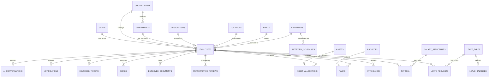
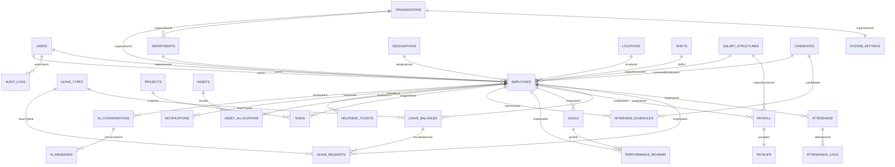
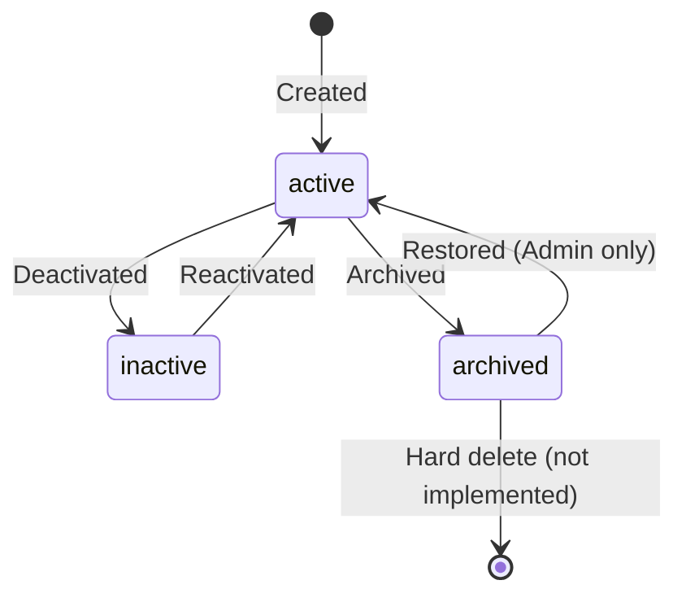

# DATABASE_DESIGN.md

---

## 1. Document Metadata

| Field           | Value                                                                      |
|-----------------|----------------------------------------------------------------------------|
| Document Name   | DATABASE_DESIGN.md                                                         |
| Version         | 1.0                                                                        |
| Status          | Approved                                                                   |
| Authority Level | Level 4 — Inherits from ARCHITECTURE_REVISION.md                          |
| Purpose         | Definitive MongoDB database architecture and schema specification for the Enterprise Workforce Management Platform |
| Dependencies    | AI_ENGINEERING_SPECIFICATION.md, Problem_Statement.md, PROJECT_MASTER.md, ARCHITECTURE_REVISION.md |
| Last Updated    | 2026-07-03                                                                 |

---

## 2. Executive Summary

### 2.1 Purpose

This document defines the complete MongoDB database architecture for the Enterprise Workforce Management Platform (EWMP). It specifies every collection, every field, every relationship, every index, and every validation rule that the backend implementation must follow. All backend modules, API specifications, and AI-generated code must derive their data model from this document.

### 2.2 Relationship with PROJECT_MASTER.md

`PROJECT_MASTER.md` defines 15 functional modules, 9 user roles, and the overall engineering philosophy. This document provides the database structures that support every module and every role defined in `PROJECT_MASTER.md`. Every module listed in `PROJECT_MASTER.md` has at least one supporting collection defined here.

### 2.3 Relationship with ARCHITECTURE_REVISION.md

`ARCHITECTURE_REVISION.md` defines the database interaction architecture: MongoDB Atlas as the database, Mongoose as the ODM, ObjectId references as the relationship strategy, soft delete as the deletion philosophy, and standard audit fields on every collection. This document implements those architectural decisions through concrete collection definitions and schema specifications.

### 2.4 Design Philosophy

The database is designed to be normalized, reference-driven, auditable, and maintainable within the constraints of a 6-day academic project delivered by a 4-person team. Engineering quality is not sacrificed for simplicity; schema correctness, relationship integrity, and index coverage are enforced at the specification level.

---

## 3. Database Design Philosophy

### 3.1 Reference Over Embedding

Cross-collection relationships use MongoDB ObjectId references exclusively. Employee data is referenced, not duplicated, in Attendance, Leave, Payroll, Performance, Project, Asset, and Help Desk collections. Embedding is used only for sub-documents that have no independent lifecycle and will never be queried without their parent (e.g., salary components within a Payroll document, address within an Employee document).

### 3.2 Normalization Philosophy

The database is normalized at the entity level. Each business entity occupies its own collection. Supporting entities (departments, designations, leave types, salary structures) are independent collections referenced by ID, not duplicated as strings. This allows modifications to supporting entities without cascading updates across dependent collections.

### 3.3 Data Integrity

Data integrity is enforced at three levels:
1. **Schema validation** — Mongoose schema constraints (type, required, enum, min, max)
2. **Unique indexes** — MongoDB-level duplicate prevention for identifiers and emails
3. **Business rule validation** — Service layer enforces cross-document rules (e.g., leave balance must not go negative)

### 3.4 Scalability Philosophy

Collections are designed to support pagination from day one. No query fetches unbounded result sets. Compound indexes are defined for the most common filter combinations. The schema supports an `organizationId` field for multi-tenancy extensibility, even though the academic version operates with a single organization.

### 3.5 Maintainability

Field names use camelCase consistently. Boolean flags are named with `is` prefix. Date fields are named with `At` or `Date` suffix. ObjectId references are named with `Id` suffix. Enumerations are documented and enforced at the schema level.

### 3.6 Auditability

Every collection includes `createdAt`, `updatedAt` (Mongoose timestamps), `createdBy` (User ObjectId), and `status`. Security-sensitive operations (login, password change, role change) are captured in the AuditLogs collection. Change history for critical entities (Employee, Payroll) is preserved through activity logging.

### 3.7 Performance Considerations

Indexes are defined for every field used in `find()` filters, sorting, or population. Text indexes are applied to searchable string fields. Compound indexes cover the most common multi-field query patterns. Index count is kept minimal to avoid write overhead on collection updates.

### 3.8 Security Considerations

Passwords are never stored in plaintext. Only bcrypt hashes are persisted in the User collection. Personally Identifiable Information (PII — email, mobile, Aadhaar number, PAN number) is stored in the database but never returned in API responses unless explicitly required by the role. Salary fields are accessible only to authorized roles at the service layer.

---

## 4. Database Overview

### 4.1 MongoDB Atlas Architecture

| Attribute          | Value                                              |
|--------------------|----------------------------------------------------|
| Database Provider  | MongoDB Atlas (cloud-managed)                      |
| Database Name      | `ewmp_db`                                          |
| ODM                | Mongoose 8.x                                       |
| Authentication     | Atlas connection string with username/password     |
| Environment        | Connection string stored in `MONGODB_URI` env var  |
| Collections        | 27 collections across 3 categories                 |

### 4.2 Collection Categories

| Category       | Collections                                                                  |
|----------------|------------------------------------------------------------------------------|
| Core           | users, organizations, departments, designations, locations, shifts           |
| HR             | employees, candidates, interviewSchedules, employeeDocuments, attendance, attendanceLogs, leaveTypes, leaveBalances, leaveRequests, holidays, salaryStructures, payroll, payslips, goals, performanceReviews |
| Operational    | projects, tasks, assets, assetAllocations, helpDeskTickets, notifications, aiConversations, aiMessages, auditLogs, activityLogs, systemSettings, announcements |

### 4.3 High-Level Entity Relationship Diagram



---

## 5. Collection Catalog

| Collection Name      | Purpose                                               | Primary Owner      | Referenced By                                     | Expected Volume |
|----------------------|-------------------------------------------------------|--------------------|---------------------------------------------------|-----------------|
| `users`              | Authentication credentials and role assignment         | Auth Module        | employees, auditLogs                              | Low (~500)      |
| `organizations`      | Organization identity and configuration               | Org Module         | All collections via organizationId               | Very Low (~5)   |
| `departments`        | Department definitions and hierarchy                  | Org Module         | employees, projects, reports                      | Low (~50)       |
| `designations`       | Job title definitions                                 | Org Module         | employees                                         | Low (~100)      |
| `locations`          | Office location definitions                           | Org Module         | employees, attendance                             | Low (~20)       |
| `shifts`             | Work shift definitions                                | Org Module         | employees, attendance                             | Low (~10)       |
| `employees`          | Core employee profile — central entity                | HR Module          | All operational collections                       | Medium (~5000)  |
| `candidates`         | Job applicant records                                 | Recruitment Module | interviewSchedules, employees                     | Medium (~2000)  |
| `interviewSchedules` | Interview appointment records                         | Recruitment Module | candidates, employees (interviewer)               | Medium (~1000)  |
| `employeeDocuments`  | Document metadata and Cloudinary URLs                 | HR Module          | employees                                         | Medium (~15000) |
| `attendance`         | Daily attendance records                              | Attendance Module  | employees, payroll                                | High (~500K/yr) |
| `attendanceLogs`     | Clock-in/out event log                                | Attendance Module  | attendance, employees                             | High            |
| `leaveTypes`         | Leave category definitions                            | HR Module          | leaveBalances, leaveRequests                      | Very Low (~10)  |
| `leaveBalances`      | Per-employee leave balance by type                    | Leave Module       | leaveRequests                                     | Medium (~5000)  |
| `leaveRequests`      | Leave application records                             | Leave Module       | employees, leaveTypes, leaveBalances              | Medium (~50K/yr)|
| `holidays`           | Organization holiday calendar                         | Org Module         | attendance, leave                                 | Low (~30/yr)    |
| `salaryStructures`   | Salary component configuration per grade              | Payroll Module     | employees, payroll                                | Low (~20)       |
| `payroll`            | Monthly payroll run records                           | Payroll Module     | employees, attendance, leave, payslips            | Medium (~5K/mo) |
| `payslips`           | Individual employee payslip records                   | Payroll Module     | payroll, employees                                | Medium (~5K/mo) |
| `goals`              | Employee performance goals                            | Performance Module | employees, performanceReviews                     | Medium (~10K)   |
| `performanceReviews` | Formal performance review records                     | Performance Module | employees, goals                                  | Medium (~5K/yr) |
| `projects`           | Project records                                       | Project Module     | departments, employees, tasks                     | Low (~500)      |
| `tasks`              | Task records within projects                          | Project Module     | projects, employees                               | Medium (~10K)   |
| `assets`             | Company asset inventory                               | Asset Module       | assetAllocations                                  | Medium (~2K)    |
| `assetAllocations`   | Asset assignment records                              | Asset Module       | assets, employees                                 | Medium (~5K)    |
| `helpDeskTickets`    | IT and HR support tickets                             | Help Desk Module   | employees                                         | Medium (~10K)   |
| `notifications`      | In-app notification records                           | Notification Module| employees                                         | High (~100K)    |
| `aiConversations`    | AI chat session records                               | AI Module          | employees                                         | Medium (~10K)   |
| `aiMessages`         | Individual AI chat messages                           | AI Module          | aiConversations, employees                        | High (~100K)    |
| `auditLogs`          | Security and compliance audit trail                   | System             | users, employees                                  | High (~500K)    |
| `activityLogs`       | General user activity tracking                        | System             | users, employees                                  | High            |
| `systemSettings`     | Organization-level configuration                      | Admin Module       | organizations                                     | Very Low        |
| `announcements`      | Organization-wide announcements                       | HR/Admin Module    | organizations, employees                          | Low             |

---

## 6. Core Collections

### 6.1 `users` Collection

**Purpose:** Stores authentication credentials, role assignment, and login security state for all platform users. The User document is the authentication identity; the Employee document is the professional identity. They are linked 1:1.

| Field                | Type       | Required | Default    | Validation                             | Notes                                    |
|----------------------|------------|----------|------------|----------------------------------------|------------------------------------------|
| `_id`                | ObjectId   | Auto     | —          | —                                      | MongoDB auto-generated                   |
| `email`              | String     | Yes      | —          | Unique, valid email format, lowercase  | Login identifier                         |
| `passwordHash`       | String     | Yes      | —          | Min 60 chars (bcrypt output)           | Never store plaintext                    |
| `role`               | String     | Yes      | —          | Enum: [SUPER_ADMIN, ORG_ADMIN, HR_MANAGER, MANAGER, TEAM_LEAD, EMPLOYEE, FINANCE, IT_ADMIN, AUDITOR] | RBAC role |
| `organizationId`     | ObjectId   | Yes      | —          | Ref: organizations                     | Scopes user to an organization           |
| `employeeId`         | ObjectId   | No       | null       | Ref: employees                         | Null for SUPER_ADMIN, ORG_ADMIN          |
| `isActive`           | Boolean    | Yes      | true       | —                                      | Account active state                     |
| `isLocked`           | Boolean    | Yes      | false      | —                                      | Locked after 5 failed attempts           |
| `lockUntil`          | Date       | No       | null       | —                                      | Auto-unlock timestamp (if timed lock)    |
| `failedLoginAttempts`| Number     | Yes      | 0          | Min: 0, Max: 10                        | Reset on successful login                |
| `lastLoginAt`        | Date       | No       | null       | —                                      | Timestamp of last successful login       |
| `passwordResetToken` | String     | No       | null       | —                                      | Hashed reset token                       |
| `passwordResetExpiry`| Date       | No       | null       | —                                      | 1-hour expiry from generation            |
| `refreshToken`       | String     | No       | null       | —                                      | Hashed refresh token                     |
| `createdAt`          | Date       | Auto     | now        | —                                      | Mongoose timestamps                      |
| `updatedAt`          | Date       | Auto     | now        | —                                      | Mongoose timestamps                      |
| `createdBy`          | ObjectId   | No       | null       | Ref: users                             | Null for self-registration               |
| `status`             | String     | Yes      | "active"   | Enum: [active, inactive, archived]     | Record lifecycle                         |

**Indexes:**
- `email` — unique index
- `organizationId` — index
- `role` — index
- `employeeId` — sparse index

---

### 6.2 `organizations` Collection

**Purpose:** Stores organization identity, configuration, and branding. The root entity for all multi-tenancy scoping.

| Field             | Type     | Required | Default  | Validation                          | Notes                              |
|-------------------|----------|----------|----------|-------------------------------------|------------------------------------|
| `_id`             | ObjectId | Auto     | —        | —                                   | MongoDB auto-generated             |
| `name`            | String   | Yes      | —        | Required, min 2, max 100            | Organization legal name            |
| `code`            | String   | Yes      | —        | Unique, uppercase, max 10           | Short identifier e.g. "EWMP"       |
| `industry`        | String   | No       | —        | Max 100                             | Industry sector                    |
| `address`         | Object   | No       | —        | Embedded sub-document               | See address sub-schema             |
| `address.street`  | String   | No       | —        | Max 200                             | Street address                     |
| `address.city`    | String   | No       | —        | Max 100                             | City                               |
| `address.state`   | String   | No       | —        | Max 100                             | State or province                  |
| `address.country` | String   | No       | —        | Max 100                             | Country                            |
| `address.pincode` | String   | No       | —        | Max 10                              | Postal code                        |
| `phone`           | String   | No       | —        | Max 15                              | Primary contact number             |
| `email`           | String   | No       | —        | Valid email format                  | Organization email                 |
| `website`         | String   | No       | —        | Valid URL format                    | Organization website               |
| `logoUrl`         | String   | No       | null     | Valid URL                           | Cloudinary URL                     |
| `employeeCount`   | Number   | No       | 0        | Min: 0                              | Computed field, updated on create  |
| `adminId`         | ObjectId | No       | null     | Ref: users                          | Primary Organization Admin         |
| `createdAt`       | Date     | Auto     | now      | —                                   | Mongoose timestamps                |
| `updatedAt`       | Date     | Auto     | now      | —                                   | Mongoose timestamps                |
| `createdBy`       | ObjectId | No       | null     | Ref: users                          | Super Admin who created this org   |
| `status`          | String   | Yes      | "active" | Enum: [active, inactive, archived]  | —                                  |

**Indexes:**
- `code` — unique index
- `status` — index

---

### 6.3 `departments` Collection

**Purpose:** Defines organizational departments and their hierarchy. Referenced by employees, projects, and reports.

| Field             | Type       | Required | Default  | Validation                          | Notes                               |
|-------------------|------------|----------|----------|-------------------------------------|-------------------------------------|
| `_id`             | ObjectId   | Auto     | —        | —                                   | MongoDB auto-generated              |
| `organizationId`  | ObjectId   | Yes      | —        | Ref: organizations                  | Multi-tenancy scope                 |
| `name`            | String     | Yes      | —        | Required, min 2, max 100            | Department name                     |
| `code`            | String     | Yes      | —        | Unique per org, uppercase, max 10   | e.g., "ENG", "HR", "FIN"            |
| `description`     | String     | No       | —        | Max 500                             | Department description              |
| `managerId`       | ObjectId   | No       | null     | Ref: employees                      | Department head                     |
| `parentDeptId`    | ObjectId   | No       | null     | Ref: departments                    | Parent department for hierarchy     |
| `headcount`       | Number     | No       | 0        | Min: 0                              | Computed, updated on employee change|
| `createdAt`       | Date       | Auto     | now      | —                                   | Mongoose timestamps                 |
| `updatedAt`       | Date       | Auto     | now      | —                                   | Mongoose timestamps                 |
| `createdBy`       | ObjectId   | Yes      | —        | Ref: users                          | —                                   |
| `status`          | String     | Yes      | "active" | Enum: [active, inactive, archived]  | Prevent deletion if employees exist |

**Indexes:**
- `{ organizationId, code }` — unique compound index
- `organizationId` — index
- `managerId` — index

---

### 6.4 `designations` Collection

**Purpose:** Defines job titles and grade classifications. Referenced by employees for their official designation.

| Field             | Type       | Required | Default  | Validation                          | Notes                               |
|-------------------|------------|----------|----------|-------------------------------------|-------------------------------------|
| `_id`             | ObjectId   | Auto     | —        | —                                   | MongoDB auto-generated              |
| `organizationId`  | ObjectId   | Yes      | —        | Ref: organizations                  | Multi-tenancy scope                 |
| `title`           | String     | Yes      | —        | Required, min 2, max 100            | e.g., "Software Engineer"           |
| `code`            | String     | Yes      | —        | Unique per org, max 20              | e.g., "SDE", "PM", "HR-EX"         |
| `grade`           | String     | No       | —        | Max 10                              | e.g., "L1", "L2", "Senior"         |
| `departmentId`    | ObjectId   | No       | null     | Ref: departments                    | Typical home department             |
| `description`     | String     | No       | —        | Max 500                             | Role description                    |
| `createdAt`       | Date       | Auto     | now      | —                                   | Mongoose timestamps                 |
| `updatedAt`       | Date       | Auto     | now      | —                                   | Mongoose timestamps                 |
| `createdBy`       | ObjectId   | Yes      | —        | Ref: users                          | —                                   |
| `status`          | String     | Yes      | "active" | Enum: [active, inactive, archived]  | —                                   |

**Indexes:**
- `{ organizationId, code }` — unique compound index
- `organizationId` — index

---

### 6.5 `locations` Collection

**Purpose:** Defines office locations and work-site addresses. Referenced by employees and attendance records.

| Field             | Type       | Required | Default  | Validation                          | Notes                               |
|-------------------|------------|----------|----------|-------------------------------------|-------------------------------------|
| `_id`             | ObjectId   | Auto     | —        | —                                   | MongoDB auto-generated              |
| `organizationId`  | ObjectId   | Yes      | —        | Ref: organizations                  | Multi-tenancy scope                 |
| `name`            | String     | Yes      | —        | Required, min 2, max 100            | e.g., "Bangalore HQ"                |
| `code`            | String     | Yes      | —        | Unique per org, max 10              | e.g., "BLR-HQ"                      |
| `address`         | Object     | Yes      | —        | Embedded sub-document               | Same sub-schema as organization     |
| `isRemote`        | Boolean    | Yes      | false    | —                                   | True for remote/WFH designation     |
| `gpsCoordinates`  | Object     | No       | null     | —                                   | { lat: Number, lng: Number }        |
| `createdAt`       | Date       | Auto     | now      | —                                   | Mongoose timestamps                 |
| `updatedAt`       | Date       | Auto     | now      | —                                   | Mongoose timestamps                 |
| `createdBy`       | ObjectId   | Yes      | —        | Ref: users                          | —                                   |
| `status`          | String     | Yes      | "active" | Enum: [active, inactive, archived]  | —                                   |

**Indexes:**
- `{ organizationId, code }` — unique compound index
- `organizationId` — index

---

### 6.6 `shifts` Collection

**Purpose:** Defines work shift schedules including start/end times and overtime thresholds. Referenced by employees and attendance.

| Field              | Type       | Required | Default  | Validation                          | Notes                                |
|--------------------|------------|----------|----------|-------------------------------------|--------------------------------------|
| `_id`              | ObjectId   | Auto     | —        | —                                   | MongoDB auto-generated               |
| `organizationId`   | ObjectId   | Yes      | —        | Ref: organizations                  | Multi-tenancy scope                  |
| `name`             | String     | Yes      | —        | Required, min 2, max 100            | e.g., "Morning Shift", "General"     |
| `code`             | String     | Yes      | —        | Unique per org, max 10              | e.g., "GEN", "MORN", "NIGHT"        |
| `startTime`        | String     | Yes      | —        | HH:mm format (24hr)                 | e.g., "09:00"                        |
| `endTime`          | String     | Yes      | —        | HH:mm format (24hr)                 | e.g., "18:00"                        |
| `workingHours`     | Number     | Yes      | —        | Min: 1, Max: 24                     | Standard expected working hours      |
| `overtimeThreshold`| Number     | Yes      | 8        | Min: 1, Max: 24                     | Hours after which overtime begins    |
| `weeklyOffDays`    | [String]   | Yes      | ["Saturday","Sunday"] | Enum: day names      | Off days in the week                 |
| `gracePeriodMinutes| Number     | No       | 15       | Min: 0, Max: 60                     | Late arrival grace period            |
| `createdAt`        | Date       | Auto     | now      | —                                   | Mongoose timestamps                  |
| `updatedAt`        | Date       | Auto     | now      | —                                   | Mongoose timestamps                  |
| `createdBy`        | ObjectId   | Yes      | —        | Ref: users                          | —                                    |
| `status`           | String     | Yes      | "active" | Enum: [active, inactive, archived]  | —                                    |

**Indexes:**
- `{ organizationId, code }` — unique compound index
- `organizationId` — index

---

## 7. HR Collections

### 7.1 `employees` Collection

**Purpose:** The central entity of the platform. Stores the complete professional profile of every employee. Referenced by virtually all other collections.

| Field                  | Type       | Required | Default      | Validation                               | Notes                                   |
|------------------------|------------|----------|--------------|------------------------------------------|-----------------------------------------|
| `_id`                  | ObjectId   | Auto     | —            | —                                        | MongoDB auto-generated                  |
| `employeeId`           | String     | Yes      | Auto-gen     | Unique, pattern: EMP[0-9]{4}             | e.g., "EMP1023"                         |
| `userId`               | ObjectId   | Yes      | —            | Ref: users, Unique                       | Links to authentication identity        |
| `organizationId`       | ObjectId   | Yes      | —            | Ref: organizations                       | Multi-tenancy scope                     |
| `departmentId`         | ObjectId   | Yes      | —            | Ref: departments                         | Current department                      |
| `designationId`        | ObjectId   | Yes      | —            | Ref: designations                        | Current designation                     |
| `locationId`           | ObjectId   | No       | null         | Ref: locations                           | Primary work location                   |
| `shiftId`              | ObjectId   | No       | null         | Ref: shifts                              | Assigned work shift                     |
| `managerId`            | ObjectId   | No       | null         | Ref: employees                           | Reporting manager                       |
| `firstName`            | String     | Yes      | —            | Required, min 1, max 50                  | —                                       |
| `lastName`             | String     | Yes      | —            | Required, min 1, max 50                  | —                                       |
| `email`                | String     | Yes      | —            | Unique, valid email                      | Work email (mirrors users.email)        |
| `mobile`               | String     | Yes      | —            | 10-digit number, unique                  | Primary mobile number                   |
| `dateOfBirth`          | Date       | No       | null         | Must be in past                          | —                                       |
| `gender`               | String     | No       | —            | Enum: [Male, Female, Other, Prefer Not to Say] | —                               |
| `bloodGroup`           | String     | No       | —            | Enum: [A+, A-, B+, B-, O+, O-, AB+, AB-]| —                                       |
| `address`              | Object     | No       | null         | Embedded sub-document                    | Residential address                     |
| `address.street`       | String     | No       | —            | Max 200                                  | —                                       |
| `address.city`         | String     | No       | —            | Max 100                                  | —                                       |
| `address.state`        | String     | No       | —            | Max 100                                  | —                                       |
| `address.country`      | String     | No       | —            | Max 100                                  | —                                       |
| `address.pincode`      | String     | No       | —            | Max 10                                   | —                                       |
| `joiningDate`          | Date       | Yes      | —            | Must not exceed current date             | —                                       |
| `employmentType`       | String     | Yes      | —            | Enum: [Full-Time, Part-Time, Contract, Intern] | —                               |
| `employmentStatus`     | String     | Yes      | "Probation"  | Enum: [Probation, Permanent, Notice Period, Resigned, Terminated] | Lifecycle state |
| `salaryStructureId`    | ObjectId   | No       | null         | Ref: salaryStructures                    | Assigned salary grade                   |
| `basicSalary`          | Number     | No       | 0            | Min: 0                                   | Base salary — sensitive field           |
| `profilePhotoUrl`      | String     | No       | null         | Valid URL                                | Cloudinary URL                          |
| `emergencyContact`     | Object     | No       | null         | Embedded sub-document                    | —                                       |
| `emergencyContact.name`| String     | No       | —            | Max 100                                  | —                                       |
| `emergencyContact.phone`| String    | No       | —            | Max 15                                   | —                                       |
| `emergencyContact.relation`| String | No       | —            | Max 50                                   | —                                       |
| `aadharNumber`         | String     | No       | null         | 12-digit number                          | PII — access restricted                 |
| `panNumber`            | String     | No       | null         | PAN format: [A-Z]{5}[0-9]{4}[A-Z]       | PII — access restricted                 |
| `bankAccountNumber`    | String     | No       | null         | Max 20                                   | Sensitive — payroll use only            |
| `bankIfscCode`         | String     | No       | null         | IFSC format                              | Sensitive — payroll use only            |
| `exitDate`             | Date       | No       | null         | Must be after joiningDate                | Set on resignation/termination          |
| `exitReason`           | String     | No       | null         | Max 500                                  | —                                       |
| `createdAt`            | Date       | Auto     | now          | —                                        | Mongoose timestamps                     |
| `updatedAt`            | Date       | Auto     | now          | —                                        | Mongoose timestamps                     |
| `createdBy`            | ObjectId   | Yes      | —            | Ref: users                               | HR user who created                     |
| `updatedBy`            | ObjectId   | No       | null         | Ref: users                               | Last modifier                           |
| `status`               | String     | Yes      | "active"     | Enum: [active, inactive, archived]       | Soft delete                             |

**Indexes:**
- `employeeId` — unique index
- `userId` — unique index
- `email` — unique index
- `mobile` — unique sparse index
- `{ organizationId, departmentId }` — compound index
- `{ organizationId, status }` — compound index
- `managerId` — index
- `panNumber` — sparse index
- `aadharNumber` — sparse index

---

### 7.2 `candidates` Collection

**Purpose:** Stores job applicant records through the full recruitment lifecycle from application to employee conversion.

| Field              | Type       | Required | Default        | Validation                               | Notes                                    |
|--------------------|------------|----------|----------------|------------------------------------------|------------------------------------------|
| `_id`              | ObjectId   | Auto     | —              | —                                        | MongoDB auto-generated                   |
| `organizationId`   | ObjectId   | Yes      | —              | Ref: organizations                       | Multi-tenancy scope                      |
| `firstName`        | String     | Yes      | —              | Required, min 1, max 50                  | —                                        |
| `lastName`         | String     | Yes      | —              | Required, min 1, max 50                  | —                                        |
| `email`            | String     | Yes      | —              | Unique per org, valid email              | Candidate contact email                  |
| `mobile`           | String     | No       | —              | Max 15                                   | Contact number                           |
| `appliedForDesignation`| ObjectId | No     | null           | Ref: designations                        | Position applied for                     |
| `appliedForDepartment`| ObjectId | No      | null           | Ref: departments                         | Department applied to                    |
| `experience`       | Number     | No       | 0              | Min: 0, Max: 60                          | Years of experience                      |
| `skills`           | [String]   | No       | []             | Max 50 items                             | Parsed or entered skill tags             |
| `resumeUrl`        | String     | No       | null           | Valid URL                                | Cloudinary URL to resume PDF             |
| `resumePublicId`   | String     | No       | null           | —                                        | Cloudinary public_id for deletion        |
| `aiAnalysisScore`  | Number     | No       | null           | Min: 0, Max: 100                         | AI-generated resume match score          |
| `aiAnalysisSummary`| String     | No       | null           | Max 2000                                 | AI analysis narrative                    |
| `aiSkillsIdentified`| [String]  | No       | []             | —                                        | Skills extracted by AI                   |
| `aiSkillsGap`      | [String]   | No       | []             | —                                        | Missing required skills per AI           |
| `recruitmentStatus`| String     | Yes      | "Applied"      | Enum: [Applied, Screening, Technical Interview, HR Interview, Offer, Accepted, Rejected, Withdrawn, Joined] | Pipeline stage |
| `rejectionReason`  | String     | No       | null           | Max 500                                  | Populated on rejection                   |
| `offerLetterUrl`   | String     | No       | null           | Valid URL                                | Cloudinary URL                           |
| `convertedEmployeeId`| ObjectId | No       | null           | Ref: employees                           | Set on candidate conversion              |
| `sourceChannel`    | String     | No       | —              | Enum: [LinkedIn, Referral, Job Board, Direct, Campus, Other] | Recruitment channel |
| `referredBy`       | ObjectId   | No       | null           | Ref: employees                           | Internal referral employee               |
| `hrOwner`          | ObjectId   | No       | null           | Ref: employees                           | HR manager handling this candidate       |
| `notes`            | String     | No       | —              | Max 2000                                 | Internal HR notes                        |
| `createdAt`        | Date       | Auto     | now            | —                                        | Mongoose timestamps                      |
| `updatedAt`        | Date       | Auto     | now            | —                                        | Mongoose timestamps                      |
| `createdBy`        | ObjectId   | Yes      | —              | Ref: users                               | —                                        |
| `status`           | String     | Yes      | "active"       | Enum: [active, inactive, archived]       | Soft delete                              |

**Indexes:**
- `{ organizationId, email }` — unique compound index
- `{ organizationId, recruitmentStatus }` — compound index
- `organizationId` — index
- `convertedEmployeeId` — sparse index

---

### 7.3 `interviewSchedules` Collection

**Purpose:** Records interview appointments between candidates and interviewers.

| Field             | Type       | Required | Default     | Validation                               | Notes                                    |
|-------------------|------------|----------|-------------|------------------------------------------|------------------------------------------|
| `_id`             | ObjectId   | Auto     | —           | —                                        | MongoDB auto-generated                   |
| `organizationId`  | ObjectId   | Yes      | —           | Ref: organizations                       | Multi-tenancy scope                      |
| `candidateId`     | ObjectId   | Yes      | —           | Ref: candidates                          | Candidate being interviewed              |
| `interviewerId`   | ObjectId   | Yes      | —           | Ref: employees                           | Employee conducting the interview        |
| `round`           | String     | Yes      | —           | Enum: [Screening, Technical, HR, Final]  | Interview round type                     |
| `scheduledAt`     | Date       | Yes      | —           | Must be in future at creation            | Interview date and time                  |
| `durationMinutes` | Number     | No       | 60          | Min: 15, Max: 480                        | Expected duration                        |
| `mode`            | String     | Yes      | "In-Person" | Enum: [In-Person, Video Call, Phone]     | Interview mode                           |
| `meetingLink`     | String     | No       | null        | Valid URL                                | Video call link if mode is Video Call    |
| `venue`           | String     | No       | null        | Max 200                                  | Physical location if In-Person           |
| `interviewStatus` | String     | Yes      | "Scheduled" | Enum: [Scheduled, Completed, Cancelled, No-Show] | —                                |
| `feedbackScore`   | Number     | No       | null        | Min: 1, Max: 10                          | Interviewer rating                       |
| `feedbackNotes`   | String     | No       | null        | Max 2000                                 | Interviewer feedback                     |
| `recommendation`  | String     | No       | null        | Enum: [Proceed, Reject, Hold]            | Interviewer recommendation               |
| `createdAt`       | Date       | Auto     | now         | —                                        | Mongoose timestamps                      |
| `updatedAt`       | Date       | Auto     | now         | —                                        | Mongoose timestamps                      |
| `createdBy`       | ObjectId   | Yes      | —           | Ref: users                               | —                                        |
| `status`          | String     | Yes      | "active"    | Enum: [active, inactive, archived]       | Soft delete                              |

**Indexes:**
- `{ candidateId, round }` — compound index
- `interviewerId` — index
- `scheduledAt` — index
- `organizationId` — index

---

### 7.4 `employeeDocuments` Collection

**Purpose:** Stores metadata and Cloudinary URLs for all documents associated with an employee (Aadhaar, PAN, resume, offer letter, certificates, photographs).

| Field             | Type       | Required | Default     | Validation                               | Notes                                    |
|-------------------|------------|----------|-------------|------------------------------------------|------------------------------------------|
| `_id`             | ObjectId   | Auto     | —           | —                                        | MongoDB auto-generated                   |
| `employeeId`      | ObjectId   | Yes      | —           | Ref: employees                           | Owner employee                           |
| `organizationId`  | ObjectId   | Yes      | —           | Ref: organizations                       | Multi-tenancy scope                      |
| `documentType`    | String     | Yes      | —           | Enum: [Aadhaar, PAN, Resume, Offer Letter, Experience Letter, Educational Certificate, Photograph, Other] | Category |
| `documentName`    | String     | Yes      | —           | Required, max 200                        | Original filename or label               |
| `documentUrl`     | String     | Yes      | —           | Valid URL                                | Cloudinary secure URL                    |
| `publicId`        | String     | Yes      | —           | —                                        | Cloudinary public_id for management      |
| `fileSizeBytes`   | Number     | No       | null        | Min: 0                                   | File size in bytes                       |
| `mimeType`        | String     | No       | —           | —                                        | e.g., "application/pdf", "image/jpeg"   |
| `uploadedBy`      | ObjectId   | Yes      | —           | Ref: users                               | Who uploaded the document                |
| `verifiedBy`      | ObjectId   | No       | null        | Ref: users                               | HR verification                          |
| `verifiedAt`      | Date       | No       | null        | —                                        | Verification timestamp                   |
| `isVerified`      | Boolean    | Yes      | false       | —                                        | Document verification state              |
| `expiryDate`      | Date       | No       | null        | —                                        | For documents with expiry (e.g., visa)   |
| `notes`           | String     | No       | null        | Max 500                                  | HR notes                                 |
| `createdAt`       | Date       | Auto     | now         | —                                        | Mongoose timestamps                      |
| `updatedAt`       | Date       | Auto     | now         | —                                        | Mongoose timestamps                      |
| `createdBy`       | ObjectId   | Yes      | —           | Ref: users                               | —                                        |
| `status`          | String     | Yes      | "active"    | Enum: [active, inactive, archived]       | Soft delete                              |

**Indexes:**
- `{ employeeId, documentType }` — compound index
- `employeeId` — index
- `organizationId` — index

---

### 7.5 `attendance` Collection

**Purpose:** Daily attendance summary record per employee. One document per employee per date.

| Field              | Type       | Required | Default    | Validation                               | Notes                                     |
|--------------------|------------|----------|------------|------------------------------------------|-------------------------------------------|
| `_id`              | ObjectId   | Auto     | —          | —                                        | MongoDB auto-generated                    |
| `employeeId`       | ObjectId   | Yes      | —          | Ref: employees                           | Employee whose attendance is recorded     |
| `organizationId`   | ObjectId   | Yes      | —          | Ref: organizations                       | Multi-tenancy scope                       |
| `date`             | Date       | Yes      | —          | Date only (no time), not in future       | Attendance date                           |
| `shiftId`          | ObjectId   | No       | null       | Ref: shifts                              | Active shift on this date                 |
| `clockInTime`      | Date       | No       | null       | —                                        | First clock-in datetime                   |
| `clockOutTime`     | Date       | No       | null       | Must be after clockInTime                | Last clock-out datetime                   |
| `workingHours`     | Number     | No       | 0          | Min: 0, Max: 24                          | Computed: clockOut - clockIn in hours     |
| `overtimeHours`    | Number     | No       | 0          | Min: 0, Max: 24                          | Hours beyond shift threshold              |
| `attendanceStatus` | String     | Yes      | "Absent"   | Enum: [Present, Absent, Late, Half-Day, Leave, Holiday, Work-From-Home, On-Duty] | —       |
| `isLate`           | Boolean    | Yes      | false      | —                                        | Computed: clockIn > shift.startTime + grace |
| `isEarlyExit`      | Boolean    | Yes      | false      | —                                        | Computed: clockOut < shift.endTime        |
| `locationId`       | ObjectId   | No       | null       | Ref: locations                           | Attendance location                       |
| `clockInGps`       | Object     | No       | null       | { lat: Number, lng: Number }             | GPS on clock-in                           |
| `clockOutGps`      | Object     | No       | null       | { lat: Number, lng: Number }             | GPS on clock-out                          |
| `correctionStatus` | String     | No       | null       | Enum: [Pending, Approved, Rejected]      | Populated if correction was requested     |
| `correctionRequestId`| ObjectId | No       | null       | Ref: attendanceLogs                      | Linked correction request                 |
| `correctionApprovedBy`| ObjectId| No      | null       | Ref: employees                           | Manager who approved correction           |
| `correctionApprovedAt`| Date    | No       | null       | —                                        | Correction approval timestamp             |
| `leaveRequestId`   | ObjectId   | No       | null       | Ref: leaveRequests                       | Linked leave if status is Leave           |
| `holidayId`        | ObjectId   | No       | null       | Ref: holidays                            | Linked holiday if status is Holiday       |
| `createdAt`        | Date       | Auto     | now        | —                                        | Mongoose timestamps                       |
| `updatedAt`        | Date       | Auto     | now        | —                                        | Mongoose timestamps                       |
| `createdBy`        | ObjectId   | Yes      | —          | Ref: users                               | —                                         |
| `status`           | String     | Yes      | "active"   | Enum: [active, inactive, archived]       | Soft delete                               |

**Indexes:**
- `{ employeeId, date }` — unique compound index
- `{ organizationId, date }` — compound index
- `{ organizationId, attendanceStatus }` — compound index
- `date` — index
- `employeeId` — index

---

### 7.6 `attendanceLogs` Collection

**Purpose:** Immutable event log of every clock-in and clock-out action. Supports attendance corrections and audit trail.

| Field             | Type       | Required | Default    | Validation                               | Notes                                     |
|-------------------|------------|----------|------------|------------------------------------------|-------------------------------------------|
| `_id`             | ObjectId   | Auto     | —          | —                                        | MongoDB auto-generated                    |
| `attendanceId`    | ObjectId   | Yes      | —          | Ref: attendance                          | Parent attendance record                  |
| `employeeId`      | ObjectId   | Yes      | —          | Ref: employees                           | Employee                                  |
| `organizationId`  | ObjectId   | Yes      | —          | Ref: organizations                       | Multi-tenancy scope                       |
| `eventType`       | String     | Yes      | —          | Enum: [Clock-In, Clock-Out, Correction-Request, Correction-Approved, Correction-Rejected] | Event type |
| `eventTime`       | Date       | Yes      | —          | —                                        | Timestamp of the event                    |
| `gpsCoordinates`  | Object     | No       | null       | { lat: Number, lng: Number }             | GPS at event time                         |
| `deviceInfo`      | String     | No       | null       | Max 200                                  | User agent or device identifier           |
| `correctionNotes` | String     | No       | null       | Max 500                                  | Notes for correction requests             |
| `processedBy`     | ObjectId   | No       | null       | Ref: users                               | Manager who processed correction          |
| `createdAt`       | Date       | Auto     | now        | —                                        | Mongoose timestamps                       |
| `status`          | String     | Yes      | "active"   | Enum: [active, archived]                 | —                                         |

**Indexes:**
- `{ employeeId, eventTime }` — compound index
- `attendanceId` — index
- `organizationId` — index

---

### 7.7 `leaveTypes` Collection

**Purpose:** Defines available leave categories and their entitlement rules.

| Field              | Type       | Required | Default    | Validation                               | Notes                                     |
|--------------------|------------|----------|------------|------------------------------------------|-------------------------------------------|
| `_id`              | ObjectId   | Auto     | —          | —                                        | MongoDB auto-generated                    |
| `organizationId`   | ObjectId   | Yes      | —          | Ref: organizations                       | Multi-tenancy scope                       |
| `name`             | String     | Yes      | —          | Required, min 2, max 100, unique per org | e.g., "Casual Leave"                      |
| `code`             | String     | Yes      | —          | Unique per org, max 10, uppercase        | e.g., "CL", "SL", "EL"                  |
| `description`      | String     | No       | —          | Max 500                                  | Policy description                        |
| `maxDaysPerYear`   | Number     | Yes      | —          | Min: 0, Max: 365                         | Annual entitlement in days                |
| `isCarryForward`   | Boolean    | Yes      | false      | —                                        | Whether unused days carry to next year    |
| `maxCarryForwardDays`| Number   | No       | 0          | Min: 0                                   | Max days that can carry forward           |
| `isPaidLeave`      | Boolean    | Yes      | true       | —                                        | Whether leave is paid                     |
| `requiresApproval` | Boolean    | Yes      | true       | —                                        | Manager approval required                 |
| `minAdvanceNoticeDays`| Number  | No       | 1          | Min: 0                                   | Advance notice required                   |
| `applicableGender` | String     | No       | null       | Enum: [Male, Female, All]                | For gender-specific leaves                |
| `createdAt`        | Date       | Auto     | now        | —                                        | Mongoose timestamps                       |
| `updatedAt`        | Date       | Auto     | now        | —                                        | Mongoose timestamps                       |
| `createdBy`        | ObjectId   | Yes      | —          | Ref: users                               | —                                         |
| `status`           | String     | Yes      | "active"   | Enum: [active, inactive, archived]       | —                                         |

**Indexes:**
- `{ organizationId, code }` — unique compound index
- `organizationId` — index

---

### 7.8 `leaveBalances` Collection

**Purpose:** Tracks per-employee remaining leave balance per leave type. One document per employee per leave type per year.

| Field              | Type       | Required | Default    | Validation                               | Notes                                     |
|--------------------|------------|----------|------------|------------------------------------------|-------------------------------------------|
| `_id`              | ObjectId   | Auto     | —          | —                                        | MongoDB auto-generated                    |
| `employeeId`       | ObjectId   | Yes      | —          | Ref: employees                           | Balance owner                             |
| `leaveTypeId`      | ObjectId   | Yes      | —          | Ref: leaveTypes                          | Leave type                                |
| `organizationId`   | ObjectId   | Yes      | —          | Ref: organizations                       | Multi-tenancy scope                       |
| `year`             | Number     | Yes      | —          | 4-digit year                             | Calendar year                             |
| `entitledDays`     | Number     | Yes      | —          | Min: 0                                   | Total days entitled this year             |
| `usedDays`         | Number     | Yes      | 0          | Min: 0                                   | Days consumed                             |
| `pendingDays`      | Number     | Yes      | 0          | Min: 0                                   | Days in pending approval                  |
| `remainingDays`    | Number     | Yes      | —          | Min: 0 (business rule enforced)          | entitledDays - usedDays - pendingDays     |
| `carryForwardDays` | Number     | No       | 0          | Min: 0                                   | Days carried from previous year           |
| `createdAt`        | Date       | Auto     | now        | —                                        | Mongoose timestamps                       |
| `updatedAt`        | Date       | Auto     | now        | —                                        | Mongoose timestamps                       |
| `status`           | String     | Yes      | "active"   | Enum: [active, archived]                 | —                                         |

**Indexes:**
- `{ employeeId, leaveTypeId, year }` — unique compound index
- `{ organizationId, year }` — compound index
- `employeeId` — index

---

### 7.9 `leaveRequests` Collection

**Purpose:** Records leave applications submitted by employees and tracks their approval workflow.

| Field               | Type       | Required | Default     | Validation                               | Notes                                    |
|---------------------|------------|----------|-------------|------------------------------------------|------------------------------------------|
| `_id`               | ObjectId   | Auto     | —           | —                                        | MongoDB auto-generated                   |
| `employeeId`        | ObjectId   | Yes      | —           | Ref: employees                           | Requesting employee                      |
| `leaveTypeId`       | ObjectId   | Yes      | —           | Ref: leaveTypes                          | Type of leave                            |
| `leaveBalanceId`    | ObjectId   | Yes      | —           | Ref: leaveBalances                       | Balance to deduct from                   |
| `organizationId`    | ObjectId   | Yes      | —           | Ref: organizations                       | Multi-tenancy scope                      |
| `startDate`         | Date       | Yes      | —           | Must not be in the past (business rule)  | Leave start date                         |
| `endDate`           | Date       | Yes      | —           | Must be >= startDate                     | Leave end date                           |
| `totalDays`         | Number     | Yes      | —           | Min: 0.5 (half day), Max: 365            | Computed business days                   |
| `isHalfDay`         | Boolean    | Yes      | false       | —                                        | Half day leave flag                      |
| `halfDaySession`    | String     | No       | null        | Enum: [Morning, Afternoon]               | Which half if isHalfDay is true          |
| `reason`            | String     | Yes      | —           | Required, min 10, max 500                | Reason for leave                         |
| `approvalStatus`    | String     | Yes      | "Pending"   | Enum: [Pending, Approved, Rejected, Cancelled] | Workflow state                    |
| `approverId`        | ObjectId   | No       | null        | Ref: employees                           | Manager reviewing this request           |
| `approverNotes`     | String     | No       | null        | Max 500                                  | Manager's notes on decision              |
| `approvedAt`        | Date       | No       | null        | —                                        | Decision timestamp                       |
| `cancellationReason`| String     | No       | null        | Max 500                                  | Populated if cancelled                   |
| `cancelledAt`       | Date       | No       | null        | —                                        | Cancellation timestamp                   |
| `createdAt`         | Date       | Auto     | now         | —                                        | Mongoose timestamps                      |
| `updatedAt`         | Date       | Auto     | now         | —                                        | Mongoose timestamps                      |
| `createdBy`         | ObjectId   | Yes      | —           | Ref: users                               | —                                        |
| `status`            | String     | Yes      | "active"    | Enum: [active, inactive, archived]       | Soft delete                              |

**Indexes:**
- `{ employeeId, startDate }` — compound index
- `{ organizationId, approvalStatus }` — compound index
- `{ employeeId, approvalStatus }` — compound index
- `approverId` — index
- `leaveTypeId` — index

---

### 7.10 `holidays` Collection

**Purpose:** Organization holiday calendar. Referenced during attendance computation and leave validation.

| Field             | Type       | Required | Default    | Validation                               | Notes                                     |
|-------------------|------------|----------|------------|------------------------------------------|-------------------------------------------|
| `_id`             | ObjectId   | Auto     | —          | —                                        | MongoDB auto-generated                    |
| `organizationId`  | ObjectId   | Yes      | —          | Ref: organizations                       | Multi-tenancy scope                       |
| `name`            | String     | Yes      | —          | Required, min 2, max 100                 | e.g., "Independence Day"                  |
| `date`            | Date       | Yes      | —          | Date only                                | Holiday date                              |
| `year`            | Number     | Yes      | —          | 4-digit year (derived from date)         | Calendar year                             |
| `holidayType`     | String     | Yes      | "Public"   | Enum: [Public, Restricted, Optional]     | Category of holiday                       |
| `applicableLocations`| [ObjectId] | No    | []         | Ref: locations                           | Empty = organization-wide                 |
| `description`     | String     | No       | —          | Max 500                                  | Optional description                      |
| `createdAt`       | Date       | Auto     | now        | —                                        | Mongoose timestamps                       |
| `updatedAt`       | Date       | Auto     | now        | —                                        | Mongoose timestamps                       |
| `createdBy`       | ObjectId   | Yes      | —          | Ref: users                               | —                                         |
| `status`          | String     | Yes      | "active"   | Enum: [active, inactive, archived]       | —                                         |

**Indexes:**
- `{ organizationId, date }` — unique compound index
- `{ organizationId, year }` — compound index

---

### 7.11 `salaryStructures` Collection

**Purpose:** Defines salary grade configurations with component percentage formulas. Assigned to employees to drive payroll computation.

| Field               | Type       | Required | Default    | Validation                               | Notes                                     |
|---------------------|------------|----------|------------|------------------------------------------|-------------------------------------------|
| `_id`               | ObjectId   | Auto     | —          | —                                        | MongoDB auto-generated                    |
| `organizationId`    | ObjectId   | Yes      | —          | Ref: organizations                       | Multi-tenancy scope                       |
| `name`              | String     | Yes      | —          | Required, unique per org, max 100        | e.g., "Grade L1", "Senior Band"          |
| `code`              | String     | Yes      | —          | Unique per org, max 10                   | e.g., "L1", "L2", "EXEC"               |
| `hraPercent`        | Number     | Yes      | —          | Min: 0, Max: 100                         | HRA as % of basic salary                 |
| `daPercent`         | Number     | No       | 0          | Min: 0, Max: 100                         | Dearness allowance % of basic            |
| `pfPercent`         | Number     | No       | 12         | Min: 0, Max: 100                         | Provident Fund % of basic                |
| `professionalTax`   | Number     | No       | 200        | Min: 0                                   | Fixed professional tax amount            |
| `medicalAllowance`  | Number     | No       | 0          | Min: 0                                   | Fixed medical allowance                  |
| `travelAllowance`   | Number     | No       | 0          | Min: 0                                   | Fixed travel allowance                   |
| `description`       | String     | No       | —          | Max 500                                  | Structure description                    |
| `createdAt`         | Date       | Auto     | now        | —                                        | Mongoose timestamps                      |
| `updatedAt`         | Date       | Auto     | now        | —                                        | Mongoose timestamps                      |
| `createdBy`         | ObjectId   | Yes      | —          | Ref: users                               | —                                        |
| `status`            | String     | Yes      | "active"   | Enum: [active, inactive, archived]       | —                                        |

**Indexes:**
- `{ organizationId, code }` — unique compound index
- `organizationId` — index

---

### 7.12 `payroll` Collection

**Purpose:** Monthly payroll run records. One document per employee per payroll period.

| Field               | Type       | Required | Default    | Validation                               | Notes                                     |
|---------------------|------------|----------|------------|------------------------------------------|-------------------------------------------|
| `_id`               | ObjectId   | Auto     | —          | —                                        | MongoDB auto-generated                    |
| `employeeId`        | ObjectId   | Yes      | —          | Ref: employees                           | Employee                                  |
| `organizationId`    | ObjectId   | Yes      | —          | Ref: organizations                       | Multi-tenancy scope                       |
| `salaryStructureId` | ObjectId   | No       | null       | Ref: salaryStructures                    | Structure used for this period            |
| `payPeriodMonth`    | Number     | Yes      | —          | Min: 1, Max: 12                          | Payroll month                             |
| `payPeriodYear`     | Number     | Yes      | —          | 4-digit year                             | Payroll year                              |
| `basicSalary`       | Number     | Yes      | —          | Min: 0                                   | Base salary for this period               |
| `hra`               | Number     | Yes      | 0          | Min: 0                                   | HRA computed amount                       |
| `da`                | Number     | No       | 0          | Min: 0                                   | Dearness allowance                        |
| `medicalAllowance`  | Number     | No       | 0          | Min: 0                                   | Medical allowance                         |
| `travelAllowance`   | Number     | No       | 0          | Min: 0                                   | Travel allowance                          |
| `overtimePay`       | Number     | No       | 0          | Min: 0                                   | Overtime compensation                     |
| `bonus`             | Number     | No       | 0          | Min: 0                                   | Performance or special bonus              |
| `grossSalary`       | Number     | Yes      | —          | Min: 0                                   | Sum of all earnings                       |
| `pfDeduction`       | Number     | No       | 0          | Min: 0                                   | Provident Fund deduction                  |
| `professionalTax`   | Number     | No       | 0          | Min: 0                                   | Professional tax deduction                |
| `incomeTax`         | Number     | No       | 0          | Min: 0                                   | TDS deduction                             |
| `leaveDayDeduction` | Number     | No       | 0          | Min: 0                                   | Deduction for unpaid leave                |
| `otherDeductions`   | Number     | No       | 0          | Min: 0                                   | Loans, penalties, etc.                    |
| `totalDeductions`   | Number     | Yes      | —          | Min: 0                                   | Sum of all deductions                     |
| `netSalary`         | Number     | Yes      | —          | Min: 0                                   | grossSalary - totalDeductions             |
| `workingDays`       | Number     | Yes      | —          | Min: 0                                   | Working days in the period                |
| `presentDays`       | Number     | Yes      | —          | Min: 0                                   | Days employee was present                 |
| `leaveDays`         | Number     | No       | 0          | Min: 0                                   | Approved leave days                       |
| `absentDays`        | Number     | No       | 0          | Min: 0                                   | Unapproved absences                       |
| `overtimeHours`     | Number     | No       | 0          | Min: 0                                   | Total overtime hours                      |
| `payrollStatus`     | String     | Yes      | "Draft"    | Enum: [Draft, Processed, Approved, Paid] | Workflow state                            |
| `processedBy`       | ObjectId   | No       | null       | Ref: users                               | Finance user who processed                |
| `processedAt`       | Date       | No       | null       | —                                        | Processing timestamp                      |
| `approvedBy`        | ObjectId   | No       | null       | Ref: users                               | Manager who approved                      |
| `approvedAt`        | Date       | No       | null       | —                                        | Approval timestamp                        |
| `payslipId`         | ObjectId   | No       | null       | Ref: payslips                            | Generated payslip document                |
| `createdAt`         | Date       | Auto     | now        | —                                        | Mongoose timestamps                       |
| `updatedAt`         | Date       | Auto     | now        | —                                        | Mongoose timestamps                       |
| `createdBy`         | ObjectId   | Yes      | —          | Ref: users                               | —                                         |
| `status`            | String     | Yes      | "active"   | Enum: [active, inactive, archived]       | Soft delete                               |

**Indexes:**
- `{ employeeId, payPeriodYear, payPeriodMonth }` — unique compound index
- `{ organizationId, payPeriodYear, payPeriodMonth }` — compound index
- `{ organizationId, payrollStatus }` — compound index
- `employeeId` — index

---

### 7.13 `payslips` Collection

**Purpose:** Generated payslip documents. Stores payslip PDF URL and structured display data.

| Field              | Type       | Required | Default    | Validation                               | Notes                                     |
|--------------------|------------|----------|------------|------------------------------------------|-------------------------------------------|
| `_id`              | ObjectId   | Auto     | —          | —                                        | MongoDB auto-generated                    |
| `payrollId`        | ObjectId   | Yes      | —          | Ref: payroll, Unique                     | Parent payroll record                     |
| `employeeId`       | ObjectId   | Yes      | —          | Ref: employees                           | Employee                                  |
| `organizationId`   | ObjectId   | Yes      | —          | Ref: organizations                       | Multi-tenancy scope                       |
| `payPeriodMonth`   | Number     | Yes      | —          | Min: 1, Max: 12                          | Payroll month                             |
| `payPeriodYear`    | Number     | Yes      | —          | 4-digit year                             | Payroll year                              |
| `payslipUrl`       | String     | No       | null       | Valid URL                                | Cloudinary URL for payslip PDF            |
| `payslipPublicId`  | String     | No       | null       | —                                        | Cloudinary public_id                      |
| `generatedAt`      | Date       | Yes      | —          | —                                        | Payslip generation timestamp              |
| `generatedBy`      | ObjectId   | Yes      | —          | Ref: users                               | Finance user who generated                |
| `isEmailSent`      | Boolean    | Yes      | false      | —                                        | Whether payslip was emailed to employee   |
| `emailSentAt`      | Date       | No       | null       | —                                        | Email dispatch timestamp                  |
| `createdAt`        | Date       | Auto     | now        | —                                        | Mongoose timestamps                       |
| `status`           | String     | Yes      | "active"   | Enum: [active, archived]                 | —                                         |

**Indexes:**
- `payrollId` — unique index
- `{ employeeId, payPeriodYear, payPeriodMonth }` — compound index
- `employeeId` — index

---

### 7.14 `goals` Collection

**Purpose:** Employee performance goals set by managers and self. Linked to quarterly performance reviews.

| Field               | Type       | Required | Default    | Validation                               | Notes                                     |
|---------------------|------------|----------|------------|------------------------------------------|-------------------------------------------|
| `_id`               | ObjectId   | Auto     | —          | —                                        | MongoDB auto-generated                    |
| `employeeId`        | ObjectId   | Yes      | —          | Ref: employees                           | Goal owner                                |
| `organizationId`    | ObjectId   | Yes      | —          | Ref: organizations                       | Multi-tenancy scope                       |
| `setByManagerId`    | ObjectId   | Yes      | —          | Ref: employees                           | Manager who set this goal                 |
| `title`             | String     | Yes      | —          | Required, min 5, max 200                 | Goal title                                |
| `description`       | String     | No       | —          | Max 1000                                 | Detailed goal description                 |
| `targetDate`        | Date       | Yes      | —          | Must be in future at creation            | Deadline for this goal                    |
| `quarter`           | String     | Yes      | —          | Enum: [Q1, Q2, Q3, Q4]                  | Review quarter                            |
| `year`              | Number     | Yes      | —          | 4-digit year                             | Review year                               |
| `goalType`          | String     | Yes      | "KPI"      | Enum: [KPI, Learning, Project, Behavior] | Category of goal                          |
| `targetValue`       | Number     | No       | null       | —                                        | Measurable target (if quantifiable)       |
| `achievedValue`     | Number     | No       | null       | —                                        | Actual value achieved                     |
| `completionPercent` | Number     | No       | 0          | Min: 0, Max: 100                         | Self-reported completion                  |
| `goalStatus`        | String     | Yes      | "Not Started"| Enum: [Not Started, In Progress, Completed, Missed] | —                           |
| `managerRating`     | Number     | No       | null       | Min: 1, Max: 5                           | Manager's rating on this goal             |
| `managerNotes`      | String     | No       | null       | Max 1000                                 | Manager feedback                          |
| `createdAt`         | Date       | Auto     | now        | —                                        | Mongoose timestamps                       |
| `updatedAt`         | Date       | Auto     | now        | —                                        | Mongoose timestamps                       |
| `createdBy`         | ObjectId   | Yes      | —          | Ref: users                               | —                                         |
| `status`            | String     | Yes      | "active"   | Enum: [active, inactive, archived]       | Soft delete                               |

**Indexes:**
- `{ employeeId, year, quarter }` — compound index
- `{ organizationId, year, quarter }` — compound index
- `employeeId` — index
- `setByManagerId` — index

---

### 7.15 `performanceReviews` Collection

**Purpose:** Formal quarterly performance review records, consolidating goals, KPI scores, and ratings.

| Field               | Type       | Required | Default    | Validation                               | Notes                                     |
|---------------------|------------|----------|------------|------------------------------------------|-------------------------------------------|
| `_id`               | ObjectId   | Auto     | —          | —                                        | MongoDB auto-generated                    |
| `employeeId`        | ObjectId   | Yes      | —          | Ref: employees                           | Employee being reviewed                   |
| `reviewerId`        | ObjectId   | Yes      | —          | Ref: employees                           | Reviewing manager                         |
| `organizationId`    | ObjectId   | Yes      | —          | Ref: organizations                       | Multi-tenancy scope                       |
| `quarter`           | String     | Yes      | —          | Enum: [Q1, Q2, Q3, Q4]                  | Review quarter                            |
| `year`              | Number     | Yes      | —          | 4-digit year                             | Review year                               |
| `goalIds`           | [ObjectId] | No       | []         | Ref: goals                               | Goals evaluated in this review            |
| `kpiScore`          | Number     | No       | null       | Min: 0, Max: 100                         | Computed KPI score                        |
| `attendanceScore`   | Number     | No       | null       | Min: 0, Max: 100                         | Attendance rating component               |
| `managerRating`     | Number     | No       | null       | Min: 1, Max: 5                           | Overall manager rating                    |
| `selfRating`        | Number     | No       | null       | Min: 1, Max: 5                           | Employee self-assessment rating           |
| `finalRating`       | Number     | No       | null       | Min: 1, Max: 5                           | Consolidated final rating                 |
| `overallLevel`      | String     | No       | null       | Enum: [Outstanding, Excellent, Good, Needs Improvement, Unsatisfactory] | Mapped from finalRating |
| `managerFeedback`   | String     | No       | —          | Max 2000                                 | Written manager feedback                  |
| `selfAssessment`    | String     | No       | —          | Max 2000                                 | Employee self-assessment text             |
| `promotionRecommended`| Boolean | No       | false      | —                                        | Manager's promotion recommendation        |
| `promotionNotes`    | String     | No       | null       | Max 500                                  | Justification for promotion               |
| `reviewStatus`      | String     | Yes      | "Draft"    | Enum: [Draft, Self-Assessment Pending, Manager Review Pending, Completed] | Workflow state |
| `completedAt`       | Date       | No       | null       | —                                        | Review completion timestamp               |
| `createdAt`         | Date       | Auto     | now        | —                                        | Mongoose timestamps                       |
| `updatedAt`         | Date       | Auto     | now        | —                                        | Mongoose timestamps                       |
| `createdBy`         | ObjectId   | Yes      | —          | Ref: users                               | —                                         |
| `status`            | String     | Yes      | "active"   | Enum: [active, inactive, archived]       | Soft delete                               |

**Indexes:**
- `{ employeeId, year, quarter }` — unique compound index
- `{ organizationId, year, quarter }` — compound index
- `reviewerId` — index
- `{ organizationId, reviewStatus }` — compound index

---

## 8. Operational Collections

### 8.1 `projects` Collection

**Purpose:** Records project definitions, team assignments, timelines, and progress tracking.

| Field               | Type       | Required | Default    | Validation                               | Notes                                     |
|---------------------|------------|----------|------------|------------------------------------------|-------------------------------------------|
| `_id`               | ObjectId   | Auto     | —          | —                                        | MongoDB auto-generated                    |
| `organizationId`    | ObjectId   | Yes      | —          | Ref: organizations                       | Multi-tenancy scope                       |
| `name`              | String     | Yes      | —          | Required, min 2, max 200                 | Project name                              |
| `code`              | String     | Yes      | —          | Unique per org, max 20                   | Project identifier                        |
| `description`       | String     | No       | —          | Max 2000                                 | Project description                       |
| `departmentId`      | ObjectId   | No       | null       | Ref: departments                         | Owning department                         |
| `projectManagerId`  | ObjectId   | Yes      | —          | Ref: employees                           | Assigned project manager                  |
| `teamMemberIds`     | [ObjectId] | No       | []         | Ref: employees                           | Assigned team members                     |
| `startDate`         | Date       | Yes      | —          | —                                        | Planned start date                        |
| `endDate`           | Date       | No       | null       | Must be after startDate                  | Planned end date                          |
| `actualEndDate`     | Date       | No       | null       | —                                        | Actual completion date                    |
| `priority`          | String     | Yes      | "Medium"   | Enum: [Critical, High, Medium, Low]      | Project priority                          |
| `projectStatus`     | String     | Yes      | "Planning" | Enum: [Planning, Active, On Hold, Completed, Cancelled] | Workflow state              |
| `completionPercent` | Number     | No       | 0          | Min: 0, Max: 100                         | Overall project completion                |
| `budget`            | Number     | No       | null       | Min: 0                                   | Allocated budget (if tracked)             |
| `createdAt`         | Date       | Auto     | now        | —                                        | Mongoose timestamps                       |
| `updatedAt`         | Date       | Auto     | now        | —                                        | Mongoose timestamps                       |
| `createdBy`         | ObjectId   | Yes      | —          | Ref: users                               | —                                         |
| `status`            | String     | Yes      | "active"   | Enum: [active, inactive, archived]       | Soft delete                               |

**Indexes:**
- `{ organizationId, code }` — unique compound index
- `{ organizationId, projectStatus }` — compound index
- `projectManagerId` — index
- `{ organizationId, departmentId }` — compound index

---

### 8.2 `tasks` Collection

**Purpose:** Individual task records within projects. Tracks status, assignments, priorities, and deadlines.

| Field               | Type       | Required | Default    | Validation                               | Notes                                     |
|---------------------|------------|----------|------------|------------------------------------------|-------------------------------------------|
| `_id`               | ObjectId   | Auto     | —          | —                                        | MongoDB auto-generated                    |
| `projectId`         | ObjectId   | Yes      | —          | Ref: projects                            | Parent project                            |
| `organizationId`    | ObjectId   | Yes      | —          | Ref: organizations                       | Multi-tenancy scope                       |
| `title`             | String     | Yes      | —          | Required, min 2, max 200                 | Task title                                |
| `description`       | String     | No       | —          | Max 2000                                 | Task description                          |
| `assignedToId`      | ObjectId   | No       | null       | Ref: employees                           | Assigned employee (single owner)          |
| `reportedById`      | ObjectId   | Yes      | —          | Ref: employees                           | Who created/reported this task            |
| `taskStatus`        | String     | Yes      | "To Do"    | Enum: [To Do, In Progress, Review, Completed, Blocked] | Kanban status                  |
| `priority`          | String     | Yes      | "Medium"   | Enum: [Critical, High, Medium, Low]      | Task priority                             |
| `dueDate`           | Date       | Yes      | —          | Required; must be after project startDate| Deadline                                  |
| `estimatedHours`    | Number     | No       | null       | Min: 0                                   | Estimated effort                          |
| `loggedHours`       | Number     | No       | 0          | Min: 0                                   | Actual hours logged                       |
| `sprintName`        | String     | No       | null       | Max 50                                   | Sprint identifier                         |
| `tags`              | [String]   | No       | []         | Max 10 tags                              | Categorization tags                       |
| `attachmentUrls`    | [Object]   | No       | []         | —                                        | Array of { url, publicId, name, mimeType }|
| `comments`          | [Object]   | No       | []         | Max 100 comments per task (embedded)     | Embedded comment sub-documents            |
| `comments.authorId` | ObjectId   | Yes      | —          | Ref: employees                           | Comment author                            |
| `comments.text`     | String     | Yes      | —          | Min 1, Max 1000                          | Comment text                              |
| `comments.createdAt`| Date       | Yes      | now        | —                                        | Comment timestamp                         |
| `blockedReason`     | String     | No       | null       | Max 500                                  | Populated when status is Blocked          |
| `completedAt`       | Date       | No       | null       | —                                        | Completion timestamp                      |
| `createdAt`         | Date       | Auto     | now        | —                                        | Mongoose timestamps                       |
| `updatedAt`         | Date       | Auto     | now        | —                                        | Mongoose timestamps                       |
| `createdBy`         | ObjectId   | Yes      | —          | Ref: users                               | —                                         |
| `status`            | String     | Yes      | "active"   | Enum: [active, inactive, archived]       | Soft delete                               |

**Indexes:**
- `{ projectId, taskStatus }` — compound index
- `assignedToId` — index
- `{ organizationId, taskStatus }` — compound index
- `dueDate` — index
- `projectId` — index

---

### 8.3 `assets` Collection

**Purpose:** Company asset inventory. Each document represents one physical or digital asset.

| Field               | Type       | Required | Default    | Validation                               | Notes                                     |
|---------------------|------------|----------|------------|------------------------------------------|-------------------------------------------|
| `_id`               | ObjectId   | Auto     | —          | —                                        | MongoDB auto-generated                    |
| `organizationId`    | ObjectId   | Yes      | —          | Ref: organizations                       | Multi-tenancy scope                       |
| `assetTag`          | String     | Yes      | —          | Unique per org                           | e.g., "AST-2024-001"                      |
| `name`              | String     | Yes      | —          | Required, min 2, max 100                 | Asset name (e.g., "Dell Laptop 15")      |
| `assetType`         | String     | Yes      | —          | Enum: [Laptop, Desktop, Monitor, Mobile Phone, Keyboard, Mouse, Furniture, Vehicle, Software License, Other] | Category |
| `brand`             | String     | No       | —          | Max 100                                  | Manufacturer/brand                        |
| `model`             | String     | No       | —          | Max 100                                  | Model number                              |
| `serialNumber`      | String     | No       | null       | Unique sparse                            | Hardware serial number                    |
| `purchaseDate`      | Date       | No       | null       | Must be in past                          | Procurement date                          |
| `purchaseCost`      | Number     | No       | null       | Min: 0                                   | Asset cost                                |
| `warrantyExpiry`    | Date       | No       | null       | —                                        | Warranty expiry date                      |
| `locationId`        | ObjectId   | No       | null       | Ref: locations                           | Current physical location                 |
| `currentAllocationId`| ObjectId | No       | null       | Ref: assetAllocations                    | Current active allocation                 |
| `assetStatus`       | String     | Yes      | "Available"| Enum: [Available, Allocated, Under Maintenance, Retired, Lost] | Current state |
| `condition`         | String     | Yes      | "Good"     | Enum: [Excellent, Good, Fair, Poor]      | Physical condition                        |
| `notes`             | String     | No       | —          | Max 1000                                 | IT notes                                  |
| `imageUrl`          | String     | No       | null       | Valid URL                                | Cloudinary asset photo                    |
| `createdAt`         | Date       | Auto     | now        | —                                        | Mongoose timestamps                       |
| `updatedAt`         | Date       | Auto     | now        | —                                        | Mongoose timestamps                       |
| `createdBy`         | ObjectId   | Yes      | —          | Ref: users                               | IT Admin who registered                   |
| `status`            | String     | Yes      | "active"   | Enum: [active, inactive, archived]       | Soft delete                               |

**Indexes:**
- `{ organizationId, assetTag }` — unique compound index
- `serialNumber` — unique sparse index
- `{ organizationId, assetStatus }` — compound index
- `{ organizationId, assetType }` — compound index

---

### 8.4 `assetAllocations` Collection

**Purpose:** Records asset assignment events and return history. Full audit trail of asset custody.

| Field               | Type       | Required | Default    | Validation                               | Notes                                     |
|---------------------|------------|----------|------------|------------------------------------------|-------------------------------------------|
| `_id`               | ObjectId   | Auto     | —          | —                                        | MongoDB auto-generated                    |
| `assetId`           | ObjectId   | Yes      | —          | Ref: assets                              | Allocated asset                           |
| `employeeId`        | ObjectId   | Yes      | —          | Ref: employees                           | Employee receiving the asset              |
| `organizationId`    | ObjectId   | Yes      | —          | Ref: organizations                       | Multi-tenancy scope                       |
| `allocationDate`    | Date       | Yes      | —          | —                                        | Date asset was handed over                |
| `expectedReturnDate`| Date       | No       | null       | After allocationDate                     | Expected return date                      |
| `actualReturnDate`  | Date       | No       | null       | —                                        | Actual return date                        |
| `conditionOnIssue`  | String     | Yes      | —          | Enum: [Excellent, Good, Fair, Poor]      | Asset condition at allocation             |
| `conditionOnReturn` | String     | No       | null       | Enum: [Excellent, Good, Fair, Poor]      | Asset condition at return                 |
| `allocationNotes`   | String     | No       | —          | Max 500                                  | IT notes                                  |
| `returnNotes`       | String     | No       | null       | Max 500                                  | Return notes                              |
| `allocationStatus`  | String     | Yes      | "Active"   | Enum: [Active, Returned, Lost]           | Allocation state                          |
| `issuedBy`          | ObjectId   | Yes      | —          | Ref: users                               | IT Admin who issued                       |
| `receivedBy`        | ObjectId   | No       | null       | Ref: users                               | IT Admin who received return              |
| `createdAt`         | Date       | Auto     | now        | —                                        | Mongoose timestamps                       |
| `updatedAt`         | Date       | Auto     | now        | —                                        | Mongoose timestamps                       |
| `status`            | String     | Yes      | "active"   | Enum: [active, archived]                 | —                                         |

**Indexes:**
- `{ assetId, allocationStatus }` — compound index
- `{ employeeId, allocationStatus }` — compound index
- `organizationId` — index
- `allocationDate` — index

---

### 8.5 `helpDeskTickets` Collection

**Purpose:** IT and HR support ticket records with full lifecycle tracking from creation to resolution.

| Field               | Type       | Required | Default    | Validation                               | Notes                                     |
|---------------------|------------|----------|------------|------------------------------------------|-------------------------------------------|
| `_id`               | ObjectId   | Auto     | —          | —                                        | MongoDB auto-generated                    |
| `ticketNumber`      | String     | Yes      | Auto-gen   | Unique, pattern: TKT-[0-9]{6}           | e.g., "TKT-001023"                       |
| `organizationId`    | ObjectId   | Yes      | —          | Ref: organizations                       | Multi-tenancy scope                       |
| `raisedById`        | ObjectId   | Yes      | —          | Ref: employees                           | Employee who raised the ticket            |
| `assignedToId`      | ObjectId   | No       | null       | Ref: employees                           | IT Admin assigned to resolve              |
| `category`          | String     | Yes      | —          | Enum: [Hardware, Software, Network, Access, HR Query, Payroll Query, Policy Query, Other] | Ticket category |
| `priority`          | String     | Yes      | "Medium"   | Enum: [Critical, High, Medium, Low]      | Ticket priority                           |
| `subject`           | String     | Yes      | —          | Required, min 5, max 200                 | Ticket subject line                       |
| `description`       | String     | Yes      | —          | Required, min 10, max 2000               | Detailed issue description                |
| `attachmentUrls`    | [Object]   | No       | []         | —                                        | Array of { url, publicId, name }         |
| `ticketStatus`      | String     | Yes      | "Open"     | Enum: [Open, In Progress, Resolved, Closed, Reopened] | Workflow state              |
| `resolutionNotes`   | String     | No       | null       | Max 2000                                 | IT Admin resolution description           |
| `resolvedAt`        | Date       | No       | null       | —                                        | Resolution timestamp                      |
| `closedAt`          | Date       | No       | null       | —                                        | Close timestamp                           |
| `satisfactionRating`| Number     | No       | null       | Min: 1, Max: 5                           | Employee satisfaction after resolution    |
| `comments`          | [Object]   | No       | []         | Max 50 comments (embedded)               | Embedded comment thread                   |
| `comments.authorId` | ObjectId   | Yes      | —          | Ref: employees                           | Comment author                            |
| `comments.text`     | String     | Yes      | —          | Min 1, Max 1000                          | Comment text                              |
| `comments.createdAt`| Date       | Yes      | now        | —                                        | Comment timestamp                         |
| `createdAt`         | Date       | Auto     | now        | —                                        | Mongoose timestamps                       |
| `updatedAt`         | Date       | Auto     | now        | —                                        | Mongoose timestamps                       |
| `createdBy`         | ObjectId   | Yes      | —          | Ref: users                               | —                                         |
| `status`            | String     | Yes      | "active"   | Enum: [active, inactive, archived]       | Soft delete                               |

**Indexes:**
- `ticketNumber` — unique index
- `{ organizationId, ticketStatus }` — compound index
- `{ organizationId, category }` — compound index
- `raisedById` — index
- `assignedToId` — index

---

### 8.6 `notifications` Collection

**Purpose:** In-app notification records for all platform events. One document per notification per recipient.

| Field               | Type       | Required | Default    | Validation                               | Notes                                     |
|---------------------|------------|----------|------------|------------------------------------------|-------------------------------------------|
| `_id`               | ObjectId   | Auto     | —          | —                                        | MongoDB auto-generated                    |
| `recipientId`       | ObjectId   | Yes      | —          | Ref: employees                           | Notification recipient                    |
| `organizationId`    | ObjectId   | Yes      | —          | Ref: organizations                       | Multi-tenancy scope                       |
| `title`             | String     | Yes      | —          | Required, max 200                        | Notification title                        |
| `message`           | String     | Yes      | —          | Required, max 500                        | Notification body                         |
| `notificationType`  | String     | Yes      | —          | Enum: [Leave, Attendance, Payroll, Task, Recruitment, Asset, Ticket, System, Announcement] | Category |
| `relatedEntityType` | String     | No       | null       | e.g., "leaveRequests", "tasks"           | Related collection name                   |
| `relatedEntityId`   | ObjectId   | No       | null       | —                                        | Related document ObjectId                 |
| `actionUrl`         | String     | No       | null       | —                                        | Frontend route for deep-link              |
| `isRead`            | Boolean    | Yes      | false      | —                                        | Read state                                |
| `readAt`            | Date       | No       | null       | —                                        | Read timestamp                            |
| `priority`          | String     | Yes      | "Normal"   | Enum: [High, Normal, Low]               | Display priority                          |
| `createdAt`         | Date       | Auto     | now        | —                                        | Mongoose timestamps                       |
| `status`            | String     | Yes      | "active"   | Enum: [active, archived]                 | Soft delete                               |

**Indexes:**
- `{ recipientId, isRead }` — compound index
- `{ recipientId, createdAt }` — compound index (descending)
- `{ organizationId, notificationType }` — compound index
- `recipientId` — index

---

### 8.7 `aiConversations` Collection

**Purpose:** AI chat session containers. Each conversation is a user-initiated AI assistant session.

| Field               | Type       | Required | Default    | Validation                               | Notes                                     |
|---------------------|------------|----------|------------|------------------------------------------|-------------------------------------------|
| `_id`               | ObjectId   | Auto     | —          | —                                        | MongoDB auto-generated                    |
| `employeeId`        | ObjectId   | Yes      | —          | Ref: employees                           | Conversation initiator                    |
| `organizationId`    | ObjectId   | Yes      | —          | Ref: organizations                       | Multi-tenancy scope                       |
| `userId`            | ObjectId   | Yes      | —          | Ref: users                               | Auth identity                             |
| `sessionTitle`      | String     | No       | "New Conversation" | Max 200                        | Auto-generated or user-set title          |
| `moduleContext`     | String     | No       | null       | Enum: [Leave, Attendance, Payroll, Recruitment, Performance, Document, General] | Active module context |
| `messageCount`      | Number     | Yes      | 0          | Min: 0                                   | Count of messages in conversation         |
| `lastMessageAt`     | Date       | No       | null       | —                                        | Timestamp of last message                 |
| `tokenUsageTotal`   | Number     | No       | 0          | Min: 0                                   | Cumulative tokens used in session         |
| `createdAt`         | Date       | Auto     | now        | —                                        | Mongoose timestamps                       |
| `updatedAt`         | Date       | Auto     | now        | —                                        | Mongoose timestamps                       |
| `status`            | String     | Yes      | "active"   | Enum: [active, archived]                 | —                                         |

**Indexes:**
- `{ employeeId, createdAt }` — compound index (descending)
- `{ organizationId, moduleContext }` — compound index
- `employeeId` — index

---

### 8.8 `aiMessages` Collection

**Purpose:** Individual message records within an AI conversation. Stores both user prompts and AI responses.

| Field               | Type       | Required | Default    | Validation                               | Notes                                     |
|---------------------|------------|----------|------------|------------------------------------------|-------------------------------------------|
| `_id`               | ObjectId   | Auto     | —          | —                                        | MongoDB auto-generated                    |
| `conversationId`    | ObjectId   | Yes      | —          | Ref: aiConversations                     | Parent conversation                       |
| `employeeId`        | ObjectId   | Yes      | —          | Ref: employees                           | Employee in the conversation              |
| `organizationId`    | ObjectId   | Yes      | —          | Ref: organizations                       | Multi-tenancy scope                       |
| `role`              | String     | Yes      | —          | Enum: [user, assistant]                  | Message sender role                       |
| `content`           | String     | Yes      | —          | Required, min 1, max 10000               | Message text                              |
| `moduleContext`     | String     | No       | null       | Enum: [Leave, Attendance, Payroll, Recruitment, Performance, Document, General] | Context at message time |
| `promptTokens`      | Number     | No       | null       | Min: 0                                   | Input tokens (for AI role)                |
| `completionTokens`  | Number     | No       | null       | Min: 0                                   | Output tokens (for AI role)               |
| `totalTokens`       | Number     | No       | null       | Min: 0                                   | Total tokens for this exchange            |
| `isError`           | Boolean    | Yes      | false      | —                                        | True if AI returned an error response     |
| `errorMessage`      | String     | No       | null       | Max 500                                  | Error detail if isError is true           |
| `feedbackRating`    | Number     | No       | null       | Min: 1, Max: 5                           | User feedback on AI response              |
| `createdAt`         | Date       | Auto     | now        | —                                        | Mongoose timestamps                       |
| `status`            | String     | Yes      | "active"   | Enum: [active, archived]                 | —                                         |

**Indexes:**
- `{ conversationId, createdAt }` — compound index
- `conversationId` — index
- `{ organizationId, createdAt }` — compound index

---

### 8.9 `auditLogs` Collection

**Purpose:** Immutable security and compliance audit trail. Records all security-sensitive and data-modification events. Never soft-deleted.

| Field               | Type       | Required | Default    | Validation                               | Notes                                     |
|---------------------|------------|----------|------------|------------------------------------------|-------------------------------------------|
| `_id`               | ObjectId   | Auto     | —          | —                                        | MongoDB auto-generated                    |
| `organizationId`    | ObjectId   | Yes      | —          | Ref: organizations                       | Multi-tenancy scope                       |
| `actorUserId`       | ObjectId   | Yes      | —          | Ref: users                               | User who performed the action             |
| `actorRole`         | String     | Yes      | —          | Enum: role values                        | Role at time of action                    |
| `action`            | String     | Yes      | —          | Required, max 100                        | e.g., "LOGIN", "PASSWORD_CHANGE", "EMPLOYEE_UPDATED" |
| `entityType`        | String     | Yes      | —          | Required, max 100                        | Collection name e.g., "employees"         |
| `entityId`          | ObjectId   | No       | null       | —                                        | Affected document ObjectId                |
| `previousValue`     | Mixed      | No       | null       | —                                        | State before change (for updates)         |
| `newValue`          | Mixed      | No       | null       | —                                        | State after change (for updates)          |
| `ipAddress`         | String     | No       | null       | Max 45 (IPv6 max length)                 | Request IP address                        |
| `userAgent`         | String     | No       | null       | Max 500                                  | Browser/client user agent                 |
| `outcome`           | String     | Yes      | "Success"  | Enum: [Success, Failure]                 | Action outcome                            |
| `failureReason`     | String     | No       | null       | Max 500                                  | Populated on failure                      |
| `createdAt`         | Date       | Auto     | now        | —                                        | Mongoose timestamps                       |

> **Note:** Audit logs are never updated or deleted. No `status` field. No `updatedAt` override.

**Indexes:**
- `{ organizationId, action }` — compound index
- `{ organizationId, entityType, entityId }` — compound index
- `actorUserId` — index
- `createdAt` — index (TTL index: 2 years retention)

---

### 8.10 `activityLogs` Collection

**Purpose:** General user activity tracking for analytics and session monitoring.

| Field               | Type       | Required | Default    | Validation                               | Notes                                     |
|---------------------|------------|----------|------------|------------------------------------------|-------------------------------------------|
| `_id`               | ObjectId   | Auto     | —          | —                                        | MongoDB auto-generated                    |
| `userId`            | ObjectId   | Yes      | —          | Ref: users                               | Active user                               |
| `organizationId`    | ObjectId   | Yes      | —          | Ref: organizations                       | Multi-tenancy scope                       |
| `activityType`      | String     | Yes      | —          | Enum: [Page View, API Call, File Upload, File Download, Export, Search, Login, Logout] | Activity category |
| `module`            | String     | No       | null       | Max 50                                   | Application module name                   |
| `description`       | String     | No       | null       | Max 200                                  | Brief activity description                |
| `ipAddress`         | String     | No       | null       | Max 45                                   | Request IP                                |
| `createdAt`         | Date       | Auto     | now        | —                                        | Mongoose timestamps                       |

**Indexes:**
- `{ userId, createdAt }` — compound index
- `{ organizationId, activityType }` — compound index
- `createdAt` — TTL index (90-day retention)

---

### 8.11 `systemSettings` Collection

**Purpose:** Organization-level configuration and feature flags.

| Field               | Type       | Required | Default    | Validation                               | Notes                                     |
|---------------------|------------|----------|------------|------------------------------------------|-------------------------------------------|
| `_id`               | ObjectId   | Auto     | —          | —                                        | MongoDB auto-generated                    |
| `organizationId`    | ObjectId   | Yes      | —          | Ref: organizations, Unique               | One settings document per organization   |
| `attendanceSettings`| Object     | No       | —          | Embedded sub-document                    | GPS required, QR enabled, correction window |
| `leaveSettings`     | Object     | No       | —          | Embedded sub-document                    | Auto-approval rules, max advance days     |
| `payrollSettings`   | Object     | No       | —          | Embedded sub-document                    | Pay cycle date, currency                  |
| `notificationSettings`| Object  | No       | —          | Embedded sub-document                    | Email enabled, SMS enabled                |
| `aiSettings`        | Object     | No       | —          | Embedded sub-document                    | AI assistant enabled, allowed modules     |
| `workingDaysPerWeek`| Number     | No       | 5          | Min: 1, Max: 7                           | Standard working days                     |
| `fiscalYearStart`   | Number     | No       | 4          | Min: 1, Max: 12                          | Month of fiscal year start                |
| `timezone`          | String     | No       | "Asia/Kolkata" | IANA timezone string                 | Organization timezone                     |
| `currency`          | String     | No       | "INR"      | ISO 4217 currency code                   | Payroll currency                          |
| `updatedAt`         | Date       | Auto     | now        | —                                        | Mongoose timestamps                       |
| `updatedBy`         | ObjectId   | No       | null       | Ref: users                               | Last modifier                             |

**Indexes:**
- `organizationId` — unique index

---

### 8.12 `announcements` Collection

**Purpose:** Organization-wide or department-specific announcements created by HR or Admin.

| Field               | Type       | Required | Default    | Validation                               | Notes                                     |
|---------------------|------------|----------|------------|------------------------------------------|-------------------------------------------|
| `_id`               | ObjectId   | Auto     | —          | —                                        | MongoDB auto-generated                    |
| `organizationId`    | ObjectId   | Yes      | —          | Ref: organizations                       | Multi-tenancy scope                       |
| `title`             | String     | Yes      | —          | Required, min 5, max 200                 | Announcement title                        |
| `content`           | String     | Yes      | —          | Required, min 10, max 5000               | Announcement body                         |
| `announcementType`  | String     | Yes      | "General"  | Enum: [General, HR Policy, Event, Holiday, Emergency, Training] | Category |
| `audienceScope`     | String     | Yes      | "All"      | Enum: [All, Department, Location, Role]  | Who sees this announcement                |
| `audienceDepartmentIds`| [ObjectId] | No    | []         | Ref: departments                         | If scope is Department                    |
| `audienceRoles`     | [String]   | No       | []         | Enum: role values                        | If scope is Role                          |
| `publishedAt`       | Date       | No       | null       | —                                        | When to publish (scheduled)               |
| `expiresAt`         | Date       | No       | null       | After publishedAt                        | When to stop showing                      |
| `isPinned`          | Boolean    | Yes      | false      | —                                        | Pin to top of announcements               |
| `attachmentUrl`     | String     | No       | null       | Valid URL                                | Optional attachment                       |
| `createdAt`         | Date       | Auto     | now        | —                                        | Mongoose timestamps                       |
| `updatedAt`         | Date       | Auto     | now        | —                                        | Mongoose timestamps                       |
| `createdBy`         | ObjectId   | Yes      | —          | Ref: users                               | HR or Admin who created                   |
| `status`            | String     | Yes      | "active"   | Enum: [active, inactive, archived]       | Soft delete                               |

**Indexes:**
- `{ organizationId, status }` — compound index
- `{ organizationId, publishedAt }` — compound index
- `{ organizationId, expiresAt }` — compound index

---

## 9. Relationship Design

### 9.1 Relationship Types

**One-to-One:**
- `users` ↔ `employees` (one user account per employee profile)
- `payroll` ↔ `payslips` (one payslip per payroll run per employee)
- `organizations` ↔ `systemSettings` (one settings document per organization)

**One-to-Many:**
- `organizations` → `departments`, `employees`, `projects`, etc.
- `employees` → `attendance`, `leaveRequests`, `payroll`, `performanceReviews`, `goals`, `employeeDocuments`
- `departments` → `employees`
- `projects` → `tasks`
- `assets` → `assetAllocations`
- `aiConversations` → `aiMessages`
- `candidates` → `interviewSchedules`

**Many-to-Many (via reference arrays):**
- `projects` ↔ `employees` (team members — referenced as array in projects)
- `performanceReviews` ↔ `goals` (reviewed goals — referenced as array in performanceReviews)
- `announcements` ↔ `departments` (audience — referenced as array in announcements)

### 9.2 Relationship Diagram



### 9.3 Cascade Behavior and Deletion Philosophy

| Scenario                          | Behavior                                                         |
|-----------------------------------|------------------------------------------------------------------|
| Employee archived                 | Set `employee.status = archived`. All linked records preserved. |
| Department archived               | Prevent if employees exist with this department (service rule)  |
| Leave request cancelled           | Update `leaveBalance.pendingDays`; restore pending to remaining  |
| Leave request approved            | Deduct from `leaveBalance.remainingDays`, add to `usedDays`     |
| Asset returned                    | Update `assetAllocation.allocationStatus = Returned`; update `asset.assetStatus = Available` |
| Payroll deleted                   | Not permitted after status is Approved; soft delete only on Draft |
| Candidate converted               | Set `candidate.convertedEmployeeId`; `candidate.recruitmentStatus = Joined` |
| User deactivated                  | `user.isActive = false`; employee continues on record           |

### 9.4 Soft Delete Strategy

All collections (except `auditLogs` and `activityLogs`) implement soft delete via:
- `status: "archived"` — record is archived but preserved
- `status: "inactive"` — record is deactivated but retrievable
- Default queries filter `{ status: "active" }`
- Restore is available to authorized roles

---

## 10. Validation Rules

### 10.1 Required Fields Summary

| Collection         | Required Fields                                                          |
|--------------------|--------------------------------------------------------------------------|
| `users`            | email, passwordHash, role, organizationId, isActive, isLocked, failedLoginAttempts, status |
| `employees`        | employeeId, userId, organizationId, departmentId, designationId, firstName, lastName, email, mobile, joiningDate, employmentType, employmentStatus, status |
| `attendance`       | employeeId, organizationId, date, attendanceStatus, isLate, isEarlyExit, status |
| `leaveRequests`    | employeeId, leaveTypeId, leaveBalanceId, organizationId, startDate, endDate, totalDays, reason, approvalStatus, status |
| `payroll`          | employeeId, organizationId, payPeriodMonth, payPeriodYear, basicSalary, grossSalary, totalDeductions, netSalary, workingDays, presentDays, payrollStatus, status |
| `goals`            | employeeId, organizationId, setByManagerId, title, targetDate, quarter, year, goalType, status |
| `tasks`            | projectId, organizationId, title, reportedById, taskStatus, priority, dueDate, status |

### 10.2 Unique Constraints

| Collection    | Unique Fields / Compound Uniques                                |
|---------------|-----------------------------------------------------------------|
| `users`       | `email`                                                         |
| `employees`   | `employeeId`, `userId`, `email`, `mobile` (sparse)             |
| `organizations`| `code`                                                         |
| `departments` | `{ organizationId, code }`                                      |
| `designations`| `{ organizationId, code }`                                      |
| `locations`   | `{ organizationId, code }`                                      |
| `shifts`      | `{ organizationId, code }`                                      |
| `leaveTypes`  | `{ organizationId, code }`                                      |
| `leaveBalances`| `{ employeeId, leaveTypeId, year }`                            |
| `attendance`  | `{ employeeId, date }`                                          |
| `payroll`     | `{ employeeId, payPeriodYear, payPeriodMonth }`                |
| `performanceReviews` | `{ employeeId, year, quarter }`                         |
| `assets`      | `{ organizationId, assetTag }`, `serialNumber` (sparse)        |
| `helpDeskTickets` | `ticketNumber`                                              |
| `candidates`  | `{ organizationId, email }`                                     |
| `systemSettings` | `organizationId`                                            |
| `payslips`    | `payrollId`                                                     |

### 10.3 Enumeration Constraints

| Field                     | Allowed Values                                                        |
|---------------------------|-----------------------------------------------------------------------|
| `users.role`              | SUPER_ADMIN, ORG_ADMIN, HR_MANAGER, MANAGER, TEAM_LEAD, EMPLOYEE, FINANCE, IT_ADMIN, AUDITOR |
| `employees.gender`        | Male, Female, Other, Prefer Not to Say                               |
| `employees.bloodGroup`    | A+, A-, B+, B-, O+, O-, AB+, AB-                                    |
| `employees.employmentType`| Full-Time, Part-Time, Contract, Intern                               |
| `employees.employmentStatus`| Probation, Permanent, Notice Period, Resigned, Terminated           |
| `attendance.attendanceStatus`| Present, Absent, Late, Half-Day, Leave, Holiday, Work-From-Home, On-Duty |
| `leaveRequests.approvalStatus`| Pending, Approved, Rejected, Cancelled                           |
| `payroll.payrollStatus`   | Draft, Processed, Approved, Paid                                      |
| `tasks.taskStatus`        | To Do, In Progress, Review, Completed, Blocked                        |
| `assets.assetStatus`      | Available, Allocated, Under Maintenance, Retired, Lost                |
| `helpDeskTickets.ticketStatus`| Open, In Progress, Resolved, Closed, Reopened                    |
| `notifications.notificationType`| Leave, Attendance, Payroll, Task, Recruitment, Asset, Ticket, System, Announcement |

### 10.4 Numeric Constraints

| Field                         | Min   | Max   |
|-------------------------------|-------|-------|
| `users.failedLoginAttempts`   | 0     | 10    |
| `attendance.workingHours`     | 0     | 24    |
| `attendance.overtimeHours`    | 0     | 24    |
| `leaveTypes.maxDaysPerYear`   | 0     | 365   |
| `leaveRequests.totalDays`     | 0.5   | 365   |
| `payroll.netSalary`           | 0     | —     |
| `goals.completionPercent`     | 0     | 100   |
| `performanceReviews.managerRating`| 1  | 5     |
| `performanceReviews.kpiScore` | 0     | 100   |
| `candidates.experience`       | 0     | 60    |
| `shifts.workingHours`         | 1     | 24    |

### 10.5 Date Validation Rules

| Field                            | Rule                                                  |
|----------------------------------|-------------------------------------------------------|
| `employees.joiningDate`          | Must not exceed current date                          |
| `employees.dateOfBirth`          | Must be in the past                                   |
| `attendance.date`                | Must not be in the future                             |
| `leaveRequests.startDate`        | Must not be in the past (service rule)                |
| `leaveRequests.endDate`          | Must be >= startDate                                  |
| `goals.targetDate`               | Must be in the future at creation                     |
| `interviewSchedules.scheduledAt` | Must be in the future at creation                     |
| `assets.purchaseDate`            | Must be in the past                                   |
| `assetAllocations.expectedReturnDate` | Must be after allocationDate                     |

---

## 11. Index Strategy

### 11.1 Index Design Principles

- Every field used as a primary filter in service queries has a supporting index
- Compound indexes are ordered with the most selective field first
- Sparse indexes are used for optional fields that are searched only when present
- TTL indexes are used for logs to enforce automatic data retention
- Text indexes are avoided in favor of regex search for academic scope
- Index count is minimized to reduce write overhead

### 11.2 Index Summary by Collection

| Collection          | Index Type      | Fields                                         | Purpose                          |
|---------------------|-----------------|------------------------------------------------|----------------------------------|
| `users`             | Unique          | `email`                                        | Login lookup                     |
| `users`             | Single          | `organizationId`                               | Org scoping                      |
| `users`             | Single          | `role`                                         | Role filtering                   |
| `employees`         | Unique          | `employeeId`                                   | ID lookup                        |
| `employees`         | Unique          | `userId`                                       | Auth link                        |
| `employees`         | Unique          | `email`                                        | Email uniqueness                 |
| `employees`         | Compound        | `{ organizationId, departmentId }`             | Dept member queries              |
| `employees`         | Compound        | `{ organizationId, status }`                   | Active employee lists            |
| `attendance`        | Unique Compound | `{ employeeId, date }`                         | Single record per day            |
| `attendance`        | Compound        | `{ organizationId, date }`                     | Daily attendance reports         |
| `leaveRequests`     | Compound        | `{ employeeId, approvalStatus }`               | Pending leave queries            |
| `leaveRequests`     | Compound        | `{ organizationId, approvalStatus }`           | HR approval queue                |
| `leaveBalances`     | Unique Compound | `{ employeeId, leaveTypeId, year }`            | Balance lookup                   |
| `payroll`           | Unique Compound | `{ employeeId, payPeriodYear, payPeriodMonth }`| Monthly payroll                  |
| `payroll`           | Compound        | `{ organizationId, payrollStatus }`            | Payroll run queries              |
| `goals`             | Compound        | `{ employeeId, year, quarter }`                | Review-period goals              |
| `performanceReviews`| Unique Compound | `{ employeeId, year, quarter }`                | One review per quarter           |
| `tasks`             | Compound        | `{ projectId, taskStatus }`                    | Kanban queries                   |
| `assets`            | Unique Compound | `{ organizationId, assetTag }`                 | Asset tag lookup                 |
| `assets`            | Compound        | `{ organizationId, assetStatus }`              | Available asset queries          |
| `notifications`     | Compound        | `{ recipientId, isRead }`                      | Unread notification count        |
| `notifications`     | Compound        | `{ recipientId, createdAt }`                   | Notification feed                |
| `auditLogs`         | Compound        | `{ organizationId, action }`                   | Security audit queries           |
| `auditLogs`         | TTL             | `createdAt` (expireAfterSeconds: 63072000)     | 2-year retention                 |
| `activityLogs`      | TTL             | `createdAt` (expireAfterSeconds: 7776000)      | 90-day retention                 |
| `aiMessages`        | Compound        | `{ conversationId, createdAt }`                | Conversation message ordering    |

---

## 12. Audit Strategy

### 12.1 Standard Audit Fields

Every collection (except `auditLogs` and `activityLogs`) includes:

| Field        | Type     | Default   | Description                              |
|--------------|----------|-----------|------------------------------------------|
| `createdAt`  | Date     | now       | Mongoose timestamps — auto-managed       |
| `updatedAt`  | Date     | now       | Mongoose timestamps — updated on save    |
| `createdBy`  | ObjectId | required  | Ref: users — who created this record     |
| `updatedBy`  | ObjectId | null      | Ref: users — who last modified           |
| `status`     | String   | "active"  | Enum: [active, inactive, archived]       |

### 12.2 Security Audit Events (AuditLogs)

The following events are always written to the `auditLogs` collection:

| Event                   | Action String         |
|-------------------------|-----------------------|
| User login              | LOGIN                 |
| Failed login            | LOGIN_FAILURE         |
| Account locked          | ACCOUNT_LOCKED        |
| Password changed        | PASSWORD_CHANGED      |
| Password reset          | PASSWORD_RESET        |
| Role changed            | ROLE_CHANGED          |
| Employee created        | EMPLOYEE_CREATED      |
| Employee archived       | EMPLOYEE_ARCHIVED     |
| Salary updated          | SALARY_UPDATED        |
| Payroll approved        | PAYROLL_APPROVED      |
| Document uploaded       | DOCUMENT_UPLOADED     |
| Data export             | DATA_EXPORTED         |

### 12.3 Soft Delete Implementation

```
Status transitions:
active    → inactive   (deactivation — reversible)
active    → archived   (archival — reversible by admin)
inactive  → active     (reactivation)
archived  → active     (restoration — admin only)
```

Deleted documents are never purged from the database in the academic release. Hard deletion is not implemented.

### 12.4 Data Recovery

Archived records are recoverable by SUPER_ADMIN and ORG_ADMIN through a `restore` service method. Recovery sets `status: "active"` and logs the action to `auditLogs`.

---

## 13. Transaction Strategy

### 13.1 When Transactions Are Required

MongoDB multi-document transactions (Mongoose sessions) are required when a single business operation must atomically modify multiple documents:

| Operation                           | Collections Affected                              |
|-------------------------------------|---------------------------------------------------|
| Leave request approval              | `leaveRequests`, `leaveBalances`                  |
| Payroll processing                  | `payroll`, `payslips`                             |
| Candidate to employee conversion    | `candidates`, `employees`, `users`, `leaveBalances` |
| Asset allocation                    | `assets`, `assetAllocations`                      |
| Asset return                        | `assets`, `assetAllocations`                      |
| Leave request cancellation          | `leaveRequests`, `leaveBalances`                  |

### 13.2 When Transactions Should Be Avoided

- Single-document operations (CRUD on one collection) — MongoDB single-document atomicity is sufficient
- Read operations — never require transactions
- Non-critical updates (notification creation, activity logging) — eventual consistency is acceptable

### 13.3 Transaction Implementation Pattern

All transactions use the Mongoose session pattern:
```
1. const session = await mongoose.startSession()
2. session.startTransaction()
3. Execute all document operations with { session }
4. await session.commitTransaction()
5. On error: await session.abortTransaction()
6. Finally: session.endSession()
```

### 13.4 Rollback Strategy

On transaction abort, all in-progress document modifications are rolled back by MongoDB. The service throws an `AppError` with appropriate HTTP status. The global error handler returns the standard error envelope.

---

## 14. Data Lifecycle

### 14.1 Lifecycle States



### 14.2 Entity Lifecycle Rules

| Entity          | Creation                    | Modification              | Archival                          | Permanent Deletion |
|-----------------|-----------------------------|---------------------------|-----------------------------------|--------------------|
| Employee        | HR creates                  | HR, Manager (limited)     | HR archives (soft)                | Not implemented    |
| Attendance      | Auto or employee clock-in   | Correction workflow       | System archives old records       | Not implemented    |
| Leave Request   | Employee applies            | Status transitions only   | Soft archived on completion       | Not implemented    |
| Payroll         | Finance processes           | Finance until Approved    | Archived after 2 years            | Not implemented    |
| Candidate       | HR creates or self-applies  | HR manages status         | Archived on rejection or join     | Not implemented    |
| Task            | Manager/Lead creates        | Assignee updates status   | Archived on project completion    | Not implemented    |
| Audit Log       | System auto-creates         | Never modified            | Never archived                    | TTL after 2 years  |
| Activity Log    | System auto-creates         | Never modified            | TTL after 90 days                 | TTL auto-expires   |

---

## 15. Database Security

### 15.1 Authentication Data Protection

- `passwordHash` field stores only bcrypt-hashed values (salt rounds: 12). Plaintext passwords never persist.
- `passwordResetToken` stores a SHA-256 hash of the reset token. Raw tokens are sent via email only.
- `refreshToken` stores a hashed value. Raw refresh tokens are transmitted via HTTP-only cookie only.

### 15.2 PII Fields

The following fields contain Personally Identifiable Information and must never be returned in API responses without explicit role authorization:

| Field                | Collection   | Authorized Roles                    |
|----------------------|--------------|-------------------------------------|
| `aadharNumber`       | employees    | SUPER_ADMIN, ORG_ADMIN, HR_MANAGER  |
| `panNumber`          | employees    | SUPER_ADMIN, ORG_ADMIN, HR_MANAGER, FINANCE |
| `bankAccountNumber`  | employees    | SUPER_ADMIN, FINANCE               |
| `bankIfscCode`       | employees    | SUPER_ADMIN, FINANCE               |
| `basicSalary`        | employees    | SUPER_ADMIN, HR_MANAGER, FINANCE   |
| `netSalary`          | payroll      | SUPER_ADMIN, HR_MANAGER, FINANCE, EMPLOYEE (own only) |
| `passwordHash`       | users        | Never returned in API responses     |
| `passwordResetToken` | users        | Never returned in API responses     |
| `refreshToken`       | users        | Never returned in API responses     |

### 15.3 Field-Level Security Implementation

Service methods implement field-level security through Mongoose projection. Sensitive fields are excluded using negative projection when the requesting role is not authorized:

```
// Example: non-finance roles cannot see salary fields
const projection = isSensitiveRole ? {} : { basicSalary: 0, bankAccountNumber: 0, bankIfscCode: 0 }
```

### 15.4 Collection Access Rules

| Role            | Collections with Full Read Access                                     |
|-----------------|-----------------------------------------------------------------------|
| SUPER_ADMIN     | All collections                                                       |
| ORG_ADMIN       | All collections within organization                                   |
| HR_MANAGER      | All HR collections; restricted: payroll (read), salary fields (read) |
| MANAGER         | employees (dept), attendance (dept), leave (dept), projects, tasks   |
| FINANCE         | payroll, payslips, salary structures                                  |
| IT_ADMIN        | assets, assetAllocations, helpDeskTickets                             |
| EMPLOYEE        | Own records across all collections                                    |
| AUDITOR         | Read access to all collections within organization                    |

### 15.5 Encryption Strategy

- In-transit encryption: HTTPS/TLS for all database connections (MongoDB Atlas enforces TLS)
- At-rest encryption: MongoDB Atlas storage encryption (enabled by default on Atlas)
- Application-level encryption: Not implemented for the academic release; recommended for PII fields in production

### 15.6 Audit Logging

All security-sensitive operations are written to `auditLogs`. This collection is never modified after creation. TTL ensures 2-year retention for compliance.

---

## 16. AI Data Architecture

### 16.1 AI Data Overview

The AI Operations Assistant requires data structures to store conversation history, message logs, usage metrics, and feedback. These are served by the `aiConversations` and `aiMessages` collections defined in Section 8.

### 16.2 Context Data Sources

The AI does not have its own data store for HR facts. It reads from existing collections at request time:

| AI Feature              | Source Collections                                           |
|-------------------------|--------------------------------------------------------------|
| Leave Assistant         | `leaveBalances`, `leaveRequests`, `leaveTypes`               |
| Attendance Insights     | `attendance` (current month/quarter)                         |
| Payroll Explainer       | `payslips`, `payroll` (own records)                          |
| HR Policy Assistant     | `announcements`, `employeeDocuments` (policy type)           |
| Resume Analyzer         | `candidates.resumeUrl` (Cloudinary URL), `candidates.skills` |
| Performance Summary     | `performanceReviews`, `goals`                                |

### 16.3 AI Usage Tracking

Token usage is tracked at the message level in `aiMessages`:
- `promptTokens` — tokens consumed by input
- `completionTokens` — tokens consumed by output
- `totalTokens` — sum per exchange

Cumulative usage per session is tracked in `aiConversations.tokenUsageTotal`.

### 16.4 AI Rate Limit Tracking

Rate limit events are recorded in `auditLogs` with `action: "AI_RATE_LIMITED"`. No separate rate limit collection is maintained for the academic release. The organization-level AI settings in `systemSettings.aiSettings` includes an `isEnabled` flag to globally enable or disable the AI assistant.

### 16.5 AI Feedback

User satisfaction feedback is captured in `aiMessages.feedbackRating` (1–5 scale). This is optional and user-initiated.

---

## 17. Backup and Recovery Strategy

### 17.1 Backup Philosophy

MongoDB Atlas provides automated continuous backups with point-in-time restore. No application-level backup implementation is required for the academic release. Atlas backup policies are configured at the cluster level.

### 17.2 Recovery Objectives

| Objective                      | Target                         |
|--------------------------------|--------------------------------|
| Recovery Time Objective (RTO)  | Not formally defined (academic)|
| Recovery Point Objective (RPO) | Last MongoDB Atlas backup point|

### 17.3 Disaster Recovery

MongoDB Atlas operates with automatic replica sets, providing high availability within the academic free tier. In the event of a node failure, Atlas promotes a secondary automatically.

### 17.4 Data Retention Strategy

| Data Category     | Retention              | Mechanism                         |
|-------------------|------------------------|-----------------------------------|
| Audit logs        | 2 years                | TTL index on `auditLogs.createdAt`|
| Activity logs     | 90 days                | TTL index on `activityLogs.createdAt`|
| Employee records  | Indefinite             | Soft archive; no auto-deletion    |
| Payroll records   | 7 years (recommended)  | Soft archive; no auto-deletion    |
| AI conversations  | 1 year (recommended)   | Soft archive                      |

### 17.5 Archive Strategy

Records older than defined thresholds are set to `status: "archived"` by a scheduled backend job. Archived records remain queryable by authorized roles (SUPER_ADMIN, AUDITOR).

---

## 18. Performance Optimization Strategy

### 18.1 Query Optimization Principles

- All list endpoints are paginated with a default limit of 20 records per page
- Queries include only required fields via Mongoose projection
- Population chains are limited to one level deep (no nested populate chains)
- Aggregation pipelines are used for report queries; not for simple CRUD

### 18.2 Pagination Strategy

All list queries accept `{ page, limit, sortBy, sortOrder }` parameters. Mongoose skip/limit pagination is used for the academic release. Cursor-based pagination is identified as a future performance enhancement.

### 18.3 Projection Strategy

Service methods define explicit field projections. Sensitive fields (`passwordHash`, `aadharNumber`, `bankAccountNumber`) are excluded by default. Only required fields are selected for list operations to minimize document transfer size.

### 18.4 Aggregation Philosophy

MongoDB aggregation pipelines are used exclusively for reporting and analytics queries (Reports & Analytics module). CRUD operations use standard Mongoose query methods. Aggregation stages are kept minimal and use existing indexes.

### 18.5 Index Maintenance

Indexes are defined at application startup via Mongoose schema definitions. No manual index creation is required. Index usage is monitored via MongoDB Atlas query performance advisor during testing.

---

## 19. Database Naming Standards

### 19.1 Collection Naming

- Collections use **camelCase plural** noun names
- Examples: `employees`, `leaveRequests`, `helpDeskTickets`, `aiConversations`
- No underscores, no hyphens, no abbreviations in collection names

### 19.2 Field Naming

- All fields use **camelCase**
- Boolean fields use `is` prefix: `isActive`, `isLocked`, `isHalfDay`, `isPinned`
- Date fields use `At` suffix for timestamps: `createdAt`, `updatedAt`, `approvedAt`
- Date fields use `Date` suffix for calendar dates: `startDate`, `endDate`, `purchaseDate`
- Reference fields use `Id` suffix: `employeeId`, `departmentId`, `organizationId`
- Array reference fields use `Ids` suffix: `teamMemberIds`, `goalIds`
- URL fields use `Url` suffix: `resumeUrl`, `documentUrl`, `profilePhotoUrl`
- Cloudinary public_id fields use `PublicId` suffix: `resumePublicId`, `documentPublicId`

### 19.3 Enum Value Naming

- Enum values use **Title Case** for display values: `"Casual Leave"`, `"Half-Day"`, `"In Progress"`
- Enum values use **UPPER_SNAKE_CASE** for system roles: `HR_MANAGER`, `SUPER_ADMIN`, `IT_ADMIN`

### 19.4 Index Naming

MongoDB auto-generates index names from field combinations. Custom index names are not required for the academic release. Where custom names are applied, the convention is: `<collection>_<fields>_<type>` (e.g., `employees_orgId_dept_compound`).

### 19.5 Database and Collection Names

| Item            | Name        |
|-----------------|-------------|
| Database        | `ewmp_db`   |
| Test Database   | `ewmp_test` |

---

## 20. Architecture Decision Records (ADR)

### ADR-201 — MongoDB Selection

| Field     | Detail                                                                      |
|-----------|-----------------------------------------------------------------------------|
| ID        | ADR-201                                                                     |
| Title     | MongoDB Atlas as the Exclusive Database Platform                            |
| Status    | Approved — Immutable                                                        |
| Context   | The MERN stack mandate requires a document-oriented database. The project requires flexible schemas for an HR system with variable fields across employee types. |
| Decision  | MongoDB Atlas (cloud-managed) with Mongoose 8.x as the ODM. `ewmp_db` as the production database name. TLS enforced. |
| Reasoning | MongoDB's document model naturally represents hierarchical HR data (employee with embedded address, tasks with embedded comments). Atlas provides managed backups, replica sets, and monitoring without infrastructure overhead. |
| Impact    | All data models must be designed as MongoDB documents. No relational joins. Cross-collection relationships use ObjectId references and Mongoose populate. |

---

### ADR-202 — Reference Over Embedding Strategy

| Field     | Detail                                                                      |
|-----------|-----------------------------------------------------------------------------|
| ID        | ADR-202                                                                     |
| Title     | ObjectId References for All Cross-Collection Relationships                  |
| Status    | Approved — Immutable                                                        |
| Context   | Employee data is referenced by 12+ collections. Duplicating employee fields in each collection would create significant data consistency challenges. |
| Decision  | Cross-collection relationships use MongoDB ObjectId references exclusively. Embedding is only permitted for sub-documents with no independent lifecycle (address, GPS coordinates, embedded comments in tasks and tickets). |
| Reasoning | A change to one Employee document is immediately consistent across all referencing collections without cascading updates. Reference strategy also keeps individual document sizes small and predictable. |
| Impact    | All schemas define cross-collection fields as `{ type: ObjectId, ref: 'CollectionName' }`. Population is explicit and selective. |

---

### ADR-203 — Audit Field Standard

| Field     | Detail                                                                      |
|-----------|-----------------------------------------------------------------------------|
| ID        | ADR-203                                                                     |
| Title     | Mandatory Audit Fields on Every Collection                                  |
| Status    | Approved — Immutable                                                        |
| Context   | An enterprise HR platform handles sensitive personal and financial data. Auditability is a non-functional requirement defined in PROJECT_MASTER.md. |
| Decision  | Every collection (except auditLogs and activityLogs) includes: `createdAt`, `updatedAt` (Mongoose timestamps), `createdBy` (Ref: users), `updatedBy` (Ref: users), `status` (lifecycle enum). |
| Reasoning | Standard audit fields enable consistent tracking of record creation and modification across all 27 collections without custom implementation per module. |
| Impact    | All Mongoose schemas must enable `{ timestamps: true }` and include `createdBy`, `updatedBy`, and `status` fields. |

---

### ADR-204 — Soft Delete Strategy

| Field     | Detail                                                                      |
|-----------|-----------------------------------------------------------------------------|
| ID        | ADR-204                                                                     |
| Title     | Soft Delete via Status Field — No Hard Deletion in Application Layer        |
| Status    | Approved — Immutable                                                        |
| Context   | HR data (employee records, payroll, leave history) must be preserved for compliance, historical analysis, and potential legal requirements. |
| Decision  | All collections use `status: { active, inactive, archived }` for record lifecycle management. Default queries filter `{ status: 'active' }`. Hard deletion is not implemented in the application layer for this release. TTL indexes handle log collection expiry. |
| Reasoning | Soft delete preserves data integrity and auditability. Payroll records, employee histories, and HR decisions must remain accessible for 7+ years in real-world compliance scenarios. |
| Impact    | All service methods must include `{ status: 'active' }` in default query filters. Admin restore endpoints set status back to `active`. |

---

### ADR-205 — Indexing Philosophy

| Field     | Detail                                                                      |
|-----------|-----------------------------------------------------------------------------|
| ID        | ADR-205                                                                     |
| Title     | Purpose-Driven Indexing — Only Index What Is Queried                        |
| Status    | Approved — Immutable                                                        |
| Context   | Over-indexing increases write overhead and storage consumption. Under-indexing causes collection scans and slow queries. |
| Decision  | Indexes are defined only for fields that appear in query filters, sort operations, or uniqueness constraints. Every compound index is ordered with the most selective field first. TTL indexes are used for log collections. Sparse indexes are used for optional unique fields. |
| Reasoning | A minimal, purpose-driven index set provides the necessary query performance without penalizing write operations on a frequently updated HR database. |
| Impact    | Every schema definition in the implementation must include the indexes specified in Section 11 of this document. No additional indexes without documented query justification. |

---

### ADR-206 — Transaction Strategy

| Field     | Detail                                                                      |
|-----------|-----------------------------------------------------------------------------|
| ID        | ADR-206                                                                     |
| Title     | Multi-Document Transactions for Atomic Business Operations Only             |
| Status    | Approved — Immutable                                                        |
| Context   | MongoDB transactions introduce latency and connection overhead. Not all operations require cross-document atomicity. |
| Decision  | Mongoose sessions and multi-document transactions are used only when a single business operation must atomically modify multiple documents. Single-document operations rely on MongoDB's native document-level atomicity. |
| Reasoning | Transactions are reserved for operations where partial success would corrupt business data (e.g., leave balance deducted but leave request not created). Overuse of transactions in a MongoDB system degrades performance unnecessarily. |
| Impact    | Service methods for leave approval, payroll processing, candidate conversion, and asset allocation must use Mongoose session-based transactions. |

---

### ADR-207 — Validation Philosophy

| Field     | Detail                                                                      |
|-----------|-----------------------------------------------------------------------------|
| ID        | ADR-207                                                                     |
| Title     | Three-Layer Validation: Zod (Frontend), Zod (Backend Middleware), Mongoose (Schema) |
| Status    | Approved — Immutable                                                        |
| Context   | Data quality must be ensured at multiple levels. A single validation layer is insufficient — client-side validation can be bypassed, and Mongoose schema validation alone does not provide human-readable field errors for API consumers. |
| Decision  | Validation is enforced at three layers: (1) Zod schema on the frontend for UX feedback, (2) Zod schema in backend middleware for API request validation with structured field errors, (3) Mongoose schema constraints as the final persistence-level defense. |
| Reasoning | Defense in depth for data quality. Each layer serves a distinct purpose: UX (frontend), API contract (backend Zod), and persistence integrity (Mongoose). |
| Impact    | All collections have corresponding Zod validator schemas in `server/validators/`. Field constraints defined in this document are implemented at both the Mongoose schema level and the Zod validator level. |

---

### ADR-208 — AI Data Storage

| Field     | Detail                                                                      |
|-----------|-----------------------------------------------------------------------------|
| ID        | ADR-208                                                                     |
| Title     | AI Conversations and Messages Stored in Dedicated Collections               |
| Status    | Approved — Immutable                                                        |
| Context   | The AI Operations Assistant requires conversation history for context continuity. Token usage must be tracked per session. User feedback must be capturable for quality improvement. |
| Decision  | `aiConversations` stores session containers. `aiMessages` stores individual message exchanges with role (user/assistant), token counts, error state, and feedback rating. AI context data is not stored separately; it is assembled at request time from existing HR collections scoped to the user's authorization. |
| Reasoning | Separating AI message storage from application data keeps the data model clean. Assembling context from source collections ensures the AI always uses the most current data and never operates on a stale AI-specific copy. |
| Impact    | AI service methods must query source collections (attendance, leave, payroll, etc.) within the requesting user's authorization scope before constructing context payloads. Conversation history is stored but is not automatically included in every AI prompt (session-managed by context builder). |

---

## 21. Database Validation Checklist

| Validation Item                                           | Status      |
|-----------------------------------------------------------|-------------|
| Every module (M-01 through M-15) has supporting collections | ✓ Verified |
| All 27 collections are documented with complete field definitions | ✓ Verified |
| Every cross-collection relationship is defined with ObjectId refs | ✓ Verified |
| Unique constraints are defined for all identifier fields  | ✓ Verified |
| Validation rules exist for all required and constrained fields | ✓ Verified |
| Index strategy covers all query-pattern fields            | ✓ Verified |
| Audit fields (createdAt, updatedAt, createdBy, status) are on all collections | ✓ Verified |
| Security strategy defines PII field access and password storage | ✓ Verified |
| Transaction strategy covers all multi-document atomic operations | ✓ Verified |
| AI collections (aiConversations, aiMessages) are correctly integrated | ✓ Verified |
| Soft delete strategy is consistent across all collections | ✓ Verified |
| TTL indexes are defined for auditLogs and activityLogs    | ✓ Verified |
| Mermaid ER diagrams are syntactically valid               | ✓ Verified |
| No naming contradictions exist with ARCHITECTURE_REVISION.md | ✓ Verified |
| No technology contradictions exist with PROJECT_MASTER.md | ✓ Verified |
| Database naming standards are consistent throughout       | ✓ Verified |
| All 8 ADRs are complete with all required fields          | ✓ Verified |
| Backup and retention strategy is defined                  | ✓ Verified |
| Data lifecycle states and transitions are documented      | ✓ Verified |
| Performance optimization principles are defined           | ✓ Verified |

---

*DATABASE_DESIGN.md — Version 1.0 — Status: Approved*
*Inherits from: ARCHITECTURE_REVISION.md v1.0 → PROJECT_MASTER.md v1.0 → AI_ENGINEERING_SPECIFICATION.md v1.0*
*Governs: API_SPECIFICATION.md, DEVELOPMENT_ORDER.md*
