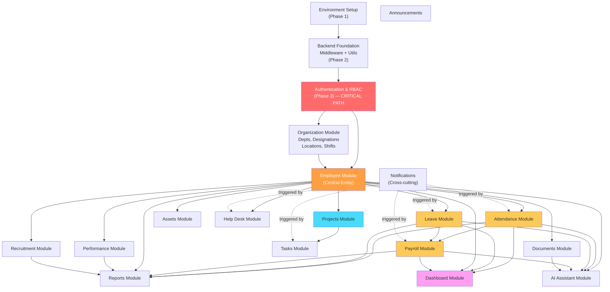

# DEVELOPMENT_ORDER.md

---

## 1. Document Metadata

| Field           | Value                                                                      |
|-----------------|----------------------------------------------------------------------------|
| Document Name   | DEVELOPMENT_ORDER.md                                                       |
| Version         | 1.0                                                                        |
| Status          | Approved                                                                   |
| Authority Level | Level 6 — Inherits from API_SPECIFICATION.md                              |
| Purpose         | Definitive implementation roadmap and execution plan for the Enterprise Workforce Management Platform |
| Dependencies    | AI_ENGINEERING_SPECIFICATION.md, Problem_Statement.md, PROJECT_MASTER.md, ARCHITECTURE_REVISION.md, DATABASE_DESIGN.md, API_SPECIFICATION.md |
| Last Updated    | 2026-07-03                                                                 |

---

## 2. Executive Summary

### 2.1 Purpose

This document defines the authoritative implementation roadmap for the Enterprise Workforce Management Platform (EWMP). It specifies the exact sequence in which every module, layer, and integration shall be developed. Every developer, every AI coding session, every code review, and every integration activity must follow this execution plan.

### 2.2 Relationship with Previous Documentation

| Document                    | Relationship                                                      |
|-----------------------------|-------------------------------------------------------------------|
| AI_ENGINEERING_SPECIFICATION.md | Governs all engineering rules and AI workflow constraints  |
| PROJECT_MASTER.md           | Defines modules, roles, and project scope this roadmap covers     |
| ARCHITECTURE_REVISION.md    | Defines the layered architecture this roadmap implements          |
| DATABASE_DESIGN.md          | Defines 27 collections this roadmap implements in dependency order |
| API_SPECIFICATION.md        | Defines 100+ endpoints this roadmap implements endpoint-by-endpoint |

### 2.3 Development Philosophy

Development follows a strict **dependency-first, backend-before-frontend-integration** model. Foundation layers are built and verified before dependent features. No module is considered complete without its backend service, API contract, and frontend integration all passing verification. The AI development workflow is documentation-driven — every AI coding session receives the relevant specification documents as authoritative context.

### 2.4 Intended Audience

- 4-person development team (1 Team Lead + 3 Developers)
- AI coding agents (Antigravity, Stitch MCP)
- Technical reviewers
- Project supervisor or academic evaluator

### 2.5 Delivery Target

This roadmap targets **70–75% functional completion** of the 15-module platform within a **6-day internship schedule**. Priority modules are identified in Section 4. Deferrable modules are documented with explicit deferral criteria so that partial completion is organized, not ad-hoc.

---

## 3. Project Development Strategy

### 3.1 Overall Implementation Philosophy

The project is executed in nine sequential phases. Each phase builds upon the previous one. No phase begins until its predecessor's exit criteria are satisfied. Foundation infrastructure (environment, database, authentication, shared utilities) is built before any feature module.

### 3.2 Dependency-First Development

Modules are implemented in the order they are depended upon. The Authentication module is built before any other module because every other module requires an authenticated user. The Employee module is built before Attendance, Leave, and Payroll because they all require an `employeeId` reference. This order is mandated by the module dependency graph in Section 5.

### 3.3 Incremental Delivery

Each module delivers a working vertical slice: backend model → service → controller → route → frontend page → integration verification. No module is partially delivered and moved on from. Partial work creates integration debt that is unrecoverable in a 6-day timeline.

### 3.4 Parallel Development Strategy

The 4-member team enables limited parallel development after the foundation is established:

| Track | Owner       | Focus                                              |
|-------|-------------|----------------------------------------------------|
| A     | Team Lead   | Architecture, integration, cross-cutting concerns  |
| B     | Developer 2 | Backend HR modules (attendance, leave, payroll)    |
| C     | Developer 3 | Backend operational modules (projects, assets, help desk) |
| D     | Developer 4 | Frontend (shared components, pages, integration)   |

Tracks B, C, and D begin parallel work only after Track A delivers the authentication foundation (end of Day 1).

### 3.5 AI-Assisted Development Workflow

Each AI coding session must receive, at minimum:
1. The relevant section of `API_SPECIFICATION.md` (endpoint definitions for the module being implemented)
2. The relevant collection schema from `DATABASE_DESIGN.md`
3. The folder structure from `ARCHITECTURE_REVISION.md` (Section 7)
4. The layer responsibility table from `ARCHITECTURE_REVISION.md` (Section 6)

AI output is reviewed by a human developer before committing. AI agents must not make architectural decisions. When AI output contradicts the documentation, the documentation governs.

### 3.6 Code Review Philosophy

Every Pull Request requires review by the Team Lead before merging to `develop`. Reviews verify:
- Layer compliance (no business logic in controllers)
- Naming compliance
- Response envelope compliance
- RBAC compliance
- No hardcoded secrets or environment values

### 3.7 Integration-First Mindset

Frontend pages are considered complete only when they are successfully calling the live backend API, not when the UI design is complete. Mock data is acceptable only during the first 24 hours of frontend development. After authentication is complete, all frontend data must come from the real API.

---

## 4. Development Phases

### Phase 1 — Repository & Environment Setup

**Duration:** Day 1, Morning (3 hours)

**Objectives:**
- Establish the project monorepo with correct folder structure
- Configure all environment variables and development tooling
- Verify all external service connections

**Deliverables:**

| Deliverable                       | Owner       |
|-----------------------------------|-------------|
| Initialized `ewmp/` monorepo      | Team Lead   |
| `client/` Vite + React 18 project | Team Lead   |
| `server/` Node.js + Express project | Team Lead |
| `docs/` folder with all 6 spec docs | Team Lead  |
| `.env.example` with all required variables | Team Lead |
| MongoDB Atlas cluster connected   | Team Lead   |
| Cloudinary account verified       | Team Lead   |
| Google Gemini API key verified    | Team Lead   |
| `main` and `develop` branches created | Team Lead |
| All team members cloned and running | All        |

**Dependencies:** None — this is the starting point.

**Success Criteria:**
- `node server.js` starts without errors
- `npm run dev` starts Vite without errors
- `GET /api/health` returns `{ success: true, status: "healthy", database: "connected" }`
- All team members can push feature branches

**Exit Criteria:** Health check passes. All developers have working local environments.

---

### Phase 2 — Core Backend Foundation

**Duration:** Day 1, Afternoon (4 hours)

**Objectives:**
- Build all shared infrastructure that every module depends upon
- Implement global middleware pipeline
- Create reusable utilities

**Deliverables:**

| Deliverable                              | Owner       |
|------------------------------------------|-------------|
| `server/config/db.js` — MongoDB connection | Team Lead |
| `server/config/cloudinary.js`            | Team Lead   |
| `server/config/gemini.js`                | Team Lead   |
| `server/config/env.js` — startup validation | Team Lead |
| `server/utils/AppError.js` — custom error class | Team Lead |
| `server/utils/formatResponse.js` — response envelope | Team Lead |
| `server/utils/generateEmployeeId.js`     | Developer 2 |
| `server/utils/calculateWorkingHours.js`  | Developer 2 |
| `server/utils/sendEmail.js` — Nodemailer | Team Lead |
| `server/middleware/errorMiddleware.js` — global error handler | Team Lead |
| `server/middleware/rateLimitMiddleware.js` | Team Lead |
| `server/middleware/uploadMiddleware.js` — Multer | Developer 3 |
| `server/middleware/validationMiddleware.js` — Zod | Team Lead |
| `server/server.js` — full middleware pipeline | Team Lead |

**Dependencies:** Phase 1 complete.

**Success Criteria:**
- Global error handler correctly formats all error types
- `validateRequest` middleware returns structured field errors
- `AppError` propagation confirmed end-to-end
- All utility functions have been manually tested

**Exit Criteria:** Middleware pipeline documented and verified. Team Lead signs off.

---

### Phase 3 — Authentication & RBAC

**Duration:** Day 1 Evening → Day 2 Morning (5 hours)

**Objectives:**
- Implement complete authentication system
- Implement RBAC middleware
- Create Users collection with all security controls

**Deliverables:**

| Deliverable                              | Owner       |
|------------------------------------------|-------------|
| `server/models/User.js` — full schema    | Team Lead   |
| `server/models/Organization.js`          | Team Lead   |
| `server/validators/authValidator.js`     | Team Lead   |
| `server/services/authService.js` — all auth logic | Team Lead |
| `server/controllers/authController.js`   | Team Lead   |
| `server/routes/authRoutes.js`            | Team Lead   |
| `server/middleware/authMiddleware.js` — verifyToken | Team Lead |
| `server/middleware/rbacMiddleware.js` — checkRole | Team Lead |
| `server/utils/generateToken.js` — JWT utilities | Team Lead |
| Seed script: default organization + SUPER_ADMIN user | Team Lead |
| `POST /api/auth/login` — verified        | Team Lead   |
| `POST /api/auth/logout` — verified       | Team Lead   |
| `POST /api/auth/refresh` — verified      | Team Lead   |
| `POST /api/auth/forgot-password` — verified | Team Lead |
| `POST /api/auth/reset-password/:token` — verified | Team Lead |
| `PUT /api/auth/change-password` — verified | Team Lead |
| `GET /api/auth/me` — verified            | Team Lead   |
| Frontend: `LoginPage.jsx`                | Developer 4 |
| Frontend: `AuthContext.jsx`              | Developer 4 |
| Frontend: `PrivateRoute.jsx`             | Developer 4 |
| Frontend: Axios instance with interceptors | Developer 4 |

**Dependencies:** Phase 2 complete.

**Success Criteria:**
- Login returns JWT access token and sets HTTP-only refresh cookie
- Invalid credentials return 401; locked accounts return 422
- `verifyToken` rejects expired tokens with 401
- `checkRole` rejects unauthorized roles with 403
- Password reset email is received and token expires correctly
- Frontend login page connects to backend successfully

**Exit Criteria:** All 7 auth endpoints return correct responses for success and error cases. RBAC middleware blocks unauthorized requests. Frontend login flow completes end-to-end.

---

### Phase 4 — Core HR Modules

**Duration:** Day 2 → Day 3 (2 full days)

**Objectives:**
- Implement the Organization, Employee, Attendance, Leave, and Payroll modules
- These are the highest-priority modules that define the platform's core value

**Sub-Phase 4A — Organization & Employee (Day 2)**

| Deliverable                                   | Owner       |
|-----------------------------------------------|-------------|
| Models: Department, Designation, Location, Shift | Developer 2 |
| Services: organizationService.js               | Developer 2 |
| Controllers and routes: departments, designations, locations, shifts | Developer 2 |
| Model: Employee.js — full schema               | Developer 2 |
| `server/services/employeeService.js`           | Developer 2 |
| `server/controllers/employeeController.js`     | Developer 2 |
| `server/routes/employeeRoutes.js`              | Developer 2 |
| `server/validators/employeeValidator.js`       | Developer 2 |
| Employee creation transaction (users + employees + leaveBalances) | Developer 2 |
| Frontend: `AppShell.jsx` with Sidebar         | Developer 4 |
| Frontend: `TopNavigation.jsx`                 | Developer 4 |
| Frontend: Shared `DataTable`, `StatCard`, `FormField`, `Toast` components | Developer 4 |
| Frontend: `EmployeeListPage.jsx`, `AddEmployeePage.jsx`, `EmployeeDetailPage.jsx` | Developer 4 |
| Frontend: Employee API integration             | Developer 4 |

**Sub-Phase 4B — Attendance & Leave (Day 2 Evening → Day 3 Morning)**

| Deliverable                                   | Owner       |
|-----------------------------------------------|-------------|
| Models: Attendance, AttendanceLogs, LeaveType, LeaveBalance, LeaveRequest, Holiday | Developer 2 |
| `server/services/attendanceService.js`         | Developer 2 |
| `server/services/leaveService.js`              | Developer 2 |
| Attendance routes: clock-in, clock-out, correction workflow | Developer 2 |
| Leave routes: CRUD, approve/reject/cancel workflow | Developer 2 |
| Leave balance initialization on employee creation | Developer 2 |
| Frontend: `AttendancePage.jsx`, `CorrectionRequestModal.jsx` | Developer 4 |
| Frontend: `LeaveRequestPage.jsx`, `LeaveApprovalPage.jsx`, `LeaveBalancePage.jsx` | Developer 4 |

**Sub-Phase 4C — Payroll (Day 3)**

| Deliverable                                   | Owner       |
|-----------------------------------------------|-------------|
| Models: SalaryStructure, Payroll, Payslip      | Developer 2 |
| `server/services/payrollService.js` — computation engine | Developer 2 |
| `server/utils/calculateSalary.js`             | Developer 2 |
| Payroll processing endpoint (calls attendance + leave services) | Developer 2 |
| Payroll approve + mark-paid workflow          | Developer 2 |
| Frontend: `PayrollListPage.jsx`, `PayslipPage.jsx` | Developer 4 |
| Frontend: `SalaryStructurePage.jsx`           | Developer 4 |

**Dependencies:** Phase 3 complete. Employee module must be complete before Attendance, Leave, and Payroll begin.

**Success Criteria:**
- All CRUD endpoints for org entities return correct paginated responses
- Employee creation transaction succeeds atomically
- Clock-in/out correctly computes working hours and late status
- Leave approval transaction correctly deducts from leave balance
- Payroll processing correctly computes gross salary and deductions from attendance/leave data
- RBAC: EMPLOYEE cannot access other employees' data

**Exit Criteria:** Core HR module API tests pass. Frontend pages connect to live backend. Leave approval workflow completes end-to-end.

---

### Phase 5 — Operational Modules

**Duration:** Day 3 → Day 4 (1.5 days)

**Objectives:**
- Implement Projects, Tasks, Assets, Help Desk, Documents, Notifications, and Announcements modules

**Sub-Phase 5A — Projects & Tasks (Day 3 Evening, parallel with Phase 4C)**

| Deliverable                                   | Owner       |
|-----------------------------------------------|-------------|
| Models: Project, Task                         | Developer 3 |
| `server/services/projectService.js`            | Developer 3 |
| Project CRUD + status workflow                | Developer 3 |
| Task CRUD + status update + comments          | Developer 3 |
| Frontend: `ProjectListPage.jsx`, `ProjectDetailPage.jsx` | Developer 4 |
| Frontend: `TaskKanbanBoard.jsx`, `TaskListPage.jsx` | Developer 4 |

**Sub-Phase 5B — Assets & Help Desk (Day 4 Morning)**

| Deliverable                                   | Owner       |
|-----------------------------------------------|-------------|
| Models: Asset, AssetAllocation                | Developer 3 |
| Model: HelpDeskTicket                         | Developer 3 |
| `server/services/assetService.js`              | Developer 3 |
| `server/services/helpdeskService.js`           | Developer 3 |
| Asset allocate/return workflow transaction     | Developer 3 |
| Help desk ticket lifecycle (raise → assign → resolve → close) | Developer 3 |
| Frontend: `AssetListPage.jsx`, `AssetAllocationPage.jsx` | Developer 4 |
| Frontend: `TicketListPage.jsx`, `TicketDetailPage.jsx` | Developer 4 |

**Sub-Phase 5C — Documents, Notifications, Announcements (Day 4)**

| Deliverable                                   | Owner       |
|-----------------------------------------------|-------------|
| Models: EmployeeDocument, Notification, Announcement | Team Lead |
| `server/services/documentService.js` + Cloudinary integration | Team Lead |
| `server/services/notificationService.js`       | Team Lead   |
| `server/utils/fileUploadUtil.js`              | Team Lead   |
| Notification triggers in leave, payroll, ticket services | Team Lead |
| Frontend: `DocumentsPage.jsx`, file upload component | Developer 4 |
| Frontend: `NotificationCenter.jsx`, `NotificationBell.jsx` | Developer 4 |
| Frontend: `AnnouncementsPage.jsx`             | Developer 4 |

**Dependencies:** Phase 3 complete. Projects and Assets can begin in parallel with Phase 4C (they only depend on Employees, which completes in Phase 4A).

**Success Criteria:**
- Kanban board task status transitions are functional
- Asset allocation/return transaction updates both asset and allocation records atomically
- Help desk ticket moves from Open → In Progress → Resolved → Closed
- File upload saves Cloudinary URL to employee document record
- Notifications are created when leave is approved/rejected

**Exit Criteria:** All operational module API tests pass. Frontend pages connected to live API.

---

### Phase 6 — AI & Reporting

**Duration:** Day 4 Evening → Day 5 (1.5 days)

**Objectives:**
- Implement AI Operations Assistant
- Implement Reports & Analytics module
- Implement Performance Reviews and Recruitment modules (if time allows)
- Implement Dashboard aggregation endpoint

**Sub-Phase 6A — AI Assistant (Day 4 Evening)**

| Deliverable                                   | Owner       |
|-----------------------------------------------|-------------|
| Models: AIConversation, AIMessage             | Team Lead   |
| `server/ai/geminiClient.js`                   | Team Lead   |
| `server/ai/promptTemplates.js`                | Team Lead   |
| `server/ai/contextBuilder.js`                 | Team Lead   |
| `server/services/aiService.js`                | Team Lead   |
| AI query endpoint with rate limiting          | Team Lead   |
| AI conversation + messages endpoints         | Team Lead   |
| Frontend: `AIAssistantPage.jsx` with chat UI | Developer 4 |

**Sub-Phase 6B — Reports & Dashboard (Day 5 Morning)**

| Deliverable                                   | Owner       |
|-----------------------------------------------|-------------|
| `server/services/reportService.js` — aggregation pipelines | Developer 3 |
| Attendance report endpoint                    | Developer 3 |
| Leave report endpoint                         | Developer 3 |
| Payroll report endpoint                       | Developer 3 |
| Headcount report endpoint                     | Developer 3 |
| `server/services/dashboardService.js`         | Developer 3 |
| Dashboard summary endpoint (role-scoped)      | Developer 3 |
| Dashboard stats endpoint                      | Developer 3 |
| Frontend: `DashboardPage.jsx` with charts     | Developer 4 |
| Frontend: `ReportsPage.jsx`                   | Developer 4 |

**Sub-Phase 6C — Performance & Recruitment (Day 5, if capacity exists)**

| Priority | Deliverable                        | Owner        |
|----------|------------------------------------|--------------|
| Medium   | Models: Goal, PerformanceReview    | Developer 2  |
| Medium   | Performance goals CRUD + progress  | Developer 2  |
| Medium   | Performance review workflow        | Developer 2  |
| Medium   | Models: Candidate, InterviewSchedule | Developer 3 |
| Medium   | Candidate pipeline + convert workflow | Developer 3 |
| Medium   | Interview scheduling + feedback    | Developer 3  |
| Medium   | Frontend: Performance pages        | Developer 4  |
| Medium   | Frontend: Recruitment pipeline pages | Developer 4 |

> **Note:** Performance and Recruitment modules are Medium priority. If the team is behind schedule, their backend is implemented at basic CRUD level only, with no complex workflow. Frontend remains at list/detail pages without approval workflows.

**Dependencies:** Phase 4 and Phase 5 complete. AI module requires all HR data collections to be populated for context building.

**Success Criteria:**
- AI query returns a relevant response using live HR data scoped to the user's role
- Dashboard summary returns correct counts from the database
- Reports return paginated and filterable aggregated data

**Exit Criteria:** AI endpoint functional. Dashboard loads live data. At least 4 report types operational.

---

### Phase 7 — Frontend Integration & Polish

**Duration:** Day 5 → Day 6 Morning (1.5 days, parallel with Phase 6)

**Objectives:**
- Connect all remaining frontend pages to live backend APIs
- Implement role-scoped navigation and page guards
- Implement loading states, error states, and empty states on all pages
- Implement responsive layout

| Deliverable                                   | Owner       |
|-----------------------------------------------|-------------|
| Role-scoped sidebar navigation (9 roles)      | Developer 4 |
| TanStack Query setup + query key standards    | Developer 4 |
| All mutation hooks with cache invalidation    | Developer 4 |
| Loading states on all data-driven pages       | Developer 4 |
| Error state handling (toast, form field errors)| Developer 4 |
| Empty state components on all list pages      | Developer 4 |
| Breadcrumb navigation on all pages            | Developer 4 |
| Profile page with photo upload                | Developer 4 |
| Settings page                                 | Developer 4 |
| Dark/light theme toggle                       | Developer 4 |
| Responsive layout (desktop + tablet)          | Developer 4 |

**Dependencies:** Phase 3 authentication frontend complete. Backend APIs from Phases 4, 5, 6 available.

**Exit Criteria:** All priority module pages load real data without errors for all 9 user roles.

---

### Phase 8 — Testing & Bug Fixing

**Duration:** Day 5 Evening → Day 6 Morning (4 hours)

**Objectives:**
- Execute systematic API testing across all modules
- Execute RBAC verification across all role/endpoint combinations
- Fix all critical and high-severity bugs

| Activity                              | Owner        |
|---------------------------------------|--------------|
| Auth API test suite (all 7 endpoints) | Team Lead    |
| Employee API test suite               | Developer 2  |
| Attendance + Leave API test suite     | Developer 2  |
| Payroll API test suite                | Developer 2  |
| Projects + Tasks API test suite       | Developer 3  |
| Assets + Help Desk API test suite     | Developer 3  |
| RBAC verification matrix (all roles)  | Team Lead    |
| Full frontend walkthrough (all roles) | All          |
| Critical bug fixing                   | All (assigned) |
| Regression check after bug fixes      | Team Lead    |

**Exit Criteria:** No critical bugs (crashes, data corruption, authentication bypass, broken RBAC). All Priority 1 modules pass API tests.

---

### Phase 9 — Demo & Presentation Readiness

**Duration:** Day 6 (3 hours)

**Objectives:**
- Seed meaningful demonstration data
- Verify all demo user accounts
- Prepare demo walkthrough flow
- Final deployment verification

| Deliverable                               | Owner       |
|-------------------------------------------|-------------|
| Seed script with demo organization data   | Developer 2 |
| Demo user accounts for all 9 roles        | Team Lead   |
| 10+ demo employees across 3 departments   | Developer 2 |
| 1 month of attendance data (demo)         | Developer 2 |
| Sample leave requests in various states   | Developer 2 |
| 1 processed payroll run                   | Developer 2 |
| 3 active projects with tasks              | Developer 3 |
| Sample help desk tickets                  | Developer 3 |
| Demo walkthrough script                   | Team Lead   |
| Final README.md with setup instructions   | Team Lead   |
| All environment variables documented      | Team Lead   |

**Exit Criteria:** Complete demo walkthrough executes without errors for HR_MANAGER role and EMPLOYEE role. All demo credentials verified working.

---

## 5. Module Dependency Graph

### 5.1 Implementation Priority Tiers

| Tier | Priority   | Modules                                                                  |
|------|------------|--------------------------------------------------------------------------|
| 1    | MUST HAVE  | Authentication, Users, Organization, Employee Management                 |
| 2    | MUST HAVE  | Attendance, Leave Management, Payroll                                    |
| 3    | MUST HAVE  | Projects & Tasks, Notifications, Dashboard                               |
| 4    | HIGH       | Assets, Help Desk, Documents, Announcements                              |
| 5    | MEDIUM     | Performance Reviews, Recruitment, AI Assistant                           |
| 6    | LOW        | Advanced Reports, Audit Log UI, AI Feedback analytics                    |

### 5.2 Module Dependency Diagram



### 5.3 Critical Path

The critical path is the sequence of modules where a delay in any one module delays everything downstream:

```
Environment Setup → Backend Foundation → Authentication → Employee → Attendance → Leave → Payroll → Dashboard
```

Any delay on this path directly reduces the final deliverable scope. The Team Lead owns the critical path and must unblock it above all other priorities.

### 5.4 Parallel Development Opportunities

After Authentication is complete (end of Day 1):

| Parallel Track | Modules                                | Owner        |
|----------------|----------------------------------------|--------------|
| Track B        | Employee → Attendance → Leave → Payroll | Developer 2 |
| Track C        | Projects → Tasks → Assets → Help Desk  | Developer 3  |
| Track D        | Frontend components → Pages → Integration | Developer 4 |

Tracks B and C are independent after they both have the Employee model available (provided by Developer 2 at the start of Phase 4A).

---

## 6. Repository Structure & Git Workflow

### 6.1 Repository Layout

```
ewmp/                           ← Monorepo root
├── client/                     ← React + Vite frontend
├── server/                     ← Node.js + Express backend
├── docs/                       ← All 6 specification documents
├── .env.example                ← Environment variable template
├── .gitignore
└── README.md
```

### 6.2 Branch Strategy

| Branch Type    | Naming Convention              | Purpose                                       |
|----------------|--------------------------------|-----------------------------------------------|
| `main`         | `main`                         | Production-ready code only; never commit directly |
| `develop`      | `develop`                      | Integration branch; all feature branches merge here |
| Feature        | `feature/<module>-<description>` | e.g., `feature/auth-login-api`              |
| Bugfix         | `bugfix/<issue>-<description>` | e.g., `bugfix/leave-balance-not-updating`    |
| Hotfix         | `hotfix/<critical-description>`| Critical fix for `main` only                 |
| Demo           | `demo`                         | Stable demo branch for presentation          |

### 6.3 Commit Message Convention

```
<type>(<scope>): <description>

Types:
  feat      — New feature or endpoint
  fix       — Bug fix
  refactor  — Code restructure without behavior change
  style     — Formatting only
  docs      — Documentation update
  test      — Test addition or modification
  chore     — Tooling, config, dependency change

Examples:
  feat(auth): add JWT refresh token endpoint
  fix(leave): correct leave balance deduction in approval transaction
  feat(employee): add employee creation with atomia user+employee transaction
  refactor(payroll): extract salary computation to utility function
```

### 6.4 Pull Request Rules

| Rule                          | Requirement                                              |
|-------------------------------|----------------------------------------------------------|
| Minimum reviewers             | 1 (Team Lead review required)                            |
| Branch source                 | Must branch from `develop`                               |
| Branch target                 | Must merge into `develop` only                           |
| PR description                | Must reference the module and API endpoints implemented  |
| Tests passing                 | Manual API test results included in PR description       |
| No merge conflicts            | Developer resolves conflicts before review               |
| Layer compliance              | Reviewer confirms service layer contains business logic  |
| Response envelope             | Reviewer confirms all responses use standard envelope    |

### 6.5 Merge Strategy

- Feature → Develop: **Squash merge** (one clean commit per feature)
- Develop → Main: **Merge commit** (preserves history)
- Develop → Demo: **Merge commit** (stable demo snapshot)

### 6.6 Branch Protection

- `main`: No direct pushes; PR with Team Lead approval required
- `develop`: No direct pushes except Team Lead for emergency integration fixes

### 6.7 Daily Git Workflow

```
Start of day:
  git checkout develop
  git pull origin develop
  git checkout -b feature/<your-module>-<description>

During work:
  git add .
  git commit -m "feat(<module>): <description>"
  (commit after each working endpoint, not at end of day)

End of session:
  git push origin feature/<your-module>-<description>
  Open PR to develop
  Notify Team Lead for review
```

---

## 7. Team Structure

### 7.1 Team Lead

| Attribute               | Detail                                                       |
|-------------------------|--------------------------------------------------------------|
| Primary Responsibilities | Architecture enforcement, authentication module, shared infrastructure, integration, environment setup |
| Secondary Responsibilities | AI module, notification service, file upload utilities, code review |
| Ownership               | Authentication, Notifications, Documents, AI Assistant, Global middleware |
| Expected Deliverables   | Phase 1 + 2 + 3 complete; all code review approvals; integration unblocking |
| Integration Responsibilities | Merge all PRs; resolve conflicts; maintain `develop` branch health |

---

### 7.2 Developer 2

| Attribute               | Detail                                                       |
|-------------------------|--------------------------------------------------------------|
| Primary Responsibilities | All HR modules: Organization config, Employee, Attendance, Leave, Payroll |
| Secondary Responsibilities | Performance Reviews, Recruitment modules (Phase 6C if capacity) |
| Ownership               | Departments, Designations, Locations, Shifts, Employees, Attendance, Leave, Payroll, Salary Structures, Payslips |
| Expected Deliverables   | Phase 4A + 4B + 4C complete; seed script for demo data |
| Integration Responsibilities | Ensure attendance and leave service exports are consumable by payroll service |

---

### 7.3 Developer 3

| Attribute               | Detail                                                       |
|-------------------------|--------------------------------------------------------------|
| Primary Responsibilities | Operational modules: Projects, Tasks, Assets, Help Desk, Reports, Dashboard |
| Secondary Responsibilities | Recruitment module (Phase 6C if capacity) |
| Ownership               | Projects, Tasks, Assets, Asset Allocations, Help Desk Tickets, Reports, Dashboard |
| Expected Deliverables   | Phase 5A + 5B + Phase 6B complete |
| Integration Responsibilities | Ensure report service correctly aggregates from attendance, leave, and payroll collections |

---

### 7.4 Developer 4 (Frontend)

| Attribute               | Detail                                                       |
|-------------------------|--------------------------------------------------------------|
| Primary Responsibilities | All frontend pages, shared component library, API integration via TanStack Query |
| Secondary Responsibilities | Stitch MCP prompt authoring for complex UI pages |
| Ownership               | Entire `client/` directory, all React components and pages |
| Expected Deliverables   | Complete frontend for all Tier 1–4 modules; responsive layout; dark/light theme |
| Integration Responsibilities | Coordinate with each developer as their backend module completes to immediately integrate |

---

### 7.5 Escalation Chain

```
Developer 2 / 3 / 4 → Team Lead → Supervisor
```

Any blocker that cannot be resolved within 30 minutes must be escalated to the Team Lead immediately. Blockers include: unexpected API behavior, dependency failures, architectural ambiguities, merge conflicts.

---

## 8. Development Timeline

### Day 1 — Foundation Day

| Time Block       | Activity                                    | Owner        | Deliverable                        |
|------------------|---------------------------------------------|--------------|------------------------------------|
| 09:00 – 12:00    | Phase 1: Repository + Environment Setup     | All (led by TL) | Working `GET /api/health`       |
| 12:00 – 13:00    | Break                                       | —            | —                                  |
| 13:00 – 16:00    | Phase 2: Backend Foundation                 | TL + Dev2    | Middleware pipeline verified       |
| 16:00 – 18:00    | Phase 3: Auth Backend                       | TL           | Login + token endpoints working    |
| 16:00 – 18:00    | Frontend: Axios + AuthContext + LoginPage   | Dev4         | Login page connects to backend     |
| 18:00 – 21:00    | Phase 3: RBAC + remaining auth endpoints    | TL           | All 7 auth endpoints verified      |

**Day 1 Exit Criteria:**
- `GET /api/health` → healthy
- `POST /api/auth/login` → returns JWT
- Frontend login completes end-to-end

---

### Day 2 — Core HR Day

| Time Block       | Activity                                    | Owner        | Deliverable                        |
|------------------|---------------------------------------------|--------------|------------------------------------|
| 09:00 – 13:00    | Phase 4A: Organization + Employee backend   | Dev2         | Employee CRUD working              |
| 09:00 – 13:00    | AppShell + Sidebar + shared components      | Dev4         | Layout shell rendering             |
| 13:00 – 14:00    | Break                                       | —            | —                                  |
| 14:00 – 18:00    | Phase 4B: Attendance backend                | Dev2         | Clock-in/out working               |
| 14:00 – 18:00    | Employee pages frontend integration         | Dev4         | Employee list page live            |
| 14:00 – 18:00    | Phase 5A: Projects backend start            | Dev3         | Project CRUD working               |
| 18:00 – 21:00    | Phase 4B: Leave backend                     | Dev2         | Leave apply + approve working      |
| 18:00 – 21:00    | Attendance pages frontend integration       | Dev4         | Clock-in/out UI working            |

**Day 2 Exit Criteria:**
- Employee CRUD, Attendance clock-in/out, Leave application all pass API tests
- Employee list page loads live data
- Projects CRUD API working

---

### Day 3 — Payroll + Operational Day

| Time Block       | Activity                                    | Owner        | Deliverable                        |
|------------------|---------------------------------------------|--------------|------------------------------------|
| 09:00 – 13:00    | Phase 4C: Payroll backend                   | Dev2         | Payroll process + approve working  |
| 09:00 – 13:00    | Phase 5A: Tasks backend + Kanban            | Dev3         | Task CRUD + status working         |
| 09:00 – 13:00    | Leave pages frontend integration            | Dev4         | Leave apply/approve UI working     |
| 13:00 – 14:00    | Break                                       | —            | —                                  |
| 14:00 – 18:00    | Payroll pages frontend                      | Dev4         | Payroll list + payslip pages live  |
| 14:00 – 18:00    | Phase 5B: Assets backend                    | Dev3         | Asset allocate/return working      |
| 14:00 – 18:00    | Review RBAC across Phase 4 modules          | TL           | RBAC verified for Phases 1–4       |
| 18:00 – 21:00    | Phase 5B: Help Desk backend                 | Dev3         | Ticket lifecycle working           |
| 18:00 – 21:00    | Project + Task pages frontend               | Dev4         | Kanban board live                  |

**Day 3 Exit Criteria:**
- Payroll processing computes correct net salary
- Task status transitions functional
- Asset allocation/return transaction atomic
- All Priority Tier 1 and 2 modules backend-complete

---

### Day 4 — Documents + Notifications + AI Day

| Time Block       | Activity                                    | Owner        | Deliverable                        |
|------------------|---------------------------------------------|--------------|------------------------------------|
| 09:00 – 12:00    | Phase 5C: Documents + file upload           | TL           | Document upload to Cloudinary      |
| 09:00 – 12:00    | Asset + Help Desk pages frontend            | Dev4         | Asset list + ticket pages live     |
| 09:00 – 12:00    | Performance backend (goals CRUD)            | Dev2         | Goals create + progress update     |
| 09:00 – 12:00    | Recruitment backend (candidate CRUD)        | Dev3         | Candidate pipeline working         |
| 12:00 – 13:00    | Break                                       | —            | —                                  |
| 13:00 – 16:00    | Phase 5C: Notifications + Announcements     | TL           | Notifications triggered + retrieved|
| 13:00 – 16:00    | Documents + notification pages frontend     | Dev4         | Upload UI + notification bell live |
| 13:00 – 16:00    | Performance + Recruitment pages frontend    | Dev4         | Basic list/detail pages live       |
| 16:00 – 21:00    | Phase 6A: AI Assistant backend              | TL           | AI query endpoint functional       |
| 16:00 – 21:00    | Integration testing: Day 3–4 modules        | Dev2 + Dev3  | API tests pass                     |

**Day 4 Exit Criteria:**
- File upload saves Cloudinary URL to database
- Notifications created on leave approval/rejection
- AI query returns contextual response using live data
- All Tier 3 and Tier 4 modules backend-complete

---

### Day 5 — Reports + Dashboard + Frontend Polish

| Time Block       | Activity                                    | Owner        | Deliverable                        |
|------------------|---------------------------------------------|--------------|------------------------------------|
| 09:00 – 13:00    | Phase 6B: Reports + Dashboard backend       | Dev3         | Dashboard summary + 4 reports live |
| 09:00 – 13:00    | AI Assistant frontend integration           | Dev4         | AI chat UI live                    |
| 09:00 – 13:00    | RBAC verification pass                      | TL           | Role isolation confirmed           |
| 13:00 – 14:00    | Break                                       | —            | —                                  |
| 14:00 – 18:00    | Dashboard + Reports pages frontend          | Dev4         | Dashboard loads live KPIs + charts |
| 14:00 – 18:00    | Empty/loading/error states on all pages     | Dev4         | UX states complete                 |
| 14:00 – 18:00    | Responsive layout pass                      | Dev4         | Tablet breakpoint verified         |
| 18:00 – 21:00    | Phase 8 starts: API testing (auth + HR)     | TL + Dev2    | Auth + HR tests complete           |
| 18:00 – 21:00    | Critical bug fixes from testing             | All          | Critical bugs resolved             |

**Day 5 Exit Criteria:**
- Dashboard loads real data for 3 different roles
- All priority module pages display live data
- No 500 errors on any tested endpoint

---

### Day 6 — Testing, Demo Readiness, Presentation

| Time Block       | Activity                                    | Owner        | Deliverable                        |
|------------------|---------------------------------------------|--------------|------------------------------------|
| 09:00 – 11:00    | Phase 8 complete: API + RBAC testing        | All          | All test results documented        |
| 09:00 – 11:00    | Bug fixes (high severity only)              | Assigned     | Bug count ≤ 0 critical             |
| 11:00 – 13:00    | Phase 9: Seed script + demo data            | Dev2 + Dev3  | Demo org + 9 user accounts seeded  |
| 11:00 – 13:00    | README.md + setup documentation             | TL           | Setup doc complete                 |
| 13:00 – 14:00    | Break                                       | —            | —                                  |
| 14:00 – 16:00    | Full demo walkthrough rehearsal             | All          | Demo script executed cleanly       |
| 14:00 – 16:00    | Final merge: develop → main                 | TL           | `main` branch clean and tagged     |
| 16:00 – 18:00    | Merge: main → demo                          | TL           | Demo branch stable                 |
| 18:00 –          | Buffer for unexpected issues                | All          | —                                  |

**Day 6 Exit Criteria:**
- Demo walkthrough completes without errors for 3 different roles
- `main` branch tagged `v1.0.0-academic`
- All team members can run the project locally from README instructions

---

## 9. AI Development Workflow

### 9.1 Documentation as Single Source of Truth

Every AI coding session must begin with the relevant specification sections. No AI agent may make design decisions. The specifications answer all design questions.

### 9.2 Minimum Context per AI Session

| AI Task                         | Mandatory Documents to Include                              |
|---------------------------------|-------------------------------------------------------------|
| Backend module implementation   | API_SPECIFICATION (module section) + DATABASE_DESIGN (collection schemas) + ARCHITECTURE_REVISION (folder structure + layer table) |
| Frontend page implementation    | API_SPECIFICATION (endpoint definitions) + ARCHITECTURE_REVISION (Stitch MCP section) |
| Service layer implementation    | DATABASE_DESIGN (collection + validation rules) + ARCHITECTURE_REVISION (service layer section) |
| Middleware implementation       | ARCHITECTURE_REVISION (middleware pipeline + error handling sections) |
| Schema (Mongoose model)         | DATABASE_DESIGN (complete collection definition including all fields, types, and indexes) |

### 9.3 AI Prompt Ownership

The human developer owning a module is responsible for:
1. Writing the AI prompt with the correct documentation context
2. Reviewing the AI output before running it
3. Verifying the output against the specification
4. Committing only verified code

### 9.4 AI Output Verification Checklist

Before committing any AI-generated code, the developer must verify:

| Check                          | Verification Method                                     |
|--------------------------------|---------------------------------------------------------|
| Layer compliance               | Business logic is in service, not controller            |
| Response envelope              | Returns `{ success, message, data }`                    |
| Field names match schema       | Compare against DATABASE_DESIGN.md collection           |
| RBAC applied                   | `verifyToken` and `checkRole` on every protected route  |
| Validation middleware attached | `validateRequest(schema)` before controller in route    |
| Error uses AppError            | No raw `res.status(500).json({...})` in service         |
| No hardcoded values            | No secrets, URLs, or credentials in code                |

### 9.5 Context Management

Each AI session is stateless. Developers must re-supply context for every session. Never assume the AI remembers a previous session's decisions. Long modules (e.g., payroll service) may require multiple focused sessions, each scoped to one function.

### 9.6 Prompt Drift Prevention

If an AI agent produces output that deviates from the approved architecture:
1. Do NOT accept the output
2. Correct the prompt by explicitly quoting the relevant specification section
3. If AI continues to deviate, escalate to Team Lead for prompt redesign
4. Document the deviation pattern for future prompt improvements

### 9.7 Stitch MCP Usage

Stitch MCP is used exclusively for generating React component and page code. Every Stitch MCP prompt must include:
- The Stitch MCP constraints from ARCHITECTURE_REVISION.md Section 21
- The shared component catalogue from ARCHITECTURE_REVISION.md Section 13
- The relevant API endpoint response schema from API_SPECIFICATION.md
- The explicit prohibition: "Do not generate backend code, authentication logic, database queries, or business rules."

---

## 10. Backend Implementation Order

### 10.1 Implementation Sequence

| Order | Component                        | Rationale                                                    |
|-------|----------------------------------|--------------------------------------------------------------|
| 1     | `config/env.js`                  | Validates all environment variables; server refuses to start without them |
| 2     | `config/db.js`                   | MongoDB connection required before any model can be used     |
| 3     | `config/cloudinary.js`           | Required by upload utility                                   |
| 4     | `config/gemini.js`               | Required by AI service                                       |
| 5     | `utils/AppError.js`              | Required by all services and error middleware                |
| 6     | `utils/formatResponse.js`        | Required by all controllers                                  |
| 7     | `middleware/errorMiddleware.js`   | Registered last in Express; must exist before any error can be handled |
| 8     | `middleware/rateLimitMiddleware.js` | Applied at entry point; must exist before routes           |
| 9     | `middleware/validationMiddleware.js` | Required by all route definitions                         |
| 10    | `server.js` — middleware pipeline | Express app with all global middleware registered           |
| 11    | `models/User.js`, `models/Organization.js` | Auth service depends on these models              |
| 12    | `utils/generateToken.js`         | Required by authService                                      |
| 13    | `services/authService.js`        | Business logic for login, token, password — no dependencies on other services |
| 14    | `controllers/authController.js`, `routes/authRoutes.js` | Auth must be the first route registered |
| 15    | `middleware/authMiddleware.js`    | Required by every subsequent route                           |
| 16    | `middleware/rbacMiddleware.js`    | Required by every subsequent route                           |
| 17    | `models/Department.js`, `Designation.js`, `Location.js`, `Shift.js` | Required by Employee model |
| 18    | `services/organizationService.js` + routes | Referenced by employee creation                  |
| 19    | `models/Employee.js`             | Central entity; required by all HR and operational modules   |
| 20    | `utils/generateEmployeeId.js`    | Required by employeeService                                  |
| 21    | `services/employeeService.js` + routes | Must be complete before any other module begins          |
| 22    | `utils/fileUploadUtil.js`        | Required by documentService                                  |
| 23    | `middleware/uploadMiddleware.js`  | Required by document upload routes                           |
| 24    | `models/Attendance.js`, `AttendanceLogs.js` | Depend on Employee                                  |
| 25    | `utils/calculateWorkingHours.js` | Required by attendanceService                               |
| 26    | `services/attendanceService.js` + routes | Must complete before payroll                          |
| 27    | `models/LeaveType.js`, `LeaveBalance.js`, `LeaveRequest.js`, `Holiday.js` | Depend on Employee |
| 28    | `services/leaveService.js` + routes | Must complete before payroll (provides leave deduction data) |
| 29    | `models/SalaryStructure.js`, `Payroll.js`, `Payslip.js` | Depend on Employee + Attendance + Leave |
| 30    | `utils/calculateSalary.js`       | Required by payrollService                                   |
| 31    | `services/payrollService.js` + routes | Calls attendanceService and leaveService               |
| 32    | `models/Project.js`, `Task.js`   | Depend on Employee                                           |
| 33    | `services/projectService.js` + routes | Independent of HR services                              |
| 34    | `models/Asset.js`, `AssetAllocation.js` | Depend on Employee                                    |
| 35    | `services/assetService.js` + routes | Independent of HR services                               |
| 36    | `models/HelpDeskTicket.js`       | Depends on Employee                                          |
| 37    | `services/helpdeskService.js` + routes | Independent of HR services                           |
| 38    | `models/EmployeeDocument.js`     | Depends on Employee                                          |
| 39    | `services/documentService.js` + routes | Depends on fileUploadUtil                              |
| 40    | `models/Notification.js`         | Depends on Employee                                          |
| 41    | `services/notificationService.js` | Called by leave, payroll, ticket services — add triggers after those services are complete |
| 42    | `models/Announcement.js`         | Independent of HR models                                     |
| 43    | `services/announcementService.js` + routes | Independent                                       |
| 44    | `models/Goal.js`, `PerformanceReview.js` | Depend on Employee                                  |
| 45    | `services/performanceService.js` + routes | Independent but references project data            |
| 46    | `models/Candidate.js`, `InterviewSchedule.js` | Depend on Employee (interviewer)               |
| 47    | `services/recruitmentService.js` + routes | Calls employeeService for conversion              |
| 48    | `services/reportService.js` + routes | Aggregates from attendance, leave, payroll, performance |
| 49    | `services/dashboardService.js` + routes | Aggregates from all HR and operational collections |
| 50    | `ai/geminiClient.js`, `ai/contextBuilder.js`, `ai/promptTemplates.js` | Depend on all HR services |
| 51    | `services/aiService.js` + routes | Last; depends on all context sources                         |
| 52    | `models/AIConversation.js`, `AIMessage.js`, `AuditLog.js`, `ActivityLog.js` | Supporting collections |
| 53    | `server/server.js` — register all routes | Final step; register all router modules             |

---

## 11. Frontend Implementation Order

### 11.1 Implementation Sequence

| Order | Component                           | Depends On                         | Owner   |
|-------|-------------------------------------|------------------------------------|---------|
| 1     | `src/lib/axios.js` — Axios instance | —                                  | Dev4    |
| 2     | `src/lib/queryClient.js` — TanStack Query | —                            | Dev4    |
| 3     | `src/context/AuthContext.jsx`       | Axios                              | Dev4    |
| 4     | `src/routes/PrivateRoute.jsx`, `RoleRoute.jsx` | AuthContext               | Dev4    |
| 5     | `src/routes/AppRouter.jsx`          | PrivateRoute, RoleRoute            | Dev4    |
| 6     | `src/features/auth/LoginPage.jsx`   | Axios, AuthContext                 | Dev4    |
| 7     | `src/features/auth/ForgotPasswordPage.jsx`, `ResetPasswordPage.jsx` | Auth API | Dev4 |
| 8     | `tailwind.config.js` + `globals.css` — design tokens | —                  | Dev4    |
| 9     | `src/components/layout/AppShell.jsx`, `TopNavigation.jsx`, `Sidebar.jsx` | Auth | Dev4 |
| 10    | `src/components/ui/` — Button, Badge, StatusBadge, ConfirmDialog, PageHeader | shadcn/ui | Dev4 |
| 11    | `src/components/data/` — DataTable, StatCard, ChartWrapper | shadcn/ui  | Dev4    |
| 12    | `src/components/forms/` — FormField, DatePicker, FileUpload, SearchInput | React Hook Form + Zod | Dev4 |
| 13    | `src/components/feedback/` — Toast, AlertBanner, EmptyState, LoadingSpinner | — | Dev4 |
| 14    | `src/components/navigation/` — Breadcrumb, TabGroup | —                  | Dev4    |
| 15    | `src/context/NotificationContext.jsx` | AuthContext                     | Dev4    |
| 16    | `src/features/employees/` — pages, hooks, services | Employee backend    | Dev4    |
| 17    | `src/features/organization/` — Dept, Designation, Location, Shift pages | Org backend | Dev4 |
| 18    | `src/features/attendance/` — pages, clock-in/out UI | Attendance backend | Dev4 |
| 19    | `src/features/leave/` — request, approval, balance pages | Leave backend | Dev4 |
| 20    | `src/features/payroll/` — payroll list, payslip pages | Payroll backend  | Dev4    |
| 21    | `src/features/projects/` — project list, Kanban board | Project backend  | Dev4    |
| 22    | `src/features/assets/` — inventory, allocation pages | Asset backend    | Dev4    |
| 23    | `src/features/helpdesk/` — ticket list, detail pages | Help Desk backend | Dev4 |
| 24    | `src/features/documents/` — upload, list pages | Document backend       | Dev4    |
| 25    | `src/features/notifications/` — center, bell | Notification backend   | Dev4    |
| 26    | `src/features/ai-assistant/` — chat UI | AI backend                  | Dev4    |
| 27    | `src/features/dashboard/` — role-aware dashboard | Dashboard backend  | Dev4    |
| 28    | `src/features/reports/` — report pages | Reports backend             | Dev4    |
| 29    | `src/features/performance/` — goals, review pages | Performance backend | Dev4 |
| 30    | `src/features/recruitment/` — candidate pipeline | Recruitment backend | Dev4 |
| 31    | `src/context/ThemeContext.jsx` + dark mode | Design tokens complete  | Dev4    |
| 32    | Profile page, Settings page        | All auth + org APIs              | Dev4    |
| 33    | Responsive layout pass (md breakpoint) | All pages complete         | Dev4    |
| 34    | Empty/loading/error states on all pages | All integrations complete   | Dev4    |

---

## 12. Integration Checkpoints

### Checkpoint 1 — Repository Ready

| Item                        | Verification                                           |
|-----------------------------|--------------------------------------------------------|
| Monorepo structure created  | Folder tree matches ARCHITECTURE_REVISION.md Section 7 |
| All team members local setup| `git clone` → `npm install` → starts without errors   |
| `GET /api/health` responds  | Returns `{ database: "connected" }`                   |
| All env vars documented     | `.env.example` has all required keys                  |

**Approval:** Team Lead signs off. All 4 developers can push branches.

---

### Checkpoint 2 — Backend Foundation Complete

| Item                        | Verification                                           |
|-----------------------------|--------------------------------------------------------|
| Global error handler works  | Throwing `AppError(404, "test")` returns correct envelope |
| Validation middleware works | Missing required field returns 400 with `{ fields: { ... } }` |
| Rate limiter active         | 11th auth request within window returns 429           |
| Multer configured           | `req.file` populated on multipart POST                |

**Approval:** Team Lead manual test. No PR required (all changes are in shared infrastructure).

---

### Checkpoint 3 — Authentication Complete

| Item                        | Verification                                           |
|-----------------------------|--------------------------------------------------------|
| Login returns JWT + cookie  | `POST /api/auth/login` with valid credentials → 200   |
| Invalid credentials → 401   | Wrong password → 401 response                         |
| RBAC blocks wrong role      | EMPLOYEE attempting SUPER_ADMIN endpoint → 403        |
| Password reset flow works   | Email received; token resets password; expired token fails |
| Frontend login works        | Browser login form → stores token → navigates to dashboard |

**Approval:** Team Lead tests all 9 role logins. Frontend Developer confirms login flow.

---

### Checkpoint 4 — Core HR Modules Complete (Phase 4)

| Item                        | Verification                                           |
|-----------------------------|--------------------------------------------------------|
| Employee creation atomic    | User + Employee + LeaveBalances created or all rolled back |
| MANAGER sees only own dept  | MANAGER JWT → `GET /api/employees` → only own dept results |
| Leave balance deducted on approval | Before/after balance confirmed via API          |
| Payroll net salary correct  | Computed net = gross - PF - PT - leave deductions     |
| Clock-in timestamps correct | `workingHours` computed correctly                     |

**Approval:** Developer 2 + Team Lead joint API test session.

---

### Checkpoint 5 — Operational Modules Complete (Phase 5)

| Item                        | Verification                                           |
|-----------------------------|--------------------------------------------------------|
| Asset allocation transaction | Asset status → Allocated; reverse on return           |
| Ticket lifecycle complete   | Open → In Progress → Resolved → Closed with notifications |
| File upload Cloudinary URL  | POST document → URL stored in DB → retrievable via GET |
| Notifications triggered     | Leave approval creates notification for employee       |
| Task Kanban status updates  | Task status changes persist and update project completion % |

**Approval:** Developer 3 + Team Lead joint API test session.

---

### Checkpoint 6 — AI & Reports Complete (Phase 6)

| Item                        | Verification                                           |
|-----------------------------|--------------------------------------------------------|
| AI query returns HR context | Query about leave balance → response includes actual balance |
| AI role-scoped context      | EMPLOYEE query cannot retrieve other employees' data  |
| Dashboard loads live KPIs   | Role-scoped dashboard returns correct counts           |
| 4 reports return data       | Attendance, Leave, Payroll, Headcount reports return paginated results |

**Approval:** Team Lead tests AI query with 3 different role tokens.

---

### Checkpoint 7 — Frontend Connected

| Item                        | Verification                                           |
|-----------------------------|--------------------------------------------------------|
| All priority pages live     | No mock data; all pages load from real API             |
| Role-scoped navigation      | Each of 9 roles sees correct sidebar items             |
| Error states work           | Kill the API → pages show error state, not crash       |
| Empty states work           | Empty collections show `EmptyState` component          |
| Loading states work         | Slow network → skeleton loaders visible                |

**Approval:** Developer 4 full walkthrough with Team Lead.

---

### Checkpoint 8 — Demo Ready

| Item                        | Verification                                           |
|-----------------------------|--------------------------------------------------------|
| All demo accounts work      | Login as each of 9 demo users succeeds                |
| Demo data populated         | 10+ employees, attendance, leave, payroll, projects    |
| Demo walkthrough clean      | Full scenario from login to report generation — no errors |
| `main` branch stable        | No uncommitted changes; build succeeds from clean clone |
| README complete             | New developer can set up project in < 30 minutes       |

**Approval:** Full team walkthrough. Supervisor review (if applicable).

---

## 13. Testing Strategy

### 13.1 API Testing (Primary Testing Method)

Every module is tested using a REST API client (e.g., Postman, Thunder Client, or curl) after backend implementation. Tests cover:
- Happy path (correct input → expected response)
- Validation error (missing required field → 400 with field errors)
- Authentication error (no token → 401)
- Authorization error (wrong role → 403)
- Not found (non-existent ID → 404)
- Business rule violation (leave balance exceeded → 422)

### 13.2 RBAC Testing Matrix

For every endpoint, at least 3 roles are tested:
1. An authorized role (should succeed)
2. An unauthorized role (should return 403)
3. No token (should return 401)

| Module          | Primary Test Role  | Unauthorized Role | Tested By  |
|-----------------|--------------------|-------------------|------------|
| Authentication  | All                | —                 | Team Lead  |
| Employee CRUD   | HR_MANAGER         | EMPLOYEE          | Developer 2 |
| Attendance      | EMPLOYEE           | AUDITOR (write)   | Developer 2 |
| Leave Approval  | MANAGER            | EMPLOYEE (approve)| Developer 2 |
| Payroll Process | FINANCE            | MANAGER           | Developer 2 |
| Projects        | MANAGER            | FINANCE           | Developer 3 |
| Assets          | IT_ADMIN           | EMPLOYEE          | Developer 3 |
| Help Desk       | IT_ADMIN           | EMPLOYEE (assign) | Developer 3 |
| AI Query        | HR_MANAGER         | Unauthenticated   | Team Lead  |
| Reports         | AUDITOR            | EMPLOYEE          | Developer 3 |

### 13.3 Integration Testing

After each checkpoint, a cross-module integration test verifies that data flows correctly:
- Checkpoint 4: Create employee → Apply leave → Approve leave → Process payroll → Verify deduction
- Checkpoint 5: Create project → Assign task → Update task status → Verify project completion %
- Checkpoint 6: Query AI about own leave balance → Verify AI response cites correct balance value

### 13.4 Frontend Testing

Manual walkthrough testing by Developer 4:
- All forms submit correctly and show field validation errors
- All list pages load paginated data
- All detail pages load individual records
- All action buttons trigger correct API calls
- Toast notifications appear on success and error

### 13.5 Authentication Testing

Specific auth tests:
- Account locks after 5 failed attempts
- Refresh token produces new access token
- Expired access token is rejected with 401
- Password reset token expires after 1 hour
- Logout clears refresh token from database and cookie

### 13.6 Performance Testing

Basic performance verification (not load testing):
- List endpoints with 50+ records return within 500ms
- Dashboard aggregation returns within 1 second
- AI query returns within 5 seconds

### 13.7 Bug Tracking Workflow

| Severity | Definition                                    | Resolution Time |
|----------|-----------------------------------------------|-----------------|
| Critical | Crashes the server; data corruption; auth bypass | Same session  |
| High     | Feature doesn't work end-to-end; wrong RBAC  | Within 4 hours  |
| Medium   | Incorrect calculation; wrong response field  | Same day        |
| Low      | UI alignment; minor UX issue                 | Day 6 buffer    |

Bugs are tracked in a shared team document listing: severity, module, description, owner, and resolution status.

---

## 14. Risk Management

### 14.1 Risk Register

| Risk                    | Likelihood | Impact   | Mitigation Strategy                                                   |
|-------------------------|------------|----------|-----------------------------------------------------------------------|
| Time constraint         | High       | High     | Strict priority tiers; defer Tier 5–6 modules without hesitation; use daily exit criteria to detect slippage early |
| AI hallucinations       | Medium     | High     | AI output verified against spec before every commit; prompt includes spec sections verbatim |
| Merge conflicts         | Medium     | Medium   | Each developer owns clearly separated modules; Team Lead resolves all conflicts; frequent small commits |
| Payroll computation error | Low      | High     | Developer 2 unit-tests calculateSalary utility with known inputs before integration |
| MongoDB Atlas connectivity | Low     | High     | Connection string tested in Phase 1; Atlas IP whitelist configured for all team members |
| Authentication JWT issue | Low       | Critical | Auth is Phase 3; full verification before any other module begins; fallback: debug immediately |
| Scope creep             | Medium     | Medium   | No module is added that is not in the approved specifications; Team Lead rejects out-of-scope work |
| Prompt drift            | Medium     | Medium   | Every AI session starts with documentation; deviating output is rejected and re-prompted |
| Documentation drift     | Low        | High     | No changes to spec documents during development; documentation is read-only after Phase 1 |
| External API failure (Gemini, Cloudinary) | Low | Medium | AI module has fallback message; file upload gracefully returns error; modules function without external APIs where possible |

### 14.2 Contingency — Behind Schedule Protocol

If the team is behind schedule at the end of Day 3:

**Defer immediately (no discussion required):**
- Performance Reviews complex workflow (keep basic CRUD)
- Recruitment module (keep candidate list only)
- AI Assistant module
- Advanced Reports (keep attendance report only)
- Audit Log UI

**Accelerate:**
- Developer 4 switches from UI polish to completing backend-to-frontend integration on priority pages
- Developer 3 assists Developer 2 with any incomplete HR module

**Definition of acceptable 70% completion:**
Authentication + Employee + Attendance + Leave + Payroll + Projects + Tasks + Dashboard + Notifications all working end-to-end with correct RBAC.

---

## 15. Definition of Done (DoD)

### 15.1 Project-Level Definition of Done

The project is Done when all of the following are true:

| Criterion                  | Verification                                                    |
|----------------------------|-----------------------------------------------------------------|
| Feature Complete           | All Tier 1–4 modules have backend + frontend complete           |
| Code Reviewed              | All PRs approved by Team Lead                                   |
| Documentation Updated      | `README.md` contains accurate setup instructions                |
| API Verified               | All priority endpoints pass manual API tests                    |
| Database Verified          | Collection indexes created; constraint violations return correct errors |
| RBAC Verified              | Each of 9 roles tested for at least 5 endpoints               |
| Error Handling Verified    | All error types (400, 401, 403, 404, 422, 500) return correct envelope |
| Responsive UI Verified     | Desktop and tablet breakpoints render correctly                 |
| No Critical Bugs           | Zero server crashes; zero auth bypasses; zero data corruption   |
| Demo Ready                 | Full walkthrough executes cleanly for 3 different user roles    |

### 15.2 Module-Level Definition of Done

A module is Done when all of the following are true:

| Criterion                  | Verification                                                    |
|----------------------------|-----------------------------------------------------------------|
| Backend service complete   | All business logic in service layer                             |
| Controller thin            | Controller only calls service and returns response              |
| Routes registered          | Module routes added to `server.js`                              |
| Validation middleware      | Zod schema attached to all mutating routes                      |
| RBAC applied               | `checkRole` on all protected routes with correct role arrays    |
| Response envelope          | All responses use `{ success, message, data }` format           |
| Frontend page connected    | Page loads real data from backend                               |
| List page paginated        | Pagination controls functional                                  |
| Error states handled       | API errors display toast; form errors display inline            |
| PR merged to develop       | Team Lead approved and merged                                   |

---

## 16. Quality Gates

### Gate 1 — Architecture Compliance

Before any PR is merged, verify:
- Business logic exists only in `server/services/`
- Controllers do not contain computation or DB queries
- Frontend components do not make direct API calls (all calls via feature service files)

**Rejection condition:** Business logic found in controller or component → PR rejected until refactored.

---

### Gate 2 — Database Compliance

Before any model file is committed, verify:
- Field names match DATABASE_DESIGN.md exactly
- Required fields match DATABASE_DESIGN.md
- Enum values match DATABASE_DESIGN.md
- Standard audit fields present (createdAt, updatedAt via timestamps, createdBy, status)
- Indexes defined in schema match DATABASE_DESIGN.md Section 11

**Rejection condition:** Missing required fields; incorrect enum values; missing indexes → PR rejected.

---

### Gate 3 — API Compliance

Before any route file is committed, verify:
- HTTP method matches API_SPECIFICATION.md
- Route path matches API_SPECIFICATION.md
- Response structure matches standard envelope
- Status codes match API_SPECIFICATION.md Section 13
- RBAC role list matches API_SPECIFICATION.md RBAC table for that endpoint

**Rejection condition:** Non-standard route path; incorrect status code; wrong role list → PR rejected.

---

### Gate 4 — Coding Standards

- No `console.log` statements committed (use structured logging)
- No hardcoded secrets or environment values in code
- All async functions use `async/await` (no `.then()` chains)
- All functions under 40 lines (extract if larger)
- Variable names are descriptive (no `x`, `temp`, `data2`)

**Rejection condition:** Any hardcoded credential → immediate rejection; others → warning with required fix.

---

### Gate 5 — Folder Structure Compliance

Every new file must be created in the correct folder as defined in ARCHITECTURE_REVISION.md Section 7. No exceptions.

**Rejection condition:** Model file outside `server/models/`; service file outside `server/services/` → PR rejected.

---

### Gate 6 — Naming Standards

- Files: camelCase for JS/TS; PascalCase for React components
- Mongoose models: PascalCase
- Service functions: camelCase with descriptive verb names
- API routes: plural lowercase nouns

**Rejection condition:** PascalCase service file; lowercase React component → PR rejected.

---

### Gate 7 — Security Review

- No sensitive field returned without role check (password hash, PAN, bank account)
- All protected routes have `verifyToken` + `checkRole`
- File uploads validated by Multer MIME type filter
- No raw MongoDB query strings (all via Mongoose)

**Rejection condition:** Sensitive field exposed in any response → immediate Priority 1 fix.

---

### Gate 8 — Integration Verification

Before marking a module complete:
- Backend endpoint tested from frontend (real HTTP call, not Postman only)
- TanStack Query cache invalidated correctly after mutations
- 401/403 responses correctly redirect or show error on frontend

---

### Gate 9 — Testing Completion

Before Phase 8 exit:
- All priority endpoints have documented test results (pass/fail table)
- All RBAC tests documented
- No untested endpoints in Tier 1–3 modules

---

### Gate 10 — Documentation Consistency

Before demo branch creation:
- `README.md` accurate and complete
- `.env.example` has all required keys
- Seed script creates demo data successfully from clean state

---

## 17. Merge & Release Strategy

### 17.1 Feature Completion Rules

A feature branch may be opened for PR only when:
- All module-level DoD criteria are satisfied
- No console.log or debug artifacts exist
- Manual API tests have been executed and documented

### 17.2 Merge Readiness Checklist

```
□ Branch branched from develop (not main)
□ No merge conflicts with develop
□ PR description lists: module name, endpoints implemented, API test results
□ Quality Gates 1–6 satisfied
□ Team Lead reviewer assigned
```

### 17.3 Pull Request Review Process

1. Developer opens PR to `develop`
2. Team Lead reviews within 1 session
3. Team Lead may request changes (one round of revisions)
4. Developer addresses feedback; pushes changes
5. Team Lead approves; squash-merges to `develop`

### 17.4 Conflict Resolution Strategy

Conflicts are always resolved by the developer who opened the PR (not the reviewer). If the conflict involves shared files (middleware, server.js, shared utils), the Team Lead resolves it directly.

### 17.5 Release Candidate Criteria

`develop` → `main` occurs at Day 6 when:
- All Tier 1–3 modules are merged and verified
- No open critical or high-severity bugs
- `GET /api/health` returns healthy
- Demo seed script executes successfully

### 17.6 Demo Branch Strategy

`main` → `demo` at Day 6 afternoon with:
- Demo seed data committed as a script
- All demo credentials documented
- `README.md` includes demo scenario instructions

### 17.7 Version Tagging

```
main branch tagged: v1.0.0-academic
demo branch tagged: v1.0.0-demo
```

Tag message: "Enterprise Workforce Management Platform — Academic Internship Submission — July 2026"

---

## 18. AI Governance

### 18.1 Documentation as Single Source of Truth

All architectural, database, and API decisions are finalized in the six specification documents. No AI agent may propose, invent, or introduce design decisions not present in those documents. If a developer asks an AI agent a design question, the AI must be directed to the relevant specification section for the answer.

### 18.2 Prohibited AI Actions

An AI agent must NEVER:
- Generate Mongoose models that contradict DATABASE_DESIGN.md
- Generate API endpoints not defined in API_SPECIFICATION.md
- Place business logic in controllers
- Place database queries in controllers
- Return responses without the standard `{ success, message, data }` envelope
- Generate frontend components that contain API calls without using the established Axios instance
- Generate new modules not approved in PROJECT_MASTER.md
- Suggest architectural changes

### 18.3 Human Review Requirements

| AI Output Type       | Required Human Review                                     |
|----------------------|-----------------------------------------------------------|
| Mongoose model file  | Verify every field against DATABASE_DESIGN.md             |
| Service file         | Verify all business logic is in service, not controller   |
| Route file           | Verify HTTP method, path, RBAC match API_SPECIFICATION.md |
| React page           | Verify data comes from API, not hardcoded                 |
| Middleware           | Verify error propagation follows AppError pattern         |

### 18.4 AI Output Conflict Resolution

When AI-generated code conflicts with approved documentation:

1. **Documentation governs** — always
2. Reject the AI output
3. Re-prompt with explicit quotation of the conflicting specification rule
4. If the AI continues to violate the specification, the developer writes the conflicting section manually

### 18.5 Refactoring Policy

AI-assisted refactoring is permitted only:
- After the module's PR has been merged to `develop`
- After Team Lead approval of the refactoring scope
- Only if the refactoring does not change API behavior or database structure

---

## 19. Architecture Decision Records (ADR)

### ADR-401 — Dependency-First Development

| Field     | Detail                                                                      |
|-----------|-----------------------------------------------------------------------------|
| ID        | ADR-401                                                                     |
| Title     | Dependency-First Module Implementation Order                                |
| Status    | Approved — Immutable                                                        |
| Context   | 15 modules with deep inter-dependencies. Implementing modules out of order creates integration debt that collapses in a 6-day timeline. |
| Decision  | Modules are implemented in strict dependency order as defined in Section 10. No module begins backend implementation until its dependencies are merged to `develop`. |
| Reasoning | Dependency-first prevents integration surprises at the end of the project. A working dependency is always available when a dependent module is being built. |
| Impact    | The critical path (Auth → Employee → Attendance → Leave → Payroll → Dashboard) must be protected above all other work. |

---

### ADR-402 — Parallel Team Workflow

| Field     | Detail                                                                      |
|-----------|-----------------------------------------------------------------------------|
| ID        | ADR-402                                                                     |
| Title     | Three-Track Parallel Development After Authentication Foundation             |
| Status    | Approved — Immutable                                                        |
| Context   | A 4-person team with a 6-day timeline cannot develop all modules sequentially. Parallel development is necessary to meet the 70–75% target. |
| Decision  | After Phase 3 (Authentication) is complete: Track B (Developer 2) owns HR modules, Track C (Developer 3) owns operational modules, Track D (Developer 4) owns frontend. All tracks depend only on the Employee model from Track B's Phase 4A deliverable. |
| Reasoning | HR modules (Track B) and operational modules (Track C) have no dependency on each other's service layer. Frontend (Track D) depends only on the API contract, which is fully defined in API_SPECIFICATION.md. |
| Impact    | Developer 2 must complete the Employee model and service before Developer 3 begins any module that references employees. |

---

### ADR-403 — Git Branch Strategy

| Field     | Detail                                                                      |
|-----------|-----------------------------------------------------------------------------|
| ID        | ADR-403                                                                     |
| Title     | Feature Branch → Develop → Main with Squash Merge                          |
| Status    | Approved — Immutable                                                        |
| Context   | Four developers committing to a shared repository creates merge risk. Without branch discipline, `develop` becomes unstable and integration testing becomes unreliable. |
| Decision  | Every module is developed on a dedicated feature branch. All feature branches merge to `develop` via squash merge after Team Lead review. `develop` merges to `main` once at final release. No direct commits to `main` or `develop`. |
| Reasoning | Squash merge keeps `develop` history clean and readable. Feature branch isolation means one developer's incomplete work never blocks another. |
| Impact    | All developers must branch from `develop` at the start of each module. Team Lead must be available for PR reviews within 1 session. |

---

### ADR-404 — Backend Before Frontend Integration

| Field     | Detail                                                                      |
|-----------|-----------------------------------------------------------------------------|
| ID        | ADR-404                                                                     |
| Title     | Backend API Must Be Verified Before Frontend Integration Begins             |
| Status    | Approved — Immutable                                                        |
| Context   | Frontend development against mock data creates rework when the real API differs from expectations. |
| Decision  | A module's frontend pages connect to the real backend API immediately after the backend module passes its API tests and is merged to `develop`. Mock data is acceptable only for the first 24 hours of frontend scaffolding. |
| Reasoning | Connecting to the real API immediately surfaces integration issues (field name mismatches, response format differences, RBAC edge cases) while the backend developer is still in context. |
| Impact    | Developer 4 must coordinate with module owners daily to know when each backend module is merged and ready for integration. |

---

### ADR-405 — Documentation-Driven Development

| Field     | Detail                                                                      |
|-----------|-----------------------------------------------------------------------------|
| ID        | ADR-405                                                                     |
| Title     | All Implementation Decisions Derived From Approved Specification Documents  |
| Status    | Approved — Immutable                                                        |
| Context   | AI-assisted development by multiple developers risks divergence, where each developer's AI agent produces different patterns for the same concern. |
| Decision  | Every implementation decision (field name, route path, response structure, folder location, function name) is derived from the six specification documents. No implementation decision is made without a specification reference. |
| Reasoning | Documentation-driven development prevents architectural drift, ensures consistency across AI-generated modules, and provides an objective review standard. |
| Impact    | Developers must reference specifications continuously, not once at the start. AI prompts must include specification excerpts. Team Lead reviews verify specification compliance. |

---

### ADR-406 — Incremental Integration

| Field     | Detail                                                                      |
|-----------|-----------------------------------------------------------------------------|
| ID        | ADR-406                                                                     |
| Title     | Integration Verification at Every Module Completion, Not at Project End    |
| Status    | Approved — Immutable                                                        |
| Context   | In a 6-day timeline, deferring all integration to Day 6 is catastrophically high-risk. |
| Decision  | Every module is verified end-to-end (backend API test + frontend page integration) immediately after backend completion. Integration checkpoints (Section 12) are mandatory gates. |
| Reasoning | Incremental integration catches field name mismatches, RBAC errors, and response format issues when the developer is in context and can fix them quickly. |
| Impact    | Developer 4 must always be ready to integrate any module within hours of its backend PR merging. |

---

### ADR-407 — Continuous Testing

| Field     | Detail                                                                      |
|-----------|-----------------------------------------------------------------------------|
| ID        | ADR-407                                                                     |
| Title     | API Testing and RBAC Verification Are Continuous Activities, Not Phase 8 Only |
| Status    | Approved — Immutable                                                        |
| Context   | Leaving all testing to Day 5–6 means bugs accumulate, compound, and become impossible to fully resolve before the demo. |
| Decision  | Every developer tests their module's API immediately upon implementation (not after PR merge). Phase 8 is a structured regression pass, not the primary testing activity. The daily exit criteria enforce minimum testing at each checkpoint. |
| Reasoning | Continuous testing reduces the Phase 8 workload to regression verification rather than primary bug discovery. |
| Impact    | Each developer must document their test results (pass/fail per endpoint) in their PR description before requesting review. |

---

### ADR-408 — AI-Assisted Engineering

| Field     | Detail                                                                      |
|-----------|-----------------------------------------------------------------------------|
| ID        | ADR-408                                                                     |
| Title     | AI as an Accelerated Code Generator — Governed by Human-Reviewed Specifications |
| Status    | Approved — Immutable                                                        |
| Context   | 4 developers with 15 modules in 6 days requires AI assistance for sustainable velocity. But ungovernedAI assistance introduces drift and inconsistency. |
| Decision  | AI agents (Antigravity for backend, Stitch MCP for frontend UI) generate implementation code. Every AI output is reviewed against the specification before committing. AI agents must never make architectural decisions. Specifications govern all conflicts. |
| Reasoning | AI-assisted development with human verification achieves higher velocity than either pure human development or unreviewed AI output. The review step is non-negotiable and is faster than debugging unchecked AI code. |
| Impact    | Every developer must be able to compare AI output to the specification documents. Team Lead's primary review focus is specification compliance, not algorithmic correctness. |

---

### ADR-409 — Demo-Oriented Delivery

| Field     | Detail                                                                      |
|-----------|-----------------------------------------------------------------------------|
| ID        | ADR-409                                                                     |
| Title     | Demo-Ready State Prioritized Over Maximum Feature Count                     |
| Status    | Approved — Immutable                                                        |
| Context   | In a 6-day academic project, a polished demo of 10 working modules is more valuable than 15 partially-broken modules. |
| Decision  | Priority Tier 1–4 modules are implemented completely (backend + frontend + RBAC + error handling). Tier 5–6 modules are implemented only if Tier 1–4 are complete and stable. Incomplete modules are not shown in the demo. Stable seed data ensures the demo is reproducible. |
| Reasoning | Academic evaluation is based on what works, not what is committed. A broken feature reduces evaluation scores more than a missing feature. |
| Impact    | On Day 5, Team Lead makes a final scope decision: any module not meeting its DoD is dropped from the demo scope. The demo branch contains only complete, verified modules. |

---

## 20. Final Project Validation Checklist

| Validation Item                                                         | Status      |
|-------------------------------------------------------------------------|-------------|
| All 9 development phases are defined with objectives and exit criteria  | ✓ Verified  |
| Module dependency graph covers all 15 modules with correct relationships | ✓ Verified |
| Critical path identified (Auth → Employee → Attendance → Leave → Payroll → Dashboard) | ✓ Verified |
| Parallel development tracks defined for 4-member team                  | ✓ Verified  |
| Backend implementation order (53 steps) follows dependency logic        | ✓ Verified  |
| Frontend implementation order (34 steps) follows API availability order | ✓ Verified  |
| 6-day timeline is realistic for 70-75% completion target               | ✓ Verified  |
| Team responsibilities assigned to all 4 roles                          | ✓ Verified  |
| Git workflow defined (branches, commits, PRs, merge strategy)           | ✓ Verified  |
| 8 integration checkpoints defined with verification criteria            | ✓ Verified  |
| Testing strategy covers API, RBAC, integration, and frontend            | ✓ Verified  |
| Risk register covers 10 risks with mitigation strategies                | ✓ Verified  |
| Behind-schedule contingency protocol defined                            | ✓ Verified  |
| Project-level and module-level DoD defined                              | ✓ Verified  |
| 10 quality gates defined with rejection conditions                      | ✓ Verified  |
| Merge and release strategy covers demo branch and version tagging       | ✓ Verified  |
| AI governance prohibitions are explicit and enforceable                 | ✓ Verified  |
| AI output verification checklist defined                                | ✓ Verified  |
| All 9 ADRs are complete with all required fields                        | ✓ Verified  |
| Mermaid dependency diagram is syntactically valid                       | ✓ Verified  |
| No conflicts exist with API_SPECIFICATION.md                            | ✓ Verified  |
| No conflicts exist with DATABASE_DESIGN.md                              | ✓ Verified  |
| No conflicts exist with ARCHITECTURE_REVISION.md                        | ✓ Verified  |
| No conflicts exist with PROJECT_MASTER.md                               | ✓ Verified  |

---

*DEVELOPMENT_ORDER.md — Version 1.0 — Status: Approved*
*Inherits from: API_SPECIFICATION.md v1.0 → DATABASE_DESIGN.md v1.0 → ARCHITECTURE_REVISION.md v1.0 → PROJECT_MASTER.md v1.0 → AI_ENGINEERING_SPECIFICATION.md v1.0*
*This document is the final layer of the documentation hierarchy. It governs all implementation activities.*
