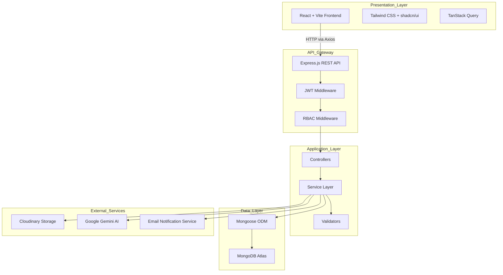
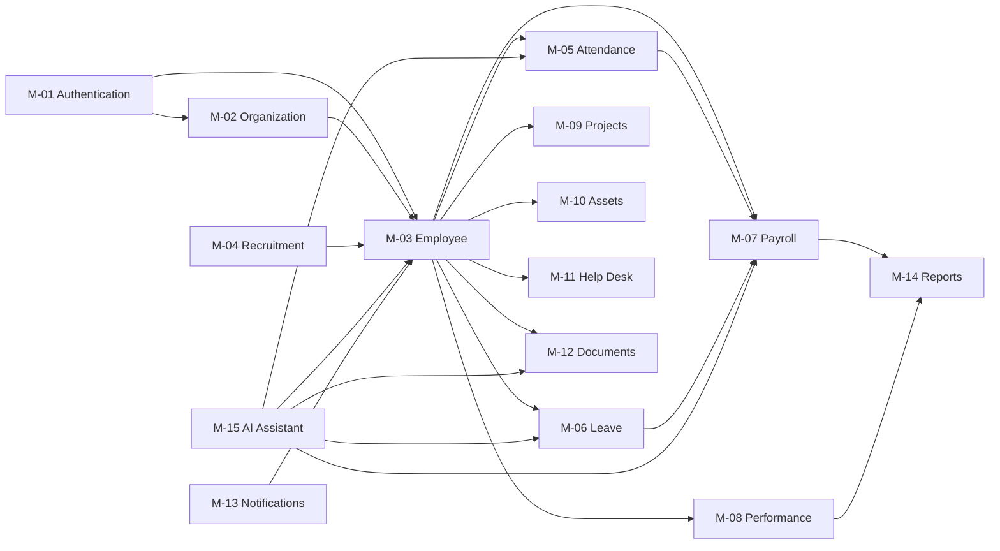
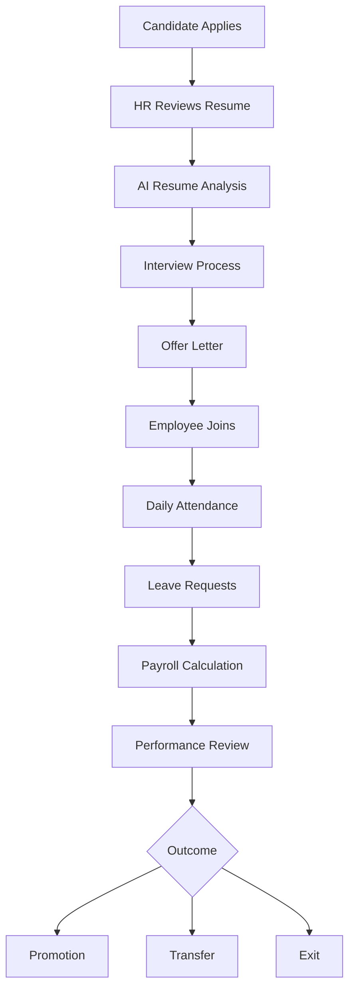
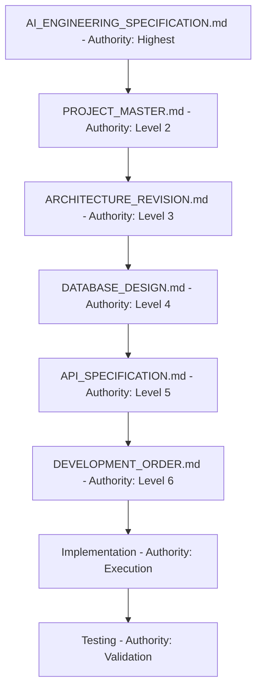
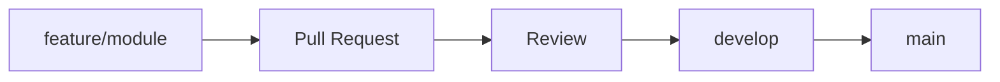
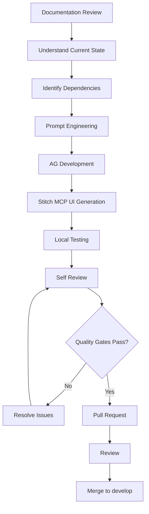

# PROJECT_MASTER.md

---

## Document Metadata

| Field            | Value                                                   |
|------------------|---------------------------------------------------------|
| Document Name    | PROJECT_MASTER.md                                       |
| Version          | 1.0                                                     |
| Status           | Approved                                                |
| Authority Level  | Level 2 — Inherits from AI_ENGINEERING_SPECIFICATION.md |
| Purpose          | Governing engineering specification for the Enterprise Workforce Management Platform |
| Dependencies     | AI_ENGINEERING_SPECIFICATION.md, Problem_Statement.md   |
| Last Updated     | 2026-07-03                                              |

---

## Table of Contents

1. [Document Metadata](#document-metadata)
2. [Executive Summary](#2-executive-summary)
3. [Project Overview](#3-project-overview)
4. [Engineering Philosophy](#4-engineering-philosophy)
5. [AI Engineering Specification Summary](#5-ai-engineering-specification-summary)
6. [Project Scope](#6-project-scope)
7. [Technology Stack](#7-technology-stack)
8. [High-Level System Overview](#8-high-level-system-overview)
9. [Module Overview](#9-module-overview)
10. [User Roles](#10-user-roles)
11. [Functional Scope](#11-functional-scope)
12. [Non-Functional Requirements](#12-non-functional-requirements)
13. [Development Principles](#13-development-principles)
14. [Documentation Hierarchy](#14-documentation-hierarchy)
15. [Git Strategy](#15-git-strategy)
16. [AI Development Workflow](#16-ai-development-workflow)
17. [Quality Standards](#17-quality-standards)
18. [Architecture Decision Records (ADR)](#18-architecture-decision-records-adr)
19. [Future Documents](#19-future-documents)
20. [Conclusion](#20-conclusion)

---

## 2. Executive Summary

### 2.1 Project

The **Enterprise Workforce Management Platform (EWMP)** is a centralized, web-based MERN stack application that digitizes and automates the complete employee lifecycle from recruitment to retirement across all HR operational domains.

### 2.2 Business Purpose

Organizations managing employees through disconnected spreadsheets, emails, and paper processes suffer from high operational costs, slow approvals, poor data integrity, and limited analytical visibility. EWMP consolidates all workforce management operations into a single governed platform.

### 2.3 Internship Objective

This project fulfills the requirements of an academic major internship. It demonstrates enterprise-grade software engineering practices including modular MERN architecture, role-based access control, AI integration, cloud storage, and real-time notifications delivered within a 6-day development cycle by a team of 4 developers.

### 2.4 AI-Assisted Development Approach

The project employs a structured AI-assisted engineering workflow. Human engineers define all architecture, scope, and engineering standards. Specialized AI systems execute implementation, documentation, and UI generation within those boundaries. No AI system may redesign, simplify, or deviate from approved engineering decisions. The governing authority for all AI behavior is `AI_ENGINEERING_SPECIFICATION.md`.

---

## 3. Project Overview

### 3.1 Project Vision

Build an enterprise-grade, modular, secure, and AI-augmented workforce management platform that serves as a single source of truth for all HR operations within an organization.

### 3.2 Project Scope

The platform covers the complete employee lifecycle: onboarding, attendance, leave, payroll, performance, project assignments, asset tracking, help desk, document management, and AI-powered operational assistance, all governed by role-based access control and delivered through a single unified dashboard.

### 3.3 Target Users

| User Category      | Description                                            |
|--------------------|--------------------------------------------------------|
| Super Admin        | Platform-level administration                          |
| Organization Admin | Organization configuration and governance              |
| HR Manager         | Employee lifecycle management and recruitment          |
| Department Manager | Team management, approvals, and performance reviews    |
| Team Lead          | Task and project management                            |
| Employee           | Self-service portal access                             |
| Finance Executive  | Payroll operations                                     |
| IT Administrator   | Asset tracking and help desk management                |
| Auditor            | Read-only compliance and audit access                  |

### 3.4 Business Value

| Value Driver             | Description                                              |
|--------------------------|----------------------------------------------------------|
| Operational Efficiency   | Eliminates manual HR processes and paperwork             |
| Data Accuracy            | Automated calculations remove human error                |
| Faster Approvals         | Automated workflows reduce approval cycle times          |
| Centralized Intelligence | Single source of truth for all workforce data            |
| AI Assistance            | Contextual AI answers reduce HR team query load          |
| Analytics Visibility     | Dashboards provide actionable workforce insights         |
| Security                 | RBAC enforces data access boundaries                     |

### 3.5 Primary Modules

| Module ID | Module Name               |
|-----------|---------------------------|
| M-01      | Authentication            |
| M-02      | Organization Management   |
| M-03      | Employee Management       |
| M-04      | Recruitment Management    |
| M-05      | Attendance Management     |
| M-06      | Leave Management          |
| M-07      | Payroll Management        |
| M-08      | Performance Management    |
| M-09      | Project & Task Management |
| M-10      | Asset Management          |
| M-11      | Help Desk                 |
| M-12      | Document Management       |
| M-13      | Notifications             |
| M-14      | Reports & Analytics       |
| M-15      | AI Operations Assistant   |

### 3.6 Success Criteria

| Criterion                   | Standard                                                       |
|-----------------------------|----------------------------------------------------------------|
| Module Completeness         | All 15 modules implemented and integrated                      |
| RBAC Enforcement            | Role permissions enforced on every protected route             |
| Employee Self-Service       | Employees can complete common HR tasks independently           |
| HR Operational Efficiency   | HR can manage recruitment, attendance, payroll, and records    |
| AI Assistant Effectiveness  | AI provides meaningful role-aware responses from platform data |
| Analytical Visibility       | Dashboards provide actionable insights per role                |
| Deployment                  | Application deployed online with complete source and documentation |
| Architecture Consistency    | All modules follow approved layered architecture               |
| Maintainability             | Codebase is modular, readable, and consistently structured     |

---

## 4. Engineering Philosophy

### 4.1 Architecture First

Architecture is determined prior to implementation. No implementation decision may redefine an approved architectural decision. Architecture precedes documentation; documentation precedes implementation.

Mandated development lifecycle:

```
Architecture -> Documentation -> Implementation -> Integration -> Testing -> Presentation
```

### 4.2 Documentation First

Every module must have its engineering decisions documented and approved before implementation begins. Implementation follows documentation, never the reverse.

### 4.3 Implementation Second

Implementation is the execution of approved decisions. AI systems and developers implement; they do not architect. The sole exception is an explicit architectural revision approved by the Project Lead.

### 4.4 Consistency Over Creativity

Consistency of naming, structure, API response format, and design language is mandatory. Creative deviations that introduce inconsistency are prohibited.

### 4.5 Reusability

Services, components, utilities, and validation logic must be reused across modules. Duplication of implementation is prohibited without justified architectural reason.

### 4.6 Maintainability

Code is written for the next developer, not for brevity. Functions are small and focused. Variable names are meaningful. Business logic resides exclusively in the service layer.

### 4.7 Scalability (Academic Scope)

The architecture supports feature-level scalability appropriate for an academic project. Production-grade infrastructure scalability is not an objective of this project.

### 4.8 Shared Design Language

The entire application presents as one unified enterprise SaaS product. Inconsistent visual patterns across modules are prohibited.

### 4.9 AI-Assisted Engineering Workflow

Human engineers define all engineering boundaries. AI systems operate exclusively within those boundaries. The distinction between human and AI responsibility is formally defined in `AI_ENGINEERING_SPECIFICATION.md` Sections 5 and 6.

---

## 5. AI Engineering Specification Summary

> **Authority Reference:** `AI_ENGINEERING_SPECIFICATION.md` — Version 1.0, Status: Approved, Authority: Highest.

### 5.1 AI Development Philosophy

AI systems are execution agents within a human-governed engineering process. They implement, generate, validate, and document. They do not architect, redesign, or deviate from approved standards.

### 5.2 AI Responsibilities

| AI Role                       | Responsibilities                                                               |
|-------------------------------|--------------------------------------------------------------------------------|
| Development AI (Antigravity)  | Backend implementation, frontend implementation, API, database, integration, testing |
| UI Generation AI (Stitch MCP) | Enterprise interface generation, shared component generation, layout, responsive design |
| Documentation AI (Claude)     | Engineering documentation, technical specifications, document generation       |
| Documentation Review AI       | Documentation refinement, technical review, consistency verification           |

### 5.3 Human Responsibilities

Human engineers define and approve:
- Architecture
- Technology choices
- Project scope
- Database design
- API contracts
- Folder structure
- Coding standards
- Prompt engineering

### 5.4 Prompt Engineering Strategy

Every prompt follows the standardized 10-element structure defined in `AI_ENGINEERING_SPECIFICATION.md` Section 21:

1. AI Identity
2. Project Context
3. Documentation Context
4. Current Project State
5. Task Objective
6. Constraints
7. Technical Requirements
8. Deliverables
9. Validation Checklist
10. Final Review

Prompts must not omit project context, redefine architecture, or request unrelated work. Each prompt has exactly one objective.

### 5.5 AI Workflow

Before producing any output, each AI system internally executes the reasoning sequence defined in `AI_ENGINEERING_SPECIFICATION.md` Section 22:

```
Understand -> Analyze -> Review Documentation -> Identify Dependencies ->
Identify Constraints -> Plan -> Implement -> Validate -> Self Review -> Produce Final Output
```

Implementation shall not begin before documentation review is complete.

---

## 6. Project Scope

### 6.1 Included Modules

| Module ID | Module Name               | Status   |
|-----------|---------------------------|----------|
| M-01      | Authentication            | In Scope |
| M-02      | Organization Management   | In Scope |
| M-03      | Employee Management       | In Scope |
| M-04      | Recruitment Management    | In Scope |
| M-05      | Attendance Management     | In Scope |
| M-06      | Leave Management          | In Scope |
| M-07      | Payroll Management        | In Scope |
| M-08      | Performance Management    | In Scope |
| M-09      | Project & Task Management | In Scope |
| M-10      | Asset Management          | In Scope |
| M-11      | Help Desk                 | In Scope |
| M-12      | Document Management       | In Scope |
| M-13      | Notifications             | In Scope |
| M-14      | Reports & Analytics       | In Scope |
| M-15      | AI Operations Assistant   | In Scope |

### 6.2 Excluded Features

| Exclusion                        | Reason                              |
|----------------------------------|-------------------------------------|
| Mobile Application               | Out of academic scope               |
| Biometric Device Integration     | Hardware dependency not available   |
| Accounting Software Integration  | Third-party system dependency       |
| Government Tax Filing            | Regulatory complexity               |
| Banking APIs                     | Financial compliance not in scope   |
| Video Conferencing               | Third-party service                 |
| Multi-language Support           | Localization not required           |
| Offline Functionality            | Progressive Web App not in scope    |
| Redis Caching                    | Production-grade optimization only  |

### 6.3 Future Enhancements

The following items are identified as post-academic enhancements and are not part of the current implementation:

- Mobile application (React Native)
- Biometric attendance integration
- Advanced payroll tax compliance engine
- Multi-tenant architecture
- Redis caching layer
- WebSocket real-time notifications (Socket.IO) — to be assessed against timeline

### 6.4 Academic Constraints

| Constraint    | Description                                                     |
|---------------|-----------------------------------------------------------------|
| Technology    | MERN Stack exclusively. No unapproved libraries or frameworks   |
| Database      | MongoDB Atlas only                                              |
| Hosting       | Free-tier or student-friendly cloud hosting                     |
| Timeline      | 6 days development duration                                     |
| Team Size     | 4 developers                                                    |
| AI Rate Limits| External AI API usage subject to provider rate limits           |

---

## 7. Technology Stack

| Layer              | Technology        | Version    | Justification                                                          |
|--------------------|-------------------|------------|------------------------------------------------------------------------|
| **Frontend**       | React             | 18.x       | Industry-standard component-based UI library; approved stack           |
|                    | Vite              | 5.x        | Fast build tooling for React applications                              |
|                    | Tailwind CSS      | 3.x        | Utility-first CSS framework; enables rapid consistent Enterprise UI    |
|                    | shadcn/ui         | Latest     | Accessible, headless component library built on Radix UI               |
|                    | Axios             | Latest     | HTTP client for REST API communication                                 |
|                    | React Hook Form   | Latest     | Performant form state management                                       |
|                    | Zod               | Latest     | Schema-based runtime validation; pairs with React Hook Form            |
|                    | TanStack Query    | v5.x       | Server state management, caching, and synchronization                  |
| **Backend**        | Node.js           | 20.x LTS   | JavaScript runtime; MERN stack foundation                              |
|                    | Express.js        | 4.x        | Minimal, unopinionated web framework for REST APIs                     |
| **Database**       | MongoDB Atlas     | Cloud      | Document-oriented database; flexible schema for workforce data         |
|                    | Mongoose          | 8.x        | ODM for schema definition, validation, and query composition           |
| **Authentication** | JWT               | —          | Stateless token-based authentication; industry standard                |
|                    | bcrypt            | Latest     | Password hashing; cryptographically secure                             |
| **Storage**        | Cloudinary        | Cloud API  | Managed cloud storage for employee documents, resumes, and assets      |
| **AI Services**    | Google Gemini     | API        | Large language model for AI Operations Assistant                       |
|                    | Stitch MCP        | —          | UI generation AI; scoped exclusively to frontend component generation  |
| **Version Control**| Git               | —          | Source control                                                         |
|                    | GitHub            | —          | Remote repository and collaboration platform                           |
| **Development AI** | Antigravity (AG)  | —          | Primary development AI; backend, frontend, API, and integration        |
| **Documentation AI**| Claude           | —          | Engineering documentation generation                                   |

> **Immutable constraint:** No additional technologies may be introduced without explicit approval from the Project Lead. This decision is locked per `AI_ENGINEERING_SPECIFICATION.md` Section 8.

---

## 8. High-Level System Overview

### 8.1 Architectural Layers

The system follows a strict layered architecture:

| Layer               | Technology          | Responsibility                                              |
|---------------------|---------------------|-------------------------------------------------------------|
| Presentation Layer  | React + Vite        | UI rendering, routing, user interaction                     |
| API Layer           | Express.js Routes   | Endpoint exposure, request routing                          |
| Controller Layer    | Express Controllers | Request coordination, response formation                    |
| Service Layer       | Node.js Services    | Business logic execution (exclusively)                      |
| Data Layer          | Mongoose Models     | Schema definition, query execution                          |
| Database            | MongoDB Atlas       | Persistent document storage                                 |
| Storage             | Cloudinary          | File and document storage                                   |
| AI Layer            | Google Gemini API   | Contextual AI response generation                           |

> **Architectural rule:** Business logic belongs exclusively in the Service Layer. Controllers coordinate; they do not compute.

### 8.2 System Architecture Diagram



### 8.3 Module Integration Overview



### 8.4 Core Business Workflow



---

## 9. Module Overview

### M-01 — Authentication

| Attribute              | Detail                                                              |
|------------------------|---------------------------------------------------------------------|
| Purpose                | Secure entry point for all platform users                           |
| Primary Responsibilities | User login, JWT issuance, refresh token management, password management, session control, account lock |
| Dependencies           | User model, bcrypt, JWT utility                                     |
| Expected Users         | All platform users                                                  |

### M-02 — Organization Management

| Attribute              | Detail                                                              |
|------------------------|---------------------------------------------------------------------|
| Purpose                | Define and manage the organizational structure                      |
| Primary Responsibilities | Department CRUD, designation management, office locations, holiday calendar, work shifts, reporting hierarchy |
| Dependencies           | M-01 Authentication, Employee model (reference)                     |
| Expected Users         | Super Admin, Organization Admin, HR Manager                         |

### M-03 — Employee Management

| Attribute              | Detail                                                              |
|------------------------|---------------------------------------------------------------------|
| Purpose                | Core employee lifecycle management                                  |
| Primary Responsibilities | Employee CRUD, document upload, manager assignment, employee ID generation, employee timeline, export |
| Dependencies           | M-01 Authentication, M-02 Organization, Cloudinary                  |
| Expected Users         | HR Manager, Manager (read), Employee (self)                         |

### M-04 — Recruitment Management

| Attribute              | Detail                                                              |
|------------------------|---------------------------------------------------------------------|
| Purpose                | Manage the end-to-end hiring lifecycle                              |
| Primary Responsibilities | Candidate registration, resume upload and AI analysis, interview scheduling, interview feedback, offer letter generation, candidate-to-employee conversion |
| Dependencies           | M-01 Authentication, M-03 Employee, M-15 AI Assistant, Cloudinary  |
| Expected Users         | HR Manager, Manager (interview stage)                               |

### M-05 — Attendance Management

| Attribute              | Detail                                                              |
|------------------------|---------------------------------------------------------------------|
| Purpose                | Digitize and automate daily attendance recording                    |
| Primary Responsibilities | Clock-in/clock-out, working hours calculation, overtime tracking, attendance correction workflow, monthly attendance reports, late/early detection |
| Dependencies           | M-01 Authentication, M-02 Organization (shifts), M-03 Employee     |
| Expected Users         | Employee, Manager, HR Manager, Finance Executive                    |

### M-06 — Leave Management

| Attribute              | Detail                                                              |
|------------------------|---------------------------------------------------------------------|
| Purpose                | Digitize leave requests and approval workflows                      |
| Primary Responsibilities | Leave application, leave approval workflow, leave balance tracking, leave history, holiday calendar integration, leave reports |
| Dependencies           | M-01 Authentication, M-03 Employee, M-02 Organization (holidays), M-07 Payroll (deductions) |
| Expected Users         | Employee, Manager, HR Manager                                       |

### M-07 — Payroll Management

| Attribute              | Detail                                                              |
|------------------------|---------------------------------------------------------------------|
| Purpose                | Automate monthly salary calculation and payslip generation          |
| Primary Responsibilities | Salary component calculation, overtime integration, leave deduction, payslip generation, salary history, tax summary, payroll reports |
| Dependencies           | M-01 Authentication, M-03 Employee, M-05 Attendance, M-06 Leave    |
| Expected Users         | Finance Executive, HR Manager (read), Employee (view own)           |

### M-08 — Performance Management

| Attribute              | Detail                                                              |
|------------------------|---------------------------------------------------------------------|
| Purpose                | Structured employee performance evaluation system                   |
| Primary Responsibilities | Goal setting, KPI tracking, quarterly reviews, manager feedback, self-assessment, promotion recommendations, performance dashboard |
| Dependencies           | M-01 Authentication, M-03 Employee, M-09 Projects                  |
| Expected Users         | Manager, Employee, HR Manager                                       |

### M-09 — Project & Task Management

| Attribute              | Detail                                                              |
|------------------------|---------------------------------------------------------------------|
| Purpose                | Enable managers to create, assign, and track project work           |
| Primary Responsibilities | Project CRUD, task creation and assignment, Kanban task status workflow, time tracking, sprint tracking, file attachments, project dashboard |
| Dependencies           | M-01 Authentication, M-03 Employee, Cloudinary (attachments)        |
| Expected Users         | Manager, Team Lead, Employee (assigned tasks)                       |

### M-10 — Asset Management

| Attribute              | Detail                                                              |
|------------------------|---------------------------------------------------------------------|
| Purpose                | Track company assets assigned to employees                          |
| Primary Responsibilities | Asset CRUD, asset assignment to employee, asset return workflow, asset audit trail |
| Dependencies           | M-01 Authentication, M-03 Employee                                  |
| Expected Users         | IT Administrator, Manager (read), Employee (view own assigned)      |

### M-11 — Help Desk

| Attribute              | Detail                                                              |
|------------------------|---------------------------------------------------------------------|
| Purpose                | Internal IT and HR support ticket management                        |
| Primary Responsibilities | Ticket creation, ticket assignment, ticket status tracking, resolution, ticket history |
| Dependencies           | M-01 Authentication, M-03 Employee, M-13 Notifications              |
| Expected Users         | Employee (raise tickets), IT Administrator (manage tickets)         |

### M-12 — Document Management

| Attribute              | Detail                                                              |
|------------------------|---------------------------------------------------------------------|
| Purpose                | Secure centralized document repository for the organization         |
| Primary Responsibilities | Document upload, document categorization, access-controlled retrieval, document search, AI-powered document query |
| Dependencies           | M-01 Authentication, M-03 Employee, Cloudinary, M-15 AI Assistant  |
| Expected Users         | HR Manager, Employee (own documents), Manager (team documents)      |

### M-13 — Notifications

| Attribute              | Detail                                                              |
|------------------------|---------------------------------------------------------------------|
| Purpose                | Communicate system events to relevant users                         |
| Primary Responsibilities | In-app notifications, email notifications, event-triggered alerts   |
| Dependencies           | All modules (as event consumer), Email service                      |
| Expected Users         | All platform users                                                  |

### M-14 — Reports & Analytics

| Attribute              | Detail                                                              |
|------------------------|---------------------------------------------------------------------|
| Purpose                | Provide actionable business intelligence through dashboards and reports |
| Primary Responsibilities | Role-scoped analytics dashboards, attendance reports, payroll reports, performance reports, recruitment pipeline reports, HR summary reports |
| Dependencies           | M-03 Employee, M-05 Attendance, M-06 Leave, M-07 Payroll, M-08 Performance, M-04 Recruitment |
| Expected Users         | Super Admin, HR Manager, Manager, Finance Executive, Auditor        |

### M-15 — AI Operations Assistant

| Attribute              | Detail                                                              |
|------------------------|---------------------------------------------------------------------|
| Purpose                | Provide contextual AI-powered HR assistance accessible from every page |
| Primary Responsibilities | HR policy Q&A, resume analysis, attendance insights, leave policy guidance, payroll explanation, document search, performance summaries, meeting note summarization |
| Dependencies           | Google Gemini API, M-03 Employee, M-05 Attendance, M-06 Leave, M-07 Payroll, M-12 Documents, M-04 Recruitment |
| Expected Users         | All platform users (role-aware responses)                           |

---

## 10. User Roles

### 10.1 Super Admin

| Attribute       | Detail                                                              |
|-----------------|---------------------------------------------------------------------|
| Purpose         | Platform-level administration and governance                        |
| Permissions     | Full access to all modules, all organizations, all data             |
| Responsibilities| Create organizations, manage admins, audit platform health          |

### 10.2 Organization Admin

| Attribute       | Detail                                                              |
|-----------------|---------------------------------------------------------------------|
| Purpose         | Configure and govern a single organization's platform instance      |
| Permissions     | Full access within the organization; manage users, departments, settings |
| Responsibilities| Organization setup, user provisioning, policy configuration         |

### 10.3 HR Manager

| Attribute       | Detail                                                              |
|-----------------|---------------------------------------------------------------------|
| Purpose         | Manage the complete employee lifecycle within the organization      |
| Permissions     | CRUD on employees, recruitment, attendance, leave; read on payroll, projects, assets |
| Responsibilities| Recruitment, onboarding, attendance oversight, leave administration, HR reporting |

### 10.4 Manager (Department Manager)

| Attribute       | Detail                                                              |
|-----------------|---------------------------------------------------------------------|
| Purpose         | Manage a department's team and operational workflows                |
| Permissions     | Read employees, approve attendance corrections, approve leave, CRUD projects/tasks, read payroll, read assets |
| Responsibilities| Team management, approvals, performance reviews, project oversight  |

### 10.5 Team Lead

| Attribute       | Detail                                                              |
|-----------------|---------------------------------------------------------------------|
| Purpose         | Manage project tasks and monitor team progress                      |
| Permissions     | Assign tasks, monitor team attendance, project task management      |
| Responsibilities| Task assignment, sprint tracking, team productivity monitoring      |

### 10.6 Employee

| Attribute       | Detail                                                              |
|-----------------|---------------------------------------------------------------------|
| Purpose         | Self-service access to personal HR data and operational functions   |
| Permissions     | Mark own attendance, apply leave, view own payslip, raise help desk tickets, view assigned tasks, view own documents |
| Responsibilities| Daily attendance, leave applications, task updates, self-service    |

### 10.7 Finance Executive

| Attribute       | Detail                                                              |
|-----------------|---------------------------------------------------------------------|
| Purpose         | Manage payroll operations                                           |
| Permissions     | CRUD on payroll; read on attendance and leave                       |
| Responsibilities| Monthly payroll processing, payslip generation, salary reporting    |

### 10.8 IT Administrator

| Attribute       | Detail                                                              |
|-----------------|---------------------------------------------------------------------|
| Purpose         | Manage platform technical support and asset inventory               |
| Permissions     | CRUD on help desk and assets; read on employees                     |
| Responsibilities| Ticket resolution, asset assignment and tracking                    |

### 10.9 Auditor

| Attribute       | Detail                                                              |
|-----------------|---------------------------------------------------------------------|
| Purpose         | Read-only compliance and audit review access                        |
| Permissions     | Read access to all modules; no write or delete permissions          |
| Responsibilities| Compliance review, audit trail examination, report generation       |

### 10.10 RBAC Matrix

| Module              | Super Admin | HR Manager | Manager   | Employee     | Finance     | IT Admin    | Auditor |
|---------------------|-------------|------------|-----------|--------------|-------------|-------------|---------|
| User Management     | Full        | Read       | No        | No           | No          | No          | Read    |
| Employee Management | Full        | CRUD       | Read      | Self         | Read        | Read        | Read    |
| Recruitment         | Full        | CRUD       | Interview | No           | No          | No          | Read    |
| Attendance          | Full        | CRUD       | Approve   | Mark Own     | Read        | No          | Read    |
| Leave               | Full        | CRUD       | Approve   | Apply        | Read        | No          | Read    |
| Payroll             | Full        | Read       | Read      | View Own     | CRUD        | No          | Read    |
| Project Management  | Full        | Read       | CRUD      | Assigned     | No          | No          | Read    |
| Asset Management    | Full        | Read       | Read      | View Assigned| No          | CRUD        | Read    |
| Help Desk           | Full        | Read       | Read      | Raise Ticket | No          | CRUD        | Read    |
| Documents           | Full        | CRUD       | Team Read | Own          | No          | No          | Read    |
| Reports             | Full        | Generate   | Dept      | Personal     | Payroll     | IT Reports  | Full    |
| AI Assistant        | Full        | Full       | Full      | Role-scoped  | Role-scoped | Role-scoped | Full    |

---

## 11. Functional Scope

### M-01 — Authentication & User Management

| Capability                  | Description                                               |
|-----------------------------|-----------------------------------------------------------|
| User Login                  | Email/password authentication with JWT issuance           |
| Forgot Password             | Token-based password reset via email                      |
| Reset Password              | Secure password update using reset token                  |
| Change Password             | Authenticated password update                             |
| JWT Authentication          | Stateless token-based session management                  |
| Refresh Token               | Access token renewal without re-authentication            |
| Role-Based Authorization    | RBAC enforcement on every protected route                 |
| Session Timeout             | Configurable token expiration                             |
| Profile Management          | Authenticated user profile updates                        |
| Account Lock                | Automatic lock after 5 failed login attempts              |

**Dependencies:** User model, JWT utility, bcrypt, email notification service
**Expected Outcomes:** Secure, session-managed entry point for all roles

---

### M-02 — Organization Management

| Capability              | Description                                                   |
|-------------------------|---------------------------------------------------------------|
| Organization Setup      | Create and configure organization identity                    |
| Department Management   | CRUD for departments with code, manager, and employee count   |
| Designation Management  | Create and manage job designations                            |
| Office Locations        | Define physical and remote office locations                   |
| Holiday Calendar        | Define organization-wide public and restricted holidays       |
| Work Shifts             | Define and assign work shift schedules                        |
| Reporting Hierarchy     | Define manager-employee reporting chains                      |

**Dependencies:** M-01 Authentication
**Expected Outcomes:** Flexible, configurable organizational structure without code changes

---

### M-03 — Employee Management

| Capability              | Description                                                   |
|-------------------------|---------------------------------------------------------------|
| Add Employee            | Create employee record with personal and professional details |
| Edit Employee           | Update employee information                                   |
| Archive Employee        | Soft-delete employee records; preserve historical data        |
| Search & Filter         | Find employees by name, department, designation, or status    |
| Document Upload         | Upload Aadhaar, PAN, resume, offer letter, certificates       |
| Employee Timeline       | View chronological history of employee events                 |
| Manager Assignment      | Assign or change reporting manager                            |
| Employee ID Generation  | Auto-generate unique employee IDs                             |
| Export                  | Export employee data to CSV or PDF                            |

**Dependencies:** M-01 Authentication, M-02 Organization, Cloudinary
**Expected Outcomes:** Centralized, authoritative employee record system

---

### M-04 — Recruitment Management

| Capability              | Description                                                   |
|-------------------------|---------------------------------------------------------------|
| Candidate Registration  | Create candidate profile with resume upload                   |
| Resume Parsing          | AI-assisted resume skill extraction and scoring               |
| Interview Scheduling    | Schedule interviews with interviewer assignment               |
| Interview Feedback      | Capture structured interviewer feedback                       |
| Offer Letter Generation | Generate and issue offer letters                              |
| Candidate Conversion    | Convert selected candidate to employee record                 |
| Hiring Dashboard        | Pipeline view: applied, interview, offer, joined, rejected    |

**Dependencies:** M-01 Authentication, M-03 Employee, M-15 AI Assistant, Cloudinary
**Expected Outcomes:** End-to-end recruitment pipeline with AI-assisted screening

---

### M-05 — Attendance Management

| Capability               | Description                                                   |
|--------------------------|---------------------------------------------------------------|
| Clock In / Clock Out     | Record attendance start and end times                         |
| Working Hours Calculation| Automatic calculation of daily working hours                  |
| Overtime Tracking        | Automatic overtime calculation beyond configured shift hours  |
| Late / Early Detection   | Identify and flag late arrivals and early departures          |
| Attendance Correction    | Employee requests correction; manager approves                |
| Monthly Attendance Report| Generate per-employee monthly attendance summaries            |
| Attendance Status        | Present, Absent, Late, Half Day, Leave, Holiday, WFH          |

**Dependencies:** M-01 Authentication, M-02 Organization (shifts/holidays), M-03 Employee
**Expected Outcomes:** Automated, accurate attendance records feeding payroll

---

### M-06 — Leave Management

| Capability              | Description                                                   |
|-------------------------|---------------------------------------------------------------|
| Leave Application       | Employee submits leave request with type, dates, reason       |
| Leave Approval Workflow | Manager approves or rejects; HR notified on approval          |
| Leave Balance Tracking  | Real-time leave balance per employee per leave type           |
| Leave Cancellation      | Employee cancels pending or approved leave                    |
| Leave History           | Full leave history per employee                               |
| Holiday Calendar        | Prevent leave application on organization holidays            |
| Leave Reports           | HR-level leave consumption and balance reports                |

Leave Types: Casual (12 days), Sick (10 days), Earned (15 days), Maternity, Paternity, Work From Home

**Dependencies:** M-01 Authentication, M-03 Employee, M-02 Organization, M-07 Payroll
**Expected Outcomes:** Automated leave approval with real-time balance updates

---

### M-07 — Payroll Management

| Capability               | Description                                                   |
|--------------------------|---------------------------------------------------------------|
| Monthly Payroll Run      | Process salary for all active employees                       |
| Salary Component Calculation | Basic, HRA, bonus, overtime computation                   |
| Leave Deductions         | Automatic deduction for unapproved absences                   |
| Payslip Generation       | Itemized payslip per employee per month                       |
| Salary History           | Historical payslip archive per employee                       |
| Tax Summary              | PF, professional tax, income tax deduction summary            |
| Payroll Reports          | Finance-level payroll expenditure reports                     |

Salary Components: Basic Salary, HRA, Bonus, Overtime, PF, Professional Tax, Income Tax, Other Deductions

**Dependencies:** M-01 Authentication, M-03 Employee, M-05 Attendance, M-06 Leave
**Expected Outcomes:** Accurate monthly payroll with automated deductions

---

### M-08 — Performance Management

| Capability               | Description                                                   |
|--------------------------|---------------------------------------------------------------|
| Goal Setting             | Manager assigns measurable goals to employees                 |
| KPI Tracking             | Track key performance indicators against targets              |
| Quarterly Reviews        | Structured review cycles per quarter                          |
| Manager Feedback         | Formal written feedback from reporting manager                |
| Self-Assessment          | Employee self-evaluation submission                           |
| Promotion Recommendation | Manager recommends promotion based on review outcome          |
| Performance Dashboard    | Aggregated performance metrics per team and organization      |

Rating Scale: 1 (Unsatisfactory) to 5 (Outstanding)

**Dependencies:** M-01 Authentication, M-03 Employee, M-09 Projects
**Expected Outcomes:** Data-driven performance evaluation with documented review records

---

### M-09 — Project & Task Management

| Capability              | Description                                                   |
|-------------------------|---------------------------------------------------------------|
| Project Creation        | Create project with name, description, timeline, team members |
| Task Management         | Create tasks within projects with priority and deadline       |
| Task Assignment         | Assign tasks to specific employees                            |
| Kanban Board            | Visual task status: To Do, In Progress, Review, Completed, Blocked |
| Sprint Tracking         | Group tasks into sprint cycles                                |
| Time Tracking           | Log time spent per task                                       |
| Task Comments           | Threaded comments per task                                    |
| File Attachments        | Attach documents to tasks via Cloudinary                      |
| Project Dashboard       | Project-level progress and team productivity overview         |

**Dependencies:** M-01 Authentication, M-03 Employee, Cloudinary
**Expected Outcomes:** Structured project delivery with clear accountability

---

### M-10 — Asset Management

| Capability              | Description                                                   |
|-------------------------|---------------------------------------------------------------|
| Asset CRUD              | Create, update, and archive company assets                    |
| Asset Assignment        | Assign assets to employees                                    |
| Asset Return Workflow   | Record asset returns with condition assessment                |
| Asset Audit Trail       | Full history of asset assignments and returns                 |

**Dependencies:** M-01 Authentication, M-03 Employee
**Expected Outcomes:** Accurate company asset inventory with full accountability chain

---

### M-11 — Help Desk

| Capability              | Description                                                   |
|-------------------------|---------------------------------------------------------------|
| Ticket Creation         | Employee raises IT or HR support ticket                       |
| Ticket Assignment       | IT Admin assigns ticket to resolver                           |
| Status Tracking         | Track ticket through open, in-progress, resolved, closed      |
| Ticket Resolution       | IT Admin records resolution and closes ticket                 |
| Ticket History          | Full history of raised and resolved tickets per employee      |

**Dependencies:** M-01 Authentication, M-03 Employee, M-13 Notifications
**Expected Outcomes:** Efficient internal IT and HR support with tracked resolution

---

### M-12 — Document Management

| Capability               | Description                                                   |
|--------------------------|---------------------------------------------------------------|
| Document Upload          | Upload organizational documents to Cloudinary                 |
| Document Categorization  | Tag and categorize by type (HR policy, employee document, etc.) |
| Access-Controlled Retrieval | Role-scoped document access                               |
| Document Search          | Search documents by name, type, or category                   |
| AI Document Query        | AI assistant retrieves information from uploaded documents     |

**Dependencies:** M-01 Authentication, M-03 Employee, Cloudinary, M-15 AI Assistant
**Expected Outcomes:** Organized, secure, and AI-searchable document repository

---

### M-13 — Notifications

| Capability               | Description                                                   |
|--------------------------|---------------------------------------------------------------|
| In-App Notifications     | Real-time bell notification for platform events               |
| Email Notifications      | Event-triggered email alerts to relevant users                |
| Event-Triggered Alerts   | Configurable notifications for module-specific events         |

Events include: new login, password change, leave applied/approved/rejected, attendance correction, task assigned, offer letter generated, payslip generated, ticket updated

**Dependencies:** All modules (as event consumer)
**Expected Outcomes:** Users remain informed of relevant events without manual follow-up

---

### M-14 — Reports & Analytics

| Capability              | Description                                                   |
|-------------------------|---------------------------------------------------------------|
| HR Dashboard            | Headcount, department distribution, turnover rate             |
| Attendance Reports      | Monthly attendance summary, late trends, overtime summary     |
| Leave Reports           | Leave consumption by type, department, and period             |
| Payroll Reports         | Monthly payroll expenditure summary, department payroll       |
| Performance Reports     | Rating distributions, review completion rates                 |
| Recruitment Reports     | Pipeline funnel, time-to-hire, offer acceptance rate          |
| Role-Scoped Dashboards  | Each role sees only its authorized analytics                  |

**Dependencies:** M-03 through M-09
**Expected Outcomes:** Data-driven decision support across all management levels

---

### M-15 — AI Operations Assistant

| Capability               | Description                                                   |
|--------------------------|---------------------------------------------------------------|
| HR Policy Assistant      | Answers questions about company HR policies                   |
| Resume Analyzer          | Summarizes resumes and highlights skills and gaps             |
| Attendance Insights      | Explains attendance patterns for an employee                  |
| Leave Assistant          | Guides employees on leave balances and policies               |
| Payroll Explainer        | Breaks down payslip components                                |
| Document Search          | Retrieves information from uploaded policy and HR documents   |
| Performance Summary      | Summarizes employee KPIs and review ratings                   |
| Meeting Notes Summarizer | Converts meeting notes into concise action-item summaries     |

Integration: AI assistant is accessible from every page; responses are scoped to the authenticated user's role and data context.

**Dependencies:** Google Gemini API, M-03 through M-12
**Expected Outcomes:** Reduced HR query volume; faster employee self-service through AI guidance

---

## 12. Non-Functional Requirements

### 12.1 Performance

| Requirement        | Standard                                                        |
|--------------------|-----------------------------------------------------------------|
| API Response Time  | Less than 500ms for standard CRUD operations                    |
| Page Load Time     | Less than 2 seconds for initial render                          |
| Concurrent Users   | System must remain stable under expected academic demonstration load |

### 12.2 Security

| Requirement             | Standard                                                   |
|-------------------------|------------------------------------------------------------|
| Authentication          | JWT with configurable expiration                           |
| Password Storage        | bcrypt hashing; plaintext passwords never stored           |
| Authorization           | RBAC enforced on every protected API endpoint              |
| Input Validation        | All inputs validated server-side using Zod schemas         |
| Account Protection      | Account locked after 5 consecutive failed login attempts   |
| Sensitive Data          | Salary data restricted to authorized roles                 |
| Environment Variables   | All secrets stored in environment variables; never in code  |

### 12.3 Maintainability

| Requirement             | Standard                                                   |
|-------------------------|------------------------------------------------------------|
| Code Structure          | Strict layered architecture; business logic in service layer only |
| Naming Conventions      | Enforced per AI_ENGINEERING_SPECIFICATION.md Section 16    |
| Modularity              | Each module independently maintainable                     |
| Reusability             | Shared services, utilities, and components                 |
| No Duplication          | DRY principle enforced throughout                          |

### 12.4 Reliability

| Requirement             | Standard                                                   |
|-------------------------|------------------------------------------------------------|
| Error Handling          | Centralized error handler; all errors caught with try/catch |
| Async Safety            | All async operations use async/await; no callback nesting  |
| Data Integrity          | Mongoose schema validation on all write operations         |
| Audit Trail             | Key events logged with timestamps                          |

### 12.5 Usability

| Requirement             | Standard                                                   |
|-------------------------|------------------------------------------------------------|
| UI Layout               | Top navigation + sidebar + content area                    |
| UI Consistency          | Unified Enterprise SaaS design language across all pages   |
| Forms                   | Inline validation with clear error messages                |
| Feedback                | Loading states and success/error toasts on all operations  |

### 12.6 Accessibility

| Requirement             | Standard                                                   |
|-------------------------|------------------------------------------------------------|
| Semantic HTML           | Appropriate HTML5 semantic elements used throughout        |
| Keyboard Navigation     | All interactive elements keyboard-accessible               |
| Color Contrast          | Sufficient contrast ratios for text and UI elements        |

### 12.7 Responsiveness

| Requirement             | Standard                                                   |
|-------------------------|------------------------------------------------------------|
| Responsive Layouts      | All pages respond correctly across desktop and tablet viewports |
| Mobile                  | Mobile application is out of scope; mobile web is best-effort |

### 12.8 Scalability (Academic)

Production-grade scalability is not an objective. The architecture supports feature-level expansion and module addition without architectural refactoring.

### 12.9 Logging

| Requirement             | Standard                                                   |
|-------------------------|------------------------------------------------------------|
| Request Logging         | HTTP request/response logging in development               |
| Error Logging           | All errors captured with stack trace in development        |
| Audit Events            | Login events, password changes, and critical data changes logged |

### 12.10 Error Handling

| Requirement             | Standard                                                   |
|-------------------------|------------------------------------------------------------|
| Standard Error Format   | All API errors return `{ "success": false, "message": "", "error": {} }` |
| Client Errors 4xx       | Specific, actionable error messages returned               |
| Server Errors 5xx       | Generic message returned; full details logged server-side  |
| Unhandled Rejections    | Global unhandled rejection handler active                  |

---

## 13. Development Principles

### 13.1 Reusable Components

The frontend maintains a shared component library under `src/components/`. No module may create a duplicate of an existing shared component. Components are reused across all modules and pages.

### 13.2 Service Layer

All business logic resides exclusively in the service layer (`server/services/`). Controllers receive requests, call services, and return responses. Services contain all computation, data access orchestration, and external service calls.

### 13.3 Controller Layer

Controllers are thin coordinators. They receive validated requests from middleware, invoke the appropriate service method, and return the standardized API response. No business logic or database queries belong in controllers.

### 13.4 Shared Utilities

Common utility functions such as date formatting, ID generation, and file handling are centralized in `server/utils/` and `src/utils/`. Inline utility implementations within modules are prohibited.

### 13.5 Shared Validation

Backend validation schemas are centralized in `server/validators/`. Frontend form validation schemas use Zod and are maintained in feature directories. Validation logic is never duplicated.

### 13.6 Clean Code

- Functions are small and focused on a single responsibility
- Variable and function names are descriptive and unambiguous
- Async/await is used throughout; callback patterns are prohibited
- No commented-out code committed to the repository
- No magic numbers; all constants are named

### 13.7 Modular Development

Each module is developed as an independently maintainable feature set with its own controller, service, model, route, and validator files. Inter-module dependencies communicate through service interfaces, not direct model access across modules.

### 13.8 Separation of Concerns

| Layer       | Responsibility               | Prohibited                               |
|-------------|------------------------------|------------------------------------------|
| Route       | Endpoint definition only     | Business logic, database calls           |
| Controller  | Request/response coordination| Business logic, direct DB queries        |
| Service     | Business logic               | HTTP concerns, response formatting       |
| Model       | Schema definition            | Business logic                           |
| Component   | UI rendering                 | Business logic, direct API calls         |
| Hook        | Reusable UI logic            | Direct business computation              |

---

## 14. Documentation Hierarchy

### 14.1 Dependency Chain



### 14.2 Document Responsibilities

| Document                          | Responsibility                                                      |
|-----------------------------------|---------------------------------------------------------------------|
| `AI_ENGINEERING_SPECIFICATION.md` | Highest engineering authority; immutable standards and principles   |
| `PROJECT_MASTER.md`               | Project identity, technology stack, module overview, engineering philosophy, ADRs |
| `ARCHITECTURE_REVISION.md`        | Detailed system architecture, folder structure, layer definitions, integration patterns |
| `DATABASE_DESIGN.md`              | Collection schemas, field definitions, indexes, reference strategies, data flow |
| `API_SPECIFICATION.md`            | Endpoint definitions, request/response schemas, authentication requirements, error codes |
| `DEVELOPMENT_ORDER.md`            | Module implementation sequence, feature dependencies, sprint plan, developer assignments |

### 14.3 Hierarchy Rules

- Lower-authority documents inherit all decisions from higher-authority documents
- Lower-authority documents may not contradict higher-authority documents
- Conflicts are resolved in favor of the higher-authority document
- Deviations require explicit Project Lead approval and a documented architectural revision

---

## 15. Git Strategy

### 15.1 Repository

Single monorepo hosted on GitHub containing both client and server codebases:

```
/
|-- client/   (React + Vite frontend)
|-- server/   (Node.js + Express backend)
```

### 15.2 Branch Strategy

| Branch Type   | Pattern                 | Purpose                                      |
|---------------|-------------------------|----------------------------------------------|
| Primary       | `main`                  | Production-ready, reviewed code only         |
| Development   | `develop`               | Integration branch; all features merge here  |
| Feature       | `feature/<module-name>` | Individual module or feature development     |

Approved feature branches:
- `feature/authentication`
- `feature/employee`
- `feature/hr`
- `feature/platform`
- `feature/ai`

### 15.3 Merge Strategy



Direct commits to `main` are strictly prohibited. All code enters through Pull Request review.

### 15.4 Review Process

- All Pull Requests require Project Lead review and approval before merge
- Reviewers verify: architecture compliance, naming conventions, coding standards, module integration, and test coverage

### 15.5 Commit Philosophy

- Commits are atomic: one logical change per commit
- Commit messages are descriptive and reference the module (example: `feat(attendance): add clock-out endpoint`)
- Incomplete implementations are not committed to `develop`

---

## 16. AI Development Workflow

### 16.1 Workflow Description

Every implementation task follows this mandatory lifecycle before any code is produced:



### 16.2 Phase Responsibilities

| Phase              | Responsible Party        | Constraint                                            |
|--------------------|--------------------------|-------------------------------------------------------|
| Documentation      | Claude (Documentation AI)| Must complete before implementation begins            |
| Prompt Engineering | Human (Project Lead)     | Must follow 10-element prompt structure               |
| AG Development     | Antigravity              | Backend, API, integration; follows approved standards |
| Stitch MCP         | Stitch MCP               | UI generation only; reuse existing layout and design  |
| Testing            | Developer                | Local functional testing before PR                    |
| Review             | Project Lead             | Architecture and standards compliance review          |
| Merge              | Project Lead             | Approved merge to develop                             |

### 16.3 AI Execution Rules

- No AI system begins implementation before completing documentation review
- Stitch MCP generates UI only; it never generates backend code, APIs, or authentication
- Antigravity extends the existing project; it never recreates completed work
- All AI output must pass the quality gates defined in `AI_ENGINEERING_SPECIFICATION.md` Section 28 before return

---

## 17. Quality Standards

### 17.1 Architecture Consistency

Every module must conform to the layered architecture defined in `AI_ENGINEERING_SPECIFICATION.md` Section 10. Deviations are not permitted without documented architectural revision.

### 17.2 Naming Standards

| Artifact             | Convention    | Example                         |
|----------------------|---------------|---------------------------------|
| Folders              | lowercase     | `controllers/`, `services/`     |
| React Components     | PascalCase    | `EmployeeCard.jsx`              |
| JavaScript Variables | camelCase     | `employeeId`, `clockInTime`     |
| Functions            | camelCase     | `getEmployeeById()`             |
| Models               | PascalCase    | `Employee.js`, `Attendance.js`  |
| Services             | camelCase     | `employeeService.js`            |
| Controllers          | camelCase     | `employeeController.js`         |
| API Routes           | plural nouns  | `/api/employees`, `/api/leaves` |

### 17.3 Coding Standards

- Async/await throughout; no callback nesting
- Centralized configuration; no hardcoded values
- Environment variables for all secrets
- Consistent formatting (Prettier-compatible)
- Proper error handling in every function
- Small, single-responsibility functions
- Maintainability over brevity

### 17.4 Testing Standards

| Test Type     | Standard                                                       |
|---------------|----------------------------------------------------------------|
| Functional    | Each module must be locally tested before PR submission        |
| API Testing   | All endpoints tested for success, error, and edge cases        |
| Role Testing  | Each role's RBAC permissions verified against access matrix    |
| Integration   | Module-to-module integration verified after each merge         |

### 17.5 Documentation Standards

Every engineering document shall include: metadata, version, status, purpose, dependencies, authority level, table of contents, and revision history. Format is professional Markdown with Mermaid diagrams where appropriate. Documentation never contains marketing language or placeholder sections.

### 17.6 Integration Standards

Every generated module must integrate with: authentication middleware, RBAC middleware, database via Mongoose ODM, standardized API response format, shared frontend components, notification service, and project navigation.

---

## 18. Architecture Decision Records (ADR)

### ADR-001 — Technology Stack

| Field     | Detail                                                                      |
|-----------|-----------------------------------------------------------------------------|
| ID        | ADR-001                                                                     |
| Title     | MERN Stack with Vite, Tailwind CSS, shadcn/ui, TanStack Query, and Zod      |
| Status    | Approved — Immutable                                                        |
| Context   | Academic internship project requiring a full-stack JavaScript solution demonstrable within 6 days by 4 developers |
| Decision  | Frontend: React + Vite + Tailwind CSS + shadcn/ui + Axios + React Hook Form + Zod + TanStack Query. Backend: Node.js + Express.js. Database: MongoDB Atlas + Mongoose. Auth: JWT + bcrypt. Storage: Cloudinary. AI: Google Gemini. UI Generation: Stitch MCP. |
| Reasoning | MERN is the project-mandated stack. Individual library selections are approved for their specific functional role. |
| Impact    | All implementations must use only these technologies. No additional libraries without Project Lead approval. |

---

### ADR-002 — Layered Architecture

| Field     | Detail                                                                      |
|-----------|-----------------------------------------------------------------------------|
| ID        | ADR-002                                                                     |
| Title     | Strict Layered Architecture: Presentation, API, Controller, Service, Data   |
| Status    | Approved — Immutable                                                        |
| Context   | A 15-module application built by 4 developers using AI assistance requires strict separation of concerns to prevent architectural drift |
| Decision  | Backend follows: Routes -> Controllers -> Services -> Models -> Database. Business logic belongs exclusively in the Service layer. |
| Reasoning | Consistent layering enables parallel module development, reduces inter-module conflicts, and allows AI systems to generate code within predictable boundaries. |
| Impact    | Any code that places business logic outside the Service layer is non-compliant and must be refactored. |

---

### ADR-003 — Single Unified Dashboard

| Field     | Detail                                                                      |
|-----------|-----------------------------------------------------------------------------|
| ID        | ADR-003                                                                     |
| Title     | Single Application Dashboard with Role-Scoped Navigation                    |
| Status    | Approved — Immutable                                                        |
| Context   | 9 user roles with different access requirements must interact with the same codebase without separate deployments |
| Decision  | All roles access the same frontend application. Navigation, menu items, and content sections are conditionally rendered based on the authenticated user's role. |
| Reasoning | Reduces deployment complexity, maintains a single codebase, and enforces the shared design language principle. |
| Impact    | Frontend routing and component rendering must be RBAC-aware throughout.     |

---

### ADR-004 — Shared Design System

| Field     | Detail                                                                      |
|-----------|-----------------------------------------------------------------------------|
| ID        | ADR-004                                                                     |
| Title     | Unified Enterprise SaaS Design System via Tailwind CSS and shadcn/ui        |
| Status    | Approved — Immutable                                                        |
| Context   | 15 modules developed by 4 developers and multiple AI systems must present as a single product |
| Decision  | All UI is built on a shared design system using Tailwind CSS utility classes and shadcn/ui components. Layout: top navigation + sidebar + content area. Components are reused; duplicates are prohibited. |
| Reasoning | Visual consistency across the platform is a stated requirement. Shared design language prevents module-level aesthetic drift. |
| Impact    | Stitch MCP and Antigravity must reuse existing layout, navigation, typography, spacing, and components on every UI generation task. |

---

### ADR-005 — Service Layer Pattern

| Field     | Detail                                                                      |
|-----------|-----------------------------------------------------------------------------|
| ID        | ADR-005                                                                     |
| Title     | Mandatory Service Layer: Business Logic Isolation                            |
| Status    | Approved — Immutable                                                        |
| Context   | AI-generated code has a tendency to place business logic directly in controllers or routes if not constrained |
| Decision  | A mandatory service layer is enforced. Controllers only receive requests, validate, call services, and return responses. Services contain all business computation, database orchestration, and external service calls. |
| Reasoning | Testability, maintainability, and consistency across AI-generated modules require that business logic location is unambiguous. |
| Impact    | Code review must reject any controller that contains database queries or business logic. |

---

### ADR-006 — Documentation Hierarchy

| Field     | Detail                                                                      |
|-----------|-----------------------------------------------------------------------------|
| ID        | ADR-006                                                                     |
| Title     | Formal Six-Level Documentation Hierarchy                                    |
| Status    | Approved — Immutable                                                        |
| Context   | AI-assisted development requires a clear chain of authority to prevent contradictory implementations across multiple AI sessions |
| Decision  | Documentation hierarchy: AI_ENGINEERING_SPECIFICATION -> PROJECT_MASTER -> ARCHITECTURE_REVISION -> DATABASE_DESIGN -> API_SPECIFICATION -> DEVELOPMENT_ORDER -> Implementation -> Testing. Lower documents inherit; they do not override. |
| Reasoning | A formal hierarchy ensures that every AI invocation operates with consistent context and cannot introduce architectural contradictions. |
| Impact    | Every AI prompt must include relevant documentation context. No implementation may contradict a higher-authority document. |

---

### ADR-007 — API Response Standard

| Field     | Detail                                                                      |
|-----------|-----------------------------------------------------------------------------|
| ID        | ADR-007                                                                     |
| Title     | Standardized API Response Envelope                                          |
| Status    | Approved — Immutable                                                        |
| Context   | Multiple AI systems generating API endpoints across 15 modules would produce inconsistent response shapes without a mandated standard |
| Decision  | All API responses conform to: Success: `{ "success": true, "message": "", "data": {} }`. Error: `{ "success": false, "message": "", "error": {} }`. No module may define its own response format. |
| Reasoning | Consistent response envelopes simplify frontend API consumption, reduce integration errors, and make TanStack Query configuration uniform. |
| Impact    | Every API endpoint across all modules must conform to this format. Non-compliant endpoints must be corrected before merge. |

---

### ADR-008 — Database Reference Strategy

| Field     | Detail                                                                      |
|-----------|-----------------------------------------------------------------------------|
| ID        | ADR-008                                                                     |
| Title     | ObjectId References Over Data Duplication in MongoDB Collections            |
| Status    | Approved — Immutable                                                        |
| Context   | MongoDB's document model allows either embedding or referencing related data. Duplication across 15 collections would create consistency issues. |
| Decision  | Operational collections reference related entities using MongoDB ObjectId. Employee information is referenced, not duplicated, across attendance, leave, payroll, performance, project, and asset collections. Every collection includes: `_id`, `createdAt`, `updatedAt`, `status`. |
| Reasoning | Reference strategy maintains data consistency. A single update to an employee record is immediately reflected across all dependent modules. |
| Impact    | Database design must use ObjectId references for all cross-collection relationships. Embedding is only permitted for tightly-coupled sub-documents that have no independent lifecycle. |

---

### ADR-009 — RBAC Enforcement Strategy

| Field     | Detail                                                                      |
|-----------|-----------------------------------------------------------------------------|
| ID        | ADR-009                                                                     |
| Title     | Role-Based Access Control Enforced at API Middleware Layer                  |
| Status    | Approved — Immutable                                                        |
| Context   | 9 user roles with distinct permission sets access 15 modules. Access control must be consistently enforced without relying on frontend-only restrictions. |
| Decision  | RBAC is enforced at the API layer via dedicated authorization middleware. Every protected route verifies: (1) Authentication — valid JWT, (2) Authorization — role has access to this route, (3) Permission — role has the required operation permission. Frontend navigation is role-filtered for UX; backend middleware is the authoritative enforcement point. |
| Reasoning | Frontend-only access control is insecure. Backend middleware enforcement ensures that unauthorized API calls are rejected regardless of how the request is made. |
| Impact    | Every module's routes must include authentication and RBAC middleware. No protected endpoint may be accessible without verified authentication and role authorization. |

---

## 19. Future Documents

### 19.1 ARCHITECTURE_REVISION.md

Defines the detailed system architecture for the project including folder structure at the directory level, layer interaction diagrams, module-to-module communication patterns, shared service definitions, middleware pipeline definitions, and frontend routing strategy. Does not contain database schemas, API contracts, or implementation code.

### 19.2 DATABASE_DESIGN.md

Defines every MongoDB collection schema including field names, data types, required/optional status, default values, index definitions, and relationships via ObjectId references. Includes data flow diagrams and denormalization decisions with justification. Does not contain API definitions or implementation code.

### 19.3 API_SPECIFICATION.md

Defines every REST API endpoint including HTTP method, path, authentication requirements, RBAC restrictions, request body schema, query parameter definitions, success response shape, and error response codes. Does not contain implementation code or database schemas.

### 19.4 DEVELOPMENT_ORDER.md

Defines the implementation sequence for all 15 modules including module dependencies, developer assignments, sprint breakdowns, prompt assignments per AI system, and integration checkpoints. Does not define architecture or API contracts; it governs the execution of approved decisions.

---

## 20. Conclusion

### 20.1 Engineering Philosophy Summary

The Enterprise Workforce Management Platform is governed by an Architecture First, Documentation First engineering philosophy. Every implementation decision is predetermined by the document hierarchy established in `AI_ENGINEERING_SPECIFICATION.md`. The platform's quality, consistency, and maintainability are determined by adherence to this hierarchy, not by individual implementation choices.

### 20.2 AI-Assisted Workflow

The project demonstrates a structured model of AI-assisted enterprise software engineering. Human engineers define the engineering boundaries. Antigravity executes backend and frontend implementation within those boundaries. Stitch MCP generates UI components conforming to the approved design system. Claude produces engineering documentation that formalizes approved decisions. No AI system redesigns, simplifies, or deviates from approved standards.

### 20.3 Implementation Readiness

This document establishes the complete engineering foundation for implementation. All architectural decisions are made, all modules are identified, all user roles are defined, all non-functional requirements are specified, and all quality standards are documented. The project is ready to proceed to `ARCHITECTURE_REVISION.md`.

### 20.4 Project Governance

This document serves as the engineering constitution for the Enterprise Workforce Management Platform. All future documents, all AI prompts, all developer implementations, and all code reviews shall inherit and comply with the decisions recorded herein. Deviations require explicit Project Lead approval and must be recorded as architectural revisions.

---

*PROJECT_MASTER.md — Version 1.0 — Status: Approved*
*Inherits from: AI_ENGINEERING_SPECIFICATION.md v1.0*
*Governs: ARCHITECTURE_REVISION.md, DATABASE_DESIGN.md, API_SPECIFICATION.md, DEVELOPMENT_ORDER.md*
