# Database Design

## Purpose
This document provides the authoritative, post-remediation database architecture specification for the Enterprise Workforce Management Platform (EWMP). It details the actual MongoDB database design implemented in the backend application server, defining every collection schema, field specification, relationship model, index definition, multi-tenant isolation boundary, and ACID transaction pattern. All backend controllers, services, repositories, and AI orchestration modules derive their data persistence logic directly from the structures documented herein.

## Database Philosophy
EWMP employs a defensive, normalized, and audit-ready database architecture. Built upon a zero-trust multi-tenant foundation, the design enforces mandatory organization-level data encapsulation on every operational read and write query. To ensure long-term structural integrity and prevent orphan records during complex enterprise workflows, EWMP prioritizes ObjectId referencing over unbounded document embedding, enforces strict Mongoose schema validation rules, implements uniform soft-deletion lifecycles, and wraps multi-document financial state transitions within atomic replica set transactions.

## MongoDB Architecture
The platform is engineered to run on MongoDB Atlas (v6.0+) deployed in a Replica Set or Sharded Cluster topology. Replica set deployment is architecturally mandatory to enable multi-document ACID transactions (`mongoose.startSession()`). Mongoose ODM (v9.7.3) serves as the Object Data Modeling layer, translating application domain entities into validated BSON documents with strict type safety, enum restrictions, and automated timestamp management.

---

## Database Overview

- **Primary Database Name**: `ewmp_production` (in production environments) / `ewmp_development` (in development environments).
- **Database Engine**: MongoDB Atlas (Cloud Hosted Replica Set / Sharded Cluster).
- **Object Data Modeling (ODM)**: Mongoose v9.7.3.
- **Implemented Collections**: 35 distinct physical collections (mapped 1-to-1 with Mongoose domain models).
- **Organization Isolation Strategy**: Every tenant-scoped document includes a mandatory, indexed `organizationId` field (`Schema.Types.ObjectId`) linking directly to the root `Organization` document. Domain services append `{ organizationId: req.user.organizationId }` to all database read and write queries, guaranteeing strict tenant boundary enforcement.

---

## Database Design Philosophy

### Reference vs. Embedding
EWMP strictly limits document embedding to atomic sub-schemas that possess no independent lifecycle and are never queried outside the context of their parent document. 
- **Reference Over Embedding**: High-cardinality entities and operational records—such as `Employee`, `Department`, `Designation`, `Attendance`, `LeaveRequest`, `Payroll`, `Project`, and `Task`—are maintained in autonomous collections and linked via MongoDB ObjectId references (`Schema.Types.ObjectId`). This prevents unbounded document growth, avoids 16MB BSON limit breaches, and eliminates the need for cascading multi-collection updates when shared entity attributes change.
- **Strategic Embedding**: Embedding is reserved exclusively for fixed-bound, atomic sub-structures, such as earnings and deductions breakdown arrays within `SalaryStructure` and `Payroll` documents, or file download tracking histories within `Document` records.

### Normalization
The database schema is normalized to the Third Normal Form (3NF) at the entity level. Supporting organizational dimensions—including `Department`, `Designation`, `Location`, `Shift`, `LeaveType`, and `JobPosition`—exist as independent, authoritative collections. Operational tables reference these entities by their immutable ObjectId primary keys rather than duplicating text strings, ensuring consistency across historical reports.

### Soft Delete Strategy
To comply with enterprise data retention, legal discovery, and historical accounting audit requirements, core operational entities (`Employee`, `Project`, `Task`, `Asset`, `Document`, `Organization`, `Department`, `Designation`) implement a uniform soft-delete pattern rather than physical deletion.
Every soft-deletable schema includes two standardized properties:
```javascript
isDeleted: { type: Boolean, default: false, index: true },
deletedAt: { type: Date, default: null }
```
When a record is archived or removed via API endpoints, domain services execute an atomic update setting `isDeleted: true` and `deletedAt: new Date()`. Standard database read queries automatically apply `{ isDeleted: false }` filters, preserving historical records for compliance audits without cluttering active operational user interfaces.

### Auditability
Every implemented collection utilizes Mongoose automated timestamping (`timestamps: true`), ensuring that `createdAt` and `updatedAt` Date objects are implicitly attached to every document. In addition, critical domain transitions generate immutable compliance entries in dedicated audit logging collections (`AuditLog` and `ActivityLog`), recording the actor (`userId`), tenant (`organizationId`), target entity, action classification, and chronological timestamp.

### Transactions
Multi-document database writes that involve financial accounting, inventory allocation, or employee status transitions are wrapped within Mongoose session transactions (`startTransactionIfPossible`, `commitOrAbort`). If any database write fails during salary payroll generation, payslip approval, or asset assignment, the entire transaction aborts and rolls back, ensuring absolute ACID consistency across collections.

### Scalability
To support high-throughput enterprise workloads, all collections are engineered with strategic indexing covering common filter combinations and tenant isolation boundaries. High-frequency read queries implement lean execution (`.lean()`) where appropriate to bypass Mongoose document hydration overhead, reducing CPU utilization and memory footprint.

---

## Entity Relationship Diagram

The following Mermaid Entity Relationship Diagram illustrates the core structural relationships linking the root tenant organization to its primary operational and financial collections within the EWMP implementation.

```mermaid
erDiagram
    ORGANIZATION ||--o{ USER : "employs / authenticates"
    ORGANIZATION ||--o{ DEPARTMENT : "structures"
    ORGANIZATION ||--o{ DESIGNATION : "defines"
    ORGANIZATION ||--o{ SHIFT : "schedules"
    ORGANIZATION ||--o{ LOCATION : "operates"
    ORGANIZATION ||--o{ HOLIDAY : "observes"
    ORGANIZATION ||--o{ SYSTEM_SETTING : "configures"
    ORGANIZATION ||--o{ EMPLOYEE : "employs"
    ORGANIZATION ||--o{ PROJECT : "executes"
    ORGANIZATION ||--o{ ASSET : "owns"
    ORGANIZATION ||--o{ DOCUMENT : "publishes"
    ORGANIZATION ||--o{ JOB_POSITION : "recruits for"
    ORGANIZATION ||--o{ AUDIT_LOG : "records"

    DEPARTMENT ||--o{ EMPLOYEE : "contains"
    DEPARTMENT ||--o{ JOB_POSITION : "allocates"
    DESIGNATION ||--o{ EMPLOYEE : "assigns title"
    SHIFT ||--o{ EMPLOYEE : "assigns schedule"
    LOCATION ||--o{ EMPLOYEE : "stationed at"

    USER ||--o| EMPLOYEE : "linked profile"
    USER ||--o{ AUDIT_LOG : "performs action"
    USER ||--o{ NOTIFICATION : "receives"
    USER ||--o{ AI_CONVERSATION : "initiates"

    EMPLOYEE ||--o| SALARY_STRUCTURE : "compensation base"
    EMPLOYEE ||--o{ ATTENDANCE : "logs daily"
    EMPLOYEE ||--o{ ATTENDANCE_LOG : "records punches"
    EMPLOYEE ||--o{ LEAVE_BALANCE : "accrues"
    EMPLOYEE ||--o{ LEAVE_REQUEST : "submits"
    EMPLOYEE ||--o{ PAYROLL : "receives pay"
    EMPLOYEE ||--o{ PAYSLIP : "receives payslip"
    EMPLOYEE ||--o{ GOAL : "pursues"
    EMPLOYEE ||--o{ PERFORMANCE_REVIEW : "undergoes"
    EMPLOYEE ||--o{ ASSET_ALLOCATION : "holds equipment"
    EMPLOYEE ||--o{ EMPLOYEE_DOCUMENT : "stores files"
    EMPLOYEE ||--o{ HELP_DESK_TICKET : "raises"

    PROJECT ||--o{ TASK : "decomposed into"
    PROJECT ||--o{ EMPLOYEE : "assigned team"
    TASK ||--o{ EMPLOYEE : "assigned to"
    JOB_POSITION ||--o{ CANDIDATE : "receives applications"
    CANDIDATE ||--o{ INTERVIEW_SCHEDULE : "scheduled for"
    AI_CONVERSATION ||--o{ AI_MESSAGE : "contains turns"
```



---

## Collection Catalog

The EWMP backend implements 35 distinct MongoDB collections. The following table provides the complete collection catalog, outlining the physical collection name, primary domain purpose, owning business module, and referencing collections.

| Collection Name | Purpose | Primary Owner Module | Referenced By |
| :--- | :--- | :--- | :--- |
| `users` | Stores authentication credentials, hashed passwords, RBAC roles, and session tokens. | Authentication (`auth`) | `Employee`, `AuditLog`, `ActivityLog`, `Notification`, `AIConversation`, `Document` |
| `organizations` | Root multi-tenant entity defining corporate identities, settings, and shift policies. | Organization (`organization`) | Referenced by all tenant-scoped collections (`Employee`, `Department`, `Payroll`, etc.) |
| `departments` | Organizational structural units organizing employees and job requisitions. | Organization (`organization`) | `Employee`, `JobPosition`, `HelpDeskTicket`, `Announcement` |
| `designations` | Professional titles and job rank classifications within an organization. | Organization (`organization`) | `Employee`, `JobPosition`, `Candidate` |
| `locations` | Physical office branches, work sites, and remote location boundaries. | Organization (`organization`) | `Employee`, `Shift`, `Attendance`, `Asset` |
| `shifts` | Daily work timing rules, grace periods, and half-day thresholds. | Organization (`organization`) | `Employee`, `Attendance` |
| `systemsettings` | Tenant-specific configuration rules for attendance, leave, payroll, and notifications. | Organization (`organization`) | Evaluated globally by domain services |
| `holidays` | Annual corporate holiday schedules observing location and department filters. | Organization (`organization`) | `Attendance` (evaluates working days), `Payroll` |
| `announcements` | Corporate news broadcasts, policy notices, and department-wide alerts. | Organization (`organization`) | Read by employee dashboard interfaces |
| `notifications` | User-specific system alerts, workflow status updates, and actionable links. | Notifications (`notifications`) | Read by frontend notification bell UI |
| `employees` | Comprehensive workforce demographic, employment, and financial profile records. | Employee (`employee`) | `User`, `Attendance`, `LeaveRequest`, `Payroll`, `Payslip`, `Task`, `AssetAllocation`, `PerformanceReview` |
| `employeedocuments` | Personal employee files (resumes, contracts, ID proofs) uploaded to Cloudinary. | Employee (`employee`) | Read by HR management and employee profile UI |
| `attendances` | Daily summarized employee attendance records (working hours, status, overtime). | Attendance (`attendance`) | `Payroll` (calculates payable days), `Reports` |
| `attendancelogs` | Raw timestamped biometric or manual clock-in/clock-out punch events. | Attendance (`attendance`) | Aggregated by `Attendance` service daily |
| `leavetypes` | Corporate leave policies defining annual allocation quotas and carry-forward rules. | Leave (`leave`) | `LeaveBalance`, `LeaveRequest` |
| `leavebalances` | Employee-specific annual accrued, utilized, and remaining leave entitlements. | Leave (`leave`) | Evaluated during `LeaveRequest` submission |
| `leaverequests` | Time-off applications, approval workflows, and managerial review comments. | Leave (`leave`) | `Attendance` (marks approved leave days), `Payroll` |
| `salarystructures` | Employee compensation breakdowns defining basic salary, allowances, and deductions. | Payroll (`payroll`) | `Employee`, `Payroll` (used for calculation base) |
| `payrolls` | Monthly calculated salary runs, tax computations, net pay, and payment statuses. | Payroll (`payroll`) | `Payslip`, `Reports`, `AuditLog` |
| `payslips` | Formatted monthly earnings and deductions records formatted for PDF generation. | Payroll (`payroll`) | Downloaded by `Employee` in self-service portal |
| `goals` | Employee key performance indicators (KPIs), targets, and progress milestones. | Performance (`performance`) | Evaluated during `PerformanceReview` cycles |
| `performancereviews` | Annual/quarterly appraisal evaluations, self-ratings, and manager scoring reviews. | Performance (`performance`) | `Reports`, HR compensation adjustment workflows |
| `jobpositions` | Open job requisitions, hiring requirements, and departmental headcount budgets. | Recruitment (`recruitment`) | `Candidate`, `InterviewSchedule` |
| `candidates` | Job applicant profiles, resume Cloudinary links, and hiring pipeline stage statuses. | Recruitment (`recruitment`) | `InterviewSchedule` |
| `interviewschedules` | Scheduled candidate interview slots, panel interviewer mappings, and feedback scores. | Recruitment (`recruitment`) | Read by recruitment dashboard UI |
| `projects` | Client deliverables, enterprise initiatives, budgets, and assigned team members. | Projects (`projects`) | `Task`, `Document` |
| `tasks` | Operational deliverable Kanban boards assigned to employees under projects. | Tasks (`tasks`) | Read by employee task management boards |
| `assets` | Physical and digital corporate equipment inventory catalog (laptops, monitors, licenses). | Assets (`assets`) | `AssetAllocation` |
| `assetallocations` | Audit trail of equipment checkouts, return dates, and employee custody records. | Assets (`assets`) | Evaluated during employee offboarding workflows |
| `helpdesktickets` | Internal employee HR, IT, and facility support tickets and comment threads. | Help Desk (`helpdesk`) | Read by support agent resolution queues |
| `documents` | Centralized repository for company-wide templates, policies, and legal files. | Documents (`documents`) | Downloaded by employees across organizations |
| `auditlogs` | Immutable compliance ledger recording critical financial and system state changes. | Security / Governance | Inspected by `AUDITOR` and `SUPER_ADMIN` roles |
| `activitylogs` | Granular user activity tracking (login timestamps, page navigations, UI clicks). | Security / Governance | Analyzed by security monitoring dashboards |
| `aiconversations` | Parent chat dialogue threads initiated by users with the integrated Gemini AI assistant. | AI Assistant (`ai`) | `AIMessage` |
| `aimessages` | Individual chronological user prompts and AI assistant structured JSON responses. | AI Assistant (`ai`) | Read by conversational AI interface UI |

---

## Detailed Collection Specifications

### 1. `users` Collection
- **Purpose**: Manages system authentication credentials, bcrypt password hashes, RBAC role classifications, and session security state.
- **Schema Overview**: Houses unique email credentials, encrypted password strings, active JWT refresh token hashes, account lock statuses, and links to employee profiles.
- **Required Fields**: `email` (String, unique, lowercase), `passwordHash` (String, min 60 chars), `role` (Enum string: `SUPER_ADMIN`, `ORG_ADMIN`, `HR_MANAGER`, `FINANCE`, `MANAGER`, `TEAM_LEAD`, `EMPLOYEE`, `IT_ADMIN`, `AUDITOR`), `status` (Enum string: `Active`, `Invited`, `Suspended`).
- **Optional Fields**: `organizationId` (ObjectId, null for `SUPER_ADMIN`), `employeeId` (ObjectId), `refreshTokenHash` (String), `lastLoginAt` (Date), `resetPasswordToken` (String), `resetPasswordExpires` (Date).
- **Relationships**: Ref `Organization` (`organizationId`), Ref `Employee` (`employeeId`).
- **Indexes**: Unique index on `email`; compound index on `{ organizationId: 1, role: 1 }`; index on `refreshTokenHash`.
- **Unique Constraints**: `email` must be globally unique across all tenants.
- **Soft Delete Behavior**: Utilizes `isDeleted` boolean and `deletedAt` timestamp. Suspended accounts are marked `status: 'Suspended'` or soft-deleted to revoke JWT token verification.
- **Audit Fields**: Implements Mongoose `timestamps: true` (`createdAt`, `updatedAt`).

### 2. `organizations` Collection
- **Purpose**: Defines root multi-tenant corporate entities, branding assets, and organization-wide operational rules.
- **Schema Overview**: Stores company names, unique registration codes, contact information, Cloudinary logo URLs, and global operational settings.
- **Required Fields**: `name` (String, trim), `code` (String, unique, uppercase alphanumeric), `email` (String), `phone` (String), `address` (Object: street, city, state, country, zipCode), `status` (Enum: `Active`, `Suspended`, `Trial`).
- **Optional Fields**: `logoUrl` (String, Cloudinary URL), `website` (String), `taxId` (String), `subscriptionPlan` (Enum: `Free`, `Standard`, `Enterprise`), `trialEndsAt` (Date).
- **Relationships**: Root entity; referenced by all domain collections via `organizationId`.
- **Indexes**: Unique index on `code`; index on `status`; index on `createdAt`.
- **Unique Constraints**: Organization `code` must be globally unique.
- **Soft Delete Behavior**: Implements `isDeleted: { type: Boolean, default: false }` and `deletedAt`. Soft deleting an organization implicitly disables access for all associated tenant users.
- **Audit Fields**: Implements Mongoose `timestamps: true`.

### 3. `departments` Collection
- **Purpose**: Structures internal organizational divisions for employee hierarchy grouping and budgeting.
- **Schema Overview**: Defines department names, unique departmental codes within an organization, cost center tags, and managerial head references.
- **Required Fields**: `organizationId` (ObjectId), `name` (String, trim), `code` (String, uppercase alphanumeric).
- **Optional Fields**: `description` (String), `departmentHeadId` (ObjectId, ref `Employee`), `parentDepartmentId` (ObjectId, ref `Department`), `costCenterCode` (String).
- **Relationships**: Ref `Organization` (`organizationId`), Ref `Employee` (`departmentHeadId`), Ref `Department` (`parentDepartmentId`).
- **Indexes**: Compound unique index on `{ organizationId: 1, code: 1 }`; index on `{ organizationId: 1, isDeleted: 1 }`.
- **Unique Constraints**: Department `code` must be unique within a specific `organizationId`.
- **Soft Delete Behavior**: Implements `isDeleted` and `deletedAt`.
- **Audit Fields**: Implements Mongoose `timestamps: true`.

### 4. `designations` Collection
- **Purpose**: Maintains standardized professional job titles, ranking tiers, and pay grade bands within an organization.
- **Schema Overview**: Stores title designations, ranking levels for organizational charts, and compensation band guidance.
- **Required Fields**: `organizationId` (ObjectId), `title` (String, trim), `code` (String, uppercase alphanumeric), `level` (Number, e.g., 1 for Entry, 5 for Executive).
- **Optional Fields**: `description` (String), `departmentId` (ObjectId, ref `Department`), `minSalaryBand` (Number), `maxSalaryBand` (Number).
- **Relationships**: Ref `Organization` (`organizationId`), Ref `Department` (`departmentId`).
- **Indexes**: Compound unique index on `{ organizationId: 1, code: 1 }`; index on `{ organizationId: 1, title: 1 }`.
- **Unique Constraints**: Designation `code` must be unique within a specific `organizationId`.
- **Soft Delete Behavior**: Implements `isDeleted` and `deletedAt`.
- **Audit Fields**: Implements Mongoose `timestamps: true`.

### 5. `locations` Collection
- **Purpose**: Defines physical office branches, manufacturing plants, and remote work geo-fence boundaries.
- **Schema Overview**: Stores site names, physical postal addresses, timezone designations, and IP address whitelists for biometric clock-in restrictions.
- **Required Fields**: `organizationId` (ObjectId), `name` (String, trim), `code` (String, uppercase alphanumeric), `address` (Object: street, city, state, country, zipCode), `timezone` (String, e.g., `America/New_York`, `Asia/Kolkata`).
- **Optional Fields**: `contactPerson` (String), `contactPhone` (String), `ipWhitelist` (Array of Strings), `isHeadquarters` (Boolean, default false).
- **Relationships**: Ref `Organization` (`organizationId`).
- **Indexes**: Compound unique index on `{ organizationId: 1, code: 1 }`; index on `{ organizationId: 1, isDeleted: 1 }`.
- **Unique Constraints**: Location `code` must be unique within an organization.
- **Soft Delete Behavior**: Implements `isDeleted` and `deletedAt`.
- **Audit Fields**: Implements Mongoose `timestamps: true`.

### 6. `shifts` Collection
- **Purpose**: Establishes work schedule timing rules, grace periods, and attendance regularization parameters.
- **Schema Overview**: Defines shift start/end times, break durations, late arrival grace minutes, and half-day absence hour thresholds.
- **Required Fields**: `organizationId` (ObjectId), `name` (String, trim), `code` (String, uppercase), `startTime` (String, HH:mm format), `endTime` (String, HH:mm format), `workDays` (Array of Numbers: 0 for Sunday through 6 for Saturday).
- **Optional Fields**: `breakDurationMinutes` (Number, default 60), `gracePeriodMinutes` (Number, default 15), `halfDayThresholdHours` (Number, default 4), `isNightShift` (Boolean, default false).
- **Relationships**: Ref `Organization` (`organizationId`).
- **Indexes**: Compound unique index on `{ organizationId: 1, code: 1 }`; index on `{ organizationId: 1, isDeleted: 1 }`.
- **Unique Constraints**: Shift `code` must be unique within an organization.
- **Soft Delete Behavior**: Implements `isDeleted` and `deletedAt`.
- **Audit Fields**: Implements Mongoose `timestamps: true`.

### 7. `systemsettings` Collection
- **Purpose**: Houses tenant-scoped configurable parameters governing automated system calculation rules.
- **Schema Overview**: Stores key-value configuration objects controlling payroll calculation formulas, leave accrual schedules, AI feature toggles, and email notification flags.
- **Required Fields**: `organizationId` (ObjectId), `settingKey` (String, uppercase alphanumeric, e.g., `PAYROLL_CALCULATION_MODE`, `AUTO_LEAVE_APPROVAL`), `settingValue` (Schema.Types.Mixed).
- **Optional Fields**: `description` (String), `category` (Enum: `Attendance`, `Leave`, `Payroll`, `General`, `AI`, `Notifications`), `isEditable` (Boolean, default true).
- **Relationships**: Ref `Organization` (`organizationId`).
- **Indexes**: Compound unique index on `{ organizationId: 1, settingKey: 1 }`.
- **Unique Constraints**: Each `settingKey` must be unique per organization.
- **Soft Delete Behavior**: Does not implement soft delete; system settings are updated in place or reset to defaults.
- **Audit Fields**: Implements Mongoose `timestamps: true`.

### 8. `holidays` Collection
- **Purpose**: Tracks corporate annual holiday schedules used by attendance and payroll engines to evaluate payable working days.
- **Schema Overview**: Defines holiday names, calendar dates, holiday classifications, and location/department applicability filters.
- **Required Fields**: `organizationId` (ObjectId), `name` (String, trim), `date` (Date), `type` (Enum: `National`, `Regional`, `Company`, `Optional`).
- **Optional Fields**: `description` (String), `applicableLocations` (Array of ObjectIds, ref `Location`), `applicableDepartments` (Array of ObjectIds, ref `Department`), `isRecurring` (Boolean, default false).
- **Relationships**: Ref `Organization` (`organizationId`), Ref `Location` (`applicableLocations`), Ref `Department` (`applicableDepartments`).
- **Indexes**: Compound index on `{ organizationId: 1, date: 1 }`; compound index on `{ organizationId: 1, isDeleted: 1 }`.
- **Unique Constraints**: None enforced globally; validated programmatically to prevent identical date duplicates per location.
- **Soft Delete Behavior**: Implements `isDeleted` and `deletedAt`.
- **Audit Fields**: Implements Mongoose `timestamps: true`.

### 9. `announcements` Collection
- **Purpose**: Broadcasts corporate news, administrative notices, and urgent alerts across employee portals.
- **Schema Overview**: Stores announcement titles, rich text messages, target audience filters, priority flags, and publication date windows.
- **Required Fields**: `organizationId` (ObjectId), `title` (String, trim), `content` (String), `publishedBy` (ObjectId, ref `User`), `publishDate` (Date, default Date.now).
- **Optional Fields**: `targetDepartments` (Array of ObjectIds, ref `Department`), `targetLocations` (Array of ObjectIds, ref `Location`), `priority` (Enum: `Low`, `Normal`, `High`, `Urgent`), `expiryDate` (Date), `attachments` (Array of Cloudinary URL Strings).
- **Relationships**: Ref `Organization` (`organizationId`), Ref `User` (`publishedBy`), Ref `Department` (`targetDepartments`), Ref `Location` (`targetLocations`).
- **Indexes**: Compound index on `{ organizationId: 1, publishDate: -1 }`; index on `{ organizationId: 1, priority: 1 }`.
- **Unique Constraints**: None.
- **Soft Delete Behavior**: Implements `isDeleted` and `deletedAt`.
- **Audit Fields**: Implements Mongoose `timestamps: true`.

### 10. `notifications` Collection
- **Purpose**: Delivers real-time, user-specific workflow alerts, approval requests, and system status updates.
- **Schema Overview**: Stores recipient user IDs, notification message text, action link URLs, read/unread status flags, and domain categorization tags.
- **Required Fields**: `organizationId` (ObjectId), `recipientId` (ObjectId, ref `User`), `title` (String), `message` (String), `type` (Enum: `Leave`, `Payroll`, `Attendance`, `Performance`, `Task`, `HelpDesk`, `General`, `System`).
- **Optional Fields**: `senderId` (ObjectId, ref `User`), `actionUrl` (String), `referenceId` (ObjectId), `referenceModel` (String), `isRead` (Boolean, default false), `readAt` (Date).
- **Relationships**: Ref `Organization` (`organizationId`), Ref `User` (`recipientId`, `senderId`).
- **Indexes**: Compound index on `{ recipientId: 1, isRead: 1, createdAt: -1 }`; compound index on `{ organizationId: 1, createdAt: -1 }`.
- **Unique Constraints**: None.
- **Soft Delete Behavior**: Implements physical deletion or expiration pruning; no soft delete required for transient user notifications.
- **Audit Fields**: Implements Mongoose `timestamps: true`.

### 11. `employees` Collection
- **Purpose**: Acts as the central master repository for employee demographic, professional, managerial, and compensation records.
- **Schema Overview**: Houses alphanumeric employee identifiers (`EMP0001`), personal biographical data, department/designation mappings, managerial reporting chains, employment lifecycle statuses, and banking metadata.
- **Required Fields**: `organizationId` (ObjectId), `employeeId` (String, unique within tenant), `firstName` (String, trim), `lastName` (String, trim), `email` (String, lowercase), `departmentId` (ObjectId, ref `Department`), `designationId` (ObjectId, ref `Designation`), `joiningDate` (Date), `employmentType` (Enum: `Full-Time`, `Part-Time`, `Contract`, `Intern`), `status` (Enum: `Active`, `Probation`, `Notice Period`, `Terminated`, `Resigned`).
- **Optional Fields**: `middleName` (String), `phone` (String), `dateOfBirth` (Date), `gender` (Enum: `Male`, `Female`, `Other`, `Prefer not to say`), `profilePhotoUrl` (String, Cloudinary URL), `reportingManagerId` (ObjectId, ref `Employee`), `locationId` (ObjectId, ref `Location`), `shiftId` (ObjectId, ref `Shift`), `salaryStructureId` (ObjectId, ref `SalaryStructure`), `bankAccountDetails` (Object: accountNumber, bankName, ifscCode, accountHolderName), `emergencyContact` (Object: name, relationship, phone), `exitDate` (Date), `exitReason` (String).
- **Relationships**: Ref `Organization` (`organizationId`), Ref `Department` (`departmentId`), Ref `Designation` (`designationId`), Ref `Employee` (`reportingManagerId`), Ref `Location` (`locationId`), Ref `Shift` (`shiftId`), Ref `SalaryStructure` (`salaryStructureId`).
- **Indexes**: Compound unique index on `{ organizationId: 1, employeeId: 1 }`; unique index on `email`; compound index on `{ organizationId: 1, departmentId: 1, status: 1 }`; compound index on `{ organizationId: 1, isDeleted: 1 }`.
- **Unique Constraints**: `employeeId` must be unique within an organization; `email` must be globally unique.
- **Soft Delete Behavior**: Implements `isDeleted` and `deletedAt`. Archiving an employee triggers updates in `users` to revoke system login access.
- **Audit Fields**: Implements Mongoose `timestamps: true`.

### 12. `employeedocuments` Collection
- **Purpose**: Stores metadata and secure Cloudinary URLs for employee-specific personal documentation.
- **Schema Overview**: Tracks document types (resumes, signed contracts, tax withholding forms, ID proofs), Cloudinary asset URLs, MIME types, file sizes, and HR verification statuses.
- **Required Fields**: `organizationId` (ObjectId), `employeeId` (ObjectId, ref `Employee`), `documentType` (Enum: `Resume`, `Contract`, `ID Proof`, `Tax Form`, `Educational`, `Other`), `title` (String), `fileUrl` (String, Cloudinary URL), `fileName` (String), `fileSize` (Number, in bytes), `mimeType` (String).
- **Optional Fields**: `uploadedBy` (ObjectId, ref `User`), `verificationStatus` (Enum: `Pending`, `Verified`, `Rejected`, default `Pending`), `verifiedBy` (ObjectId, ref `User`), `verifiedAt` (Date), `rejectionReason` (String), `expiryDate` (Date).
- **Relationships**: Ref `Organization` (`organizationId`), Ref `Employee` (`employeeId`), Ref `User` (`uploadedBy`, `verifiedBy`).
- **Indexes**: Compound index on `{ organizationId: 1, employeeId: 1 }`; index on `{ organizationId: 1, verificationStatus: 1 }`.
- **Unique Constraints**: None.
- **Soft Delete Behavior**: Implements `isDeleted` and `deletedAt`.
- **Audit Fields**: Implements Mongoose `timestamps: true`.

### 13. `attendances` Collection
- **Purpose**: Stores daily summarized attendance records per employee, utilized by payroll and analytical engines.
- **Schema Overview**: Aggregates daily clock-in/clock-out timestamps, total calculated working hours, overtime hours, attendance status classifications, and regularization request details.
- **Required Fields**: `organizationId` (ObjectId), `employeeId` (ObjectId, ref `Employee`), `attendanceDate` (Date, normalized to midnight UTC), `status` (Enum: `Present`, `Absent`, `Half Day`, `Late`, `On Leave`, `Holiday`, `Weekend`).
- **Optional Fields**: `shiftId` (ObjectId, ref `Shift`), `clockInTime` (Date), `clockOutTime` (Date), `totalWorkingHours` (Number, default 0), `overtimeHours` (Number, default 0), `lateMinutes` (Number, default 0), `earlyLeavingMinutes` (Number, default 0), `isRegularized` (Boolean, default false), `regularizationReason` (String), `regularizationStatus` (Enum: `None`, `Pending`, `Approved`, `Rejected`, default `None`), `approvedBy` (ObjectId, ref `User`).
- **Relationships**: Ref `Organization` (`organizationId`), Ref `Employee` (`employeeId`), Ref `Shift` (`shiftId`), Ref `User` (`approvedBy`).
- **Indexes**: Compound unique index on `{ organizationId: 1, employeeId: 1, attendanceDate: 1 }`; compound index on `{ organizationId: 1, attendanceDate: 1, status: 1 }`.
- **Unique Constraints**: Only one summary attendance record is permitted per `employeeId` per `attendanceDate`.
- **Soft Delete Behavior**: Does not implement soft delete; historical attendance records remain immutable unless explicitly modified via formal HR regularization workflows.
- **Audit Fields**: Implements Mongoose `timestamps: true`.

### 14. `attendancelogs` Collection
- **Purpose**: Records raw, immutable biometric scanner punches and manual clock-in/clock-out timestamp events.
- **Schema Overview**: Captures individual punch events, punch types (in/out), punch sources (biometric hardware, web portal, mobile app), IP addresses, and geolocation coordinates.
- **Required Fields**: `organizationId` (ObjectId), `employeeId` (ObjectId, ref `Employee`), `punchTime` (Date, default Date.now), `punchType` (Enum: `CLOCK_IN`, `CLOCK_OUT`), `source` (Enum: `BIOMETRIC`, `WEB_PORTAL`, `MOBILE_APP`, `ADMIN_MANUAL`).
- **Optional Fields**: `ipAddress` (String), `deviceIdentifier` (String), `geolocation` (Object: latitude, longitude), `notes` (String).
- **Relationships**: Ref `Organization` (`organizationId`), Ref `Employee` (`employeeId`).
- **Indexes**: Compound index on `{ organizationId: 1, employeeId: 1, punchTime: -1 }`; index on `{ organizationId: 1, punchTime: 1 }`.
- **Unique Constraints**: None.
- **Soft Delete Behavior**: Physical append-only collection; deletion is strictly prohibited to preserve audit trail integrity.
- **Audit Fields**: Implements Mongoose `timestamps: true` (only `createdAt` is populated; records are never updated).

### 15. `leavetypes` Collection
- **Purpose**: Defines organizational leave policies, annual quota allotments, and accrual rules.
- **Schema Overview**: Stores leave category names (Casual, Medical, Earned, Maternity), annual day quotas, paid/unpaid classifications, carry-forward caps, and encashment eligibility flags.
- **Required Fields**: `organizationId` (ObjectId), `name` (String, trim), `code` (String, uppercase alphanumeric), `defaultQuotaDays` (Number, min 0), `isPaid` (Boolean, default true).
- **Optional Fields**: `description` (String), `maxCarryForwardDays` (Number, default 0), `isEncashable` (Boolean, default false), `requiresDocumentation` (Boolean, default false), `consecutiveDaysLimit` (Number), `applicableGenders` (Enum: `All`, `Male`, `Female`, default `All`).
- **Relationships**: Ref `Organization` (`organizationId`).
- **Indexes**: Compound unique index on `{ organizationId: 1, code: 1 }`; index on `{ organizationId: 1, isDeleted: 1 }`.
- **Unique Constraints**: Leave type `code` must be unique within an organization.
- **Soft Delete Behavior**: Implements `isDeleted` and `deletedAt`.
- **Audit Fields**: Implements Mongoose `timestamps: true`.

### 16. `leavebalances` Collection
- **Purpose**: Maintains real-time employee leave quota ledgers across defined leave types for a specific calendar year.
- **Schema Overview**: Tracks annual accrued entitlements, utilized leave days, pending request days, and available remaining balances per employee per leave type.
- **Required Fields**: `organizationId` (ObjectId), `employeeId` (ObjectId, ref `Employee`), `leaveTypeId` (ObjectId, ref `LeaveType`), `calendarYear` (Number, e.g., 2026), `totalAccruedDays` (Number, default 0), `utilizedDays` (Number, default 0), `pendingDays` (Number, default 0), `remainingDays` (Number, default 0).
- **Optional Fields**: `carriedForwardDays` (Number, default 0), `encashedDays` (Number, default 0), `lastAccruedAt` (Date).
- **Relationships**: Ref `Organization` (`organizationId`), Ref `Employee` (`employeeId`), Ref `LeaveType` (`leaveTypeId`).
- **Indexes**: Compound unique index on `{ organizationId: 1, employeeId: 1, leaveTypeId: 1, calendarYear: 1 }`.
- **Unique Constraints**: Exactly one balance record per employee per leave type per calendar year.
- **Soft Delete Behavior**: Does not implement soft delete; ledgers roll over annually or freeze upon employee termination.
- **Audit Fields**: Implements Mongoose `timestamps: true`.

### 17. `leaverequests` Collection
- **Purpose**: Manages employee time-off applications, multi-tier managerial approval pipelines, and cancellation workflows.
- **Schema Overview**: Houses requested date ranges, leave type references, total requested days, employee reasons, supporting document Cloudinary links, approval stage progression, and manager review feedback.
- **Required Fields**: `organizationId` (ObjectId), `employeeId` (ObjectId, ref `Employee`), `leaveTypeId` (ObjectId, ref `LeaveType`), `startDate` (Date), `endDate` (Date), `totalDays` (Number, min 0.5), `reason` (String), `status` (Enum: `Pending`, `Approved`, `Rejected`, `Cancelled`, default `Pending`).
- **Optional Fields**: `isHalfDay` (Boolean, default false), `halfDayPeriod` (Enum: `First Half`, `Second Half`, null), `supportingDocumentUrl` (String, Cloudinary URL), `reviewedBy` (ObjectId, ref `User`), `reviewedAt` (Date), `managerComments` (String), `cancellationReason` (String).
- **Relationships**: Ref `Organization` (`organizationId`), Ref `Employee` (`employeeId`), Ref `LeaveType` (`leaveTypeId`), Ref `User` (`reviewedBy`).
- **Indexes**: Compound index on `{ organizationId: 1, employeeId: 1, status: 1 }`; compound index on `{ organizationId: 1, startDate: 1, endDate: 1 }`; index on `{ organizationId: 1, status: 1 }`.
- **Unique Constraints**: None enforced via schema indexes; domain logic validates date range overlap before insertion.
- **Soft Delete Behavior**: Implements `isDeleted` and `deletedAt`.
- **Audit Fields**: Implements Mongoose `timestamps: true`.

### 18. `salarystructures` Collection
- **Purpose**: Defines reusable or employee-specific compensation models detailing earnings, statutory deductions, and tax withholdings.
- **Schema Overview**: Stores basic pay amounts, itemized allowance arrays (HRA, Transport, Special), statutory deduction formulas (Provident Fund, Professional Tax), and net monthly compensation calculations.
- **Required Fields**: `organizationId` (ObjectId), `name` (String, trim), `basicSalary` (Number, min 0), `currency` (String, default `USD`).
- **Optional Fields**: `description` (String), `isDefault` (Boolean, default false), `earnings` (Array of Objects: `{ componentName: String, amount: Number, isTaxable: Boolean }`), `deductions` (Array of Objects: `{ componentName: String, amount: Number, isStatutory: Boolean }`), `grossSalary` (Number), `netEstimatedSalary` (Number).
- **Relationships**: Ref `Organization` (`organizationId`).
- **Indexes**: Compound index on `{ organizationId: 1, name: 1 }`; index on `{ organizationId: 1, isDeleted: 1 }`.
- **Unique Constraints**: Structure `name` should be unique per organization.
- **Soft Delete Behavior**: Implements `isDeleted` and `deletedAt`.
- **Audit Fields**: Implements Mongoose `timestamps: true`.

### 19. `payrolls` Collection
- **Purpose**: Serves as the master accounting record for monthly salary runs, itemized employee disbursements, and financial transaction audits.
- **Schema Overview**: Stores pay period months/years, basic pay figures, total allowances, total deductions, overtime pay additions, loss-of-pay (LOP) deductions, net payable salary amounts, payment statuses, and finance approver references.
- **Required Fields**: `organizationId` (ObjectId), `employeeId` (ObjectId, ref `Employee`), `payPeriodYear` (Number, e.g., 2026), `payPeriodMonth` (Number, 1 to 12), `basicPay` (Number, min 0), `totalEarnings` (Number, min 0), `totalDeductions` (Number, min 0), `netPayable` (Number), `paymentStatus` (Enum: `Draft`, `Processing`, `Approved`, `Paid`, `Rejected`, default `Draft`).
- **Optional Fields**: `salaryStructureId` (ObjectId, ref `SalaryStructure`), `workingDays` (Number), `presentDays` (Number), `paidLeaveDays` (Number), `unpaidLeaveDays` (Number), `overtimeHours` (Number), `overtimePay` (Number), `lossOfPayAmount` (Number), `earningsBreakdown` (Array of Objects), `deductionsBreakdown` (Array of Objects), `approvedBy` (ObjectId, ref `User`), `approvedAt` (Date), `paidAt` (Date), `paymentReference` (String, e.g., bank transaction ID), `remarks` (String).
- **Relationships**: Ref `Organization` (`organizationId`), Ref `Employee` (`employeeId`), Ref `SalaryStructure` (`salaryStructureId`), Ref `User` (`approvedBy`).
- **Indexes**: Compound unique index on `{ organizationId: 1, employeeId: 1, payPeriodYear: 1, payPeriodMonth: 1 }`; compound index on `{ organizationId: 1, payPeriodYear: 1, payPeriodMonth: 1, paymentStatus: 1 }`.
- **Unique Constraints**: Exactly one payroll record per employee per pay period month and year.
- **Soft Delete Behavior**: Implements `isDeleted` and `deletedAt`. Approved or Paid payroll records cannot be soft-deleted without formal accounting reversal workflows.
- **Audit Fields**: Implements Mongoose `timestamps: true`.

### 20. `payslips` Collection
- **Purpose**: Stores immutable, document-ready payslip snapshots generated from approved payroll runs for self-service employee downloads.
- **Schema Overview**: Houses formatted snapshot summaries of employee earnings, deductions, tax withholding details, net pay, and generated PDF file Cloudinary URLs.
- **Required Fields**: `organizationId` (ObjectId), `employeeId` (ObjectId, ref `Employee`), `payrollId` (ObjectId, ref `Payroll`), `payslipNumber` (String, unique within tenant, e.g., `PS-202607-EMP0001`), `payPeriodYear` (Number), `payPeriodMonth` (Number), `netPay` (Number), `status` (Enum: `Generated`, `Published`, `Archived`, default `Generated`).
- **Optional Fields**: `pdfUrl` (String, Cloudinary URL), `publishedAt` (Date), `downloadedCount` (Number, default 0), `lastDownloadedAt` (Date).
- **Relationships**: Ref `Organization` (`organizationId`), Ref `Employee` (`employeeId`), Ref `Payroll` (`payrollId`).
- **Indexes**: Compound unique index on `{ organizationId: 1, payslipNumber: 1 }`; compound unique index on `{ organizationId: 1, payrollId: 1 }`; compound index on `{ organizationId: 1, employeeId: 1, payPeriodYear: -1, payPeriodMonth: -1 }`.
- **Unique Constraints**: `payslipNumber` and `payrollId` must be unique per organization.
- **Soft Delete Behavior**: Implements `isDeleted` and `deletedAt`.
- **Audit Fields**: Implements Mongoose `timestamps: true`.

### 21. `goals` Collection
- **Purpose**: Tracks employee key performance indicators (KPIs), professional objectives, and target progress milestones.
- **Schema Overview**: Stores goal titles, descriptions, target completion dates, progress percentages, weightages, alignment tags, and evaluation statuses.
- **Required Fields**: `organizationId` (ObjectId), `employeeId` (ObjectId, ref `Employee`), `title` (String, trim), `targetDate` (Date), `status` (Enum: `Not Started`, `In Progress`, `Completed`, `Deferred`, `Cancelled`, default `Not Started`).
- **Optional Fields**: `description` (String), `category` (Enum: `Performance`, `Development`, `Project`, `Organizational`), `weightage` (Number, min 1, max 100), `progressPercentage` (Number, min 0, max 100, default 0), `reviewCycleId` (ObjectId, ref `PerformanceReview`), `assignedBy` (ObjectId, ref `Employee`), `managerFeedback` (String).
- **Relationships**: Ref `Organization` (`organizationId`), Ref `Employee` (`employeeId`, `assignedBy`), Ref `PerformanceReview` (`reviewCycleId`).
- **Indexes**: Compound index on `{ organizationId: 1, employeeId: 1, status: 1 }`; index on `{ organizationId: 1, targetDate: 1 }`.
- **Unique Constraints**: None.
- **Soft Delete Behavior**: Implements `isDeleted` and `deletedAt`.
- **Audit Fields**: Implements Mongoose `timestamps: true`.

### 22. `performancereviews` Collection
- **Purpose**: Manages structured appraisal review cycles, self-evaluation submissions, managerial scoring reviews, and final HR distribution ratings.
- **Schema Overview**: Tracks review cycle identifiers, evaluation periods, itemized KPI competency ratings, employee self-comments, manager ratings, overall weighted score averages, and promotion recommendations.
- **Required Fields**: `organizationId` (ObjectId), `employeeId` (ObjectId, ref `Employee`), `reviewerId` (ObjectId, ref `Employee`), `reviewCycle` (String, e.g., `Annual Appraisal 2026`, `Q2 2026 Review`), `status` (Enum: `Draft`, `Self-Assessment Pending`, `Manager Review Pending`, `HR Review Pending`, `Completed`, `Archived`, default `Draft`).
- **Optional Fields**: `reviewPeriodStart` (Date), `reviewPeriodEnd` (Date), `selfAssessmentScore` (Number, min 1, max 5), `selfAssessmentComments` (String), `selfSubmittedAt` (Date), `managerScore` (Number, min 1, max 5), `managerComments` (String), `managerSubmittedAt` (Date), `finalRating` (Enum: `Unsatisfactory`, `Needs Improvement`, `Meets Expectations`, `Exceeds Expectations`, `Outstanding`), `recommendedAction` (Enum: `None`, `Salary Increment`, `Promotion`, `Performance Improvement Plan`), `competencies` (Array of Objects: `{ competencyName: String, selfRating: Number, managerRating: Number, comments: String }`).
- **Relationships**: Ref `Organization` (`organizationId`), Ref `Employee` (`employeeId`, `reviewerId`).
- **Indexes**: Compound unique index on `{ organizationId: 1, employeeId: 1, reviewCycle: 1 }`; compound index on `{ organizationId: 1, reviewerId: 1, status: 1 }`.
- **Unique Constraints**: Exactly one active review record per employee per review cycle.
- **Soft Delete Behavior**: Implements `isDeleted` and `deletedAt`.
- **Audit Fields**: Implements Mongoose `timestamps: true`.

### 23. `jobpositions` Collection
- **Purpose**: Manages departmental hiring requisitions, open position headcount budgets, and recruitment requirements.
- **Schema Overview**: Defines position titles, target department and designation references, required experience levels, headcount openings, compensation budget ranges, and requisition statuses.
- **Required Fields**: `organizationId` (ObjectId), `title` (String, trim), `departmentId` (ObjectId, ref `Department`), `hiringManagerId` (ObjectId, ref `Employee`), `numberOfOpenings` (Number, min 1, default 1), `status` (Enum: `Draft`, `Open`, `On Hold`, `Filled`, `Cancelled`, default `Open`).
- **Optional Fields**: `designationId` (ObjectId, ref `Designation`), `jobDescription` (String), `requirements` (Array of Strings), `minExperienceYears` (Number, default 0), `maxExperienceYears` (Number), `locationId` (ObjectId, ref `Location`), `employmentType` (Enum: `Full-Time`, `Part-Time`, `Contract`, `Intern`, default `Full-Time`), `salaryBudgetMin` (Number), `salaryBudgetMax` (Number), `targetHireDate` (Date), `closedAt` (Date).
- **Relationships**: Ref `Organization` (`organizationId`), Ref `Department` (`departmentId`), Ref `Designation` (`designationId`), Ref `Employee` (`hiringManagerId`), Ref `Location` (`locationId`).
- **Indexes**: Compound index on `{ organizationId: 1, status: 1, departmentId: 1 }`; compound index on `{ organizationId: 1, isDeleted: 1 }`.
- **Unique Constraints**: None.
- **Soft Delete Behavior**: Implements `isDeleted` and `deletedAt`.
- **Audit Fields**: Implements Mongoose `timestamps: true`.

### 24. `candidates` Collection
- **Purpose**: Stores job applicant profiles, resume Cloudinary attachments, interview evaluation ratings, and recruitment pipeline stage progression.
- **Schema Overview**: Houses applicant contact details, target job requisition references, current pipeline stage classifications, interviewer evaluation notes, salary expectations, and final hiring decisions.
- **Required Fields**: `organizationId` (ObjectId), `jobPositionId` (ObjectId, ref `JobPosition`), `firstName` (String, trim), `lastName` (String, trim), `email` (String, lowercase), `phone` (String), `stage` (Enum: `Applied`, `Screening`, `Interviewing`, `Offered`, `Hired`, `Rejected`, `Withdrawn`, default `Applied`).
- **Optional Fields**: `resumeUrl` (String, Cloudinary URL), `coverLetterUrl` (String), `portfolioUrl` (String), `totalExperienceYears` (Number), `currentEmployer` (String), `currentSalary` (Number), `expectedSalary` (Number), `noticePeriodDays` (Number), `source` (Enum: `LinkedIn`, `Company Website`, `Referral`, `Agency`, `Other`), `referredByEmployeeId` (ObjectId, ref `Employee`), `overallRating` (Number, min 1, max 5), `rejectionReason` (String), `hiredEmployeeId` (ObjectId, ref `Employee`, populated upon conversion).
- **Relationships**: Ref `Organization` (`organizationId`), Ref `JobPosition` (`jobPositionId`), Ref `Employee` (`referredByEmployeeId`, `hiredEmployeeId`).
- **Indexes**: Compound index on `{ organizationId: 1, jobPositionId: 1, stage: 1 }`; index on `{ organizationId: 1, email: 1 }`; compound index on `{ organizationId: 1, isDeleted: 1 }`.
- **Unique Constraints**: None enforced globally on email to allow candidates to apply for multiple different job positions over time; programmatic checks prevent duplicate active applications for the exact same `jobPositionId`.
- **Soft Delete Behavior**: Implements `isDeleted` and `deletedAt`.
- **Audit Fields**: Implements Mongoose `timestamps: true`.

### 25. `interviewschedules` Collection
- **Purpose**: Manages candidate interview scheduling, panel interviewer assignments, meeting room/video links, and post-interview assessment scoring.
- **Schema Overview**: Tracks interview rounds (Technical, HR, Managerial), scheduled start and end timestamps, interviewer employee arrays, meeting URLs, attendance statuses, and structured competency feedback scores.
- **Required Fields**: `organizationId` (ObjectId), `candidateId` (ObjectId, ref `Candidate`), `jobPositionId` (ObjectId, ref `JobPosition`), `interviewRound` (Enum: `Screening`, `Technical Round 1`, `Technical Round 2`, `Managerial`, `HR Round`, `Final`), `scheduledStartTime` (Date), `scheduledEndTime` (Date), `interviewers` (Array of ObjectIds, ref `Employee`, min length 1), `status` (Enum: `Scheduled`, `Completed`, `Cancelled`, `Rescheduled`, `No Show`, default `Scheduled`).
- **Optional Fields**: `meetingType` (Enum: `In-Person`, `Video Conference`, `Phone`), `meetingLink` (String, e.g., Google Meet / Zoom link), `locationDetails` (String), `interviewerFeedback` (Array of Objects: `{ interviewerId: ObjectId, rating: Number, comments: String, recommendation: Enum('Strong Hire', 'Hire', 'Hold', 'No Hire') }`), `averageRating` (Number), `notes` (String).
- **Relationships**: Ref `Organization` (`organizationId`), Ref `Candidate` (`candidateId`), Ref `JobPosition` (`jobPositionId`), Ref `Employee` (`interviewers`).
- **Indexes**: Compound index on `{ organizationId: 1, candidateId: 1 }`; compound index on `{ organizationId: 1, scheduledStartTime: 1, status: 1 }`; index on `interviewers`.
- **Unique Constraints**: None.
- **Soft Delete Behavior**: Implements `isDeleted` and `deletedAt`.
- **Audit Fields**: Implements Mongoose `timestamps: true`.

### 26. `projects` Collection
- **Purpose**: Manages enterprise initiatives, client software deliverables, budget allocations, project timelines, and assigned project teams.
- **Schema Overview**: Defines project names, client names, project manager references, assigned team member arrays, budget figures, start/deadline dates, and delivery status milestones.
- **Required Fields**: `organizationId` (ObjectId), `name` (String, trim), `code` (String, uppercase alphanumeric), `projectManagerId` (ObjectId, ref `Employee`), `startDate` (Date), `status` (Enum: `Planning`, `In Progress`, `On Hold`, `Completed`, `Cancelled`, default `Planning`).
- **Optional Fields**: `description` (String), `clientName` (String), `clientContactEmail` (String), `endDate` (Date), `actualCompletionDate` (Date), `budget` (Number, min 0), `currency` (String, default `USD`), `teamMembers` (Array of ObjectIds, ref `Employee`), `completionPercentage` (Number, min 0, max 100, default 0).
- **Relationships**: Ref `Organization` (`organizationId`), Ref `Employee` (`projectManagerId`, `teamMembers`).
- **Indexes**: Compound unique index on `{ organizationId: 1, code: 1 }`; compound index on `{ organizationId: 1, status: 1 }`; index on `projectManagerId`; index on `teamMembers`.
- **Unique Constraints**: Project `code` must be unique within an organization.
- **Soft Delete Behavior**: Implements `isDeleted` and `deletedAt`. Soft deleting a project prevents new task creation under that project code.
- **Audit Fields**: Implements Mongoose `timestamps: true`.

### 27. `tasks` Collection
- **Purpose**: Manages operational work breakdown structures, employee deliverable assignments, Kanban progression boards, and task deadlines under parent projects.
- **Schema Overview**: Stores task titles, detailed descriptions, parent project references, assigned employee IDs, priority severity flags, Kanban statuses, estimated vs. actual hours, and due dates.
- **Required Fields**: `organizationId` (ObjectId), `projectId` (ObjectId, ref `Project`), `title` (String, trim), `assignedTo` (ObjectId, ref `Employee`), `priority` (Enum: `Low`, `Medium`, `High`, `Urgent`, default `Medium`), `status` (Enum: `To Do`, `In Progress`, `Under Review`, `Completed`, `Blocked`, default `To Do`).
- **Optional Fields**: `description` (String), `assignedBy` (ObjectId, ref `Employee`), `dueDate` (Date), `completedAt` (Date), `estimatedHours` (Number, min 0), `actualHours` (Number, min 0, default 0), `tags` (Array of Strings), `blockedReason` (String).
- **Relationships**: Ref `Organization` (`organizationId`), Ref `Project` (`projectId`), Ref `Employee` (`assignedTo`, `assignedBy`).
- **Indexes**: Compound index on `{ organizationId: 1, projectId: 1, status: 1 }`; compound index on `{ organizationId: 1, assignedTo: 1, status: 1 }`; index on `{ organizationId: 1, dueDate: 1 }`.
- **Unique Constraints**: None.
- **Soft Delete Behavior**: Implements `isDeleted` and `deletedAt`.
- **Audit Fields**: Implements Mongoose `timestamps: true`.

### 28. `assets` Collection
- **Purpose**: Maintains an inventory catalog of physical and digital corporate equipment (laptops, mobile devices, servers, software licenses) and tracks operational condition states.
- **Schema Overview**: Houses asset names, unique alphanumeric asset tags (`AST-0001`), serial numbers, category classifications, purchase dates, warranty expiration dates, condition ratings, and current custody allocation statuses.
- **Required Fields**: `organizationId` (ObjectId), `assetTag` (String, uppercase alphanumeric, unique within tenant), `name` (String, trim), `category` (Enum: `Laptop`, `Desktop`, `Mobile`, `Monitor`, `Peripherals`, `Software License`, `Furniture`, `Other`), `status` (Enum: `Available`, `Allocated`, `In Maintenance`, `Retired`, `Lost`, default `Available`).
- **Optional Fields**: `serialNumber` (String), `brand` (String), `model` (String), `purchaseDate` (Date), `purchaseCost` (Number), `warrantyExpiryDate` (Date), `condition` (Enum: `New`, `Good`, `Fair`, `Poor`, `Damaged`, default `New`), `currentAllocationId` (ObjectId, ref `AssetAllocation`), `locationId` (ObjectId, ref `Location`), `notes` (String).
- **Relationships**: Ref `Organization` (`organizationId`), Ref `AssetAllocation` (`currentAllocationId`), Ref `Location` (`locationId`).
- **Indexes**: Compound unique index on `{ organizationId: 1, assetTag: 1 }`; compound index on `{ organizationId: 1, category: 1, status: 1 }`; index on `serialNumber`.
- **Unique Constraints**: `assetTag` must be unique per organization.
- **Soft Delete Behavior**: Implements `isDeleted` and `deletedAt`.
- **Audit Fields**: Implements Mongoose `timestamps: true`.

### 29. `assetallocations` Collection
- **Purpose**: Serves as an auditable chain of custody ledger recording equipment checkouts, return timestamps, and condition evaluations during asset transfers.
- **Schema Overview**: Tracks references to parent assets and recipient employees, allocation timestamps, expected return dates, actual return dates, checkout condition notes, and return condition assessments.
- **Required Fields**: `organizationId` (ObjectId), `assetId` (ObjectId, ref `Asset`), `employeeId` (ObjectId, ref `Employee`), `allocatedBy` (ObjectId, ref `User`), `allocatedAt` (Date, default Date.now), `status` (Enum: `Active`, `Returned`, `Overdue`, `Lost`, default `Active`).
- **Optional Fields**: `expectedReturnDate` (Date), `returnedAt` (Date), `receivedBy` (ObjectId, ref `User`), `checkoutCondition` (String), `returnCondition` (String), `notes` (String).
- **Relationships**: Ref `Organization` (`organizationId`), Ref `Asset` (`assetId`), Ref `Employee` (`employeeId`), Ref `User` (`allocatedBy`, `receivedBy`).
- **Indexes**: Compound index on `{ organizationId: 1, assetId: 1, status: 1 }`; compound index on `{ organizationId: 1, employeeId: 1, status: 1 }`.
- **Unique Constraints**: Only one `Active` allocation record is permitted per `assetId` at any given time.
- **Soft Delete Behavior**: Implements `isDeleted` and `deletedAt`. Active allocations must be formally returned before archiving.
- **Audit Fields**: Implements Mongoose `timestamps: true`.

### 30. `helpdesktickets` Collection
- **Purpose**: Manages internal employee HR, IT, payroll, and facility support inquiries, assignment queues, SLAs, and resolution comment threads.
- **Schema Overview**: Houses ticket tracking numbers (`TKT-1001`), employee submitter references, department categories, priority severity tiers, assigned support agent references, resolution timestamps, and embedded comment discussion arrays.
- **Required Fields**: `organizationId` (ObjectId), `ticketNumber` (String, unique within tenant), `employeeId` (ObjectId, ref `Employee`), `subject` (String, trim), `description` (String), `category` (Enum: `IT Support`, `HR Inquiry`, `Payroll Issue`, `Facility`, `Hardware`, `Software`, `Other`), `priority` (Enum: `Low`, `Medium`, `High`, `Urgent`, default `Medium`), `status` (Enum: `Open`, `In Progress`, `Waiting on Employee`, `Resolved`, `Closed`, default `Open`).
- **Optional Fields**: `assignedTo` (ObjectId, ref `User`), `assignedAt` (Date), `resolvedAt` (Date), `closedAt` (Date), `resolutionSummary` (String), `attachments` (Array of Cloudinary URL Strings), `comments` (Array of Objects: `{ senderId: ObjectId, senderType: Enum('Employee', 'Support Agent'), message: String, createdAt: Date, attachments: Array }`).
- **Relationships**: Ref `Organization` (`organizationId`), Ref `Employee` (`employeeId`), Ref `User` (`assignedTo`).
- **Indexes**: Compound unique index on `{ organizationId: 1, ticketNumber: 1 }`; compound index on `{ organizationId: 1, employeeId: 1, status: 1 }`; compound index on `{ organizationId: 1, assignedTo: 1, status: 1 }`.
- **Unique Constraints**: `ticketNumber` must be unique per organization.
- **Soft Delete Behavior**: Implements `isDeleted` and `deletedAt`.
- **Audit Fields**: Implements Mongoose `timestamps: true`.

### 31. `documents` Collection
- **Purpose**: Serves as an enterprise-wide repository for corporate templates, legal policies, compliance guidelines, and general administrative files.
- **Schema Overview**: Stores document titles, categorization tags, version numbers, Cloudinary asset URLs, MIME types, file sizes, optional links to specific projects or assets, and embedded download history logs.
- **Required Fields**: `organizationId` (ObjectId), `title` (String, trim), `category` (Enum: `HR`, `Employee`, `Payroll`, `Project`, `Asset`, `Legal`, `Finance`, `Policy`, `Other`, default `Other`), `fileUrl` (String, Cloudinary URL), `fileName` (String), `fileSize` (Number, in bytes), `mimeType` (String), `uploadedBy` (ObjectId, ref `User`), `documentStatus` (Enum: `Active`, `Archived`, `Deleted`, default `Active`).
- **Optional Fields**: `description` (String), `tags` (Array of Strings), `versionNumber` (Number, default 1), `employeeId` (ObjectId, ref `Employee`, null for general docs), `projectId` (ObjectId, ref `Project`), `assetId` (ObjectId, ref `Asset`), `isPublicWithinOrg` (Boolean, default true), `allowedRoles` (Array of Enum Strings, empty array implies all roles), `downloadCount` (Number, default 0), `downloadHistory` (Array of Objects: `{ downloadedBy: ObjectId, downloadedAt: Date }`).
- **Relationships**: Ref `Organization` (`organizationId`), Ref `User` (`uploadedBy`), Ref `Employee` (`employeeId`), Ref `Project` (`projectId`), Ref `Asset` (`assetId`).
- **Indexes**: Compound index on `{ organizationId: 1, category: 1, documentStatus: 1 }`; compound index on `{ organizationId: 1, isDeleted: 1 }`; index on `tags`.
- **Unique Constraints**: None.
- **Soft Delete Behavior**: Implements `isDeleted` and `deletedAt`.
- **Audit Fields**: Implements Mongoose `timestamps: true`.

### 32. `auditlogs` Collection
- **Purpose**: Operates as an append-only, immutable compliance ledger recording all critical financial modifications, administrative role changes, and system security lifecycle events.
- **Schema Overview**: Captures actor user IDs, tenant organization IDs, target entity identifiers, target entity model names, action classification categories, IP addresses, and before/after JSON diff snapshots.
- **Required Fields**: `organizationId` (ObjectId), `action` (String, uppercase alphanumeric, e.g., `PAYROLL_APPROVED`, `EMPLOYEE_CREATED`, `USER_LOGIN_FAILED`, `ROLE_UPDATED`), `entityType` (String, e.g., `Payroll`, `Employee`, `User`, `Organization`), `timestamp` (Date, default Date.now).
- **Optional Fields**: `userId` (ObjectId, ref `User`, null for system automated actions), `entityId` (ObjectId), `ipAddress` (String), `userAgent` (String), `oldValues` (Schema.Types.Mixed), `newValues` (Schema.Types.Mixed), `description` (String), `status` (Enum: `SUCCESS`, `FAILURE`, `WARNING`, default `SUCCESS`).
- **Relationships**: Ref `Organization` (`organizationId`), Ref `User` (`userId`).
- **Indexes**: Compound index on `{ organizationId: 1, timestamp: -1 }`; compound index on `{ organizationId: 1, entityType: 1, entityId: 1 }`; compound index on `{ organizationId: 1, userId: 1, timestamp: -1 }`; index on `action`.
- **Unique Constraints**: None.
- **Soft Delete Behavior**: Physical append-only collection; soft deletion and physical modification are strictly forbidden to ensure audit readiness.
- **Audit Fields**: Implements Mongoose `timestamps: true` (only `createdAt` is populated; records are never updated).

### 33. `activitylogs` Collection
- **Purpose**: Provides high-granularity tracking of user interactions, UI page navigations, button clicks, and API request traffic for security monitoring and UX analytics.
- **Schema Overview**: Stores actor user IDs, HTTP request methods, endpoint paths, status codes, execution duration milliseconds, IP addresses, and user agent strings.
- **Required Fields**: `organizationId` (ObjectId), `userId` (ObjectId, ref `User`), `activityType` (Enum: `LOGIN`, `LOGOUT`, `API_REQUEST`, `PAGE_VIEW`, `EXPORT_DATA`, `REPORT_GENERATED`), `timestamp` (Date, default Date.now).
- **Optional Fields**: `ipAddress` (String), `userAgent` (String), `method` (String, HTTP verb), `endpoint` (String), `statusCode` (Number), `responseTimeMs` (Number), `details` (Schema.Types.Mixed).
- **Relationships**: Ref `Organization` (`organizationId`), Ref `User` (`userId`).
- **Indexes**: Compound index on `{ organizationId: 1, timestamp: -1 }`; compound index on `{ userId: 1, timestamp: -1 }`; index on `activityType`.
- **Unique Constraints**: None.
- **Soft Delete Behavior**: Append-only collection; deletion is prohibited.
- **Audit Fields**: Implements Mongoose `timestamps: true`.

### 34. `aiconversations` Collection
- **Purpose**: Stores parent conversational chat session threads initiated by users interacting with the integrated Google Gemini AI Assistant.
- **Schema Overview**: Houses conversation titles, initiator user IDs, tenant organization scoping, active context mode tags, message counts, and last interaction timestamps.
- **Required Fields**: `organizationId` (ObjectId), `userId` (ObjectId, ref `User`), `title` (String, trim, default `New Conversation`), `startedAt` (Date, default Date.now), `status` (Enum: `Active`, `Archived`, `Deleted`, default `Active`).
- **Optional Fields**: `lastMessageAt` (Date), `messageCount` (Number, default 0), `contextModule` (Enum: `General`, `Payroll`, `Attendance`, `Leave`, `Performance`, `Recruitment`, `Analytics`, default `General`), `metadata` (Schema.Types.Mixed).
- **Relationships**: Ref `Organization` (`organizationId`), Ref `User` (`userId`).
- **Indexes**: Compound index on `{ organizationId: 1, userId: 1, lastMessageAt: -1 }`; compound index on `{ organizationId: 1, isDeleted: 1 }`.
- **Unique Constraints**: None.
- **Soft Delete Behavior**: Implements `isDeleted` and `deletedAt`.
- **Audit Fields**: Implements Mongoose `timestamps: true`.

### 35. `aimessages` Collection
- **Purpose**: Records individual chronological turns (user prompts and AI assistant structured JSON responses) within an AI conversation session.
- **Schema Overview**: Tracks parent conversation IDs, message sender roles (`user`, `model`, `system`), raw prompt text, structured JSON response payloads, token consumption counts, and processing latency times.
- **Required Fields**: `organizationId` (ObjectId), `conversationId` (ObjectId, ref `AIConversation`), `role` (Enum: `user`, `model`, `system`), `content` (String), `timestamp` (Date, default Date.now).
- **Optional Fields**: `intentClassified` (String, e.g., `PAYROLL_QUERY`, `RECOMMENDATION_REQUEST`), `structuredData` (Schema.Types.Mixed, JSON tables or charts returned by LLM), `promptTokens` (Number), `responseTokens` (Number), `totalTokens` (Number), `latencyMs` (Number), `providerModel` (String, default `gemini-2.0-flash`), `feedbackScore` (Enum: `1`, `-1`, null), `feedbackComment` (String).
- **Relationships**: Ref `Organization` (`organizationId`), Ref `AIConversation` (`conversationId`).
- **Indexes**: Compound index on `{ conversationId: 1, timestamp: 1 }`; compound index on `{ organizationId: 1, timestamp: -1 }`; index on `intentClassified`.
- **Unique Constraints**: None.
- **Soft Delete Behavior**: Implements physical deletion when the parent `AIConversation` is deleted or purged; does not require independent soft deletion.
- **Audit Fields**: Implements Mongoose `timestamps: true`.

---

## Relationship Design

EWMP models database relationships using MongoDB ObjectId references (`mongoose.Schema.Types.ObjectId`), ensuring high data normalization and query flexibility.

### One-to-One Relationships
One-to-one relationships occur when an entity must remain strictly singular with respect to its parent:
- `User` $\rightarrow$ `Employee`: An authenticated user profile maps to exactly one workforce demographic profile (`user.employeeId`).
- `Employee` $\rightarrow$ `SalaryStructure`: An employee profile binds to one active baseline salary structure (`employee.salaryStructureId`).
- `Asset` $\rightarrow$ `AssetAllocation`: A physical asset maps to exactly one currently active custody allocation (`asset.currentAllocationId`).

### One-to-Many Relationships
One-to-many relationships represent hierarchical enterprise structures and historical event logs:
- `Organization` $\rightarrow$ `Department` / `Designation` / `Shift` / `Location`: A single tenant root organization contains multiple structural departments, designations, work shifts, and branch locations.
- `Department` $\rightarrow$ `Employee`: A department contains multiple workforce members (`employee.departmentId`).
- `Employee` $\rightarrow$ `Attendance` / `LeaveRequest` / `Payroll` / `Payslip`: A single employee accumulates numerous daily attendance records, leave applications, monthly payroll calculation runs, and payslips over their employment tenure.
- `Project` $\rightarrow$ `Task`: A project decomposes into multiple operational deliverable Kanban tasks (`task.projectId`).
- `AIConversation` $\rightarrow$ `AIMessage`: A parent conversation thread contains multiple alternating user and assistant message turns (`aimessage.conversationId`).

### Many-to-Many Relationships
Many-to-many relationships are modeled via embedded arrays of ObjectId references within the parent entity, eliminating the need for relational SQL join tables:
- `Project` $\leftrightarrow$ `Employee` (Team Members): A project assigns multiple employees to its delivery team via `project.teamMembers = [ObjectId, ObjectId]`. Conversely, an employee can participate in multiple concurrent projects.
- `InterviewSchedule` $\leftrightarrow$ `Employee` (Interviewers): A candidate interview panel consists of multiple employee interviewers via `interviewschedules.interviewers = [ObjectId, ObjectId]`.
- `Document` $\leftrightarrow$ `Role` (Access Control): A document restricts viewing permissions to an array of authorized RBAC role strings via `document.allowedRoles = ['HR_MANAGER', 'FINANCE']`.

### Reference Strategy (`ref` Declarations)
Every ObjectId field in the Mongoose schema explicitly declares its target collection using the `ref` option:
```javascript
departmentId: {
  type: mongoose.Schema.Types.ObjectId,
  ref: 'Department',
  required: [true, 'Department reference is required']
}
```
This strategy allows domain services and controllers to execute targeted, multi-collection JOIN operations on demand using Mongoose `.populate()`, such as populating employee demographic names and department codes when rendering monthly payroll summaries or project Kanban boards.

---

## Index Strategy

To ensure sub-millisecond query performance across large-scale enterprise datasets, EWMP implements a comprehensive indexing strategy combining unique indexes, compound filtering indexes, and time-series sorting indexes.

### Summary of Implemented Indexes

| Collection | Indexed Fields | Index Type / Purpose |
| :--- | :--- | :--- |
| `users` | `email` | **Unique Index**: Enforces global email uniqueness for authentication login. |
| `users` | `{ organizationId: 1, role: 1 }` | **Compound Index**: Accelerates tenant-scoped role filtering in RBAC authorization checks. |
| `organizations` | `code` | **Unique Index**: Enforces unique corporate registration identifiers. |
| `departments` | `{ organizationId: 1, code: 1 }` | **Compound Unique Index**: Enforces unique departmental codes per tenant organization. |
| `designations` | `{ organizationId: 1, code: 1 }` | **Compound Unique Index**: Enforces unique job designation codes per tenant organization. |
| `locations` | `{ organizationId: 1, code: 1 }` | **Compound Unique Index**: Enforces unique branch location codes per tenant organization. |
| `shifts` | `{ organizationId: 1, code: 1 }` | **Compound Unique Index**: Enforces unique shift timing codes per tenant organization. |
| `systemsettings` | `{ organizationId: 1, settingKey: 1 }` | **Compound Unique Index**: Enforces unique configuration setting keys per tenant organization. |
| `employees` | `{ organizationId: 1, employeeId: 1 }` | **Compound Unique Index**: Enforces unique alphanumeric employee IDs (`EMP0001`) per tenant. |
| `employees` | `{ organizationId: 1, departmentId: 1, status: 1 }` | **Compound Index**: Optimizes departmental directory listings and active workforce filtering. |
| `attendances` | `{ organizationId: 1, employeeId: 1, attendanceDate: 1 }` | **Compound Unique Index**: Prevents duplicate daily summary attendance records per employee. |
| `attendancelogs` | `{ organizationId: 1, employeeId: 1, punchTime: -1 }` | **Compound Index**: Accelerates chronological sorting of biometric punch events per employee. |
| `leavetypes` | `{ organizationId: 1, code: 1 }` | **Compound Unique Index**: Enforces unique leave category codes per tenant organization. |
| `leavebalances` | `{ organizationId: 1, employeeId: 1, leaveTypeId: 1, calendarYear: 1 }` | **Compound Unique Index**: Enforces exactly one annual leave quota ledger per employee per leave type. |
| `leaverequests` | `{ organizationId: 1, employeeId: 1, status: 1 }` | **Compound Index**: Optimizes fetching pending or approved leave requests per employee. |
| `salarystructures` | `{ organizationId: 1, name: 1 }` | **Compound Index**: Accelerates salary structure lookup during employee profile onboarding. |
| `payrolls` | `{ organizationId: 1, employeeId: 1, payPeriodYear: 1, payPeriodMonth: 1 }` | **Compound Unique Index**: Prevents duplicate monthly payroll calculations per employee. |
| `payrolls` | `{ organizationId: 1, payPeriodYear: 1, payPeriodMonth: 1, paymentStatus: 1 }` | **Compound Index**: Optimizes batch finance filtering during monthly salary disbursement runs. |
| `payslips` | `{ organizationId: 1, payslipNumber: 1 }` | **Compound Unique Index**: Enforces unique payslip document numbers per tenant organization. |
| `payslips` | `{ organizationId: 1, payrollId: 1 }` | **Compound Unique Index**: Guarantees exactly one generated payslip document per approved payroll run. |
| `performancereviews` | `{ organizationId: 1, employeeId: 1, reviewCycle: 1 }` | **Compound Unique Index**: Enforces exactly one appraisal review record per employee per cycle. |
| `projects` | `{ organizationId: 1, code: 1 }` | **Compound Unique Index**: Enforces unique project tracking codes per tenant organization. |
| `tasks` | `{ organizationId: 1, projectId: 1, status: 1 }` | **Compound Index**: Accelerates project Kanban board column rendering and status filtering. |
| `assets` | `{ organizationId: 1, assetTag: 1 }` | **Compound Unique Index**: Enforces unique alphanumeric equipment asset tags (`AST-0001`) per tenant. |
| `helpdesktickets` | `{ organizationId: 1, ticketNumber: 1 }` | **Compound Unique Index**: Enforces unique helpdesk support ticket numbers (`TKT-1001`) per tenant. |
| `auditlogs` | `{ organizationId: 1, timestamp: -1 }` | **Compound Index**: Optimizes chronological pagination of compliance audit trails per tenant. |
| `auditlogs` | `{ organizationId: 1, entityType: 1, entityId: 1 }` | **Compound Index**: Accelerates fetching complete audit histories for specific domain entities. |
| `aimessages` | `{ conversationId: 1, timestamp: 1 }` | **Compound Index**: Accelerates chronological chat history loading within active AI conversation threads. |

---

## Multi-Tenancy

EWMP implements a strict **Organization-Level Multi-Tenant Architecture**. All data from disparate corporate clients is hosted within a shared MongoDB cluster and database instance, but is logically isolated at the collection document level.

```
+-----------------------------------------------------------------------------------+
|                           Shared MongoDB Atlas Cluster                            |
|                            Database: ewmp_production                              |
+-----------------------------------------------------------------------------------+
                                         |
         +-------------------------------+-------------------------------+
         |                                                               |
         v                                                               v
+----------------------------------+                   +----------------------------------+
|      Tenant A (Acme Corp)        |                   |     Tenant B (Global Tech)       |
|  organizationId: 64b8f0...111    |                   |  organizationId: 64b8f0...222    |
+----------------------------------+                   +----------------------------------+
| Employees:                       |                   | Employees:                       |
|  - EMP0001 (orgId: ...111)       |                   |  - EMP0001 (orgId: ...222)       |
|  - EMP0002 (orgId: ...111)       |                   |  - EMP0002 (orgId: ...222)       |
|                                  |                   |                                  |
| Payrolls:                        |                   | Payrolls:                        |
|  - PR-July (orgId: ...111)       |                   |  - PR-July (orgId: ...222)       |
+----------------------------------+                   +----------------------------------+
```

### Mandatory `organizationId` Scoping
Every operational, financial, and administrative collection schema enforces a required `organizationId` property:
```javascript
organizationId: {
  type: mongoose.Schema.Types.ObjectId,
  ref: 'Organization',
  required: [true, 'Organization ID is required for tenant scoping'],
  index: true
}
```

### Query Scoping Enforcement
Tenant isolation is enforced programmatically across the entire service layer. When an authenticated request passes through the JWT authentication middleware (`authMiddleware.js`), the decoded token payload attaches `req.user.organizationId` to the Express request object. Whenever a controller invokes a domain service, it passes this organization ID as an immutable scoping parameter. Domain services append `{ organizationId: userOrgId }` to every Mongoose read, update, or delete query:
```javascript
// Example: Fetching all active employees in the tenant's organization
const employees = await Employee.find({
  organizationId: req.user.organizationId,
  isDeleted: false
});
```
Because compound unique constraints (e.g., `{ organizationId: 1, employeeId: 1 }`) include the organization ID, two different corporate tenants can simultaneously utilize identical alphanumeric identifiers (such as `EMP0001` or `PS-202607-001`) without causing schema uniqueness collisions or cross-tenant data exposure.

---

## Transactions

To guarantee ACID (Atomicity, Consistency, Isolation, Durability) compliance across multi-document financial state transitions, EWMP utilizes Mongoose replica set session transactions (`mongoose.startSession()`).

### Implemented Transaction Workflows
1. **Monthly Payroll Calculation (`processPayrollRun`)**:
   - Initiates a database transaction session.
   - Calculates itemized earnings, statutory tax deductions, and net payable amounts across a batch of active employees.
   - Inserts multiple new documents into the `payrolls` collection within the transaction boundary.
   - Inserts corresponding summary compliance records into the `auditlogs` collection.
   - Commits the transaction session (`session.commitTransaction()`), making all monthly payroll records visible simultaneously.
2. **Payroll Approval & Payslip Generation (`approvePayroll`)**:
   - Initiates a database transaction session.
   - Updates target `payrolls` documents from `paymentStatus: 'Processing'` to `'Approved'`.
   - Generates formatted payslip snapshot documents and inserts them into the `payslips` collection.
   - Writes an immutable approval event entry to the `auditlogs` collection.
   - Commits the transaction session.
3. **Salary Disbursement Marking (`markPaid`)**:
   - Initiates a database transaction session.
   - Updates target `payrolls` documents to `paymentStatus: 'Paid'` with bank transaction reference numbers and disbursement timestamps.
   - Updates corresponding `payslips` documents from `status: 'Generated'` to `'Published'`.
   - Commits the transaction session.
4. **Employee Archiving & User Access Revocation (`deleteEmployee` / `archiveEmployee`)**:
   - Initiates a database transaction session.
   - Soft-deletes the target `Employee` document (`isDeleted: true`, `deletedAt: new Date()`).
   - Locates the linked `User` authentication document and sets `status: 'Suspended'` or `isDeleted: true` to immediately revoke API login capabilities.
   - Commits the transaction session.

### Rollback Strategy
Service methods implement structured `try...catch...finally` blocks wrapping all transaction boundaries using helper utilities from `payrollService.js` and `employeeService.js`:
```javascript
const session = await startTransactionIfPossible();
try {
  // Execute multi-document database operations passing { session }
  await Payroll.create([payrollPayload], { session });
  await Payslip.create([payslipPayload], { session });
  await AuditLog.create([auditPayload], { session });
  
  await commitOrAbort(session, true);
} catch (error) {
  // Automatically abort transaction and roll back all intermediate insertions
  await commitOrAbort(session, false);
  logger.error(`Transaction failed and rolled back: ${error.message}`);
  throw error;
}
```
When executing on standalone MongoDB single-node topologies during local debugging, `startTransactionIfPossible()` safely returns a null session wrapper while executing sequential writes. When deployed on production MongoDB Replica Sets or Sharded Clusters, any database exception, disk fault, or validation failure during the `try` block immediately aborts the session, reverting all intermediate document insertions and guaranteeing that orphaned accounting records can never exist.

---

## Audit Logging

EWMP enforces enterprise compliance and non-repudiation through a dual-collection audit logging architecture: `auditlogs` for regulatory governance, and `activitylogs` for operational security monitoring.

### Regulatory Governance (`auditlogs`)
The `auditlogs` collection operates as an append-only, immutable accounting and governance ledger. It captures high-impact administrative, financial, and structural state transitions:
- **Captured Events**: `PAYROLL_GENERATED`, `PAYROLL_APPROVED`, `PAYROLL_DISBURSED`, `EMPLOYEE_CREATED`, `EMPLOYEE_ARCHIVED`, `SALARY_STRUCTURE_UPDATED`, `ORG_SETTINGS_MODIFIED`, `USER_ROLE_ESCALATED`, `LEAVE_POLICY_CHANGED`.
- **Compliance Benefits**: Meets SOX (Sarbanes-Oxley), HIPAA, and GDPR compliance audit mandates by preserving an unalterable chronological record of who modified critical corporate financial records, what old and new values were affected, from which IP address the request originated, and at what exact UTC timestamp the action occurred.

### Operational Security Tracking (`activitylogs`)
The `activitylogs` collection records granular user interactions across API endpoints to feed security monitoring dashboards and anomaly detection algorithms:
- **Captured Events**: `LOGIN`, `LOGOUT`, `LOGIN_FAILED`, `API_REQUEST`, `PAGE_VIEW`, `EXPORT_DATA`, `REPORT_GENERATED`.
- **Security Benefits**: Allows system administrators and security officers to trace brute-force login attempts, monitor abnormal data export volumes, track after-hours API request patterns, and investigate user session hijacking attempts.

---

## Security Considerations

### Password & Credential Protection
User passwords are never stored in plain text. When an account is created or a password is updated in the `users` collection, Mongoose pre-save hooks execute `bcryptjs.hash()` using a cost factor of 12 rounds. Refresh token strings issued during login are hashed before persistence (`user.refreshTokenHash`), preventing attacker credential hijacking even in the event of unauthorized read access to the database collection.

### Sensitive Field Projection Scoping
To prevent accidental exposure of cryptographic hashes and private employee financial metrics, Mongoose schemas implement strict field-level exclusion definitions:
```javascript
passwordHash: { type: String, required: true, select: false },
refreshTokenHash: { type: String, select: false }
```
Because `select: false` is declared at the schema level, standard Mongoose `.find()` or `.findOne()` queries automatically exclude these fields from returned document payloads. Controllers and auth services must explicitly invoke `.select('+passwordHash')` when credential verification is strictly necessary.

### NoSQL Operator Injection Mitigation
To defend against MongoDB operator injection attacks (where an attacker injects query operators like `{ "$ne": null }` or `{ "$gt": "" }` into HTTP request bodies or query parameters to bypass authentication or dump collection records), the backend mounts centralized Express middleware (`express-mongo-sanitize`). This middleware intercepts incoming request payloads prior to controller execution, stripping all keys beginning with `$` or containing `.`, neutralizing NoSQL injection payloads before they reach Mongoose query evaluators.

### Data Validation Integrity
Database integrity is protected by a two-tiered validation architecture:
1. **Request Layer (Zod)**: Exhaustive Zod schemas validate all incoming HTTP request bodies, query strings, and URL parameters in Express middleware, rejecting malformed data types, negative salary figures, or invalid date ranges with 400 Bad Request status codes before reaching domain services.
2. **Persistence Layer (Mongoose)**: Mongoose schemas enforce secondary database-level validation rules, required field attributes, min/max numeric bounds, string length trimming, and enum restrictions, preventing invalid data insertion from background automated scripts or direct database operations.

---

## Performance Considerations

### Pagination Strategy
To prevent memory exhaustion and database read timeouts when querying high-cardinality collections (`employees`, `attendances`, `payrolls`, `auditlogs`), all list endpoints enforce mandatory pagination. Domain services utilize standardized pagination calculation helpers (`utils/pagination.js`), executing structured MongoDB `.limit()`, `.skip()`, and `.countDocuments()` queries:
```javascript
const page = parseInt(req.query.page, 10) || 1;
const limit = Math.min(parseInt(req.query.limit, 10) || 10, 100); // Cap max limit at 100
const skip = (page - 1) * limit;

const [records, total] = await Promise.all([
  Employee.find(query).sort({ createdAt: -1 }).skip(skip).limit(limit).lean(),
  Employee.countDocuments(query)
]);
```

### Projection Strategy
Database read queries explicitly define field projections (`.select('firstName lastName email employeeId departmentId status')`) when populating dropdown menus, Kanban boards, or summary dashboards. This eliminates unnecessary network data transfer and BSON deserialization overhead associated with loading heavy embedded arrays or large text descriptions.

### Lean Query Execution (`.lean()`)
For read-only operations—such as generating analytical reports, rendering employee directory lists, or feeding historical data to the AI Context Builder—domain services append `.lean()` to Mongoose query chains:
```javascript
const activeEmployees = await Employee.find({ organizationId, isDeleted: false }).lean();
```
Executing `.lean()` instructs Mongoose to return plain JavaScript objects rather than fully hydrated Mongoose Document instances, bypassing internal change-tracking logic, virtual getters, and lifecycle methods, which reduces query execution latency by up to 50% and minimizes garbage collection memory pressure.

### Aggregation Pipeline Optimization
When generating cross-module statistical summaries (such as monthly department payroll expenditures, leave utilization averages, or recruitment conversion rates in `reportsController.js`), domain services utilize native MongoDB Aggregation Pipelines (`Model.aggregate()`). Aggregation pipelines execute data grouping (`$group`), filtering (`$match`), sorting (`$sort`), and field transformation (`$project`) directly within the database engine C++ runtime, avoiding the performance penalty of transferring thousands of raw documents over the network to application servers for in-memory Node.js array manipulation.

---

## Backup & Recovery

### Current Backup Assumptions
EWMP relies on MongoDB Atlas cloud infrastructure for automated data protection and disaster recovery:
- **Automated Continuous Snapshots**: MongoDB Atlas automatically captures continuous cluster disk snapshots every 24 hours, maintaining a rolling retention window of 7 to 30 days based on corporate tier configurations.
- **Point-in-Time Recovery (PITR)**: Production clusters utilize MongoDB Atlas oplog (operations log) journaling to enable point-in-time recovery, allowing database administrators to restore cluster databases to any exact second within the retention window prior to an accidental data deletion or infrastructure fault.
- **Replica Set High Availability**: All production database deployments operate across multi-region MongoDB Replica Sets (minimum 1 Primary and 2 Secondary nodes). If a primary database node experiences hardware failure or network partition, an automated failover election promotes a secondary node to primary within milliseconds without data loss or application downtime.

---

## Known Limitations

1. **In-Memory Rate Limiting and AI Caching**: API rate limiting counters (`express-rate-limit`) and AI response caches (`cacheManager.js`) currently utilize Node.js local instance memory. In horizontally scaled multi-node Kubernetes deployments, rate limit counters and cached LLM responses are not currently synchronized across pods.
2. **Absence of Automated Audit Log TTL Pruning**: The `auditlogs` and `activitylogs` collections record compliance events indefinitely without an automated background archiving task or MongoDB Time-To-Live (TTL) index configuration for older non-regulatory audit events.
3. **Absence of Cloud Antivirus Metadata Fields**: While uploaded employee resumes and corporate documents undergo strict Multer MIME-type and size threshold enforcement before uploading to Cloudinary, `Document` and `EmployeeDocument` schemas do not currently store metadata fields tracking asynchronous cloud antivirus scan statuses (`scanStatus`, `scannedAt`, `virusSignature`).

---

## Future Improvements

The following database architectural enhancements were identified during the enterprise post-remediation audit for scheduled implementation during future DevOps database hardening cycles:

1. **Distributed Redis Storage Adapter Integration**: Implement an optional `ioredis` storage adapter for `server/config/rateLimiter.js` and `server/ai/optimization/cacheManager.js` to enable synchronized rate-limiting counters and shared AI prompt/response caching across horizontally scaled production Kubernetes pods.
2. **Automated Audit Log Pruning & Archiving**: Configure an automated monthly background archiving cron job or establish MongoDB Time-To-Live (TTL) indexes (`{ expireAfterSeconds: 157680000 }`) on non-regulatory `activitylogs` entries older than 3 to 5 years in alignment with corporate compliance retention schedules.
3. **Cloud Antivirus Webhook Metadata Integration**: Expand `Document` and `EmployeeDocument` schemas to include explicit antivirus verification properties (`securityScanStatus: Enum('Pending', 'Clean', 'Infected', 'Failed')`, `scannedAt: Date`) populated via asynchronous ClamAV or AWS Lambda cloud storage scanning webhooks.
4. **Explicit Mongoose Network Failover Thresholds**: Explicitly define `serverSelectionTimeoutMS: 5000`, `socketTimeoutMS: 45000`, and `maxPoolSize: 50` within the Mongoose connection options array in `server/config/db.js` to ensure predictable failover behavior during cloud network latency spikes.
