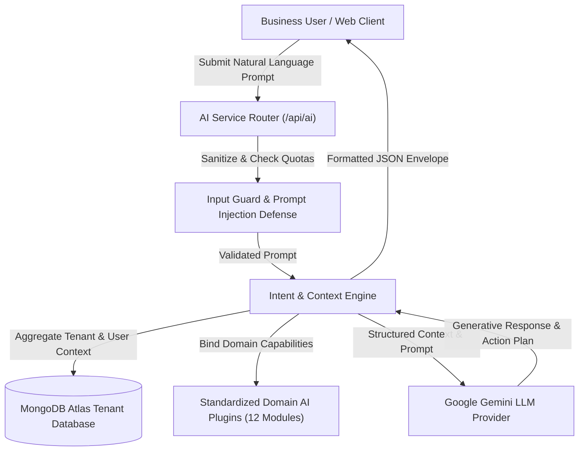
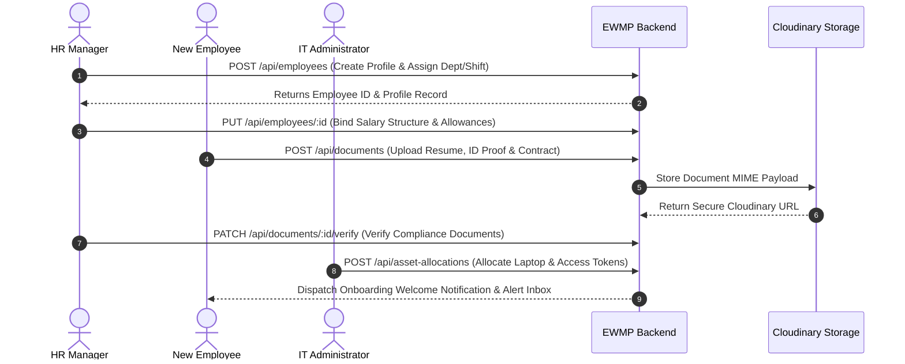
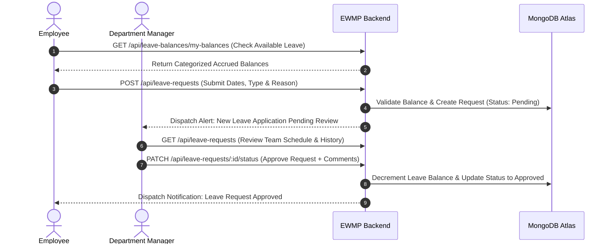
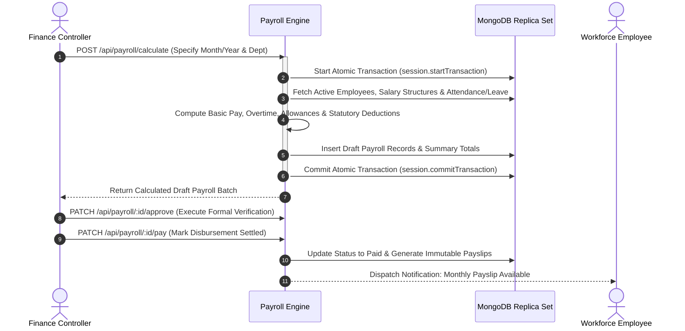
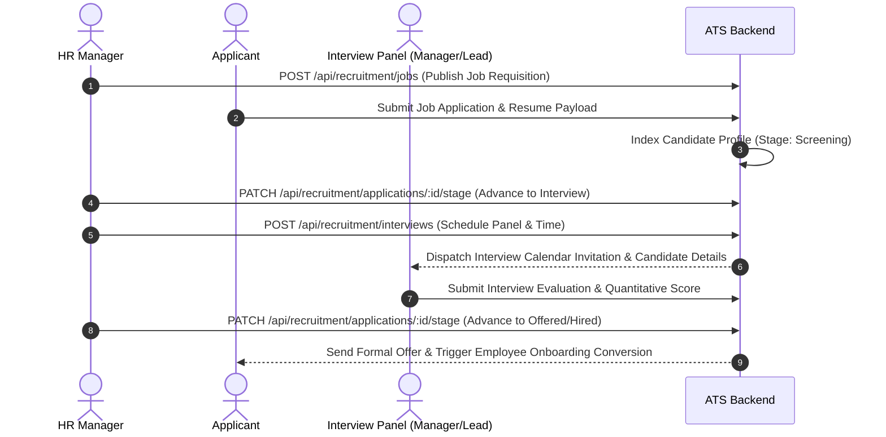
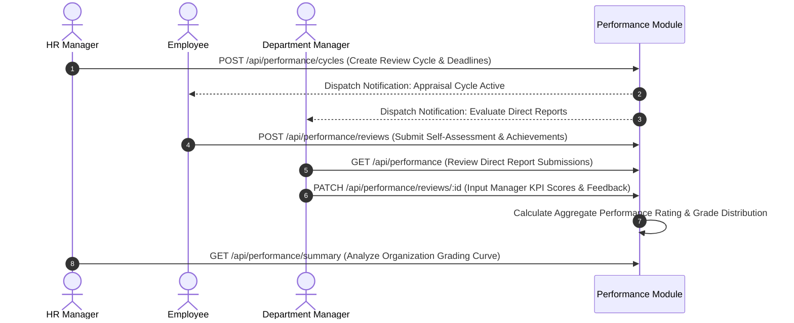
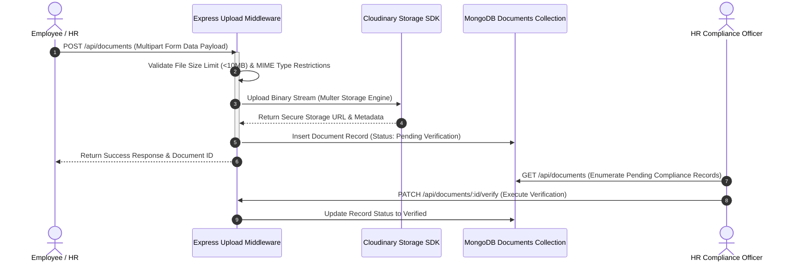
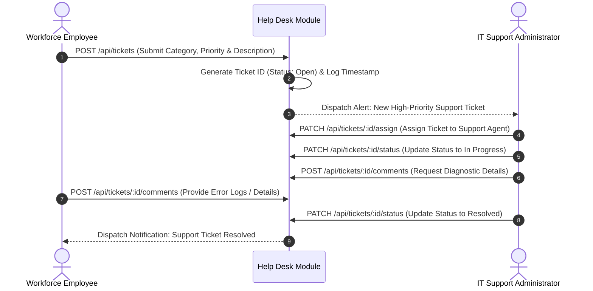

# Enterprise Workforce Management Platform (EWMP) — User Manual

## Introduction

### Purpose
The Enterprise Workforce Management Platform (EWMP) User Manual is the definitive operational guide for business users, administrative personnel, managers, and executives. This document describes the workflows, operational boundaries, and system interactions enabled by the EWMP backend infrastructure. It provides structured guidance on performing daily tasks—ranging from time and attendance tracking to atomic payroll processing, multi-stage recruitment, asset allocation, help desk ticketing, and artificial intelligence interaction—without requiring technical programming knowledge.

### System Overview
EWMP is an enterprise-grade Human Resources and Workforce Management system built on a secure, multi-tenant architecture. The platform centralizes operational workflows across the entire employee lifecycle. Business logic is executed through stateless REST API endpoints that enforce strict Role-Based Access Control (RBAC), multi-document transactional integrity for financial operations, and data isolation across organization tenants. An integrated 16-phase Artificial Intelligence subsystem powered by Google Gemini assists users through conversational querying, policy summarization, predictive analytics, and workflow planning, operating strictly under automated security guardrails.

### Supported User Roles
EWMP enforces access permissions through nine discrete functional user roles defined within the platform kernel. Each role represents a specific operational hierarchy and access tier within the enterprise.

| Role Identifier | System Display Name | Primary Operational Domain | Tenant Scope |
| :--- | :--- | :--- | :--- |
| `SUPER_ADMIN` | Super Administrator | Global System Governance & Tenant Management | Cross-Tenant (Global) |
| `ORG_ADMIN` | Organization Administrator | Tenant Structural Configuration & Account Administration | Single Tenant |
| `HR_MANAGER` | Human Resources Manager | Workforce Onboarding, Leave Governance, Recruitment & Performance | Single Tenant |
| `FINANCE` | Finance & Payroll Controller | Compensation Calculation, Tax Computation & Payroll Disbursement | Single Tenant |
| `MANAGER` | Department Manager | Team Attendance Review, Leave Approval & Operational Projects | Department / Assigned Teams |
| `TEAM_LEAD` | Project Team Leader | Task Assignment, Workload Execution & Technical Oversight | Assigned Project Teams |
| `EMPLOYEE` | Regular Workforce Employee | Self-Service Time Clocking, Leave Application & Help Desk Ticketing | Personal Record Scope |
| `IT_ADMIN` | IT Administrator | Asset Inventory Allocation, Support Ticketing & System Diagnostics | Single Tenant |
| `AUDITOR` | Compliance Auditor | Read-Only Compliance Tracking, Historical Auditing & Report Inspection | Single Tenant |

### Role Responsibilities
Every user interaction within EWMP is authenticated via cryptographically signed JSON Web Tokens (JWT) and validated against the Role-Based Access Control matrix. The specific responsibilities assigned to each target user role include:

* **Employee**: Responsible for daily attendance clock-in and clock-out, submitting leave applications, uploading personal compliance documents (such as identity proofs and certifications), updating task progression statuses, viewing payslips, and submitting help desk support inquiries.
* **Manager**: Responsible for monitoring department attendance records, processing and approving employee leave applications, reviewing attendance regularization requests, conducting employee performance evaluations, and overseeing project deliverables and task deadlines.
* **Human Resources (HR)**: Responsible for end-to-end employee lifecycle management including profile creation, onboarding, department and shift assignment, recruitment pipeline management, company-wide performance review cycle initiation, corporate document verification, and broadcasting company announcements.
* **Finance**: Responsible for configuring salary structures, executing monthly payroll calculations within atomic database transactions, reviewing and approving draft payroll runs, marking net disbursements as paid, generating official payslip documents, and analyzing statutory payroll tax summaries.
* **IT Administrator**: Responsible for cataloging corporate physical and digital assets, allocating equipment to employees, managing inventory condition states, assigning and resolving help desk support tickets, and monitoring system and AI diagnostic readiness.
* **Organization Administrator**: Responsible for configuring core organization parameters, defining department hierarchies, managing office location branches, setting up daily work shifts, establishing annual holiday calendars, and managing user account lockouts and active statuses.
* **Super Administrator**: Responsible for enterprise-wide multi-tenant provisioning, cross-tenant global monitoring, system-wide rate limit and security parameter oversight, and high-level infrastructure governance.

---

## Getting Started

### Login
Accessing EWMP requires valid user credentials established during onboarding. To log into the platform, users submit their registered business email address and password through the authentication portal. The platform verifies credentials against secure bcrypt hash algorithms and evaluates account status flags (checking whether an account is inactive, locked due to excessive failed attempts, or archived).

### Authentication
EWMP utilizes a secure, stateless dual-token authentication architecture:
1. **Access Token**: Upon successful authentication, the system issues a short-lived JSON Web Token (access token) encoded with the user's unique identifier, assigned role, organization ID, and employee profile ID. This token must be attached as a Bearer authorization header to every operational request.
2. **Refresh Token**: To maintain continuous workflow without frequent re-authentications, a cryptographically secure, long-lived refresh token is issued via an HTTP-only, encrypted, `SameSite=Strict` browser cookie. When the access token expires, the client application exchanges the refresh token for a fresh access token seamlessly without exposing credentials.

### Password Reset
If a user forgets their login credentials, they can initiate a self-service password reset workflow:
1. The user submits a password reset request providing their registered email address.
2. The platform generates a cryptographically random, time-sensitive reset token, saves a hashed copy in the database, and dispatches a recovery link to the user via corporate SMTP email.
3. The user accesses the unique recovery link and submits a new password along with the token. The system verifies token expiration, updates the password hash, and clears any existing login lockouts.

### Change Password
Authenticated users can update their account password proactively to maintain account security:
1. The user navigates to their account security settings and initiates a password change.
2. The system requires input of the current password alongside the new desired password.
3. Upon verifying the current password, the platform applies password complexity rules, generates a new bcrypt hash, updates the user record, and invalidates older sessions.

### Logout
To terminate an active session securely, users trigger the logout function. This operation invalidates the active refresh token cookie on the server, removes stored access tokens from the client browser, and terminates access to protected platform functions until re-authentication occurs.

---

## Dashboard Overview

The EWMP Dashboard serves as the central operational cockpit for users upon logging into the platform. Conceptually, the dashboard aggregates real-time metrics, actionable tasks, and system alerts tailored specifically to the authenticated user's role and organizational scope. Rather than presenting static information, the dashboard interfaces with dynamic analytics endpoints to provide immediate visibility into workforce operations.

Key conceptual components of the EWMP Dashboard include:
* **Executive Summary Metrics**: High-level statistical indicators showing active employee headcount, department attendance averages, daily present versus absent ratios, and total pending administrative approvals.
* **Personal Operational Widget**: For employees, this area displays current clock-in status, today's recorded working hours, remaining leave balances across categories (Annual, Sick, Casual), and immediate upcoming task deadlines.
* **Management Action Queue**: For Managers, HR, and Finance officers, this section consolidates pending workflow items requiring immediate intervention—such as submitted leave applications awaiting review, attendance regularization requests, open help desk tickets, or draft payroll runs awaiting approval.
* **System Broadcasts & Announcements**: A prioritized feed displaying company-wide bulletins, departmental notices, holiday calendar reminders, and system notifications dispatched by HR or administrators.
* **AI Insights Feed**: An interactive summary area showcasing proactive recommendations and workforce anomalies generated by the integrated AI engine, such as attendance irregularity patterns or departmental project velocity trends.

---

## Employee Functions

### View Profile
Employees can access their professional employee profile at any time. The profile aggregates demographic details, organizational placement, and compensation structures stored in the backend repository.
* **Demographics & Contact Information**: View full legal name, personal and professional email addresses, contact telephone numbers, emergency contact details, and residential address.
* **Employment Details**: Review assigned alphanumeric Employee ID, joining date, current department, functional designation, assigned work location branch, and daily shift timing.
* **Career Timeline**: Inspect historical lifecycle transitions, including promotion records, department transfers, designation upgrades, and compensation revisions.
* **Profile Photo**: Upload or update a professional profile picture, which is validated for MIME file type and stored securely in cloud infrastructure.

### Attendance
The attendance module allows employees to record working hours and manage attendance irregularities:
* **Daily Clock-In and Clock-Out**: Employees record their daily arrival and departure times. The backend captures timestamps, evaluates punctuality against assigned shift grace periods, and calculates total worked hours and overtime hours automatically.
* **Attendance History**: View paginated historical logs of daily attendance records, filtering by date ranges or attendance statuses (Present, Absent, Half Day, Late).
* **Attendance Regularization**: If an employee misses a biometric clock-in or experiences a technical anomaly, they can submit an official regularization request specifying the date, corrected check-in/check-out timestamps, and a detailed justification for manager review.

### Leave
The leave management subsystem enables self-service time-off tracking and application:
* **Check Leave Balances**: View real-time accrued leave balances categorized by leave type (e.g., Annual Leave, Sick Leave, Casual Leave, Maternity/Paternity Leave). The backend enforces annual balance limits and deducts approved days automatically.
* **Submit Leave Request**: Initiate a leave application by selecting the leave type, start date, end date, and providing an explanation. The system calculates the total working days required (excluding weekends and official company holidays) and verifies that sufficient balance exists before accepting the application.
* **Track Request Status**: Monitor the lifecycle progression of submitted leave requests (Pending, Approved, Rejected, or Cancelled) and view feedback comments submitted by reviewing managers or HR officers.

### Documents
Employees maintain a personal digital document repository for compliance and professional certification:
* **Document Upload**: Upload necessary corporate documentation such as Resumes, Identity Proofs, Educational Certificates, Signed Contracts, and Tax Forms. The backend validates file integrity, restricting uploads to approved MIME formats (PDF, DOCX, JPEG, PNG) within strict file size quotas.
* **Repository Access**: Enumerate and view personal uploaded documents, track verification statuses marked by HR compliance officers, and update outdated document records.

### Notifications
The notifications hub keeps employees informed of critical workflow events:
* **Alert Inbox**: Receive automated real-time notifications regarding leave request approvals or rejections, payroll payslip generation, asset allocation assignments, help desk ticket updates, and task deadlines.
* **Status Management**: Mark individual notifications as read or execute a bulk update to mark all unread alerts as read.

### Projects
Employees participating in project deliverables can view their assigned enterprise projects:
* **Project Overview**: Access project summaries, client allocation details, target completion timelines, and overall project status (Planned, Active, On Hold, Completed).
* **Team Roster**: View assigned project managers, team leaders, and peer team members collaborating on the project.

### Tasks
The task management workflow allows employees to manage daily operational assignments:
* **Task Board**: View assigned tasks categorized by priority (Low, Medium, High, Urgent) and associated parent projects.
* **Status Progression**: Update task lifecycle states across standard Kanban workflows—moving deliverables from *To Do* to *In Progress*, *Review*, and *Completed*.
* **Hours Logging**: Log actual hours expended on specific tasks to support project budget tracking and productivity reporting.

### AI Assistant
Employees can interact with the integrated AI Assistant to query personal data and simplify administrative work:
* **Conversational Querying**: Ask natural language questions regarding personal employment data, such as *"What is my remaining Sick Leave balance?"* or *"Show my attendance record for last week."* The AI safely queries user-scoped database records without exposing system-wide information.
* **Policy Summarization**: Request concise summaries of lengthy corporate policy documents or employee handbook guidelines stored in the platform.

---

## Manager Functions

### Approve Leave
Managers exercise supervisory oversight over department and team leave applications:
* **Pending Queue Review**: Access a centralized dashboard queue of all pending leave applications submitted by direct reports or departmental employees.
* **Workflow Evaluation**: Review application details, including requested dates, duration, employee leave history, and overlapping team leave schedules to evaluate operational coverage.
* **Decision Execution**: Approve or reject leave applications. Managers can attach formal feedback comments explaining rejection reasons. Upon approval, the backend automatically decrements the employee's leave balance and dispatches an immediate notification.

### Review Attendance
Managers monitor departmental attendance patterns and resolve time-clock discrepancies:
* **Attendance Oversight**: Enumerate daily attendance records across assigned departments, tracking employee arrival times, overtime accumulation, and unexplained absences.
* **Regularization Processing**: Review attendance regularization requests submitted by team members who missed standard clock-in workflows. Managers evaluate the justification, cross-reference project activity logs, and approve or reject the correction. Approved regularizations update the official attendance record and adjust payable hours accordingly.

### Performance Reviews
Managers lead operational performance evaluations during scheduled appraisal cycles:
* **Appraisal Dashboard**: View active performance review cycles initiated by HR and enumerate direct reports requiring evaluation.
* **KPI Evaluation**: Assess employee performance against structured Key Performance Indicators (KPIs). Managers input quantitative rating scores (e.g., on a 1-to-5 scale) and qualitative evaluation feedback.
* **Review Submission**: Submit formal managerial reviews to the HR department, completing the appraisal workflow for the evaluation period.

### Projects
Managers oversee project creation, resource allocation, and timeline governance:
* **Project Planning**: Create new enterprise projects, specifying project titles, client names, operating budgets, start dates, and target deadlines.
* **Resource Assignment**: Assign Project Managers, Team Leaders, and individual Employee team members to specific project rosters.
* **Lifecycle Governance**: Advance project lifecycle statuses from initial planning through active execution, suspension, or final completion.

### Tasks
Managers break down project deliverables into actionable operational tasks:
* **Task Creation**: Generate detailed tasks under parent projects, defining specifications, estimated hour budgets, and strict delivery deadlines.
* **Workload Distribution**: Assign tasks to specific team members and set priority severity levels to guide employee daily workflows.
* **Progress Monitoring**: Monitor task completion velocity across the team, reviewing items submitted for evaluation before marking them as officially completed.

### Reports
Managers have access to analytical reporting endpoints scoped to their operational departments:
* **Attendance & Punctuality Reports**: Generate departmental summaries analyzing average check-in times, late arrival frequencies, and overall attendance compliance rates.
* **Leave Utilization Analytics**: View aggregated reports detailing department leave utilization, identifying seasonal absenteeism trends and leave balance exhaustion.
* **Task Productivity Metrics**: Evaluate project completion rates, task hour variance (estimated versus actual hours logged), and individual team member productivity distributions.

### AI Recommendations
Managers can leverage the AI Assistant to gain proactive managerial insights:
* **Retention & Workload Recommendations**: Request AI analysis of team workload distribution and overtime accumulation to receive recommendations on preventing employee burnout or mitigating turnover risks.
* **Performance Insights**: Synthesize team performance review scores and task completion velocity to identify high-performing employees deserving recognition or team members requiring additional training allocation.

---

## HR Functions

### Employee Management
Human Resources officers serve as the primary administrators of workforce records:
* **Onboarding & Creation**: Create new employee records, inputting personal demographics, corporate email credentials, initial department assignment, job designation, work shift, and branch location.
* **Profile Maintenance**: Update employee records to reflect career progression, salary structure binding, supervisor reassignment, or contact information changes.
* **Lifecycle State Transitions**: Manage employment status changes (such as Probation, Permanent, Notice Period, or Terminated).
* **Profile Archiving**: Soft-delete and archive departing employees upon exit completion, preserving historical attendance, payroll, and compliance records for statutory auditing while revoking platform login access.

### Recruitment
HR manages the enterprise talent acquisition pipeline through the Applicant Tracking System (ATS):
* **Job Requisition Management**: Create and publish job postings specifying required qualifications, department placement, headcount requirements, and hiring budgets.
* **Applicant Tracking**: Add candidate profiles to open requisitions and track applicants across sequential hiring stages: *Screening*, *Interview*, *Offered*, *Hired*, or *Rejected*.
* **Interview Scheduling**: Schedule candidate interviews, assigning internal interview panel members (Managers and Team Leaders), defining interview formats (technical, HR, culture fit), and logging evaluation dates.
* **Hiring Conversion**: Upon candidate acceptance of an offer, convert applicant records directly into onboarding employee profiles.

### Performance
HR governs the enterprise performance appraisal framework:
* **Cycle Initialization**: Create organization-wide performance review cycles (e.g., *Annual Appraisal 2026* or *Q3 Technical Review*), defining evaluation timeframes and submission deadlines.
* **Appraisal Oversight**: Track organization-wide completion rates for self-assessments and managerial evaluations, sending automated reminders to delinquent evaluators.
* **Distribution Summary Analysis**: Generate and review organization-wide performance distribution summaries, analyzing grading curves, departmental averages, and compensation adjustment eligibility.

### Documents
HR maintains corporate compliance by governing the document management repository:
* **Compliance Verification**: Review documents uploaded by employees (such as academic credentials, government identification, and signed NDAs). HR officers inspect document accuracy and mark records as officially *Verified* or *Rejected*.
* **Policy Repository Administration**: Upload and categorize corporate policy documents, employee handbooks, and standard operating procedures for organization-wide access.

### Organization Management
HR assists in structuring the operational hierarchy of the organization:
* **Department Governance**: Create, rename, and manage organizational departments (e.g., Engineering, Human Resources, Finance, Sales), assigning Department Heads to oversee operations.
* **Designation Hierarchy**: Define job designations and professional titles, mapping reporting hierarchies and seniority levels across the platform.

### Notifications
HR acts as the primary broadcaster of corporate communications:
* **Announcement Bulletins**: Create and broadcast organization-wide or department-specific announcements. These bulletins appear immediately on employee dashboards and trigger alert notifications across the workforce.

---

## Finance Functions

### Payroll
The Finance department controls the enterprise compensation and payroll calculation engine:
* **Batch Payroll Calculation**: Initiate monthly batch payroll processing for target departments or the entire organization. The backend calculation engine executes a complex automated workflow:
  1. Retrieves active employee compensation structures (Basic Pay, House Rent Allowance, Special Allowances).
  2. Cross-references attendance records, unpaid absences, and leave utilization for the pay period.
  3. Computes statutory deductions (such as tax withholding, provident fund contributions, and health insurance withholding) and overtime additions.
  4. Generates transactional payroll records reflecting basic pay, total allowances, gross salary, total deductions, and net payable salary.
* **Transactional Integrity**: Payroll calculations execute within atomic MongoDB database transactions. If any individual calculation fails or encounters invalid data, the entire batch rolls back automatically, preventing partial or corrupt financial entries.

### Payslips
Finance oversees the generation and distribution of employee salary slips:
* **Payslip Generation**: Generate formal, immutable payslip document records for processed payroll runs.
* **Distribution & Archiving**: Publish payslips to employee self-service portals, allowing staff to download formatted salary statements while maintaining historical financial archives for audit compliance.

### Approval
To enforce segregation of duties, payroll runs must undergo formal verification before disbursement:
* **Draft Review**: Finance controllers review draft payroll batches, inspecting individual employee earnings, deduction anomalies, and overall department expenditure totals.
* **Formal Approval Execution**: Execute formal approval on verified payroll runs. Approving a payroll run locks the calculation records against further modification and transitions the status to *Approved*, readying the batch for treasury disbursement.

### Payment Tracking
Finance tracks the final settlement of approved payroll batches:
* **Disbursement Marking**: Following bank transfer or treasury execution, finance officers mark approved payroll records as officially *Paid*.
* **Payment Reference Logging**: Record transaction reference codes, payment disbursement dates, and disbursement methods (Bank Transfer, Check, Electronic Funds Transfer) to close the financial accounting cycle.

### Reports
Finance officers access specialized financial analytics and statutory reporting tools:
* **Monthly Expenditure Breakdowns**: Generate comprehensive reports detailing total organizational payroll costs, basic salary disbursements, overtime expenses, and allowance totals across departments.
* **Statutory Deduction Summaries**: Export tax withholding, provident fund, and statutory compliance deduction summaries required for government regulatory filing and accounting audits.
* **Department Cost Center Analysis**: Compare payroll expenditures across different business units and office locations to support corporate budget planning.

---

## IT Administrator Functions

### Asset Management
IT Administrators maintain governance over corporate physical and digital equipment:
* **Asset Catalog Maintenance**: Catalog hardware (laptops, monitors, mobile devices, servers) and software licenses. Record asset tags, serial numbers, make/model specifications, purchase dates, warranty expiration timestamps, and initial purchase values.
* **Inventory Categorization**: Categorize assets by type and track real-time physical condition states (*New*, *Good*, *Fair*, *Poor*, *Maintenance Required*, or *Retired*).
* **Asset Allocation & Assignment**: Allocate available assets to specific employees upon onboarding or hardware request. The backend logs assignment dates, asset allocation conditions, and employee responsibility acceptances.
* **Return & Recovery Tracking**: Process asset returns when employees depart or upgrade equipment. IT Administrators inspect returned items, log return timestamps, update physical condition states, and return assets to available inventory pool.

### Help Desk
IT Administrators manage the internal technical support ticketing system:
* **Ticket Triage & Review**: Monitor the centralized help desk queue for support tickets submitted by employees regarding technical failures, hardware requests, or software access issues.
* **Agent Assignment**: Assign open tickets to specific IT support personnel or specialized technical groups, establishing accountability for resolution.
* **Resolution Workflow**: Track ticket lifecycle progress across standard support states (*Open*, *In Progress*, *Waiting on Customer*, *Resolved*, *Closed*).
* **Communication Threads**: Communicate with affected employees through internal ticket comment threads, requesting diagnostic details or providing troubleshooting steps until formal resolution is confirmed.

### System Monitoring
IT Administrators oversee the technical operational readiness of the platform infrastructure:
* **AI Subsystem Diagnostics**: Execute diagnostic health checks against the integrated Artificial Intelligence subsystem (`GET /api/ai/health`). Verify network connectivity with Google Gemini LLM provider endpoints, measure API response latency, and confirm active registration of domain AI plugins.
* **Security & Error Auditing**: Monitor platform error rate limiters, inspect security logs, and review system audit trails to identify potential unauthorized access attempts or infrastructure performance degradation.

---

## Organization Administrator

### Organization Settings
Organization Administrators govern the tenant-level structural configuration of the platform:
* **Profile & Branding Configuration**: Configure legal organization name, corporate registration numbers, tax identification codes, contact email addresses, official telephone numbers, and corporate website URLs.
* **System Policy Settings**: Establish global tenant parameters, such as default currency codes, standard work hours per day, fiscal year start/end dates, and multi-factor authentication requirements.

### Departments
* **Hierarchy Structure**: Establish and maintain the organizational department tree. Define department names, assign unique operational codes, allocate departmental operating budgets, and designate primary Department Head managers.

### Locations
* **Branch Administration**: Add and manage corporate office branch locations, regional headquarters, and remote work sites. Configure physical branch addresses, city/state/country metadata, timezone parameters, and geographic coordinates (latitude and longitude) used for geofenced biometric attendance validation.

### Shifts
* **Work Shift Definition**: Configure standardized working shifts for the organization. Set shift labels (e.g., *General Shift*, *Morning Shift*, *Night Shift*), define precise start and end times, specify unpaid lunch break durations, and configure attendance grace periods (e.g., allowing 15 minutes of late arrival before triggering penalty calculations).

### Holidays
* **Holiday Calendar Management**: Create and maintain annual corporate holiday calendars. Define non-working public holidays, religious observances, and company-specific closure dates. The payroll and leave engines automatically reference this calendar to exclude holiday dates from leave duration calculations and attendance deductions.

### Users
* **Account Governance**: Oversee enterprise user account status. Activate newly onboarded user credentials, manually lock suspicious accounts, unlock accounts triggered by excessive failed login attempts, and reset user authentication states when administrative intervention is required.

---

## Super Administrator

### Tenant Management
Super Administrators operate at the highest tier of platform authority, managing the multi-tenant architecture:
* **Organization Provisioning**: Provision new tenant organization boundaries within the EWMP platform. Define initial tenant global settings, allocate primary organization administrator accounts, and establish tenant database isolation parameters.
* **Tenant Lifecycle Oversight**: Monitor active tenant organizations, modify subscription tier limits, suspend inactive or non-compliant tenant domains, and execute cross-tenant data governance policies.

### Global Monitoring
Super Administrators maintain unrestricted visibility across the entire platform infrastructure:
* **Cross-Tenant Oversight**: Monitor system operations, database transaction volumes, and active user sessions across all hosted organization tenants simultaneously.
* **Global Security & Rate Limiting**: Configure global rate-limiting thresholds, inspect cross-tenant security audit logs, monitor NoSQL injection sanitization interceptors, and ensure platform-wide adherence to enterprise compliance standards.

---

## AI Assistant

### Explain
The EWMP platform integrates an advanced, 16-phase Artificial Intelligence architecture located within the server kernel and powered by Google Gemini generative models. The AI Assistant operates as a context-aware enterprise co-pilot designed to enhance workforce productivity without compromising data security or system integrity. The AI subsystem communicates with core business modules through a standardized AI Plugin Framework—enabling natural language understanding, automated data synthesis, and complex workflow planning while remaining entirely isolated from direct, autonomous database write operations.

### Chat
The conversational chat capability (`POST /api/ai/chat`) allows users to query enterprise data using natural language dialog:
* **Context-Aware Querying**: Users ask plain-language questions (e.g., *"How many employees are currently assigned to the Engineering department?"* or *"What is my attendance percentage this month?"*).
* **Dynamic Context Aggregation**: The AI Context Builder automatically retrieves relevant, tenant-scoped database records based on the user's authenticated RBAC role, injecting accurate ground-truth data into the LLM prompt window.
* **Conversational Memory**: The AI Memory Manager tracks short-term dialogue history and long-term conversation summaries (`GET /api/ai/history`), enabling multi-turn follow-up queries without losing conversational context.

### Summarization
The AI summarization engine (`POST /api/ai/summarize`) synthesizes voluminous text into concise, actionable executive briefings:
* **Policy & Document Summarization**: Condense lengthy corporate policy documents, compliance manuals, or legal contracts into clear bulleted summaries highlighting key employee obligations and operational guidelines.
* **Appraisal & Report Synthesis**: Summarize extensive employee performance review feedback, multi-page help desk ticket communication threads, or project milestone reports for rapid managerial review.

### Recommendations
The recommendation engine (`POST /api/ai/recommendations`) analyzes operational data to deliver proactive managerial advice:
* **Workload & Burnout Prevention**: Evaluates employee overtime accumulation, leave utilization deficiency, and task completion velocity to recommend mandatory time-off or task redistribution for at-risk employees.
* **Talent Development & Compensation**: Synthesizes performance appraisal scores and historical project delivery rates to suggest training program allocations, merit-based salary adjustments, or promotion candidates.

### Insights
The analytical insight generator (`POST /api/ai/insights`) identifies deep operational trends and predictive metrics across enterprise datasets:
* **Attendance Anomaly Detection**: Identifies chronic absenteeism patterns, frequent late arrivals on specific shift days, or department-wide punctuality degradation.
* **Turnover Prediction Analysis**: Correlates leave exhaustion, stagnated compensation timelines, and performance ratings to flag potential employee turnover risks before voluntary resignation occurs.
* **Payroll Cost Trend Analysis**: Analyzes monthly payroll expenditure variance, overtime cost surges, and departmental allowance distributions to support executive financial planning.

### Workflow Planning
The AI Action Planner (`POST /api/ai/action-plan` and `POST /api/ai/workflow`) synthesizes multi-step operational roadmaps from high-level objectives:
* **Automated Plan Synthesis**: When presented with a complex objective (e.g., *"Plan an onboarding workflow for 5 new senior engineers starting next month"*), the AI identifies required sequential actions across departments—such as HR profile creation, asset allocation requests, IT helpdesk account setup, and manager project assignment.
* **Dry-Run Simulation**: Users can simulate planned workflows (`POST /api/ai/workflow/simulate`) to inspect proposed sequential execution steps, required parameters, and estimated system impacts before initiating manual execution.

### Limitations
To maintain strict enterprise security and data integrity, the EWMP AI architecture operates under enforced operational limitations:
* **No Autonomous State Mutations**: The AI Assistant is strictly prohibited from executing direct database write, update, or delete operations. It cannot automatically approve leaves, disburse payroll, modify employee salaries, or delete records. All AI-generated action plans require explicit human review and execution through standard API controllers.
* **Strict PII & Prompt Sanitization**: Incoming user prompts undergo mandatory filtering through the AI Security Layer (`inputGuard` and `promptInjectionDetector`). Malicious prompt injection attempts, NoSQL operator strings (`$where`, `$regex`), and sensitive Personally Identifiable Information (PII) are scrubbed before prompt transmission to external LLM providers.
* **External Provider & Quota Dependency**: AI capabilities depend on network connectivity to Google Gemini API endpoints and are subject to organizational token quotas and rate limits. If external provider latency spikes or quotas are exhausted, the AI module degrades gracefully without disrupting core platform CRUD operations.
* **Dry-Run Non-Persistence**: Workflow simulations executed via `/api/ai/workflow/simulate` operate entirely within ephemeral memory sandbox environments and never commit changes to MongoDB replica sets.

---

## Notifications

The EWMP Notifications module (`/api/notifications` and `/api/announcements`) operates as an event-driven messaging hub, delivering real-time alerts and organizational broadcasts across the enterprise.

### Attendance
* **Regularization Alerts**: Managers receive immediate notification when a direct report submits an attendance regularization request. Employees are alerted instantly upon managerial approval or rejection of their attendance correction.
* **Anomalous Clock-In Warnings**: Automated alerts trigger when biometric or manual clock-ins occur significantly outside assigned shift boundaries or designated geofenced branch coordinates.

### Leave
* **Application Submission Alerts**: When an employee submits a leave application, the system alerts their assigned department manager and HR controllers to review the pending request.
* **Decision Notifications**: Employees receive real-time notifications detailing leave application approvals or rejections, including any feedback comments appended by the reviewing manager.

### Payroll
* **Payslip Availability Notice**: Upon Finance approving and marking a monthly payroll batch as paid, automated notifications are dispatched to all affected employees confirming that official payslips are available for view and download.
* **Payroll Run Approval Alerts**: Finance controllers receive workflow alerts when draft payroll batches finish calculation and await formal approval verification.

### Tasks
* **Task Assignment Notices**: Employees receive immediate notification when a Manager or Team Leader assigns a new operational task to their workload board.
* **Deadline & Status Reminders**: Automated alerts remind employees of approaching task deadlines, while project leaders receive notifications when tasks advance to *Review* or *Completed* status.

### Announcements
* **Corporate Bulletins**: HR officers and Organization Administrators can broadcast general announcements (`POST /api/announcements`) to the entire organization or specific target departments. These bulletins appear prominently on user dashboards and trigger priority system alerts regarding company events, policy updates, or emergency facility notices.

---

## Common Workflows

### Employee Onboarding
The onboarding workflow incorporates HR administration, compensation structuring, compliance verification, and IT asset allocation to integrate new personnel into the enterprise.

**Step-by-Step Execution**:
1. **Profile Creation**: HR navigates to Employee Management and creates a new profile, inputting legal demographic details, professional email, initial department, designation, and work shift timing.
2. **Compensation Binding**: HR or Finance binds the employee's basic salary structure, house rent allowance, and statutory deduction parameters to the newly created profile.
3. **Document Submission**: The newly onboarded employee logs in and uploads mandatory compliance documentation (government ID proof, academic transcripts, signed employment contract).
4. **Compliance Verification**: HR inspects the uploaded digital documents in the repository and marks each file as officially *Verified*.
5. **Asset Allocation**: The IT Administrator allocates required equipment (laptop, monitor, security badges) from the asset catalog, linking serial numbers to the employee's profile.
6. **Workflow Completion**: The system activates the employee's dashboard, dispatches a welcome notification, and initializes daily attendance tracking.

---

### Leave Request
The leave request workflow balances employee self-service convenience with managerial operational oversight.

**Step-by-Step Execution**:
1. **Balance Verification**: The employee checks their active leave balances on the dashboard to ensure sufficient accrued days are available.
2. **Application Submission**: The employee submits a leave request specifying the leave category, start date, end date, and descriptive justification.
3. **Automated Validation**: The backend validates that requested dates do not conflict with existing approved leaves and fall on standard working days (excluding holidays), saving the request in *Pending* status.
4. **Managerial Alert**: The system automatically dispatches an alert notification to the employee's assigned department manager.
5. **Supervisory Review**: The manager opens the pending leave queue, evaluates departmental project workloads and overlapping team leave schedules, and approves the request.
6. **Balance Deduction**: Upon approval, the backend atomically deducts the working days from the employee's leave balance and notifies the employee of the final decision.

---

### Payroll Processing
The payroll workflow executes high-precision financial calculations across multi-document MongoDB transactions, ensuring ACID compliance and audit traceability.

**Step-by-Step Execution**:
1. **Batch Initialization**: The Finance controller initiates the monthly payroll calculation run for a specific target month and year (`POST /api/payroll/calculate`).
2. **Atomic Data Aggregation**: Within an atomic MongoDB transaction, the payroll engine pulls active employee profiles, mapped salary structures, verified attendance hours, overtime logs, and unpaid leave deductions.
3. **Statutory Computation**: The engine calculates gross earnings, subtracts tax withholding and statutory provident fund deductions, and computes net payable salary for each employee.
4. **Draft Review**: If all calculations succeed, the transaction commits and presents a draft payroll batch. Finance reviews department expenditure summaries and individual pay slips.
5. **Formal Approval**: Finance executes formal approval (`PATCH /api/payroll/:id/approve`), locking the calculated amounts against further alteration.
6. **Disbursement Settlement**: Once bank funds transfer is complete, Finance marks the batch as paid (`PATCH /api/payroll/:id/pay`). The system generates official payslip records and notifies employees.

---

### Recruitment
The recruitment workflow manages talent acquisition from initial job posting through candidate evaluation and hiring conversion.

**Step-by-Step Execution**:
1. **Requisition Publishing**: HR creates and publishes an open job requisition specifying title, department, skills required, and headcount budget.
2. **Applicant Indexing**: Applications and resumes are logged into the ATS repository under initial *Screening* status.
3. **Stage Advancement**: HR screens candidate qualifications and advances qualified applicants to the *Interview* stage (`PATCH /api/recruitment/applications/:id/stage`).
4. **Interview Scheduling**: HR schedules an interview session (`POST /api/recruitment/interviews`), assigning department managers and team leaders to the evaluation panel.
5. **Panel Evaluation**: Interviewers conduct the session and submit quantitative ratings and qualitative evaluation feedback to the candidate record.
6. **Hiring Conversion**: HR extends an employment offer. Upon candidate acceptance, the status is updated to *Hired*, enabling direct conversion of applicant data into a new employee profile.

---

### Performance Review
The performance review workflow structures employee appraisals through standardized KPI evaluations and supervisory feedback.

**Step-by-Step Execution**:
1. **Cycle Creation**: HR establishes a formal performance appraisal cycle (`POST /api/performance/cycles`), setting review start/end dates and assigning target departments.
2. **Self-Assessment Submission**: Employees access their appraisal portal, review assigned Key Performance Indicators (KPIs), and submit self-assessment scores and achievement notes.
3. **Managerial Evaluation**: Department managers review self-assessments submitted by their direct reports, input supervisory KPI rating scores, and record formal evaluative commentary.
4. **Rating Aggregation**: The backend computes weighted final appraisal scores and categorizes performance gradings.
5. **Executive Review**: HR and Organization Administrators access performance distribution summaries (`GET /api/performance/summary`) to analyze company-wide bell curves and guide merit compensation decisions.

---

### Document Upload
The document upload workflow ensures secure transmission, MIME validation, cloud storage, and HR compliance auditing of enterprise files.

**Step-by-Step Execution**:
1. **File Transmission**: An employee or HR officer selects a file (e.g., identity proof, contract, policy PDF) and submits a multipart upload request (`POST /api/documents`).
2. **MIME & Size Validation**: Backend middleware intercepts the payload, verifying that the file extension and MIME type match approved formats (PDF, DOCX, JPEG, PNG) and adhere to file size limits (<10MB).
3. **Cloud Storage Execution**: Validated files are streamed securely to cloud infrastructure via Cloudinary SDK, which returns a secure, encrypted file destination URL.
4. **Database Indexing**: The backend creates a metadata record in MongoDB storing the document title, category, owner ID, cloud URL, and sets verification status to *Pending*.
5. **Compliance Auditing**: HR compliance officers review the uploaded document in the repository and execute formal verification (`PATCH /api/documents/:id/verify`), marking the file as compliance-verified.

---

### Help Desk Ticket
The help desk workflow streamlines internal technical support and facility inquiry resolution across structured ticket lifecycles.

**Step-by-Step Execution**:
1. **Ticket Creation**: An employee encountering a technical failure or requiring administrative assistance submits a support ticket (`POST /api/tickets`), specifying the problem category (IT, HR, Facility), priority severity (Low, Medium, High, Urgent), and detailed problem description.
2. **Alert Dispatch**: The system assigns a unique tracking number, sets status to *Open*, and notifies the IT Administrator or relevant department support queue.
3. **Agent Assignment**: An IT Administrator reviews the ticket queue and assigns the ticket to a specialized support agent (`PATCH /api/tickets/:id/assign`), advancing status to *In Progress*.
4. **Collaborative Troubleshooting**: The support agent and employee communicate through internal ticket comment threads (`POST /api/tickets/:id/comments`) to exchange diagnostic steps and system error details.
5. **Ticket Resolution**: Upon resolving the technical issue, the support agent updates ticket status to *Resolved* (`PATCH /api/tickets/:id/status`), notifying the employee of issue completion.

---

## Frequently Asked Questions

#### Q1: How do I access EWMP if my account is locked due to excessive failed login attempts?
**Answer**: For security compliance, EWMP automatically locks user accounts after multiple consecutive failed authentication attempts. Normal regular employees and managers cannot self-unlock an account. You must contact your Organization Administrator or HR Manager, who can access user account settings (`PUT /api/employees/:id/status`) to manually unlock your credentials and restore login access.

#### Q2: What happens if I forget to clock out at the end of my working shift?
**Answer**: If a biometric or manual clock-out is missed, the attendance engine records an incomplete punch sequence for that date, which may result in an automated absence marking or zero calculated working hours. To correct this, navigate to the Attendance module and submit an Attendance Regularization request (`POST /api/attendance/regularize`), specifying your actual departure timestamp and explaining the omission. Your manager must approve the request to correct your payable hours.

#### Q3: Why is my submitted leave application marked as "Rejected" or unable to be processed?
**Answer**: Leave requests can be rejected for three primary reasons:
1. **Insufficient Balance**: You attempted to apply for more working days than your currently accrued balance allows in that leave category.
2. **Schedule Overlap**: The requested dates overlap with an already approved leave period on your calendar.
3. **Managerial Discretion**: Your department manager rejected the application due to departmental workload coverage or project delivery deadlines. Check the comment history on your leave request for specific supervisory feedback.

#### Q4: Can the AI Assistant automatically approve my leave or modify my salary structure?
**Answer**: No. The integrated EWMP AI Assistant operates strictly under read-only and analytical guardrails. While it can draft recommendation summaries, analyze attendance trends, and formulate multi-step action plans, it is architecturally prohibited from executing autonomous state mutations or database write operations. All operational changes—such as leave approvals, salary binding, or payroll disbursement—must be explicitly executed by authorized human managers and finance officers via REST API controllers.

#### Q5: Once a monthly payroll run is marked as "Approved" or "Paid", can Finance edit an employee's calculated salary?
**Answer**: No. To maintain strict financial auditing standards and ACID compliance, once a payroll run transitions to *Approved* or *Paid* status, the database records are immutably locked against modification. If a calculation error occurred, an Organization Administrator or Super Administrator must intervene through formal administrative rollback procedures, or Finance must apply a manual financial adjustment in the subsequent month's payroll calculation cycle.

#### Q6: Why are my uploaded document files failing to save in the document repository?
**Answer**: Document uploads fail if they violate strict security validation rules enforced by the backend upload middleware:
* **File Size Exceeded**: The file exceeds the maximum allowable limit of 10MB per upload.
* **Invalid MIME Type**: The file format is not permitted. Ensure your document is saved as a standard PDF (`application/pdf`), Microsoft Word document (`application/vnd.openxmlformats-officedocument.wordprocessingml.document`), or standard image format (`image/jpeg`, `image/png`).
* **Network Interruption**: The multipart stream to cloud infrastructure was interrupted before completion. Retry the upload over a stable connection.

#### Q7: Can a Department Manager view payroll calculation details or payslips for employees outside their direct department?
**Answer**: No. EWMP enforces strict Role-Based Access Control (RBAC) and tenant query scoping. Department Managers can only view operational attendance, leave requests, and performance evaluations for employees assigned to their specific department hierarchies. Detailed financial payroll records, salary structures, and payslips are strictly restricted to authenticated users holding the `FINANCE`, `ORG_ADMIN`, `SUPER_ADMIN`, or `AUDITOR` roles, or to individual employees viewing their own personal payslips.

---

## Troubleshooting

### Login Issues
| Symptom / Error Message | Root Cause Analysis | Actionable Resolution Workflow |
| :--- | :--- | :--- |
| **"Invalid email or password"** | The submitted email address does not exist in the database, or the bcrypt password hash evaluation failed. | Verify spelling of the registered corporate email address. Ensure CAPS LOCK is disabled. If password is lost, initiate the self-service Forgot Password workflow (`/api/auth/forgot-password`). |
| **"Account is locked due to multiple failed login attempts"** | Security middleware triggered an account lockout after exceeding consecutive failed authentication thresholds. | Do not attempt further immediate logins. Contact your Organization Administrator or HR Manager to request a manual account unlock via user management endpoints. |
| **"Account has been deactivated or archived"** | The user profile's `isActive` flag is set to false, or the employee record has undergone soft-delete archiving. | Contact HR or Organization Administration. Archived departing employees lose platform login rights permanently upon employment termination. |

### Permission Errors
| Symptom / Error Message | Root Cause Analysis | Actionable Resolution Workflow |
| :--- | :--- | :--- |
| **"401 Unauthorized: Access token missing or invalid"** | The HTTP request lacked a valid Bearer JWT header, or the provided token has expired or suffered cryptographic corruption. | Log out and re-authenticate via `/api/auth/login` to secure a fresh access token and rotating refresh token cookie. Ensure client applications attach headers correctly. |
| **"403 Forbidden: Insufficient permissions to access resource"** | The authenticated user's assigned role (e.g., `EMPLOYEE`) attempted to access an endpoint restricted to higher authorization tiers (e.g., `FINANCE` or `HR_MANAGER`). | Verify your assigned role in your user profile (`GET /api/auth/me`). If elevated access is legitimately required for your job responsibilities, request a role upgrade from your Organization Administrator. |
| **"404 Not Found: Resource belongs to another organization tenant"** | The requested resource ID exists in the database but is scoped to a different multi-tenant organization ID than the authenticated user. | Tenant data isolation prevents cross-organization access. Ensure you are referencing resource IDs belonging strictly to your assigned organization tenant. |

### Attendance Issues
| Symptom / Error Message | Root Cause Analysis | Actionable Resolution Workflow |
| :--- | :--- | :--- |
| **"Clock-in rejected: Outside shift grace period"** | The clock-in timestamp exceeded the allowable late arrival grace period defined in the assigned work shift parameters. | Record the actual check-in timestamp and immediately submit an Attendance Regularization request (`POST /api/attendance/regularize`) explaining the transportation or technical delay for manager review. |
| **"Biometric punch not reflecting on dashboard"** | Network synchronization latency between physical biometric hardware terminals and backend attendance ingestion endpoints. | Allow up to 15 minutes for terminal batch polling to complete. If the record remains absent, contact IT Help Desk to check terminal connectivity and submit a manual regularization request. |

### Leave Issues
| Symptom / Error Message | Root Cause Analysis | Actionable Resolution Workflow |
| :--- | :--- | :--- |
| **"422 Unprocessable Entity: Insufficient leave balance"** | The requested leave duration exceeds the accrued days available in the selected leave balance category. | Check available leave balances (`GET /api/leave-balances/my-balances`). Reduce requested dates, or select an alternative available leave category (such as Unpaid Leave or Casual Leave) if permitted by HR policy. |
| **"409 Conflict: Overlapping leave application exists"** | The requested start and end dates conflict with an existing pending or approved leave application on your schedule. | Review your leave request history (`GET /api/leave-requests/my-requests`). Cancel any duplicate or outdated pending requests before submitting a new application for those dates. |

### Payroll Issues
| Symptom / Error Message | Root Cause Analysis | Actionable Resolution Workflow |
| :--- | :--- | :--- |
| **"Payroll calculation failed: Salary structure missing"** | An active employee included in the batch calculation lacks a bound compensation structure in the database. | Finance or HR must navigate to Employee Management (`PUT /api/employees/:id`) and bind a valid basic salary structure and statutory parameters before re-running batch calculation. |
| **"Cannot approve payroll: Batch calculation in draft mismatch"** | A concurrent database update occurred to employee attendance or leave records while the draft payroll batch was being reviewed. | Discard the outdated draft payroll batch and re-initiate `POST /api/payroll/calculate` to generate a synchronized financial calculation reflecting latest attendance records. |
| **"Payslip download unreadable or missing data"** | Cloud storage retrieval error or incomplete payslip document generation during financial settlement. | Finance controllers should re-verify the paid status of the payroll run and trigger payslip regeneration if necessary (`POST /api/payslips/generate`). |

### AI Quota Issues
| Symptom / Error Message | Root Cause Analysis | Actionable Resolution Workflow |
| :--- | :--- | :--- |
| **"503 Service Unavailable: AI provider connection timed out"** | Network latency or upstream service outage connecting from backend servers to Google Gemini LLM API endpoints. | Platform core CRUD operations remain unaffected. Wait several minutes and retry the AI conversational prompt or summarization request. |
| **"429 Too Many Requests: AI organization token quota exceeded"** | The organization tenant has exhausted its allocated generative AI token consumption quota for the current billing cycle. | Contact your Super Administrator or Organization Administrator to review token utilization metrics or upgrade the tenant AI subscription tier. |
| **"AI prompt rejected: Security violation detected"** | The AI security interceptor detected potential prompt injection syntax, NoSQL operator strings (`$where`, `$regex`), or unauthorized data extraction requests. | Rephrase your natural language prompt using standard, professional terminology. Avoid pasting raw database query syntax, code fragments, or requests involving sensitive PII outside your scope. |

---

## Best Practices

To ensure operational efficiency, data security, and seamless platform navigation, all users should adhere to the following enterprise best practices:

1. **Credential & Security Hygiene**:
   * Never share your individual login credentials, access tokens, or password reset recovery links with colleagues or external parties.
   * When logging into EWMP from shared corporate workstations or public networks, always execute a formal logout (`POST /api/auth/logout`) before departing to destroy active browser session cookies.
   * Utilize strong, alphanumeric passwords incorporating symbols and upper/lower case characters, changing them proactively every 90 days via account security settings.

2. **Attendance Punctuality & Clocking Discipline**:
   * Perform daily clock-in and clock-out operations immediately upon arrival and departure to prevent discrepancy logging against assigned shift grace periods.
   * Whenever a missed punch occurs due to technical or hardware faults, submit an Attendance Regularization request within 24 hours. Prompt submission ensures managers can review and approve corrections before monthly payroll batch calculation freezes attendance records.

3. **Proactive Leave Planning & Coordination**:
   * Check your accrued leave balances (`GET /api/leave-balances/my-balances`) before making personal travel commitments or submitting formal leave applications.
   * Submit annual and extended leave applications at least two weeks in advance to provide department managers adequate time to evaluate project workloads and coordinate team operational coverage.

4. **Document Formatting & Compliance Submission**:
   * Before uploading personal compliance documents (resumes, academic certificates, tax forms), ensure files are scanned clearly, saved in standard PDF or DOCX formats, and compressed below the 10MB file size limit.
   * Give uploaded files clear, professional filenames (e.g., `John_Doe_Resume_2026.pdf` or `Jane_Smith_ID_Proof.pdf`) to facilitate rapid review and verification by HR compliance officers.

5. **Effective AI Prompt Structuring**:
   * When querying the AI Assistant (`POST /api/ai/chat`), formulate clear, specific natural language prompts defining precise operational parameters (e.g., *"Summarize attendance late arrivals for the Sales department during May 2026"* rather than *"Show attendance issues"*).
   * Utilize AI workflow simulation (`POST /api/ai/workflow/simulate`) to preview multi-step administrative plans and review required execution parameters before executing manual changes in platform modules.
   * Remember that AI recommendations are advisory analytical tools; managers should combine AI insights with human operational judgment when conducting performance appraisals or making compensation adjustments.

6. **Structured Payroll Verification & Segregation of Duties**:
   * Finance controllers should enforce a two-stage verification process for monthly payroll: one officer runs batch calculation (`POST /api/payroll/calculate`) and reviews draft summaries, while a secondary senior controller executes formal approval (`PATCH /api/payroll/:id/approve`).
   * Always verify that HR has finalized employee onboarding, salary binding, and attendance regularizations for the closing month before initiating batch payroll calculations to prevent costly post-disbursement adjustments.

---

## Known Limitations

The Enterprise Workforce Management Platform is engineered to robust enterprise specifications; however, business users and administrators must be aware of the following actual technical and architectural limitations inherent in the backend implementation:

1. **No Autonomous AI Write Operations**:
   * The integrated 16-phase AI architecture is intentionally decoupled from database state mutations. The AI Assistant cannot autonomously create, update, delete, or approve database records. It cannot automatically approve pending leave requests, disburse monthly payroll, alter employee basic salary structures, or modify user roles. All operational write actions require explicit initiation by authenticated human users through REST API controllers.

2. **Immutable Finalized Payroll Runs**:
   * To guarantee ACID compliance and maintain statutory financial audit trails, payroll runs marked as *Approved* or *Paid* (`PATCH /api/payroll/:id/approve` and `PATCH /api/payroll/:id/pay`) are locked immutably in MongoDB. The backend calculation engine rejects any subsequent attempts to modify, recalculate, or delete finalized payroll batches. Corrections for past pay periods can only be accommodated through manual financial adjustments applied during subsequent monthly payroll cycles.

3. **External Biometric Hardware Dependency**:
   * The backend Attendance module provides robust REST APIs for time clocking (`POST /api/attendance/clock-in`), but does not natively interface with low-level biometric hardware protocols (such as fingerprint scanners or facial recognition turnstiles). Physical time clocks must rely on external middleware or polling daemons to convert hardware scans into authenticated REST HTTP payloads directed to EWMP endpoints.

4. **Upload Size Quotas & MIME Restrictions**:
   * Digital file uploads to the Document Repository and Employee Profile modules are constrained by Express Multer upload middleware and Cloudinary storage limits. The system strictly enforces a maximum payload size limit of 10MB per request. Binary uploads attempting to transmit unsupported file extensions or MIME types outside approved documents and images (`application/pdf`, `application/vnd.openxmlformats-officedocument.wordprocessingml.document`, `image/jpeg`, `image/png`) are rejected at the routing layer before reaching cloud storage.

5. **Rate Limiting & Throttling Enforcement**:
   * To prevent Denial of Service (DoS) degradation and protect cryptographic authentication endpoints against brute-force attacks, the platform enforces strict API rate limiting via `express-rate-limit` middleware. Excessive rapid requests directed to public endpoints (such as `/api/auth/login` or `/api/auth/forgot-password`) or heavy analytical queries will trigger temporary IP and account throttling, returning standard `429 Too Many Requests` HTTP responses until cooldown periods expire.

6. **AI Provider Latency & Token Quotas**:
   * The AI Assistant relies on external API communication with Google Gemini Generative AI endpoints. Consequently, AI conversational responses, document summarization, and insight generation are subject to external network latency and third-party API availability. If organizational token quotas are exhausted or upstream LLM provider outages occur, AI analytical features will become temporarily unavailable, though core platform HR, attendance, and payroll CRUD operations will continue functioning without interruption.

---

*End of Document — Enterprise Workforce Management Platform (EWMP) User Manual*
